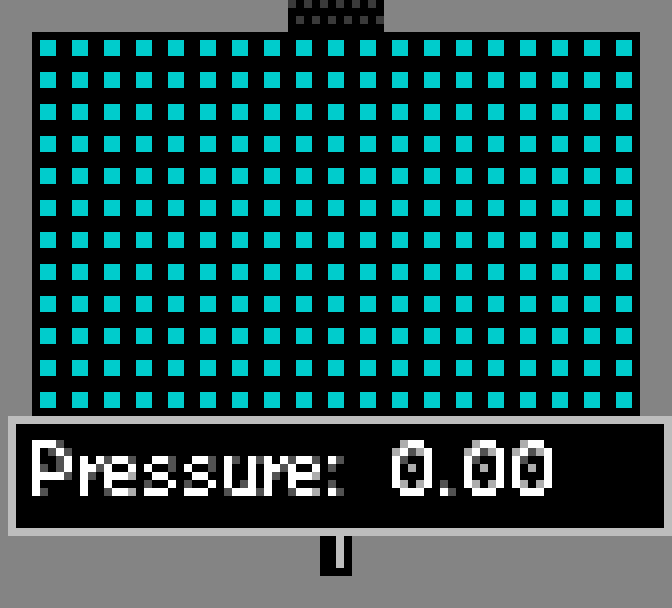

# Sensors传感器

传感器检测周围环境条件并在满足条件时输出 SPRK 电脉冲。所有传感器共享统一的输出机制：检测到条件→在 2 格范围内的导体上产生 SPRK(life=4)。INSL 和 RSSS 绝缘体可阻断输出信号。

传感器是 TPT 自动化系统的核心——它们将物理量（温度、压力、速度、粒子类型等）转换为电信号，使电路能"感知"环境并作出响应。

本分类共 **7** 个元素。

---

###### 虚无(INVS)【Invisible】----------------------------------------------------Type:115

| 属性 | 值 |
|------|-----|
| 内部标识 | DEFAULT_PT_INVS |
| 颜色 | 淡紫色半透明 |
| 类型 | TYPE_SOLID |
| 硬度 | 15 |
| 热导率 | 164 |
| 特殊属性 | PROP_PHOTPASS（光子穿透）, PROP_NEUTPASS（中子穿透）|

**描述**：当施加压力时隐形——不是真正的"传感器"（不输出电脉冲），而是被动压力响应型可见度控制器。

### 核心机制

INVS 的隐形基于压力阈值判定：
- **Tmp**：压力抗性阈值。Tmp>0 时使用 Tmp 值作为阈值（单位即压力值），Tmp=0 时默认阈值=4.0
- **Tmp2**：状态标志——1=隐形态，0=可见态
- 判定规则：所在位置压力 < -阈值 **或** 压力 > +阈值 → 进入隐形态（淡紫色半透明渲染）
- 阈值范围内 → 恢复可见态

### 应用场景
- 压力可视化——INVS 在高压区变透明，直观显示压力分布
- 隐藏式安全门——高压触发开门（配合其他压力敏感元素）
- 光子传导管道——光子可穿透，用于光学系统的隐蔽布线
- 中子实验——中子可穿透，不影响核反应

导热率：164
初始温度：22℃/295.15K

---

###### 探测器(DTEC)【Detector】---------------------------------------------------Type:162

| 属性 | 值 |
|------|-----|
| 内部标识 | DEFAULT_PT_DTEC |
| 颜色 | 随 Ctype 对应元素颜色变化 |
| 热导率 | 0 |
| 特殊功能 | Ctype 自动学习、FILT 写入 |

**描述**：使用方法类似 CLNE——将需要探测的物质与之接触即可设置 Ctype 为目标 Type 值，之后相同物质接触时产生电脉冲。是探测墙(WL_DETECT)的粒子版本。

### 参数系统

| 参数 | 用途 |
|------|------|
| **Ctype** | 目标元素类型。接触该类型粒子时触发。支持 LIFE 子类型匹配（通过 Tmp 指定 GOL 规则编号） |
| **Tmp** | LIFE 子类型过滤（当 Ctype==LIFE 时指定具体 GOL 规则），0=匹配所有 LIFE |
| **Tmp2** | 探测半径（1~25，默认 2）。越大覆盖范围越广但探测越"模糊" |

### 双重功能

1. **粒子探测模式**：在探测半径内发现 Ctype 类型粒子→life=1 并输出 SPRK。每帧重置重新检测。
2. **FILT 写入模式**：检测到光子类粒子（PHOT/BRAY/等）→将该光子波长写入相邻 FILT 的 ctype。用于构建光谱分析系统。

### Ctype 学习机制
Ctype 未设置时（=0 或无效），扫描接触的粒子类型自动写入 Ctype——与 CLNE 相同的"学习"逻辑。之后只对已学会的类型响应。

### 应用场景
- 物质分拣系统——检测到目标元素→触发活塞/门
- 粒子计数/存在检测
- 光谱分析（配合 FILT）

导热率：0
初始温度：22℃/295.15K

---

###### 温度传感器(TSNS)【Temperature Sensor】-----------------------------------Type:164

| 属性 | 值 |
|------|-----|
| 内部标识 | DEFAULT_PT_TSNS |
| 颜色 | 随温度变化（热=红，冷=蓝） |
| 热导率 | 0 |

**描述**：可用 HEAT/COOL 改变自身温度作参考值。检测周围物质温度比它高或低时发出电脉冲。

### 参数系统

| 参数 | 用途 |
|------|------|
| **Tmp** | 工作模式：**0**=检测高于自身温度（默认），**2**=检测低于自身温度，**1**=将粒子温度写入相邻 FILT（温度→FILT.ctype） |
| **Temp** | 参考温度（开尔文）。用 HEAT/COOL 调整。默认 22℃/295K |
| **Tmp2** | 探测半径（1~25，默认 2） |

### 工作模式详解

- **模式0（高于检测）**：扫描半径内粒子，任一粒子温度 > TSNS.temp → 输出 SPRK
- **模式2（低于检测）**：任一粒子温度 < TSNS.temp → 输出 SPRK
- **模式1（温度写入）**：不输出 SPRK，将最近粒子的温度值写入相邻 FILT.ctype（编码为 FILT 可读格式）。用于远程温度监控

**排除规则**：自动排除 METL 避免自触发（METL 通电会自加热 10℃/传导，可能导致误触发）。

### 应用场景
- 恒温器——温度超标→启动冷却系统
- 火灾报警——检测到 FIRE/PLSM 高温→触发洒水/灭火
- 反应堆监控——核反应温度过高时紧急停堆

导热率：0
初始温度：22℃/295.15K

---

###### 压力传感器(PSNS)【Pressure Sensor】--------------------------------------Type:172

| 属性 | 值 |
|------|-----|
| 内部标识 | DEFAULT_PT_PSNS |
| 颜色 | 随压力变化 |
| 热导率 | 0 |

**描述**：直接检测所在位置的压力值（pv），无需扫描周围粒子。可用 HEAT/COOL 改变自身温度作阈值。

### 参数系统

| 参数 | 用途 |
|------|------|
| **Tmp** | 工作模式：**0**=检测压力高于阈值（默认），**2**=检测压力低于阈值，**1**=将压力写入相邻 FILT |
| **Temp** | 参考阈值——阈值压力 = (temp - 273.15)。默认 4℃→默认阈值=4.0 压力 |
| **Tmp2** | 探测半径（默认 2） |

### 与 TSNS 的关键区别
PSNS 检测的是**所在单元格的压力场值(pv)**，而非周围粒子的属性。这意味着：
- 不需要粒子接触——空气压力本身就足够触发
- 响应速度极快——直接读取 pv 值，无需遍历粒子
- 适合气压系统——配合 PUMP/AIR/VAC 使用

### 应用场景
- 气压安全阀——压力超限→释放/泄压
- 真空检测——压力过低→补充气体
- 爆炸检测——检测到爆炸压力波→触发防护系统

导热率：0
初始温度：4℃/277.15K

---

###### 生命探测器(LSNS)【Life Sensor】-------------------------------------------Type:185

| 属性 | 值 |
|------|-----|
| 内部标识 | DEFAULT_PT_LSNS |
| 颜色 | 随检测状态变化 |
| 热导率 | 0 |

**描述**：检测周围粒子 Life 值。当 Life 值高于（或低于）传感器温度时产生电流。

### 参数系统

| 参数 | 用途 |
|------|------|
| **Tmp** | 工作模式：**0**=检测 life > 阈值（默认），**2**=检测 life <= 阈值，**1**=写入 FILT，**3**=从 FILT 读取 life 值并应用到相邻粒子 |
| **Temp** | 阈值——阈值 life = (temp - 273.15)。默认 4℃→默认阈值 life=4 |
| **Tmp2** | 探测半径（1~25，默认 2） |

### 模式3详解（FILT→粒子 Life 写入）
这是 LSNS 最独特的功能：从相邻 FILT 读取 life 值（FILT.ctype - 0x10000000 解码），将该值写入探测到的粒子。相当于"远程 Life 注入器"——可通过电路精确控制粒子的 life 参数。

**排除规则**：自动排除 METL。

### 应用场景
- 粒子生命周期监控——检测即将耗尽的粒子（如 FUSE life<40 已点燃）
- 定时器反馈——配合 DLAY 等 life 递减元素实现状态检测
- 远程 Life 操控——模式3 可通过电路远距离修改粒子 life

导热率：0
初始温度：4℃/277.15K

---

###### 线性探测器(LDTC)【Linear Detector】---------------------------------------Type:186

| 属性 | 值 |
|------|-----|
| 内部标识 | DEFAULT_PT_LDTC |
| 颜色 | 随检测方向变化 |
| 热导率 | 0 |

**描述**：从 8 个方向独立发射扫描射线，在相反方向激发导体。输出方向与探测方向相反（射线从上方来→在下方导体输出 SPRK）。

### 参数系统

| 参数 | 用途 |
|------|------|
| **Ctype** | 目标粒子类型。0=通配符（任何粒子都触发） |
| **Life** | 扫描起始偏移（跳过前 N 格的粒子），可跨障碍探测 |
| **Tmp** | 最大扫描长度。0=无限（直到碰到固体墙或画布边界） |
| **Tmp2** | 标志位字：**0x01**=反转过滤器（排除 Ctype 类型），**0x02**=忽略能量粒子，**0x04**=不向 FILT 写颜色，**0x08**=找到后继续搜索（多目标触发） |

### 扫描机制
8 个方向（NESW+4 对角）完全独立——每个方向有自己的射线和触发判定。这意味着：
- 不同方向可检测到不同类型的粒子
- 输出方向精确指示粒子所在方向
- 可实现"粒子从哪个方向来"的方向感知

**射线与输出方向相反**：上方检测到→在下方输出 SPRK。这是设计使然——输出导体放在粒子来源的反方向。

### 应用场景
- 粒子追踪定位——确定粒子相对于 LDTC 的方向
- 多方向入侵检测——8 方向同时监控
- 精确瞄准系统——配合 FRAY/CRAY 实现定向发射

导热率：0
初始温度：22℃/295.15K

---

###### 速度探测器(VSNS)【Velocity Sensor】--------------------------------------Type:189

| 属性 | 值 |
|------|-----|
| 内部标识 | DEFAULT_PT_VSNS |
| 颜色 | 随速度变化 |
| 热导率 | 0 |

**描述**：检测速度高于（或低于）传感器温度的粒子时生成电脉冲。仅检测非固体粒子（TYPE_PART/ENERGY/LIQUID/GAS）。

### 参数系统

| 参数 | 用途 |
|------|------|
| **Tmp** | 工作模式：**0**=检测速度 > 阈值（默认），**2**=检测速度 <= 阈值，**1**=写入 FILT，**3**=从 FILT 读取速度并对粒子施加等比例速度缩放 |
| **Temp** | 阈值——阈值速度 = (temp - 273.15)。默认 4℃→默认阈值速度=4 像素/帧 |
| **Tmp2** | 探测半径（1~25，默认 2） |

### 速度计算
速度幅度 Vm = sqrt(vx² + vy²)，即粒子的实际运动速度（非分量）。VSNS 比较此幅度与阈值。

### 模式3详解（FILT→粒子速度缩放）
从 FILT 读取速度阈值，对探测到的粒子施加等比速度缩放：vx *= (FILT 值 / Vm)，vy *= (FILT 值 / Vm)。实现"根据检测到的速度自动调节粒子速度"。

### 应用场景
- 粒子速度筛选——高速粒子触发分流门
- 碰撞检测——检测到高速粒子→启动保护机制
- 速度反馈控制——模式 3 实现自动速度平衡

导热率：0
初始温度：4℃/277.15K

---

## 传感器速查表

| 传感器 | 检测量 | 参考值来源 | 模式数 | 特殊功能 |
|--------|--------|-----------|--------|---------|
| INVS | 压力 | Tmp 阈值 | 2（可见/隐形） | 光子/中子穿透 |
| DTEC | 粒子类型 | Ctype 学习 | 2（检测/写FILT） | LIFE 子类型匹配 |
| TSNS | 温度 | Temp（HEAT/COOL 可调） | 3（高于/低于/写FILT） | 排除 METL |
| PSNS | 压力(pv) | Temp（HEAT/COOL 可调） | 3（高于/低于/写FILT） | 直接读 pv 无需粒子 |
| LSNS | Life 值 | Temp | 4（含远程写入） | 可从 FILT 注入 Life |
| LDTC | 粒子类型 | Ctype | 8 方向独立 | 偏移/反转/多目标 |
| VSNS | 速度(Vm) | Temp | 4（含速度缩放） | 仅非固体粒子 |

---

## 传感器通用交互

- **输出机制**：2 格范围导体上产生 SPRK(life=4)
- **阻断**：INSL/RSSS 在传感器和导体之间阻断输出
- **FILT 集成**：TSNS/PSNS/LSNS/VSNS/DTEC 的模式 1 均支持向 FILT 写入数据（温度→FILT.ctype）
- **温度调控**：所有传感器的参考值（Temp）均可用 HEAT/COOL 工具实时调整
- **多传感器组网**：多个传感器可并联→OR 逻辑（任一触发即输出），或串联→AND 逻辑（全部触发才输出）
