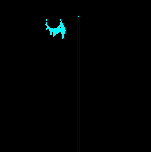
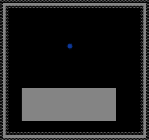

# Force动力材料

力元素施加各种力学效果。用于构建粒子运输、分拣和机械系统。本分类共9个元素。

---

###### 动力管(PIPE)【Pipe】--------------------------------------------------------Type:099

| 属性 | 值 |
|---|---|
| 内部标识 | PIPE |
| 显示颜色 | BRCK灰色边框 + 管道色(红RED/蓝BLUE/绿GREEN三色循环) |
| 类型分类 | TYPE_099 (特殊固体) |
| 重量 | N/A（固定不可移动） |
| 硬度 | N/A（不可破坏，高压除外） |
| 热导率 | 0（检测HEAC激活后启用） |
| 初始温度 | 22℃ / 295.15K |
| 特殊属性 | 三色循环管道网络系统、自动BRCK边框生成、单像素方向记录 |

描述：用于向一个方向运输物质，自带动力。放置完毕后在周围自动出现一圈砖块(BRCK)边框，形成封闭管道。

核心机制——三色循环管道系统：
- 管道颜色循环：RED→BLUE→GREEN→RED
- nextColor: RED→BLUE, BLUE→GREEN, GREEN→RED
- prevColor反向
- 粒子沿颜色方向单向流动，确保不会倒流

初始化(life>10)：扫描周围创建BRCK砖块边界。life==3进行自动配对：相邻初始化中的PIPE分配下一个颜色，形成三色循环管道网。单像素PIPE额外记录方向坐标。

粒子推进(pushParticle)：3次尝试推向8邻域颜色为nextColor的空PIPE。递归推进每帧最多2格。到达管道末端出口释放粒子（完整保留属性）。入口吸收接触粒子/STOR内容。与PRTI互操作：管道→传送门加速运输。

存储粒子属性：Ctype=类型，Tmp2=life，Tmp3=tmp，Tmp4=ctype，Temp=温度，Dcolour=装饰色。检测HEAC激活导热(CAN_CONDUCT)。

高压(>10.0)→变为BRMT碎石。

导热率：0
初始温度：22℃/295.15K

**参数详解：**

| 参数 | 用途 | 取值范围 |
|---|---|---|
| life | 初始化状态 / 存储粒子life | >10 初始化阶段；3 配对阶段；存储粒子时=粒子原life值 |
| tmp | 存储粒子tmp值 | 任意整数 |
| tmp2 | 存储粒子tmp2值 | 任意整数 |
| tmp3 | 存储粒子tmp值（备用） | 任意整数 |
| tmp4 | 存储粒子ctype值 | 任意整数 |
| ctype | 存储粒子类型 | 任意有效元素Type |
| temp | 存储粒子温度(K) | 任意有效温度值 |
| dcolour | 管道装饰颜色 | 0xRRGGBB |
| pavg[0] | 当前管道颜色(0=RED,1=BLUE,2=GREEN) | 0-2 |

**深入机制解析：**

管道颜色分配算法：
1. 当PIPE被创建且life>10时，首先扫描周围3x3区域是否有BORD或其他PIPE。若周围无BORD，则在8邻域空格创建BRCK边框。
2. life设为3进入配对阶段。此时PIPE检测周围已初始化的PIPE（life<=10），若该相邻PIPE已有颜色，当前PIPE自动分配前一个颜色（prevColor），从而确保三色循环的连续性。
3. 配对完成后life置0，管道进入正常运输状态。

粒子运输流程：
1. 入口阶段：PIPE检测8邻域中的非PIPE粒子（包括STOR内容），将其"吸收"进入管道。粒子属性被保存在PIPE的tmp/tmp2/tmp3/tmp4/ctype/temp中。
2. 运输阶段：每帧3次尝试将存储的粒子推向相邻的nextColor PIPE。目标PIPE必须为空（未存储粒子）且颜色为当前PIPE的nextColor。递归推进允许单帧移动最多2格。
3. 出口阶段：当PIPE存储粒子后，检测周围是否有相邻的nextColor PIPE。若无可用目标，则将粒子释放到周围空位（优先释放到非管道方向）。粒子恢复全部原始属性。

**实用技巧：**
- 管道必须形成完整的三色循环回路才能持续运输。至少需要RED→BLUE→GREEN→RED三个PIPE才能构成最小闭环。
- 使用BRAY（射线）可以透视管道内部的粒子流动情况。
- 管道系统可以配合STOR作为缓冲存储器，先将粒子存入STOR再由相邻PIPE读取。
- 单像素PIPE（即只放置一个像素宽的管道）效率最高，因为方向记录更精确。
- PIPE与PRTI（传送门）配合可实现超远距离瞬间运输。
- 高压破裂是管道系统最常见的故障模式。避免在管道附近放置会累积压力的元素（如火焰、爆炸物）。
- 利用HEAC加热PIPE可使其具备导热能力，实现温度控制运输。

**反应：**
- PIPE(三色循环RED→BLUE→GREEN→RED) → 运输粒子(入口吸收,出口释放)
- PIPE + STOR → 读取STOR内粒子（管道自动检测相邻STOR的内容）
- PIPE + PRTI → 管道→传送门加速（粒子经管道送至传送门瞬间转移）
- PIPE(pres>10) → BRMT (高压破裂，管道永久损坏)
- PIPE + HEAC(接触) → 管道启用热传导(CAN_CONDUCT)，可加热/冷却运输中的粒子
- PIPE + BRAY(射线穿过) → BRAY可见管道内部存储粒子的存在状态
- PIPE(出口) + 任意可容纳空间 → 粒子释放恢复全部属性(保持原始type/life/tmp/ctype/temp)

---

###### 加速器(ACEL)【Accelerator】-----------------------------------------------Type:137

| 属性 | 值 |
|---|---|
| 内部标识 | ACEL |
| 显示颜色 | 蓝绿色（激活时有PMODE_GLOW发光效果） |
| 类型分类 | TYPE_137 (特殊力场) |
| 重量 | N/A（固定） |
| 硬度 | N/A |
| 热导率 | 0 |
| 初始温度 | 22℃ / 295.15K |
| 特殊属性 | 十字方向粒子加速、life控制倍率 |

描述：加速附近元素。扫描十字方向（上下左右，不处理对角）。对TYPE_PART/LIQUID/GAS/ENERGY粒子速度乘以multiplier钳制到MAX_VELOCITY。有加速发生时Tmp=1驱动PMODE_GLOW光效。

Life：加速倍率控制。life!=0时multiplier=1.0+(life/100.0)钳制0~1000。life==0时默认1.1。

导热率：0
初始温度：22℃/295.15K

**参数详解：**

| 参数 | 用途 | 取值范围 | 说明 |
|---|---|---|---|
| life | 加速倍率控制 | 0~1000 | life/100=附加倍率，life=0默认1.1倍 |
| tmp | 活动标志 | 0或1 | 1=本帧有粒子被加速，触发光效 |
| ctype | 无特殊用途 | - | 保留，可用于装饰性分类 |

**深入机制解析：**

加速计算流程：
1. 每帧扫描ACEL的十字方向（上、下、左、右）各约3-5格范围。
2. 检测范围内所有TYPE_PART（普通粒子）、TYPE_LIQUID（液体）、TYPE_GAS（气体）、TYPE_ENERGY（能量粒子）。
3. 对每个检测到的粒子：new_velocity = current_velocity * multiplier，其中multiplier=1.0+(life/100.0)。
4. 速度钳制：结果速度不得超过MAX_VELOCITY（通常为29.9像素/帧）。
5. 倍增公式：life=0→1.1倍；life=10→1.1倍；life=50→1.5倍；life=100→2.0倍；life=500→6.0倍；life=1000→11.0倍（钳制上限1000）。

加速度叠加：
- 多个ACEL可叠加作用在同一粒子上（每次独立乘法）。
- 例如：两个life=100的ACEL作用于同一粒子→速度×2.0×2.0=×4.0。
- 注意：堆叠过多会导致速度极快触及MAX_VELOCITY钳制。

**实用技巧：**
- 将ACEL串联排列可构建"粒子加速器"——粒子每经过一个ACEL速度翻倍。
- 配合DCEL使用可实现"速度门"——只有速度足够高的粒子才能通过特定区域。
- life值通过控制台或PROP工具修改。也可用LUA脚本批量设置。
- 激活时Tmp=1的光效可用于视觉调试——观察哪些ACEL正在工作。
- ACEL在真空或任何环境中均正常工作，不依赖介质。
- 适用于加速液体流（如加速熔岩流动）、加速气体扩散、加速能量粒子传播。

**反应：**
- ACEL(life>0) + ENERGY粒子(十字方向) → 能量粒子速度倍增(可用于加速PHOT/NEUT/ELEC)
- ACEL + LIQUID(十字方向) → 液体流速倍增(加速LAVA/WATR/OIL等流动)
- ACEL + GAS(十字方向) → 气体扩散速度倍增(加速FIRE/SMOKE/PLSM等)
- ACEL(life=0默认) + 任意可移动粒子(十字方向) → 速度×1.1(轻微加速)
- ACEL + ACEL(串联) → 多重加速叠加(粒子速度指数增长)
- ACEL(tmp=1) → PMODE_GLOW发光(可视化加速状态)

---

###### 减速器(DCEL)【Decelerator】-----------------------------------------------Type:138

| 属性 | 值 |
|---|---|
| 内部标识 | DCEL |
| 显示颜色 | 橙红色（激活时有PMODE_GLOW发光效果） |
| 类型分类 | TYPE_138 (特殊力场) |
| 重量 | N/A（固定） |
| 硬度 | N/A |
| 热导率 | 0 |
| 初始温度 | 22℃ / 295.15K |
| 特殊属性 | 十字方向粒子减速、life控制减速倍率 |

描述：使能量粒子减速。扫描十字方向同ACEL。速度乘以减速因子。有减速发生时Tmp=1。

Life：减速倍率控制。life!=0时multiplier=1.0-(life/100.0)钳制0~100。life==0时multiplier≈0.909。life=100时完全停止(multiplier=0)。

导热率：0
初始温度：22℃/295.15K

**参数详解：**

| 参数 | 用途 | 取值范围 | 说明 |
|---|---|---|---|
| life | 减速倍率控制 | 0~100 | life/100=减速比例，life=0默认0.909倍 |
| tmp | 活动标志 | 0或1 | 1=本帧有粒子被减速，触发光效 |
| ctype | 无特殊用途 | - | 保留 |

**深入机制解析：**

减速计算流程：
1. 每帧扫描DCEL十字方向（上、下、左、右）约3-5格范围。
2. 检测范围内所有TYPE_PART/LIQUID/GAS/ENERGY粒子。
3. 对每个检测到的粒子：new_velocity = current_velocity * multiplier，其中multiplier=1.0-(life/100.0)。
4. 减速公式：life=0→0.909倍；life=10→0.90倍；life=25→0.75倍；life=50→0.50倍；life=75→0.25倍；life=100→0倍（完全停止）。

粒子完全停止后的行为：
- life=100时multiplier=0，粒子速度归零。
- 粒子不会消失，仅在当前位置静止不动。
- 静止粒子仍会受重力影响（若Falldown=1），下一帧可能重新获得速度。
- 若要让粒子完全停滞，需配合消除重力（如在真空中使用life=100的DCEL）。

**实用技巧：**
- DCEL与ACEL配合使用可构建"速度调节站"：先ACEL加速，经DCEL减速到恰当速度。
- life=100的DCEL可作为"粒子制动器"——紧急停止高速危险粒子。
- 将DCEL排列成栅栏形状可构建"能量屏障"——阻挡粒子穿透。
- 配合FILT（过滤器）实现选择性减速：仅特定类型粒子通过特定区域被减速。
- 用于等离子体(PLSM)约束——在等离子体容器内壁放置DCEL防止粒子逃逸。
- DCEL无法减速固定元素（非TYPE_PART/LIQUID/GAS/ENERGY类型）。

**反应：**
- DCEL(life>0) + ENERGY粒子(十字方向) → 能量粒子速度降低(PHOT减速,NEUT减速)
- DCEL + LIQUID(十字方向) → 液体流速降低(减缓熔岩/水流)
- DCEL + GAS(十字方向) → 气体扩散速度降低
- DCEL(life=100) + 可移动粒子(十字方向) → 粒子完全停止(速度归零)
- DCEL + DCEL(串联) → 多重减速叠加(粒子速度指数衰减)
- DCEL + ACEL(交替排列) → 速度调节系统(加速/减速平衡控制)
- DCEL(tmp=1) → PMODE_GLOW发光(可视化减速状态)

---

###### 引力炸弹(GBMB)【Gravity Bomb】--------------------------------------------Type:157

| 属性 | 值 |
|---|---|
| 内部标识 | GBMB |
| 显示颜色 | 深紫色/品红色 |
| 类型分类 | TYPE_157 (特殊炸弹) |
| 重量 | N/A |
| 硬度 | N/A |
| 热导率 | 0 |
| 初始温度 | 22℃ / 295.15K |
| 特殊属性 | 重力井(gravIn)、60帧寿命、先吸后推 |

描述：黏在接触的第一个物体上产生强大的引力推力。

Life阶段（自动递减）：
- life<=0：飘落中(Falldown=1)
- 碰到非免疫物体(BOMB/GBMB/CLNE/PCLN/DMND以外)→life=60黏附激活
- life>20：20帧强力吸引(gravIn.mass=20)
- 1<=life<=20：20帧强力排斥(gravIn.mass=-80)
- life耗尽消失

总寿命60帧，前20帧吸后20帧推。

导热率：0
初始温度：22℃/295.15K

**参数详解：**

| 参数 | 用途 | 取值范围 | 说明 |
|---|---|---|---|
| life | 阶段计时器 | -∞~60 | <=0飘落；60→21吸引；20→1排斥；0消失 |
| gravIn.mass | 重力井质量 | -80或20 | 负值=排斥，正值=吸引 |
| tmp | 无特殊用途 | - | 可用于LUA脚本标记 |
| tmp2 | 无特殊用途 | - | 可用于LUA脚本标记 |
| ctype | 无特殊用途 | - | 保留 |

**深入机制解析：**

GBMB生命周期详细流程：

阶段0——飘落 (life<=0)：
- GBMB以普通粒子方式下落，Falldown=1。
- 可以穿过气体和液体。
- 在飘落过程中不产生任何引力效果。
- 可被ACEL/DCEL影响速度。

阶段1——黏附 (接触触发→life=60)：
- 当GBMB接触到非免疫物体时触发黏附。
- 免疫列表：BOMB（炸弹）、GBMB（其他引力炸弹）、CLNE（克隆器）、PCLN（克隆器变体）、DMND（钻石）。
- 黏附后GBMB固定在接触位置，不再下落。
- 对其他元素的接触无响应（仅首次接触触发）。

阶段2——吸引 (life 60→21，共40帧)：
- gravIn.mass=20，创建正质量重力井。
- 周围约20-30像素半径内的所有可移动粒子被拉向GBMB。
- 吸引力度=gravIn.mass/距离²（平方反比衰减）。
- 粒子越靠近GBMB，吸引力越强。
- 固体元素（如STNE、BMTL等）不受影响（TYPE_PART但非固体也可能受影响，取决于元素类型）。

阶段3——排斥 (life 20→1，共20帧)：
- gravIn.mass=-80，创建负质量重力井（排斥力）。
- 力度是吸引阶段的4倍（|80| vs |20|）。
- 周围粒子被猛烈推开。
- 排斥力同样遵循平方反比衰减。

阶段4——消失 (life=0)：
- GBMB从世界中删除。
- 不再有任何引力效果。
- 释放该像素空间。

**实用技巧：**
- 利用先吸后推机制创建"粒子收集-释放"装置：吸引聚集粒子后进行二次处理。
- 多个GBMB协同使用：同时投掷多个GBMB可覆盖更大区域或创造复杂力场。
- GBMB免疫链条：由于GBMB免疫其他GBMB，可以在同一位置叠加投放而互不干扰。
- 配合FILT选择性处理：在GBMB影响区域设置FILT，对吸入的粒子进行分类或转化。
- 延时投掷：GBMB先飘落后激活的特性可用于延时触发机制。
- GBMB吸引阶段可集中散落粒子便于收集；排斥阶段可清除区域内所有污染物。
- 注意：DMND（钻石）免疫GBMB，可用于构建"GBMB护盾"保护关键结构。

**反应：**
- GBMB(life<=0飘落) → 碰触非免疫物体后life=60黏附激活
- GBMB(life>20吸引阶段) + 周围粒子(半径~25px) → 粒子被拉向GBMB中心(gravIn.mass=20)
- GBMB(life<=20排斥阶段) + 周围粒子(半径~25px) → 粒子被猛推远离(gravIn.mass=-80)
- GBMB(life=0) → 自毁消失
- GBMB + DMND → 无反应(钻石免疫GBMB)
- GBMB + BOMB/CLNE/PCLN → 无反应(免疫元素)
- GBMB(吸引阶段) + GBMB(排斥阶段相邻) → 两力场叠加形成复杂粒子运动轨迹

---

###### 力射线发射器(FRAY)【F-Ray Emitter】--------------------------------------Type:159

| 属性 | 值 |
|---|---|
| 内部标识 | FRAY |
| 显示颜色 | 青色/蓝绿色 |
| 类型分类 | TYPE_159 (特殊力场发射器) |
| 重量 | N/A（固定） |
| 硬度 | N/A |
| 热导率 | 0 |
| 初始温度 | 20℃ / 293.15K |
| 特殊属性 | 需SPRK电流激活、射线方向跟随SPRK位置 |

描述：沿电流方向寻找物质并施加力（方向判定规则与ARAY相同）。检测3x3邻域SPRK→沿SPRK对角方向发射射线。

Tmp：射线长度（默认10）。Temp：力系数=(temp-273.15)/10.0，每升10℃力+1。射线上每个非固体粒子施加沿射线方向的速度力。

导热率：0
初始温度：20℃/293.15K

**参数详解：**

| 参数 | 用途 | 取值范围 | 说明 |
|---|---|---|---|
| tmp | 射线长度 | 1~? (默认10) | 力射线扫描的像素距离 |
| temp | 力系数控制器 | 任意温度(K) | force=(T-273.15)/10，每10℃力+1 |
| life | 无特殊用途 | - | 保留 |
| tmp2 | 无特殊用途 | - | 保留 |
| ctype | 无特殊用途 | - | 保留 |

**深入机制解析：**

SPRK方向检测与射线发射：
1. FRAY检测自身3x3邻域内的SPRK（电火花）。
2. 检测到SPRK后，计算SPRK相对于FRAY的方向向量（8方向之一）。
3. 注意：检测的是3x3范围内的SPRK，而非接触即可。SPRK必须在FRAY的3x3邻域内。
4. 方向判定与ARAY（射线发射器）完全一致——SPRK在左上角→射线朝左上方向；SPRK在正上方→射线朝上；依此类推。
5. 若FRAY周围3x3存在多个SPRK，优先级取决于检测顺序（通常先检测到的生效）。
6. 确定方向后，沿该方向发射力射线。

力射线施加机制：
- 射线从FRAY中心沿确定方向延伸，长度为tmp像素（默认10）。
- 对射线路径上的每个像素进行检测。
- 遇到非固体粒子（TYPE_PART非固体、LIQUID、GAS、ENERGY）时施加力。
- 施加的力方向=射线方向，大小=(temp-273.15)/10.0。
- 力系数示例：
  - temp=20℃(293.15K)→force=(293.15-273.15)/10=2.0
  - temp=100℃(373.15K)→force=(373.15-273.15)/10=10.0
  - temp=1000℃(1273.15K)→force=100.0
  - temp=0℃(273.15K)→force=0（无力输出！）
  - temp=-100℃(173.15K)→force=-10.0（反向力！）
- 固体元素(如STNE/BMTL/WOOD等)阻挡射线传播但不被施力。
- 射线遇固体即停止，类似光线被遮挡。

**实用技巧：**
- 低温(0℃以下)FRAY产生反向推力——可用于构建"反向力场"或粒子减速器。
- 利用HEAC/COOL精确控制FRAY温度→精确控制力输出大小。
- FRAY配合SPRK矩阵可实现360度全方位力场覆盖。
- 多SPRK+单FRAY：在FRAY周围放置多个SPRK可实现动态方向切换（通过电路控制SPRK开关）。
- FRAY与ARAY的协作：ARAY用于信号传输，FRAY用于力学操控——两者共用SPRK方向判定逻辑，容易协同设计。
- 利用tmp延长射线范围（通过PROP工具或LUA设置tmp>10）实现远距离力场投射。
- FRAY + FILT：在被施力的粒子通路上设置FILT过滤，实现选择性施力。

**反应：**
- FRAY + SPRK(3x3邻域) → 沿SPRK方向发射力射线(长度=tmp, 力度=(T-273.15)/10)
- FRAY(force>0) + 非固体粒子(射线路径上) → 粒子沿射线方向加速
- FRAY(force<0, T<0℃) + 非固体粒子(射线路径上) → 粒子沿射线反方向加速(反向力)
- FRAY(射线) + 固体粒子(射线路径上) → 射线被阻挡(固体不受力)
- FRAY(无SPRK) → 无任何输出(必须通电激活)
- FRAY + 多个SPRK(同时) → 按检测顺序取首个SPRK方向
- FRAY + HEAT(加热) → 力输出增大(每10℃力+1)
- FRAY + COOL(冷却) → 力输出减小或反转方向

---

###### 反射极(RPEL)【Repeller】---------------------------------------------------Type:160

| 属性 | 值 |
|---|---|
| 内部标识 | RPEL |
| 显示颜色 | 品红色/紫红色 |
| 类型分类 | TYPE_160 (特殊力场) |
| 重量 | N/A（固定） |
| 硬度 | N/A |
| 热导率 | 0 |
| 初始温度 | 20℃ / 293.15K |
| 特殊属性 | 无需通电始终工作、ctype过滤、21x21作用范围 |

描述：无需通电。与FRAY类似根据温度来吸引或推开物质。力系数同FRAY：(temp-273.15)/10.0。

每帧随机采样10次在21x21范围随机选点。对该点非固体粒子施加远离RPEL的力。Ctype过滤：设置后只影响该类型粒子（FRAY无此功能）。不需要SPRK激活，始终工作。

导热率：0
初始温度：20℃/293.15K

**参数详解：**

| 参数 | 用途 | 取值范围 | 说明 |
|---|---|---|---|
| temp | 力系数控制器 | 任意温度(K) | force=(T-273.15)/10，正值=排斥，负值=吸引 |
| ctype | 粒子类型过滤器 | 任意有效Type或0 | 0=影响所有类型；非0=仅影响指定类型粒子 |
| life | 无特殊用途 | - | 保留 |
| tmp | 无特殊用途 | - | 保留 |
| tmp2 | 无特殊用途 | - | 保留 |

**深入机制解析：**

随机采样与力施加机制：
1. RPEL每帧在21x21（以RPEL为中心，半径10像素）的正方形范围内随机选取10个点。
2. 对每个采样点检测是否存在非固体粒子。
3. 若存在且符合ctype过滤条件，则施加力。
4. 力的方向=从RPEL中心指向/远离采样点（取决于温度）。
5. 力的大小=(temp-273.15)/10.0。
6. 注意：力的方向是径向的——粒子总是被推向远离RPEL的方向（正温度）或拉向RPEL（负温度）。

ctype过滤机制：
- ctype=0（默认）：影响范围内所有非固体粒子。
- ctype=特定元素：仅影响该类型的粒子。
- 例如：设置ctype=DUST→仅对粉尘施力；设置ctype=WATR→仅对水施力。
- 这是RPEL相对于FRAY的核心优势——选择性施力。

10次采样 vs 全覆盖：
- 每帧仅10次随机采样，而非遍历21x21=441个像素。
- 这意味着RPEL每秒约600次采样（60fps×10次/帧）。
- 效率极高，但可能遗漏部分粒子（尤其是粒子密度低时）。
- 在粒子密集区域效果稳定；在稀疏区域可能出现"间歇性"效果。

与FRAY的关键区别：
| 特性 | FRAY | RPEL |
|---|---|---|
| 激活方式 | 需SPRK通电 | 始终工作 |
| 施力方向 | 固定射线方向 | 径向(远离中心) |
| 作用范围 | 直线射线(tmp长度) | 21x21正方形区域 |
| 过滤功能 | 无 | 有(ctype过滤) |
| 适用场景 | 定向力场 | 区域排斥/吸引场 |

**实用技巧：**
- RPEL是天然的"粒子护栏"——放置一排RPEL形成排斥屏障，阻止粒子逃逸。
- 负温度(冷却)RPEL变为吸引器——构建"粒子收集器"将范围内的粒子吸到一起。
- ctype过滤在实际应用中极为强大：
  - 构建"分拣器"：设置不同ctype的RPEL阵列，将混合粒子流按类型分离。
  - 构建"离子阱"：ctype=PLSM的RPEL约束等离子体。
  - 构建"防水墙"：ctype=WATR的RPEL阻止水进入特定区域。
- 多个RPEL叠加：在关键位置放置多个RPEL增加每帧采样次数（每个RPEL独立10次采样）。
- RPEL + ACEL：先用RPEL将粒子推入特定通道，再用ACEL沿通道加速。
- 注意：RPEL影响范围较大(21x21)，紧凑设计中需注意间距，避免相互干扰。
- RPEL对固体粒子无效——这是区别于PSTN/活塞推动的关键特性。

**反应：**
- RPEL(T>0℃) + 非固体粒子(21x21范围随机采样) → 粒子远离RPEL中心(排斥力)
- RPEL(T<0℃) + 非固体粒子(21x21范围随机采样) → 粒子被拉向RPEL中心(吸引力)
- RPEL(ctype=X) + X类型粒子 → 选择性施力(仅影响指定类型)
- RPEL(ctype=0) + 所有非固体粒子 → 无差别施力(默认行为)
- RPEL + 固体粒子 → 无反应(固体不受RPEL影响)
- RPEL + RPEL(相邻) → 多重采样叠加(每帧每RPEL独立10次)
- RPEL(冷却至极低温) + 光子(PHOT) → 光子被吸引集中(构建光子阱)

---

###### 压力炸弹(DMG)【Damage】----------------------------------------------------Type:163

| 属性 | 值 |
|---|---|
| 内部标识 | DMG |
| 显示颜色 | 深红色/暗红色 |
| 类型分类 | TYPE_163 (TYPE_PART \| PROP_SPARKSETTLE) |
| 重量 | N/A |
| 硬度 | N/A |
| 热导率 | 0 |
| 初始温度 | 22℃ / 295.15K |
| 特殊属性 | 唯一可触发元素高压转变的炸弹、半径25压力波 |

描述：对碰到它的物质表面产生破坏性压力。接触非免疫物质时引爆。TYPE_PART|PROP_SPARKSETTLE。

爆炸半径25像素圆形范围：所有粒子受力远离中心(v=cos(angle)*7, sin(angle)*7)。爆炸区域CELL设pv+=1.0和速度场。硬编码触发各元素高压转变：BMTL→BRMT,GLAS→BGLA,COAL→BCOL,QRTZ→PQRT,TUNG→BRMT(保留ctype),WOOD→SAWD。是游戏中唯一能直接触发元素高压转变的炸弹。

导热率：0
初始温度：22℃/295.15K

**参数详解：**

| 参数 | 用途 | 取值范围 | 说明 |
|---|---|---|---|
| life | 状态标志 | 0=待引爆 | 接触非免疫物后归0引爆（实际爆炸逻辑在元素交互中） |
| tmp | 无特殊用途 | - | 保留 |
| tmp2 | 无特殊用途 | - | 保留 |
| ctype | 无特殊用途 | - | 保留 |

**深入机制解析：**

引爆条件与免疫：
- DMG属于TYPE_PART且带有PROP_SPARKSETTLE属性，意味着它像火花一样在接触非免疫元素时触发。
- 免疫元素：DMND（钻石）。DMG接触DMND不会引爆。
- 非免疫元素包括：所有TYPE_PART普通粒子、LIQUID液体、GAS气体、ENERGY能量粒子。
- 接触判定：DMG的像素与其他粒子像素相邻或重叠时触发。

爆炸效应详细分解：
1. 确定爆炸中心=DMG所在像素坐标。
2. 爆炸半径=25像素（圆形范围）。
3. 粒子冲击波：遍历半径25圆内所有粒子，计算每个粒子到爆炸中心的角度θ，施加速度v=(cos(θ)*7, sin(θ)*7)。力度恒定为7像素/帧，与距离无关（但爆炸圆边缘的粒子同样受力）。
4. 压力场：爆炸范围内所有CELL（计算单元，4x4像素块）的pv（压力值）增加1.0。
5. 速度场：爆炸范围内所有CELL的vx/vy速度场分量受影响（叠加冲击方向）。

硬编码高压转变表：
| 原元素 | 转变产物 | 说明 |
|---|---|---|
| BMTL(金属) | BRMT(碎金属) | 金属结构被压碎 |
| GLAS(玻璃) | BGLA(碎玻璃) | 玻璃被压裂 |
| COAL(煤) | BCOL(碎煤) | 煤块被压碎 |
| QRTZ(石英) | PQRT(石英粉) | 石英晶体被压成粉末 |
| TUNG(钨) | BRMT(保留ctype) | 钨→碎金属(ctype记录原类型) |
| WOOD(木头) | SAWD(锯末) | 木头被压成木屑 |

这些转变是DMG独有的——其他元素（包括常规压力累积）无法触发同样的高压转变。这是DMG在游戏中最独特的功能。

与其他炸弹的区别：
| 特性 | DMG | BOMB(普通炸弹) | DEST(破坏弹) | THDR(雷霆) |
|---|---|---|---|---|
| 伤害类型 | 压力冲击波 | 热+压力 | 直接删除 | 电击+高温 |
| 粒子推动 | 速度7,方向=径向 | 随机方向 | 无(删除) | 无 |
| 高压转变 | 有(硬编码) | 无 | 无 | 无 |
| 爆炸半径 | 25 | 约50 | 约15 | 约20 |

**实用技巧：**
- DMG是获取BRMT（碎金属）的最可靠方式——比依赖自然压力累积高效得多。
- 利用DMG产生PQRT（石英粉）：QRTZ→PQRT的转变是获取石英粉的唯一途径之一。
- DMG爆炸后推动粒子的力度(7像素/帧)适中，不会将粒子推得太远，便于收集处理。
- 在密闭容器中引爆DMG：所有粒子被冲向容器壁后反弹，产生二次碰撞效果。
- DMG + FILT配合：先引爆DMG推动粒子穿过FILT阵列进行分类。
- 防止意外引爆：用DMND（钻石）包裹DMG，需要引爆时用其他手段移除DMND保护层。
- DMG可用于清除金属结构：在BMTL结构中埋设DMG，引爆后全部BMTL→BRMT。
- 多次DMG叠加：在密闭小空间放置多个DMG，压力值(pv)可累积到极高水平。

**反应：**
- DMG + 非免疫物质 → 压力冲击波(半径25, 触发各种高压转变)
- DMG + BMTL → BRMT（碎金属）——金属结构破坏
- DMG + GLAS → BGLA（碎玻璃）——玻璃碎裂
- DMG + COAL → BCOL（碎煤）——煤矿压碎
- DMG + QRTZ → PQRT（石英粉）——石英粉碎
- DMG + TUNG → BRMT（保留ctype=TUNG）——钨结构破坏
- DMG + WOOD → SAWD（锯末）——木材粉碎
- DMG + DMND → 无反应（钻石免疫，DMG不引爆）
- DMG(引爆) + 所有粒子(半径25内) → 粒子以速度7沿径向向外飞散
- DMG(引爆) + CELL(半径25内) → pv+=1.0, 速度场叠加

---

###### 活塞(PSTN)【Piston】-------------------------------------------------------Type:168

| 属性 | 值 |
|---|---|
| 内部标识 | PSTN |
| 显示颜色 | 灰色(头部)/深灰色(臂部)（arms渐暗加dcolour调色） |
| 类型分类 | TYPE_168 (特殊机械) |
| 重量 | N/A（固定） |
| 硬度 | N/A（不可破坏） |
| 热导率 | 0 |
| 初始温度 | 22℃ / 295.15K |
| 特殊属性 | 电控伸缩、FRME框架联动、最大15框架 |
| 头部颜色 | 灰色/银白色 |
| 臂部颜色 | 深灰（随延伸距离渐暗） |

描述：用PSCN激活时变长(NSCN缩回)。可推动前方堆叠物质。与FRME支架配合可一次性推动更大面积。

参数：
- Life：0=活塞头，1=活塞臂。
- Tmp：最大推动距离(默认31)。
- Tmp2：活塞臂最大长度(默认255)。
- Temp：编码延伸数量。pistonCount=floor((temp-268.15)/10)，即每10℃高于-5℃伸出1格。
- Ctype：阻塞材料类型。设置后该类型粒子不可推动。
- Dcolour：臂段装饰颜色（渐暗）。

激活：扫描5x5十字方向SPRK。PSCN→EXTEND，NSCN→RETRACT。

伸出(EXTEND)：计算可推动量→CanMoveStack探测（记录粒子ID和空位，遇墙或阻塞物停止）→MoveStack逐格前移堆叠→腾出空间创建新活塞臂(life=1)。

缩回(RETRACT)：删除臂末端→逆向移动堆叠粒子。

FRME联动：活塞头前方是FRME时，沿正交方向扫描最多15个FRME。每个FRME独立探测可推空间取最小值。递归MoveStack传递sticky标志(由FRME.tmp控制)。缩回时同步拉回框架和前方粒子。

导热率：0
初始温度：22℃/295.15K

**参数详解：**

| 参数 | 用途 | 取值范围 | 说明 |
|---|---|---|---|
| life | 身份标识 | 0或1 | 0=活塞头(控制端), 1=活塞臂(延伸段) |
| tmp | 最大推动距离 | 1~? (默认31) | 活塞单次最大可推动的像素距离 |
| tmp2 | 活塞臂最大长度 | 1~? (默认255) | 活塞臂可延伸的最大像素数 |
| temp | 延伸数量编码 | 任意温度(K) | pistonCount=floor((T-268.15)/10); 每伸出1格temp+10K |
| ctype | 阻塞材料类型 | 任意有效Type或0 | 设置后该类型粒子不可被推动 |
| dcolour | 臂段装饰颜色 | 0xRRGGBB | 活塞臂的渐暗基准颜色 |

**深入机制解析：**

温度→延伸数编码/解码：
- 编码公式：pistonCount = floor((temp - 268.15) / 10)
- 268.15K = -5℃
- 温度与延伸数量的对应关系：
  | temp(K) | temp(℃) | pistonCount |
  |---|---|---|
  | 268.15 | -5 | 0（未伸出） |
  | 278.15 | 5 | 1格 |
  | 288.15 | 15 | 2格 |
  | 298.15 | 25 | 3格 |
  | 378.15 | 105 | 11格 |
  | 1278.15 | 1005 | 101格 |

PSCN/NSCN激活检测：
1. 活塞头(life=0)每帧扫描自身5x5范围的十字方向（上、下、左、右各2格）。
2. 检测到PSCN（P型半导体，通电激活）→触发EXTEND（伸出）。
3. 检测到NSCN（N型半导体，通电激活）→触发RETRACT（缩回）。
4. 注意：检测的是SPRK化后的半导体，而非裸半导体元素本身。需要电路实际通电。
5. 同时检测到PSCN和NSCN→行为取决于检测顺序（通常以先检测到的为准，建议避免此情况）。

伸出(EXTEND)详细流程：
1. 读取当前pistonCount（从temp解码）。
2. 检查当前延伸数量是否已达tmp2上限（臂最大长度）。若已达上限，不执行伸出。
3. 确定伸出方向：默认为活塞头前方（即活塞臂延伸方向）。方向由已有活塞臂确定。
4. CanMoveStack探测：
   - 从活塞头前方第1格开始，逐格向前检查。
   - 检测每格是否有粒子。若有粒子，记录粒子ID。
   - 若粒子类型=ctype（阻塞类型），CanMoveStack返回失败，不伸出。
   - 若遇到墙壁（不可移动的固体元素如DMND），停止探测。
   - 探测距离=tmp（最大推动距离）。
   - 记录需要移动的粒子堆叠和前方空位数。
5. MoveStack移动：
   - 从最远端空位开始，逐格将粒子向前移动1格。
   - 确保不会覆盖任何粒子。
6. 创建活塞臂：
   - 在腾出的空间（活塞头前方第1格）创建life=1的活塞臂。
   - pistonCount++，更新temp=268.15+(pistonCount*10)。
   - 活塞臂继承Dcolour属性（渐暗效果）。

缩回(RETRACT)详细流程：
1. 找到活塞臂最远端（最末端的life=1像素）。
2. 删除该末端臂像素。
3. 执行逆向MoveStack：将臂前方的粒子堆叠整体向后移动1格。
4. pistonCount--，更新temp=268.15+(pistonCount*10)。

FRME联动详细机制：
1. 当活塞头前方紧邻FRME时触发框架联动模式。
2. 沿正交方向（垂直于活塞方向）扫描FRME连续排列。
3. 最多扫描15个FRME像素(MAX_FRAME=15)。
4. 对每个FRME独立探测其前方可推动空间。
5. 取所有FRME中可推动空间的最小值作为实际推动距离。
6. 每个FRME前方粒子的MoveStack传递sticky标志：
   - FRME.tmp!=0 → sticky=false（粘性关闭），仅推动FRME自身，不连带前方粒子。
   - FRME.tmp=0 → sticky=true（粘性开启），推动FRME时连带前方粒子一起移动。
7. 缩回时同步：所有FRME及其前方粒子同步反向移动。

**实用技巧：**

基本活塞应用：
- 保持PSCN/NSCN与活塞头的5x5十字范围连接，确保信号可靠。
- 使用INST（绝缘体）隔离不需要的电路干扰。
- 多个独立活塞可共用同一PSCN/NSCN信号源。
- 通过温度控制延伸数量：精确调节temp可实现精确的位置控制。

高级框架系统：
- 利用FRME.tmp的不同值在同一框架系统中混合粘性和非粘性区域。
- 15个FRME上限意味着最大推动宽度约30像素（15个FRME+其间隔）。
- 框架不消耗活塞臂长度——推动的是FRME前方的粒子，而非FRME本身。
- 构建"推土机"：活塞+FRME阵列一次性推动大面积松散材料。
- 构建"电梯"：垂直布置活塞+FRME实现多层粒子运输。

阻塞控制：
- ctype设为DMND→活塞不会推动钻石，遇到钻石即停止（保护性停止）。
- ctype设为0→无阻塞限制，推动所有类型。
- 利用不同类型的阻塞设置在不同区域实现选择性推动。

故障排查：
- 活塞不伸出：检查是否已达tmp2臂长度上限、是否前方被墙壁阻挡、是否PSCN未正确通电。
- 活塞不缩回：检查是否NSCN未正确通电、是否pistonCount已为0。
- 框架不联动：检查FRME是否与活塞头直接相邻、是否超过15个FRME限制。

**反应：**
- PSTN(PSCN激活) → EXTEND (伸出, 推前方堆叠)
- PSTN(NSCN激活) → RETRACT (缩回, 拉回堆叠)
- PSTN + FRME(框架配合) → 推动大面积结构(最多15个FRME)
- PSTN(EXTEND, ctype设置) + ctype类型粒子 → 阻塞不推动(选择性推动控制)
- PSTN(EXTEND, tmp2达到上限) → 无动作(臂长度已达最大限制)
- PSTN(EXTEND, 前方为墙壁/DMND) → CanMoveStack失败, 停止伸出
- PSTN + SPRK(多重PSCN/NSCN同时激活) → 行为不确定(应避免)
- PSTN(EXTEND) + 液体/气体前方 → 液体/气体被推挤(产生流动效应)
- PSTN(RETRACT) + 前方空位 → 粒子被逆向拉回填补空位
- PSTN(life=1臂段) + 高温→ 臂段承受高温(可配合TUNG臂段使用)

---

###### 支架(FRME)【Frame】--------------------------------------------------------Type:169

| 属性 | 值 |
|---|---|
| 内部标识 | FRME |
| 显示颜色 | 浅灰色（tmp!=0时亮度增加变为亮灰色） |
| 类型分类 | TYPE_169 (特殊机械) |
| 重量 | N/A（固定） |
| 硬度 | N/A |
| 热导率 | 0 |
| 初始温度 | 22℃ / 295.15K |
| 特殊属性 | 纯被动元素、活塞框架联动、粘性控制 |

描述：用于增加活塞一次性推动物质的数量。纯被动元素，所有逻辑在PSTN中处理。放置方向必须正交于活塞方向。最多推15个FRME像素(MAX_FRAME=15)。

Tmp：粘性标志。!=0时活塞推FRME不连带前方粒子(sticky=false)，只推框架本身。Graphics中tmp!=0颜色调亮。

导热率：0
初始温度：22℃/295.15K

**参数详解：**

| 参数 | 用途 | 取值范围 | 说明 |
|---|---|---|---|
| tmp | 粘性标志 | 0或非0 | 0=粘性模式(推FRME连带前方粒子); !=0=非粘性(只推框架) |
| life | 无特殊用途 | - | 保留，所有逻辑由PSTN处理 |
| tmp2 | 无特殊用途 | - | 保留 |
| ctype | 无特殊用途 | - | 保留 |
| temp | 无特殊用途 | - | 保留 |

**深入机制解析：**

FRME的纯被动设计：
- FRME本身不包含任何每帧执行的逻辑代码。
- 所有FRME相关的处理逻辑完全在PSTN（活塞）的update函数中。
- FRME仅作为"标记器"存在——标记哪些像素应参与框架联动。
- 这使得FRME极其轻量，大量放置也不影响性能。

粘性模式(sticky)详解：
- FRME.tmp=0（默认，粘性模式）：
  - 活塞推动时，FRME连带其前方所有粒子一起移动。
  - 前方粒子包括：任何TYPE_PART粒子、液体、气体（取决于具体实现）。
  - 本质上是扩大了活塞的推动面。
  - 适合大面积推土、推液体等需要整体移动的场景。

- FRME.tmp!=0（非粘性模式）：
  - 活塞推动时，仅FRME自身移动，其前方粒子不随之移动。
  - FRME本身像"空框"一样穿过粒子。
  - 适合仅调整框架结构而不影响周围粒子的场景。
  - 视觉反馈：tmp!=0的FRME颜色更亮，便于区分。

FRME排列规则：
- 必须正交于活塞方向排列。例如：
  - 活塞水平方向→FRME垂直排列（上下方向排列）。
  - 活塞垂直方向→FRME水平排列（左右方向排列）。
- 必须连续排列（像素接壤），不能有间隙。
- 活塞头必须与FRME排列中的至少一个像素直接相邻。
- 扫描方向：以活塞头为起点，沿正交方向双向扫描，各扫描最多7个FRME（总上限15）。

MAX_FRAME=15的典型配置：
- 15个FRME一字排开→约15像素宽的推面。
- 或两侧对称分布：活塞两侧各7个FRME+1个中心→15总宽度。
- 超过15个后，额外的FRME被忽略（不参与联动）。

**实用技巧：**
- 默认使用tmp=0（粘性模式）可推动大面积材料——构建"铲斗"、"推土机"。
- tmp!=0（非粘性）用于精密控制——仅移动框架而不扰动内部粒子。
- 混合使用：同一活塞系统中，部分FRME设粘性、部分设非粘性，实现选择性推动。
- FRME不能独立工作——必须与PSTN配合，单独放置无任何效果。
- 注意正交方向约束：FRME排列方向错误会导致无法被活塞识别。
- 利用颜色区分：tmp!=0的FRME更亮，可快速目视检查配置。
- FRME支架配合多个活塞可实现"多段伸缩平台"——每个活塞控制一段框架的移动。
- 构建"活塞门"：PSTN+FRME推动一整排固体墙（如BMTL墙）实现开关门效果。

**反应：**
- FRME + PSTN(活塞头相邻) → 框架联动(沿正交方向扫描最多15个FRME)
- FRME(tmp=0,粘性) + 活塞EXTEND → FRME连带前方粒子整体前推
- FRME(tmp!=0,非粘性) + 活塞EXTEND → 仅FRME自身前推(前方粒子原位置不动)
- FRME(排列>15) + 活塞 → 超出部分FRME被忽略(不参与联动)
- FRME(排列非正交方向) + 活塞 → FRME不被识别(无联动)
- FRME + PSTN RETRACT → FRME及前方粒子(若粘性)同步逆向拉回
- FRME(无相邻活塞头) → 无任何效果(纯装饰状态)
- FRME(tmp!=0, 单独) → 视觉显示亮灰色(便于区分粘性设置)

---

## 力元素综合应用指南

### 粒子运输系统构建

完整的粒子运输系统通常涉及以下力元素的协同工作：

1. **管道网络层**（PIPE）：负责粒子在固定路径上的长距离稳定运输。三色循环确保单向流动。
2. **速度控制层**（ACEL/DCEL）：在管道入口/出口处调节粒子速度，确保运输稳定。
3. **力场引导层**（FRAY/RPEL）：在开放空间中引导粒子流向管道入口。
4. **结构推动层**（PSTN/FRME）：移动固体结构，调整管路布局或清理阻塞。

### 粒子分拣系统

利用RPEL的ctype过滤功能配合其他力元素构建高效分拣系统：

1. 混合粒子进入分拣区
2. RPEL阵列（不同ctype设置）将不同粒子推向不同方向
3. 各方向PIPE入口接收对应类型粒子
4. ACEL/DCEL调节流速匹配处理能力

### 机械自动化

PSTN+FRME配合电路(PSCN/NSCN)实现可编程机械运动：

- 活塞门：PSTN推拉BMTL墙实现开关
- 粒子铲斗：PSTN+FRME粘性模式大面积收集粒子
- 分层升降机：多个垂直PSTN实现多层粒子运输
- 定时推土机：配合延时电路周期性清理表面

### 破坏与重建

DMG（压力炸弹）用于可控破坏：

- 金属结构拆除：BMTL→BRMT
- 玻璃窗破坏：GLAS→BGLA  
- 获取粉末材料：QRTZ→PQRT, COAL→BCOL, WOOD→SAWD
- 密闭空间高压实验：多个DMG叠加创造极端压力环境

### 常见问题与解决方案

| 问题 | 原因 | 解决方案 |
|---|---|---|
| PIPE不运输粒子 | 三色循环不完整 | 确保至少RED→BLUE→GREEN→RED完整回路 |
| PIPE粒子卡住 | 出口堵塞/无nextColor目标 | 检查出口是否有空位、管道颜色顺序是否正确 |
| ACEL加速不明显 | life值太低/粒子已达最大速度 | 增大life值(最大1000)、检查是否已触MAX_VELOCITY |
| DCEL无法完全停止粒子 | life<100/粒子受重力加速 | 设life=100、配合真空环境使用 |
| GBMB未触发 | 接触了免疫元素 | 确保接触目标非BOMB/GBMB/CLNE/PCLN/DMND |
| FRAY无射线输出 | 缺少SPRK或SPRK不在3x3范围 | 确保SPRK通电且在3x3邻域内 |
| RPEL无效果 | 温度在0℃附近(力≈0) | 调整温度远离0℃、检查ctype过滤是否误设 |
| PSTN不伸出 | 臂长达上限/前方阻塞 | 检查tmp2限制、前方是否ctype阻塞或墙壁 |
| FRME不联动 | 排列非正交方向/超过15个 | 调整排列方向与活塞正交、控制在15个以内 |

---

## 元素间交互矩阵

| | PIPE | ACEL | DCEL | GBMB | FRAY | RPEL | DMG | PSTN | FRME |
|---|---|---|---|---|---|---|---|---|---|
| **PIPE** | 三色循环 | 加速输出粒子 | 减速输出粒子 | GBMB触发时推离 | FRAY射线推动 | RPEL引/斥 | 高压→BRMT | 可被推 | 可被推 |
| **ACEL** | 管道内加速 | 串联叠加 | 速度抵消 | 吸引/排斥 | - | - | 被推离 | 可被推 | 可被推 |
| **DCEL** | 管道内减速 | 速度抵消 | 串联叠加 | 吸引/排斥 | - | - | 被推离 | 可被推 | 可被推 |
| **GBMB** | - | - | - | 免疫彼此 | - | - | 可能被推离 | 黏附后不动 | - |
| **FRAY** | - | - | - | - | - | - | - | - | - |
| **RPEL** | - | - | - | - | - | 采样叠加 | - | - | - |
| **DMG** | - | - | - | 推离 | - | - | - | - | - |
| **PSTN** | 可推PIPE | 可推ACEL | 可推DCEL | - | 可推FRAY | 可推RPEL | 推离前引爆 | 可推臂段 | 框架联动 |
| **FRME** | - | - | - | - | - | - | - | 被动联动 | - |

"-" 表示无特殊交互或仅通过通用力场机制间接影响。

