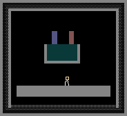

# PoweredMaterial可控材料

可控材料是可以被电信号(PSCN/NSCN)激活或切换状态的元素。它们本身不一定导电，但能响应 SPRK 信号改变自身行为。

**核心概念**：所有可控材料通过检测 2 格范围内的 SPRK 来获知激活/关闭信号——PSCN 类型 SPRK 为激活，NSCN 类型 SPRK 为关闭。多数可控材料支持"相邻传播"——已激活的粒子可将激活状态传递给相邻同类粒子，形成连锁反应。

本分类共 **10** 个元素。

---

###### 液晶(LCRY)【Liquid Crystal】----------------------------------------------Type:054

描述：激活时改变颜色。用P型硅激活，N型硅关闭。通过相邻LCRY之间传播tmp状态来传递激活/关闭信号。

Tmp状态机：0=关闭态，1=正向淡出中，2=激活态，3=正在淡入中。Life：亮度计数器，关闭态从10递减到0，激活态从0递增到10。Tmp2每帧设为life当前值用于渲染。

状态传播：关闭态(tmp=0)检测相邻是否有淡入态(tmp=3)→自身变淡出(tmp=1)。激活态(tmp=3)检测相邻是否有淡出态(tmp=0)→自身变淡入(tmp=2)。链式传播。

高温：>999.85℃/1273K变为BGLA（硼硅酸盐玻璃）。

导热率：251
初始温度：22℃/295.15K

---

###### 可控复制体(PCLN)【Powered Clone】---------------------------------------Type:074

描述：激活时变得和复制体(CLNE)一样，复制其Ctype指向的元素。需要PSCN通电才工作，NSCN可关闭。

Life：10=激活，9=刚被NSCN关闭（残留一帧），1~8=衰减中，0=未激活。Ctype：存储目标元素类型，未设置时自动从相邻非特殊元素学习（排除CLNE/PCLN/BCLN/SPRK/NSCN/PSCN/STKM/PBCN）。Tmp：Ctype为LIFE或LAVA时存储子类型。

信号检测（2格范围）：SPRK(PSCN)→life=10激活。SPRK(NSCN)→life=9关闭。相邻PCLN传播：life=10可激活相邻life=0的PCLN。

激活时生成粒子（life==10）：Ctype==PHOT→8邻格各创建光子。Ctype==LIFE→3x3区域创建LIFE，子类型从Tmp读取。Ctype==LIGH→1/30概率。其他→相邻1格随机创建。

光子通道(PROP_PHOTPASS)：光子可穿过未激活状态的PCLN。

导热率：0
初始温度：22℃/295.15K

---

###### 热开关(HSWC)【Heat Switch】-----------------------------------------------Type:075

描述：激活时才可以导热。Life==10时正常导热，life<10时热绝缘。通过相邻HSWC之间life状态传播来激活/关闭。

Tmp==1 时进入反序列化模式：从相邻 FILT 读取温度值（FILT.ctype - 0x10000000）写入 HSWC.temp，实现远程温度设定——FILT 充当"温度遥控器"。

在热传导网络中使用：HSWC 作为"热阀门"，PSCN 打开导热通道，NSCN 切断。可用于构建温度控制的反馈回路。

导热率：251
初始温度：22℃/295.15K

---

###### 延时器(DLAY)【Delay】-----------------------------------------------------Type:079

描述：当电脉冲通过时延迟X帧再输出，X等于延时计的温度（开氏度-273.15）。默认温度4℃/277.15K即默认延迟4帧。

Life：延时计数器。收到SPRK(PSCN)时设为temp-273.15。每帧递减，从1变为0瞬间在相邻NSCN位置产生SPRK输出。延时时间可用HEAT/COOL调整温度改变。相邻DLAY之间自动同步life值，INSL/RSSS隔离可阻断同步。

EMP破坏：概率1/70随机化temp值。

导热率：0
初始温度：4℃/277.15K

---

###### 堆栈(STOR)【Store】--------------------------------------------------------Type:083

描述：吸收与之接触的单个粒子并完整保存其属性。Ctype=0时吸收任何非固体，设为特定Type则只吸收该类型。

Tmp：存储被吸收粒子的类型，0=未存储。Tmp2/Tmp3/Tmp4：存储原粒子的life/tmp/ctype。Temp：存储原粒子温度。Life：10=刚释放（冷却中），每帧递减至0。

吸收（Tmp==0且life==0时）：2格范围内吸收非STOR、非固体的粒子。SOAP先解绑。完整保存所有属性。

释放（Tmp>0且被SPRK(PSCN)触发）：从上方扫描空位，创建粒子并恢复全部属性，清空Tmp，life=10冷却。与PIPE/PPIP/PRTI可配合使用。

导热率：0
初始温度：22℃/295.15K

---

###### 可控虚空(PVOD)【Powered Void】-------------------------------------------Type:084

描述：激活时如同虚空(VOID)一样吸收一切物质。Life==10 开启吞噬，life==0 关闭。

信号检测（2 格范围）：SPRK(PSCN)→life=10 激活，SPRK(NSCN)→life=9 关闭。相邻 PVOD 传播激活/关闭。与 VOID 的关键区别：可远程控制——通过电路开关决定何时吞噬，不需要直接物理接触。常用于：可控粒子销毁器、自动化清场系统、门控废物处理。

导热率：251
初始温度：22℃/295.15K

---

###### 压力泵(PUMP)【Pressure Pump】----------------------------------------------Type:097

描述：激活时改变周围压力为自身温度值。Life==10 时工作。

核心压力控制：对 4 个正交邻格(NESW)压力平滑逼近——每帧 pv += 0.1 * (目标压力 - pv)，实现渐进式压力调节而非突变。目标压力=(temp-273.15)K。默认 0℃ 即默认目标压力=0，可用 HEAT/COOL 调整目标值。硬度 9（较硬但可被破坏）。

Tmp==1 时进入反序列化模式：从相邻 FILT.ctype 解码压力值直接设置目标（FILT 作"压力遥控器"）。相邻 PUMP 之间传播激活/关闭。

应用：精确气压控制、压力触发系统、真空/高压环境构建。

导热率：0
初始温度：0℃/273.15K

---

###### 可控可破坏复制体(PBCN)【Breakable Powered Clone】-----------------------Type:153

描述：激活时和可破坏复制体(BCLN)相同——生成 Ctype 目标类型的粒子。Ctype 自动学习，激活时生成对应粒子（规则同 PCLN——对 LIFE/LIGH/PHOT 等有特殊生成逻辑）。

Tmp2：可破坏计时器。压力>4.0 时 Tmp2 设为 80~119 倒计时，粒子受气流漂移，归零时销毁。硬度 12。通过相邻 PBCN 传播信号（不直接检测 SPRK——只通过同类传播，形成隔离的控制网络）。光子通道(PROP_PHOTPASS)。

与 PCLN 的关键区别：可被高压破坏，有寿命限制。适合需要"有限次数使用"的复制场景。

导热率：0
初始温度：22℃/295.15K

---

###### 引力泵(GPMP)【Gravity Pump】----------------------------------------------Type:154

描述：激活时改变牛顿万有引力为自身温度值。**必须在全局牛顿引力开启（按 N 键）时才工作。**

Life==10 时设置重力网格：gravIn.mass[cell]=0.2*(temp-273.15)。温度每变化 1℃ 对应重力加速度变化 0.2。温度钳制在 ±256℃ 范围，即引力范围约 -51.2 ~ +51.2。正值吸引（类 BHOL），负值排斥（类 WHOL）。

相邻传播激活/关闭。通过 HEAT/COOL 调整温度来改变引力强度。应用：可控引力阱、自动粒子分选、动态引力场构建。

导热率：0
初始温度：22℃/295.15K

---

###### 可控动力管(PPIP)【Powered Pipe】-----------------------------------------Type:161

描述：与动力管(PIPE)共用核心运输逻辑，但可通过电信号控制。PSCN→运输，NSCN→停止，INST→反转方向。

Tmp标志位：0x10000000=收到PSCN激活，0x08000000=收到NSCN关闭，0x04000000=收到INST反转，0x01000000=方向反转，0x02000000=暂停。通过Flood_trigger洪水填充传播信号到相连管道。

管道颜色循环(RED→BLUE→GREEN→RED)，粒子沿颜色方向单向流动。支持完整属性保存(ctype/tmp/life/temp/dcolour)。与STOR/PRTI/HEAC配合。不会被高压破坏（与PIPE不同）。

导热率：0
初始温度：22℃/295.15K
