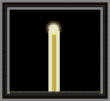
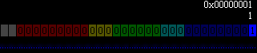
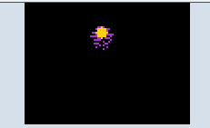
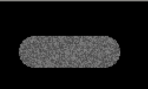

# Solids固体

静态构造材料。从脆弱的冰和玻璃到坚不可摧的金刚石。部分可熔化或具有特殊功能。

本分类共 **33** 个元素。

---

## 快速参考总览表

| 元素 | Type | 内部标识 | 颜色 | 硬度(酸抗) | 导热率 | 熔点(°C) | 压力极限(P) | 导电 | 核心特性 |
|------|------|----------|------|------------|--------|-----------|-------------|------|----------|
| GOO | 12 | PT_GOO | #804000 | 极低 | 75 | — | 1.0 | 否 | 受压变形消失 |
| BIZS | 13 | PT_BIZS | 热致变色 | 高 | 251 | -126.85(→BIZR) | — | 否 | 反物理三态，颜色感染 |
| WOOD | 17 | PT_WOOD | 棕→黑(烧焦) | 低 | 164 | 599.85(燃烧) | -10(炭化) | 否 | 可燃，NEUT穿透 |
| PLNT | 20 | PT_PLNT | #0CAC00 | 极低 | 65 | 299.85(燃烧) | — | 否 | 吸水生长，光合作用 |
| BMTL | 29 | PT_BMTL | #505070 | 中 | 251 | 999.85 | 2.5 | 是(弱) | 生锈碎裂，电加热 |
| WAX | 33 | PT_WAX | #F0F0BB | 极低 | 44 | 45.85 | — | 否 | 低熔点，PHOT可熔 |
| GLAS | 45 | PT_GLAS | #404040 | 0(酸免疫) | 150 | 1699.85 | 0.25(差值) | 否 | 光子色散，化学钢化 |
| NICE | 51 | PT_NICE | #C0E0FF | 极低 | 46 | -210.05 | — | 否 | 氮固体，极低温 |
| COAL | 59 | PT_COAL | #222222 | 低 | 200 | — | 4.31 | 否 | 缓慢燃烧，中子变木材 |
| BRCK | 67 | PT_BRCK | #808080 | 中低 | 251 | 949.85 | 8.8 | 否 | 建筑材料，PSTE烧制 |
| IRON | 76 | PT_IRON | #707070 | 中(~50) | 251 | 1413.85 | — | 是 | 生锈，电解水 |
| ICE | 80 | PT_ICE | #A0C0FF | 极低 | 46 | 0 | 0.8 | 否 | Ctype决定融化产物 |
| DRIC | 81 | PT_DRIC | #E0E0E0 | 极低 | 2 | -77.5(升华) | — | 否 | 固体CO2，缓慢升华 |
| SPNG | 90 | PT_SPNG | #C8A45C | 低 | 251 | 2456.85(燃烧) | — | 否 | 吸水存储，灭火 |
| RIME | 91 | PT_RIME | #CCCCCC | 极低 | 100 | 0 | — | 是 | 通电升华成雾 |
| PSTS | 112 | PT_PSTS | #776677 | 低 | 29 | — | 0.5(→PSTE) | 否 | 浆糊固体形式 |
| VINE | 114 | PT_VINE | #079A00 | 极低 | 65 | 299.85(燃烧) | — | 否 | 藤蔓生长，NEUT导向 |
| FILT | 125 | PT_FILT | 温度变色 | 极高(接近0) | 251 | —(~3000+) | 极高 | 否 | 光子逻辑运算，30位存储 |
| QRTZ | 132 | PT_QRTZ | #AADDDD | 0(酸免疫) | 3 | 2300 | — | 压电导电 | 低温碎裂，盐水生长 |
| TTAN | 144 | PT_TTAN | #909090 | 极高 | 251 | 1667.85 | 极高(阻隔) | 是 | 中子吸收，压敏隔断 |
| SHLD | 152 | PT_SHLD1 | #AAAAAA | 高 | 0 | — | 7 | 是(触发) | 通电生长自修复膜 |
| SHD2 | 153 | PT_SHLD2 | #777777 | 高 | 0 | — | 15 | 是(触发) | 自修复膜 Lv.2 |
| SHD3 | 154 | PT_SHLD3 | #444444 | 高 | 0 | — | 25 | 是(触发) | 自修复膜 Lv.3 |
| SHD4 | 155 | PT_SHLD4 | #212121 | 极高 | 0 | — | 40 | 是(触发) | 自修复膜 Lv.4 |
| SPWN | 162 | PT_SPAWN | #AAAAAA | 不可破坏 | 0 | — | — | 否 | STKM出生点 |
| SPWN2 | 163 | PT_SPAWN2 | #AAAAAA | 不可破坏 | 0 | — | — | 否 | STKM2出生点 |
| GOLD | 169 | PT_GOLD | #DCAD2C | 0(酸免疫*) | 251 | 1063.85 | — | 是(高速) | 抗腐蚀，修复铁锈 |
| VRSS | 174 | PT_VRSS | #D408CD | 中 | 251 | 31.85(→VIRS) | — | 否 | 病毒固体，接触感染 |
| CRMC | 178 | PT_CRMC | #D6D1D4 | 0(酸免疫) | 35 | 2614+(10*P) | -30(→CLST) | 否 | 压力增强熔点 |
| HEAC | 179 | PT_HEAC | #CB6351 | 极高 | 255(最高) | ~1650(仅LIGH) | 几乎无限 | 否 | 超快速热均衡 |
| PTNM | 187 | PT_PTNM | #D5E0EB | 0(催化) | 251 | 1768.85 | — | 是(高速) | 催化剂，冷聚变 |
| ROCK | 189 | PT_ROCK | #727272 | 极高 | 200 | 1943.15 | 120(→STNE) | 否 | CNCT地基，高压矿物 |
| RSSS | 192 | PT_RSSS | #C43626 | 中 | 130 | — | — | 否(绝缘) | 光刻胶固化，反射PHOT |

---

## 目录

- [GOO Type:12](#goo) — 粘土,在压力下会变形消失
- [BIZS Type:13](#bizs) — 奇异固体
- [WOOD Type:17](#wood) — 木头,可燃物允许NEUT通过
- [PLNT Type:20](#plnt) — 植物,吸收水分生长,低温时变成蓝色
- [BMTL Type:29](#bmtl) — 脆金属,在压力下破坏,高温下熔化
- [WAX Type:33](#wax) — 蜡,加热时会融化
- [GLAS Type:45](#glas) — 玻璃,可熔,在压力下破碎,可以将光子分散成不同的光
- [NICE Type:51](#nice) — 氮冰,氮的固体形式,熔化后变成LN2
- [COAL Type:59](#coal) — 煤,缓慢燃烧,燃烧时发红
- [BRCK Type:67](#brck) — 砖块,易碎的建筑材料
- [IRON Type:76](#iron) — 铁,会被,盐水,氧气,水,液氧,腐蚀后变成脆金属,可用于电解水
- [ICE Type:80](#ice) — 冰,在压力下会破碎变成雪
- [DRIC Type:81](#dric) — 干冰,二氧化碳冷却时形成
- [SPNG Type:90](#spng) — 海绵可以从多种元素中(WATR,SLTW,DSTW,FRZW,BUBW,PSTE)吸水
- [RIME Type:91](#rime) — 霜,可以通电升华成雾
- [PSTS Type:112](#psts) — 液体浆糊
- [VINE Type:114](#vine) — 藤蔓,吸水生长,中心部分是PLNT
- [FILT Type:125](#filt) — 滤镜,能改变通过光子的颜色
- [QRTZ Type:132](#qrtz) — 石英,接近绝对零度时会变得很脆并碎裂成PQRT,允许一部分PHOT通过并散射掉另一部分
- [TTAN Type:144](#ttan) — 钛,金属固体坚固的材料熔点很高能导电,会吸收中子
- [SHLD Type:152](#shld) — 自修复膜,通电时会自动生长出保护膜
- [SHD2 Type:153](#shd2) — 自修复膜 Lv.2,通电时会自动生长出保护膜
- [SHD3 Type:154](#shd3) — 自修复膜 Lv.3,通电时会自动生长出保护膜
- [SHD4 Type:155](#shd4) — 自修复膜 Lv.4,通电时会自动生长出保护膜
- [SPWN Type:162](#spwn) — STKM 出生点
- [SPWN2 Type:163](#spwn2) — STKM2 出生点
- [GOLD Type:169](#gold) — 金,抗腐蚀(但通电时会受到酸的腐蚀),可以保护铁免受腐蚀
- [VRSS Type:174](#vrss) — 病毒块,会将其碰触到的所有物质变成VIRS
- [CRMC Type:178](#crmc) — 陶瓷,受压时熔点增加
- [HEAC Type:179](#heac) — 导热体,导热速度比任何其他材料都快
- [PTNM Type:187](#ptnm) — 铂,可以催化某些反应
- [ROCK Type:189](#rock) — 岩石,坚固的材料,CNCT可以堆叠在它上面
- [RSSS Type:192](#rsss) — 固化光刻胶,绝缘,遇NEUT液化,且会反射PHOT

---

###### GOO Type:12


```
┌─────────────────────────────────────────────────────┐
│  属性         │  值                                  │
│───────────────┼──────────────────────────────────────│
│  内部标识     │  PT_GOO                              │
│  颜色         │  #804000 (棕褐色)                     │
│  分类         │  TYPE_SOLID                          │
│  重量(模拟)   │  100                                 │
│  硬度(酸抗)   │  极低 (易被酸腐蚀)                      │
│  导热率       │  75                                  │
│  初始温度     │  22.00°C / 295.15 K                   │
│  压力极限     │  >1.0 P → 变形消失                     │
│  中子反应     │  NEUT → GOO变形 (PLEX来源: 3/200)      │
└─────────────────────────────────────────────────────┘
```

**深度机制：** GOO (粘土) 是一种极不稳定的半固体。其核心机制是"压力敏感性"——当环境压力超过1.0 P时，GOO粒子将不可逆地消失。这个阈值相对较低，意味着即使是很小的爆炸或局部压力积累都可能摧毁GOO结构。中子(NEUT)轰击也会使GOO经历微弱的变形(位移而非消失)，这是核反应场景中需要注意的。

**参数详解：**
- **Life值：** 不会被GOO自动修改，但可通过控制台设置来创建特殊行为
- **Tmp值：** 不会被GOO主动使用
- **Ctype值：** 不会被GOO主动使用

**反应链：**
```
GOO + 高压(>1P) → NONE (永久消失)
GOO + NEUT(来自PLEX) → GOO位移变形 (3/200概率)
GOO + BASE → GEL (酸碱中和转化为胶体)
PLEX + NEUT → GOO (3/200, GOO的来源反应)
```

**实用场景：**
- **压力传感器/指示器：** 利用GOO在>1P时消失的特性，可在密闭容器中布置GOO作为一次性压力保险丝
- **可破坏封印：** 在需要"一次性进入"的结构中使用GOO作为门封，一旦承受压力即永久打开
- **中子探测器(间接)：** 观察GOO是否变形来推断附近是否有中子源活动
- **地基填料：** 由于GOO无特殊反应，可用作廉价填充材料(但需注意压力环境)

*源码：GOO.cpp*

---

###### BIZS Type:13 (奇特固体) —— 见BIZR(液体Type:103)、BIZG(气体Type:104)


```
┌─────────────────────────────────────────────────────┐
│  属性         │  值                                  │
│───────────────┼──────────────────────────────────────│
│  内部标识     │  PT_BIZS                             │
│  颜色         │  热致变色 (温度决定颜色)                │
│  分类         │  TYPE_SOLID                          │
│  重量(模拟)   │  100                                 │
│  硬度(酸抗)   │  高                                  │
│  导热率       │  251                                 │
│  初始温度     │  322.00°C / 595.15 K (比室温高300°C)   │
│  低温转换     │  <126.85°C / 400 K → BIZR(液体)       │
│  特殊属性     │  反物理三态循环 / 颜色感染 / PHOT→ELEC  │
│  关联元素     │  BIZG(气,Type:104) / BIZR(液,Type:103) │
└─────────────────────────────────────────────────────┘
```

**深度机制：** BIZ系列(BIZS/BIZR/BIZG)完全颠覆正常物理规律。正常物质是"升温→熔化→蒸发"，而BIZ系列则是"升温→凝固"。具体而言：BIZG气体在>100K时"凝固"为BIZR液体，BIZR液体在>400K时"凝固"为BIZS固体。物理模拟引擎对BIZ系列使用反重力加速度，使其在引力场中向上"掉落"。这一反常行为使其成为制作反重力装置和特殊逻辑电路的关键材料。

**参数详解：**
- **dcolour (装饰色)：** 如果BIZS粒子被赋予dcolour装饰色，它会以95%的权重将该颜色混合到周围5x5范围内所有非BIZ系列粒子中——本质上是"颜色感染"
- **发光效果：** 速度越大的BIZS粒子发光越亮，使用FIRE_ADD + PMODE_BLUR混合模式渲染
- **Ctype值：** 不会被BIZS主动修改

**BIZ三态反物理循环：**
```
BIZG(气体) ──(>100K升温)──→ BIZR(液体) ──(>400K升温)──→ BIZS(固体)
BIZS(固体) ──(<400K降温)──→ BIZR(液体) ──(<100K降温)──→ BIZG(气体)
```

**反应链：**
```
BIZS + 降温(<400K) → BIZR (固体→液体, 注意: 这是"冷却凝固"的逆过程)
BIZS + 周围粒子(dcolour存在) → 颜色感染 (5x5范围, 95%权重混合)
BIZS + PHOT → ELEC (光子转电子)
```

**实用场景：**
- **反重力电梯：** 利用BIZ系列在引力场中向上运动的反常特性构建
- **颜色扩散器：** 用dcolour装饰BIZS，使其自动将颜色传播到周围建筑
- **光子-电子转换器：** 在光电逻辑电路中充当PHOT→ELEC的接口
- **温度门控开关：** 利用BIZS⇌BIZR在400K的相变，制作温度触发的三态开关

*源码：BIZRS.cpp*

---

###### WOOD Type:17


```
┌─────────────────────────────────────────────────────┐
│  属性         │  值                                  │
│───────────────┼──────────────────────────────────────│
│  内部标识     │  PT_WOOD                             │
│  颜色         │  #C08040 (棕色) → 烧焦变黑 → 低温变蓝  │
│  分类         │  TYPE_SOLID                          │
│  重量(模拟)   │  100                                 │
│  硬度(酸抗)   │  低 (~15)                            │
│  导热率       │  164                                 │
│  初始温度     │  22.00°C / 295.15 K                   │
│  燃点         │  599.85°C / 873 K                    │
│  炭化条件     │  低压(≤-10P) + 高温(>773K) → BCOL      │
│  中子穿透     │  是 (NEUT可穿透, 但会使WOOD变形)        │
└─────────────────────────────────────────────────────┘
```

**深度机制：** WOOD是TPT中生态/建筑体系的基础材料。其燃烧机制分为两个阶段：(1) 加热到499.85°C以上时木材开始变暗，颜色逐渐从棕色过渡到深褐色最终变为煤黑色；(2) 达到燃点599.85°C时引燃为FIRE。已经烧焦的木材(超过176.85°C)永远无法恢复原始颜色——这是一个单向不可逆过程，类似于真实世界中木材的热解炭化。

NEUT穿透机制特殊：中子穿过WOOD时不仅不会消耗，还会让木材发生轻微位移变形。这意味着WOOD不能用作中子屏蔽材料。

高速粒子撞击WOOD时会将其转化为SAWD(锯末/木屑粉末)，这模拟了现实中的机械破坏过程。

低压炭化(≤-10 P + >773K)生成BCOL(煤粉)，这是无氧热解的模拟——在缺乏氧化剂的环境下，有机物被加热后炭化而非燃烧。

**参数详解：**
- **Life值：** 表示木材的"新鲜度"(非官方，但烧焦后life会有变化)
- **Ctype值：** 不会被主动修改

**反应链完整图：**
```
WOOD + 高温(>873K) → FIRE (有氧燃烧)
WOOD + 高温(>773K) + 负压(≤-10P) → BCOL (无氧炭化)
WOOD + 高速粒子撞击 → SAWD (机械破坏, 产生锯末)
WOOD + NEUT → WOOD位移变形 (中子穿透,不消耗)
WOOD + VINE/PLNT → 藤蔓生长基板 (VINE在WOOD上蔓延)
WOOD + 低温(<0°C) → 颜色变蓝 (霜冻效果, 不影响属性)
BCOL + ? → (煤粉可通过压缩等方式回溯利用)
```

**实用场景：**
- **建筑框架：** 用于搭建房屋骨架(需注意防火)
- **中子束流观察窗：** 利用WOOD对中子透明的特性，在不阻挡中子束的情况下标记束流路径
- **VINE种植基板：** 利用WOOD作为VINE/PLNT的生长平台，快速构建绿色植被区
- **木炭生产：** 在负压环境中加热WOOD生产BCOL(煤粉)，用于后续工业应用
- **冲击检测器：** WOOD被高速粒子撞击变成SAWD的现象可作为粒子速度指示
- **可破坏隔板：** 利用其可燃性和适中硬度构建"可烧穿"的墙壁

*源码：WOOD.cpp*

---

###### PLNT Type:20


```
┌─────────────────────────────────────────────────────┐
│  属性         │  值                                  │
│───────────────┼──────────────────────────────────────│
│  内部标识     │  PT_PLNT                             │
│  颜色         │  #0CAC00 (翠绿) → 低温蓝色            │
│  分类         │  TYPE_SOLID                          │
│  重量(模拟)   │  100                                 │
│  硬度(酸抗)   │  极低 (~10)                          │
│  导热率       │  65                                  │
│  初始温度     │  22.00°C / 295.15 K                   │
│  燃点         │  299.85°C / 573 K                    │
│  水分繁殖率   │  1/50 (接触WATR时)                    │
│  生长方式     │  Tmp=1时沿WOOD蔓延 / 接触水自我复制    │
└─────────────────────────────────────────────────────┘
```

**深度机制：** PLNT是TPT生态系统核心。它的生长分为两种模式：(1) "水繁殖"——接触WATR时以1/50概率在相邻空格产生新PLNT；(2) "藤蔓蔓延"——当PLNT的Tmp值为1时，它会沿着WOOD表面线性蔓延生长，在接触WOOD后转化为VINE。光合作用模拟由life=2的PLNT粒子实现：周围有空位时产生O2(氧气)，并可吸收CO2和SMKE。

PLNT还能为火柴人(STKM/STK2)提供生命恢复：火柴人靠近植物时+5生命值。

**参数详解：**
- **Tmp值：** Tmp=1使PLNT沿WOOD生长成VINE；其他值正常水繁殖
- **Life值：** life=2时启动光合作用(产生O2)
- **Ctype值：** 不会被主动修改

**反应链：**
```
PLNT + WATR → 2×PLNT (1/50, 自我复制, 有水环境)
PLNT + WOOD(Tmp=1) → VINE (沿木材蔓延生长)
PLNT(life=2) + 空邻格 → O2 (光合作用产氧)
PLNT + CO2/SMKE → O2 (吸收CO2/烟, 净化空气)
PLNT + NEUT → WOOD (1/20, 辐射诱导木质化)
PLNT + SLTW → SLTW (1/40, 被盐水杀死)
PLNT + LAVA → FIRE (1/50, 直接焚毁)
PLNT + 高温(>573K) → FIRE (燃烧)
STKM/STK2靠近 → +5生命值 (食用)
```

**实用场景：**
- **自动农场：** 在封闭水域旁布置PLNT，利用自我复制机制产生无限植物
- **空气净化系统：** 利用life=2的PLNT吸收CO2/SMKE并产O2，构建封闭生态循环
- **WOOD/VINE绿化：** 先铺WOOD，再用Tmp=1的PLNT让其沿WOOD自动生成VINE
- **火柴人回复站：** 在竞技场中种植PLNT供火柴人回血
- **辐射探测器：** PLNT被中子照射变WOOD的现象可作为辐射泄漏指示
- **CO2回收：** 连接燃烧装置(产生CO2)和PLNT农场形成碳循环

*源码：PLNT.cpp*

---

###### BMTL Type:29


```
┌─────────────────────────────────────────────────────┐
│  属性         │  值                                  │
│───────────────┼──────────────────────────────────────│
│  内部标识     │  PT_BMTL                             │
│  颜色         │  #505070 (暗灰蓝)                     │
│  分类         │  TYPE_SOLID                          │
│  重量(模拟)   │  100                                 │
│  硬度(酸抗)   │  中 (~40-50)                         │
│  导热率       │  251                                 │
│  初始温度     │  22.00°C / 295.15 K                   │
│  熔点         │  999.85°C / 1273 K                    │
│  压力极限     │  >2.5 P → 破坏                         │
│  电加热效应   │  电脉冲通过时升温                       │
│  光子透过率   │  50% (一半透过一半反射)                 │
└─────────────────────────────────────────────────────┘
```

**深度机制：** BMTL是TPT中最常见的"可破坏金属"。其生锈机制采用两阶段模型：

阶段一 (锈蚀蔓延)：IRON接触SALT/SLTW/WATR/OXYG/LOXY后变为BMTL(Tmp=1)
阶段二 (完全锈蚀)：BMTL(Tmp=1)以1/1000概率变为BRMT(铁锈粉末)，此过程不可逆

GOLD在4格范围内可将BMTL(Tmp>0)还原为IRON，模拟了贵金属的阴极保护作用。这在电化学上是合理的——金作为更惰性的金属，在电解质中充当阴极，保护铁不被氧化。

BMTL也可由THRM燃烧产生：THRM燃烧后的熔融物冷却形成BMTL，构成铝热剂→BMTL的反应路径。

在极端条件下(9000°C + 250 P + 高牛顿引力)，OXYG可被压缩成熔融BMTL，这是聚变路径的最后一步。

**参数详解：**
- **Tmp值：** Tmp=0为纯净BMTL；Tmp≥1表示已经开始生锈(BMTL→BRMT有1/1000概率)
- **Life值：** 不被主动使用
- **Ctype值：** 不被主动使用

**反应链：**
```
铁制品生锈链:
IRON + SALT/SLTW/WATR/OXYG/LOXY → BMTL(Tmp=1) [阶段一: 锈蚀]
BMTL(Tmp=1) → BRMT [阶段二: 碎裂, 1/1000/帧]

铁锈修复链:
GOLD(4格内) + BMTL(Tmp>0) → IRON [阴极保护还原]

铝热剂路径:
THRM燃烧 → LAVA(BMTL) → BMTL(冷却) [工业制备]

聚变路径:
OXYG + 9000°C + 250P + 高引力 → LAVA(BMTL) → BMTL [极端合成]

锈蚀蔓延:
BMTL(Tmp>1) + METL/IRON → 2×BMTL [1/100, 接触传播]
```

**实用场景：**
- **可破坏建筑：** 利用其2.5 P压力极限构建"可摧毁"的掩体结构
- **电加热器：** 通电后BMTL升温，可用作简易电热元件
- **锈蚀展示：** 在教学中展示铁→锈的完整化学过程
- **半透光子镜：** 利用50%反射/50%透过的特性制作分光器
- **可修复结构：** 利用GOLD的还原能力制作"可维护"铁结构
- **铝热剂收集：** 燃烧THRM后收集冷却形成的BMTL

*源码：BMTL.cpp*

---

###### WAX Type:33



```
┌─────────────────────────────────────────────────────┐
│  属性         │  值                                  │
│───────────────┼──────────────────────────────────────│
│  内部标识     │  PT_WAX                              │
│  颜色         │  #F0F0BB (淡黄奶油色)                 │
│  分类         │  TYPE_SOLID                          │
│  重量(模拟)   │  100                                 │
│  硬度(酸抗)   │  极低 (~5)                           │
│  导热率       │  44                                  │
│  初始温度     │  22.00°C / 295.15 K                   │
│  熔点         │  45.85°C / 319 K                     │
│  燃点(蒸汽)   │  399.85°C / 673 K (MWAX点燃)          │
│  中子特性     │  反射中子(NEUT)                       │
│  PHOT特性     │  光子照射加速熔化                      │
└─────────────────────────────────────────────────────┘
```

**深度机制：** WAX是TPT中熔点最低的固体之一(45.85°C)，这使得它在室温下稳定但极易被任何热源熔化。PHOT(光子)照射可加速熔化过程——光子携带的能量被蜡吸收后转化为热能，类似于激光加热。WAX反射中子(NEUT)，这使其成为廉价的中子反射层候选材料。

熔化后变为MWAX(蜡油液体)，MWAX在44.85°C时重新凝固。MWAX的燃点为399.85°C，比固态WAX更难点燃。

**参数详解：**
- **Life值：** 不被主动使用
- **Tmp值：** 可表示熔化进度(非官方机制)
- **Ctype值：** 不被主动使用

**反应链：**
```
WAX + 高温(>319K) → MWAX (熔化)
MWAX + 低温(<318K) → WAX (凝固)
MWAX + 高温(>673K) → FIRE (点燃)
WAX + PHOT → 加速熔化 (光热效应)
WAX + NEUT → 反射 (中子反射层)
```

**实用场景：**
- **低熔点保险丝/阀门：** 利用WAX低熔点制作热触发的一次性开关
- **可变性材料：** 用于需要固液转换的教学演示
- **中子反射器：** WAX作为廉价NEUT反射材料，用于核反应堆外层
- **光热转换器：** 利用PHOT→WAX熔化制作光控阀门
- **温度校准标尺：** WAX在45.85°C熔化的特性可作为温度参考点
- **蜡烛模拟：** 真实的WAX→MWAX→FIRE链条可模拟真实蜡烛燃烧

*源码：WAX.cpp*

---

###### GLAS Type:45


```
┌─────────────────────────────────────────────────────┐
│  属性         │  值                                  │
│───────────────┼──────────────────────────────────────│
│  内部标识     │  PT_GLAS                             │
│  颜色         │  #404040 (深灰) → 强化后略微发亮       │
│  分类         │  TYPE_SOLID                          │
│  重量(模拟)   │  100                                 │
│  硬度(酸抗)   │  0 (实验室条件下对酸免疫)              │
│  导热率       │  150                                 │
│  初始温度     │  22.00°C / 295.15 K                   │
│  熔点         │  1699.85°C / 1973 K                   │
│  压力极限     │  压力变化>0.25 P → 破碎成BGLA           │
│  化学钢化     │  SALT浸泡: Life值增加, 每点提升强度      │
│  PHOT色散     │  通过时分散成不同波长(棱镜效应)          │
│  NEUT反应     │  生成单色PHOT并可能增殖NEUT             │
│  ELEC反应     │  产生EMBR火花(光电效应模拟)              │
└─────────────────────────────────────────────────────┘
```

**深度机制：** GLAS是最复杂的结构材料之一。其破碎机制基于"压力变化"而非绝对压力——当相邻区域压力差超过强度阈值时GLAS碎裂为BGLA(碎玻璃粉末)。这正是真实玻璃的热冲击破碎原理：局部加热/冷却导致膨胀/收缩不均，产生应力。

化学钢化(通过SALT浸泡)使GLAS的Life值增加。Life<16不提供额外强度，而Life最大值可达28080(仅能通过控制台或属性笔设置)。更高的Life值意味着更大的压力差容忍度，最大强度差异可达3.91倍。

NEUT+GLAS交互有双重效果：(1)产生单色PHOT(切伦科夫辐射模拟)；(2)如果通过足够数量的NEUT，GLAS会增加NEUT数量(次级中子增殖)。这使GLAS在中子物理实验中非常独特。

**参数详解：**
- **Life值：** 强度值。0-15为基准强度；>15开始线性增强，最大28080
- **Tmp值：** 不被主动使用
- **Ctype值：** 不被主动使用

**反应链：**
```
GLAS + 压力差>强度阈值 → BGLA (碎裂)
GLAS + SALT(浸泡) → Life值增加 (化学钢化, 最大差异3.91x)
GLAS + NEUT → 单色PHOT + 可能NEUT增殖 (切伦科夫+次级中子)
GLAS + ELEC → EMBR (光电火花, 无害)
GLAS(强度>200, <77K, pres>5) → GLAS + LNTG(冷凝液氮, 1/100)
GLAS + ACID/CAUS → 不反应 (实验室级耐酸)
PHOT通过GLAS → 色散为不同波长 (棱镜分光)
```

**实用场景：**
- **中子增殖器：** 利用GLAS+NEUT的中子增殖效应构建核反应装置
- **分光棱镜：** 利用PHOT通过GLAS时的色散制作光谱分析器
- **化学钢化工厂：** 用SALT浸泡GLAS批量生产高强玻璃
- **光控电路板：** 利用BGLA折射PHOT制作光子路由
- **观察窗：** GLAS对ACID免疫且透明(PHOT可通过)，适合酸环境观察窗
- **低温液氮冷凝器：** 利用GLAS在低温高压下冷凝LN2的特性
- **切伦科夫探测器：** 观察NEUT→PHOT转换以检测中子束

*源码：GLAS.cpp*

---

###### NICE Type:51


```
┌─────────────────────────────────────────────────────┐
│  属性         │  值                                  │
│───────────────┼──────────────────────────────────────│
│  内部标识     │  PT_NICE                             │
│  颜色         │  #C0E0FF (淡蓝白)                     │
│  分类         │  TYPE_SOLID                          │
│  重量(模拟)   │  100                                 │
│  硬度(酸抗)   │  极低 (~5)                           │
│  导热率       │  46                                  │
│  初始温度     │  -238.15°C / 35 K                     │
│  熔点         │  -210.05°C / 63.1 K                   │
│  关联元素     │  LN2(液氮,Type:95)                     │
└─────────────────────────────────────────────────────┘
```

**深度机制：** NICE(氮冰)是氮元素的固体形态，初始温度仅35K(-238.15°C)，是TPT中最冷的固体之一。它的相变温度区间极窄(-210.05°C熔化)，这意味着在常规环境中NICE几乎会瞬间熔化——大多数材料的温度都足够高以使其熔化为LN2(液氮)，且大概率进一步沸腾消失。

NICE常与LN2配合作为冷却系统的一部分。典型的冷却链为：LN2吸收热量后消失(不留下任何产物)，带走大量热能。NICE作为LN2的"固态缓存"，可在需要时提供更密集的冷却剂储备。

**参数详解：**
- **Life值：** 不被主动使用
- **Tmp值：** 不被主动使用
- **Ctype值：** 不被主动使用

**反应链：**
```
NICE + 升温(>63.1K) → LN2 (液氮)
LN2 + 升温(>77K) → NONE (消失, 带走热量)
LN2 + 降温(<63K) → NICE (重新冻结)
```

**实用场景：**
- **超低温冷却：** 作为固体冷却剂提供极致制冷（初始35K）
- **反应堆紧急冷却：** 在核反应堆中布置NICE作为后备冷却介质
- **低温实验：** 利用NICE制造接近绝对零度的实验环境
- **温差发电组件：** 利用NICE和环境温度的极端温差驱动热力装置
- **相变储能：** NICE熔化吸收大量热量，用于温度峰值缓冲

*源码：NICE.cpp*

---

###### COAL Type:59


```
┌─────────────────────────────────────────────────────┐
│  属性         │  值                                  │
│───────────────┼──────────────────────────────────────│
│  内部标识     │  PT_COAL                             │
│  颜色         │  #222222 (深黑) → 加热白热化 → 冷却灰白 │
│  分类         │  TYPE_SOLID                          │
│  重量(模拟)   │  100                                 │
│  硬度(酸抗)   │  低 (~20)                            │
│  导热率       │  200                                 │
│  初始温度     │  22.00°C / 295.15 K                   │
│  压力极限     │  >4.31 P → BCOL(碎裂成煤粉)            │
│  点燃方式     │  FIRE、PLSM、LAVA可点燃缓慢燃烧          │
│  NEUT反应     │  1/20概率变WOOD (辐射诱导有机化)        │
│  光学特性     │  吸收光子(PHOT)                        │
└─────────────────────────────────────────────────────┘
```

**深度机制：** COAL(煤块)是一种可缓慢燃烧的固体。加热时逐渐白热化——温度越高越亮，模拟了黑体辐射。停止加热后自身冷却变为浅灰色，这是不可逆的颜色变化。燃烧过程由Life值控制：Life<100时处于燃烧状态，此时煤块持续消耗。Tmp<40时煤块碎裂。

在>4.31 P压力下COAL碎裂成BCOL(煤粉)，这是物理粉碎模拟。BCOL继承了COAL的白热化/冷却变色特性。

COAL在冶炼中扮演重要角色：LAVA(STNE)+COAL→LAVA(SLCN)模拟了用碳还原二氧化硅制取硅的过程；LAVA(IRON)+COAL→LAVA(METL)模拟了碳还原铁矿石的炼铁过程。

**参数详解：**
- **Life值：** Life<100时燃烧(持续消耗)，Life减少代表燃烧进度
- **Tmp值：** Tmp<40时碎裂
- **Ctype值：** 不被主动使用

**反应链：**
```
COAL + FIRE/PLSM/LAVA → 点燃(缓慢燃烧, Life递减)
COAL + 高压(>4.31P) → BCOL (碎裂)
COAL + NEUT → WOOD (1/20, 辐射还原)
COAL + PHOT → 光子被吸收
COAL加热 → 白热化 (温度越高越亮)
COAL冷却(烧过后) → 浅灰色 (不可逆)

冶炼链:
LAVA(STNE) + COAL → LAVA(SLCN) (1/60, 硅冶炼)
LAVA(IRON) + COAL → LAVA(METL) (1/500, 炼铁)
```

**实用场景：**
- **慢速燃烧热源：** COAL提供稳定长时间热源(不同于FIRE的剧烈燃烧)
- **冶金还原剂：** 用于STNE→SLCN和IRON→METL的冶炼工艺
- **中子转换：** 利用NEUT→WOOD转换制作特殊建筑材料
- **温度指示器：** 利用COAL加热白热化的特性制作简易温度计
- **光吸收器：** 利用COAL吸收PHOT制作暗室或光陷阱
- **压力传感器：** >4.31P碎裂成BCOL作为压力阈值指示

*源码：COAL.cpp*

---

###### BRCK Type:67


```
┌─────────────────────────────────────────────────────┐
│  属性         │  值                                  │
│───────────────┼──────────────────────────────────────│
│  内部标识     │  PT_BRCK                             │
│  颜色         │  #808080 (灰色) → Tmp=1时发蓝光       │
│  分类         │  TYPE_SOLID                          │
│  重量(模拟)   │  100                                 │
│  硬度(酸抗)   │  中低 (~30-35)                       │
│  导热率       │  251                                 │
│  初始温度     │  22.00°C / 295.15 K                   │
│  熔点         │  949.85°C / 1223 K                    │
│  压力极限     │  >8.8 P → STNE(碎裂成石粉)             │
│  制取方法     │  PSTE加热至480°C / 753.15 K → BRCK    │
│  蓝光特效     │  Tmp=1时发出蓝色光芒(类似PPIP)          │
└─────────────────────────────────────────────────────┘
```

**深度机制：** BRCK(砖块)是常见的建筑材料，由PSTE(浆糊)加热至480°C烧制而成。模拟了现实中粘土砖的烧制工艺。当压力超过8.8 P时碎裂成STNE(石粉)，这个压力极限相对较高，使其作为建筑材料比BMTL(2.5 P)和GLAS(0.25 P差值)更可靠。

BRCK不导电，这使其成为高压/电火花环境下的理想隔离材料。Tmp=1时BRCK发出蓝光，类似PPIP(可控动力管)的视觉效果，可用于装饰或信号指示。

**参数详解：**
- **Tmp值：** Tmp=1激活蓝光效果(纯装饰性)
- **Life值：** 不被主动使用
- **Ctype值：** 不被主动使用

**反应链：**
```
PSTE + 高温(>747K) → BRCK (烧砖, 不可逆)
BRCK + 高压(>8.8P) → STNE (碎裂)
BRCK + 高温(>1223K) → LAVA(BRCK) (熔化)
```

**实用场景：**
- **建筑材料：** 高压力极限(8.8P)使其成为优秀的结构墙材料
- **电绝缘墙：** 不导电特性适用于高压电设备隔离
- **烧砖工业：** PSTE→BRCK的生产线模拟真实烧砖流程
- **蓝光装饰：** Tmp=1的BRCK可用于建筑灯光装饰
- **压力隔离带：** 介于低压区和高压区之间作为过渡材料

*源码：BRCK.cpp*

---

###### IRON Type:76


```
┌─────────────────────────────────────────────────────┐
│  属性         │  值                                  │
│───────────────┼──────────────────────────────────────│
│  内部标识     │  PT_IRON                             │
│  颜色         │  #707070 (金属灰)                     │
│  分类         │  TYPE_SOLID                          │
│  重量(模拟)   │  100                                 │
│  硬度(酸抗)   │  中 (~50)                            │
│  导热率       │  251                                 │
│  初始温度     │  22.00°C / 295.15 K                   │
│  熔点         │  1413.85°C / 1687 K                   │
│  导电性       │  是 (导体)                            │
│  腐蚀物       │  SALT, SLTW, OXYG, WATR, LOXY        │
│  防腐蚀保护   │  GOLD (4格范围内)                      │
│  电解         │  通电+水 → H2 + O2                     │
└─────────────────────────────────────────────────────┘
```

**深度机制：** IRON(铁)的腐蚀是TPT中最详细的化学过程之一。五种物质可引发腐蚀：SALT(盐)、SLTW(盐水)、OXYG(氧气)、WATR(水)、LOXY(液氧)。腐蚀产物为BMTL(Tmp=1)，随后BMTL以1/1000概率继续锈蚀为BRMT(铁锈粉末)。

电解水的机制：IRON作为电极时，电流通过WATR→分解为HYGN(氢气)和OXYG(氧气)。这模拟了真实电解反应，IRON充当阴极/阳极材料。

GOLD的阴极保护是电化学机制：金(更惰性金属)在IRON四格范围内将BMTL还原为IRON，这是贵金属牺牲保护的简化模拟。

**参数详解：**
- **Life值：** 不被主动使用
- **Tmp值：** 不被主动使用
- **Ctype值：** 不被主动使用

**反应链：**
```
锈蚀路径:
IRON + SALT/SLTW/OXYG/WATR/LOXY → BMTL(Tmp=1) [生锈开始]
BMTL(Tmp=1) → BRMT [完全锈蚀, 1/1000/帧, 不可逆]
BMTL(Tmp>1) + IRON/METL → 2×BMTL [锈蚀蔓延, 1/100]

防锈/还原路径:
GOLD(4格内) + BMTL(Tmp>0) → IRON [阴极保护]

电解路径:
IRON(通电) + WATR → HYGN + OXYG [水电解]

热加工路径:
IRON + 高温(>1687K) → LAVA(IRON) [熔融铁]
LAVA(IRON) + COAL → LAVA(METL) [炼铁, 1/500]
```

**实用场景：**
- **电解槽电极：** IRON浸泡在水中通电可制取H2和O2
- **可生锈建筑：** 故意利用锈蚀机制创建随时间退化的结构
- **金防锈系统：** 在铁结构旁嵌GOLD条维持结构完整性
- **锈蚀传感器：** 监控铁结构周围是否有SALT/SLTW等腐蚀性物质
- **热传导框架：** 利用高导热率(251)制作热管理结构
- **熔融金属源：** 冶炼链条起始材料

*源码：IRON.cpp*

---

###### ICE Type:80


```
┌─────────────────────────────────────────────────────┐
│  属性         │  值                                  │
│───────────────┼──────────────────────────────────────│
│  内部标识     │  PT_ICE (指向ICEI)                    │
│  颜色         │  #A0C0FF (冰蓝)                       │
│  分类         │  TYPE_SOLID                          │
│  重量(模拟)   │  100                                 │
│  硬度(酸抗)   │  极低 (~10)                          │
│  导热率       │  46                                  │
│  初始温度     │  -28.00°C / 245.15 K                  │
│  熔点         │  0°C / 273.15 K                       │
│  压力极限     │  >0.8 P → SNOW(雪)                     │
│  Ctype机制    │  Ctype值决定融化后的产物                │
│  中子减速     │  是 (NEUT速度×0.995)                    │
└─────────────────────────────────────────────────────┘
```

**深度机制：** ICE(冰)最具特色的机制是Ctype决定的融化产物。普通ICE(Ctype=WATR)融化后生成WATR水，但如果设置Ctype为SLTW，融化后将生成SLTW——这意味着你可以拥有"盐水冰""蒸馏水冰"等变体。这在建造多液系统时非常灵活。

ICE对中子(NEUT)有减速作用(v*0.995每接触一次)，类似于真实水/冰作为中子慢化剂。连续穿过多层ICE可使中子速度显著下降，直至被吸收。

压力>0.8 P时ICE碎裂为SNOW(雪)而非直接变成水——这是压力诱导相变而非温度相变。

盐(SALT/SLTW)可加速融化：ICE+SALT→2×SLTW (1/200)，模拟了现实生活中盐降低冰点的融冰效应。

**参数详解：**
- **Ctype值：** 决定融化产物类型(默认WATR, 可为SLTW/DSTW/FRZW等)
- **Life值：** 不被主动使用
- **Tmp值：** 不被主动使用

**反应链：**
```
ICE + 升温(>273.15K) → 融化产物(Ctype决定) [热融化]
ICE + 高压(>0.8P) → SNOW [压力碎裂]
ICE + NEUT → NEUT减速(v×0.995) + ICE持续存在 [中子慢化]
ICE + SALT/SLTW → 2×SLTW (1/200) [盐融冰]
ICE + FRZZ → ICE(FRZW) (1/200) [超冷水冻结]
ICE(通电) → 不导电，冰是绝缘体
```

**实用场景：**
- **中子慢化层：** 利用ICE逐层减速中子的特性构建核反应堆慢化剂
- **多液冰仓库：** 使用不同Ctype的ICE分别储存SLTW/DSTW等液体
- **压力传感器：** >0.8P碎裂变SNOW指示压力超标
- **盐检测器：** 观察ICE是否异常融化以检测SALT泄漏
- **冷水管道：** 低温液体输送中的固液过渡材料
- **冰雕艺术：** 利用可熔性创造临时冰建筑

*源码：ICEI.cpp*

---

###### DRIC Type:81


```
┌─────────────────────────────────────────────────────┐
│  属性         │  值                                  │
│───────────────┼──────────────────────────────────────│
│  内部标识     │  PT_DRIC                             │
│  颜色         │  #E0E0E0 (灰白)                       │
│  分类         │  TYPE_SOLID                          │
│  重量(模拟)   │  100                                 │
│  硬度(酸抗)   │  极低 (~5)                           │
│  导热率       │  2 (极低, 接近绝热)                    │
│  初始温度     │  -100.50°C / 172.65 K                 │
│  升华点       │  -77.5°C / 195.65 K → CO2             │
│  生成条件     │  CO2温度 < -78.5°C → DRIC             │
└─────────────────────────────────────────────────────┘
```

**深度机制：** DRIC(干冰)是二氧化碳(CO2)的固体形式。与大多数固体不同，DRIC不经过液态直接升华为气体CO2——这是真正的"升华"过程。值得注意的是，即使在高温环境下，升华也需要一定时间才能完成，不是瞬间发生的。升华点为-77.5°C。

极低的导热率(2)使DRIC成为优秀的绝热材料。在需要保温/保冷的环境中，DRIC层可有效减缓热量传递。

**参数详解：**
- **Life值：** 不被主动使用
- **Tmp值：** 不被主动使用
- **Ctype值：** 不被主动使用

**反应链：**
```
CO2 + 降温(<194.65K) → DRIC (凝华, 气→固)
DRIC + 升温(>195.65K) → CO2 (升华, 固→气, 缓慢进行)
DRIC + 热量输入 → 缓慢升温+逐步升华
```

**实用场景：**
- **绝热层：** 利用导热率2制作极高效保温墙
- **低温冷源：** 作为初始温度-100.5°C的固体冷源
- **CO2储存：** 固态CO2比气态密度高，节省空间
- **缓慢释放CO2：** 利用缓慢升华特性，长期少量供应CO2给植物
- **温度隔离带：** 在高温区和低温区之间使用DRIC作为热屏障

*源码：DRIC.cpp*

---

###### SPNG Type:90


```
┌─────────────────────────────────────────────────────┐
│  属性         │  值                                  │
│───────────────┼──────────────────────────────────────│
│  内部标识     │  PT_SPNG                             │
│  颜色         │  #C8A45C (浅棕色) → 吸水深褐色        │
│  分类         │  TYPE_SOLID                          │
│  重量(模拟)   │  100                                 │
│  硬度(酸抗)   │  低 (~15)                            │
│  导热率       │  251                                 │
│  初始温度     │  22.00°C / 295.15 K                   │
│  燃点         │  2456.85°C / 2730 K (极高)            │
│  可吸收液体   │  WATR, SLTW, DSTW, FRZW, BUBW, PSTE  │
│  储水容量     │  Life值(0~无上限)每Life=1份水          │
└─────────────────────────────────────────────────────┘
```

**深度机制：** SPNG(海绵)是一种吸水存储材料。当接触可吸收液体时，Life值递增(每吸收一帧的液体，Life+1)，同时液体被消耗。已被吸收的水以"存储"形式存在于SPNG内部。

饱和或高温时SPNG释放WTRV(水蒸气)来排水。附近有FIRE(火焰)时自动释放水蒸气灭火并消耗Life值——这是自动灭火机制。

吸收SLTW时可能析出SALT(盐)，模拟了盐在水分蒸发/排出后的结晶过程。吸收BUBW(苏打水)时释放CO2。吸收PSTE(浆糊)时PSTE变成CLST(粘土砂)——海绵从浆糊中吸水，留下固体沉淀。

**参数详解：**
- **Life值：** 储水量(每值代表1份水)。Life越高颜色越深。释放水后Life减少
- **Tmp值：** 不被主动使用
- **Ctype值：** 不被主动使用

**反应链：**
```
SPNG(Life<N) + WATR/SLTW/DSTW/FRZW/CBNW/PSTE → SPNG(Life+1) [吸水]
SPNG(高Life,高温) → SPNG(Life-1) + WTRV [排水/蒸发]
SPNG(附近有FIRE) → SPNG(Life-1) + WTRV [自动灭火]
SPNG + SLTW(吸水时) → SALT析出 [盐结晶]
SPNG + BUBW(吸水时) → CO2释放 [脱气]
SPNG + PSTE(吸水时) → PSTE→CLST [脱水固化]
SPNG + 超高温(>2730K) → FIRE [燃烧]
```

**实用场景：**
- **自动灭火系统：** 在FIRE易发区域布置SPNG构建被动灭火网络
- **水库/蓄水池：** 利用SPNG大量储存水用于后续释放
- **水净化：** 利用吸水-排水循环分离SLTW中的盐分
- **BUBW脱气器：** 用SPNG吸收BUBW并释放CO2收集气体
- **湿度调节器：** 自动在高热时释放水蒸气调节环境湿度
- **浆糊分离：** 利用SPNG+PSTE→CLST反应提取粘土砂

*源码：SPNG.cpp*

---

###### RIME Type:91


```
┌─────────────────────────────────────────────────────┐
│  属性         │  值                                  │
│───────────────┼──────────────────────────────────────│
│  内部标识     │  PT_RIME                             │
│  颜色         │  #CCCCCC (灰白霜色)                    │
│  分类         │  TYPE_SOLID                          │
│  重量(模拟)   │  100                                 │
│  硬度(酸抗)   │  极低 (~8)                           │
│  导热率       │  100                                 │
│  初始温度     │  -30°C / 243.15 K                     │
│  熔点         │  0°C / 273.15 K → WATR                │
│  电反应       │  通电→升华成FOG(雾)                     │
│  生成条件     │  WTRV快速冷却凝华 → RIME              │
└─────────────────────────────────────────────────────┘
```

**深度机制：** RIME(霜)是水蒸气的凝华产物(WTRV快速冷却→RIME)，模拟了现实中霜的形成过程。与ICE不同，RIME在通电时升华成FOG(雾)而非直接融化——这是电热升华，将固体直接转化为气体悬浮液。

FOG的生成具有实用价值：FOG可作为光线散射介质或视觉效果层。RIME→FOG的转化使霜成为可控雾发生器。

**参数详解：**
- **Life值：** 不被主动使用
- **Tmp值：** 不被主动使用
- **Ctype值：** 不被主动使用

**反应链：**
```
WTRV + 快速降温 → RIME (凝华, 气→固)
RIME + 升温(>273.15K) → WATR (熔化)
RIME + SPRK(通电) → FOG (升华, 固→雾气)
FOG + 升温 → WTRV (雾→水蒸气, 或自然消散)
```

**实用场景：**
- **雾发生器：** RIME+SPRK→FOG用于可控造雾
- **视觉效果：** FOG散射光线用于照明效果
- **冷源指示器：** RIME的形成指示局部温度降至冰点以下
- **蒸气阱：** 利用凝华特性从WTRV中提取水分
- **低温艺术装置：** 利用RIME的视觉特性和相变制作动态冰雕

*源码：RIME.cpp*

---

###### PSTS Type:112


```
┌─────────────────────────────────────────────────────┐
│  属性         │  值                                  │
│───────────────┼──────────────────────────────────────│
│  内部标识     │  PT_PSTS                             │
│  颜色         │  #776677 (暗紫灰)                      │
│  分类         │  TYPE_SOLID                          │
│  重量(模拟)   │  100                                 │
│  硬度(酸抗)   │  低 (~20)                            │
│  导热率       │  29                                  │
│  初始温度     │  20.00°C / 293.15 K                   │
│  低压转换     │  <0.5 P → PSTE (浆糊液体)              │
│  关联元素     │  PSTE(液体浆糊, Type:111)              │
└─────────────────────────────────────────────────────┘
```

**深度机制：** PSTS(固体浆糊)是PSTE(液体浆糊)在压力>0.5 P时的固化形式。PSTE/PSTS对PSTE/GEL构成了一个"压力控制型固液转换系统"：低压区PSTE流动，高压区PSTE凝固为PSTS；反之PSTS在低压下恢复为PSTE。

PSTS+GEL→CLST的反应表明胶体(GEL)和浆糊之间存在排异作用——胶体从浆糊中夺取水分，留下CLST(粘土砂)固体沉淀。

**参数详解：**
- **Life值：** 不被主动使用
- **Tmp值：** 不被主动使用
- **Ctype值：** 不被主动使用

**反应链：**
```
PSTE + 高压(>0.5P) → PSTS (加压固化)
PSTS + 低压(<0.5P) → PSTE (减压液化)
PSTS + GEL → CLST (胶体排异, GEL夺水留下粘土砂)
PSTE + 高温(>747K) → BRCK (烧制成砖)
```

**实用场景：**
- **压力阀门：** PSTS/PSTE根据压力自动切换固液状态
- **可逆建筑材料：** 需要时可固化的临时结构
- **粘土砂提取：** 利用GEL从PSTS中提取CLST
- **压力可视化：** PSTS/PSTE转换直观展示压力分布
- **软体机器人关节：** 利用压力控制的固液转换制作可动结构

*源码：PSTS.cpp*

---

###### VINE Type:114


```
┌─────────────────────────────────────────────────────┐
│  属性         │  值                                  │
│───────────────┼──────────────────────────────────────│
│  内部标识     │  PT_VINE                             │
│  颜色         │  #079A00 (深绿)                       │
│  分类         │  TYPE_SOLID                          │
│  重量(模拟)   │  100                                 │
│  硬度(酸抗)   │  极低 (~10)                          │
│  导热率       │  65                                  │
│  初始温度     │  22.00°C / 295.15 K                   │
│  燃点         │  299.85°C / 573 K                    │
│  生长方式     │  半随机蔓延, 中心节点转PLNT             │
│  NEUT导向     │  向中子来源方向生长                    │
└─────────────────────────────────────────────────────┘

**深度机制：** VINE(藤蔓)以一种半随机、类似草的形态生长。生长过程：VINE沿可接触表面蔓延→蔓延后自身转化为PLNT→PLNT继续产生新的VINE。这形成了一个自持的植物扩散系统。

NEUT(中子)会引发VINE向中子来源方向生长，且VINE被中子轰击后变为WOOD——这使VINE成为辐射响应材料。

**参数详解：**
- **Life值：** 不被主动使用
- **Tmp值：** 不被主动使用
- **Ctype值：** 不被主动使用

**反应链：**
```
VINE + 生长扩散 → PLNT (蔓延后自身转为植被节点)
PLNT(Tmp=1) + WOOD → VINE (沿木材蔓延)
VINE + NEUT → WOOD + 向中子源方向生长 (辐射响应)
VINE + WATR → 加速生长 (间接通过PLNT繁殖)
VINE + 高温(>573K) → FIRE (燃烧)
```

**实用场景：**
- **自动绿化：** 在WOOD骨架上自动生成VINE植被覆盖
- **中子方向检测：** 观察VINE生长方向推断中子源位置
- **木质转化站：** 用NEUT照VINE产生WOOD用于建筑
- **自然景观：** 利用VINE的随机蔓延形态创造有机外观
- **生物防护带：** VINE+PLNT系统可作为环境净化屏障（吸收CO2产O2）

*源码：VINE.cpp*

---

###### FILT Type:125



```
┌─────────────────────────────────────────────────────┐
│  属性         │  值                                  │
│───────────────┼──────────────────────────────────────│
│  内部标识     │  PT_FILT                             │
│  颜色         │  温度决定 (蓝→绿→橙→红 对应 0→1000°C) │
│  分类         │  TYPE_SOLID                          │
│  重量(模拟)   │  100                                 │
│  硬度(酸抗)   │  极高 (接近0/免疫)                     │
│  导热率       │  251                                 │
│  初始温度     │  22.00°C / 295.15 K                   │
│  熔点         │  >3000°C (几乎不熔)                    │
│  环境热辐射   │  免疫 (不受空气温度影响)                │
│  存储容量     │  30位二进制 (通过Ctype值)               │
│  Ctype运算    │  色光谱位运算(5组: 红9/黄3/绿6/青3/蓝9) │
└─────────────────────────────────────────────────────┘
```

**深度机制：** FILT(滤镜)是TPT中最强大的光学/逻辑元件。其Ctype值用30位编码一个"颜色波长"，其中仅低30位中的5组位决定可见颜色(红9位、黄3位、绿6位、青3位、蓝9位，共30位)。Ctype=0x3FFFFFFF(全1)为白色(所有波长启用)，Ctype=0为透明(波长由温度决定)。

温度着色模式(Ctype=0时生效)：从0°C开始，每40°C向红色端移动1位，共25次移位后到达全红(1000°C)。冷色→蓝色端，热色→红色端。

FILT对BRAY射线的作用由Tmp值决定(9种模式)：
- **Tmp=0 (SET/设置)**：将BRAY颜色强制改为自身Ctype颜色
- **Tmp=1 (AND/与门过滤)**：BRAY颜色与自身Ctype做按位与——只有两者共有的波长保留
- **Tmp=2 (OR/或门增加)**：将自身Ctype的波长添加到BRAY中
- **Tmp=3 (SUB/减法删除)**：从BRAY波长中减去自身Ctype对应位
- **Tmp=4 (红移<<)**：BRAY所有波长位左移(向红色端)
- **Tmp=5 (蓝移>>)**：BRAY所有波长位右移(向蓝色端)
- **Tmp=6 (透明/无效果)**：BRAY不受影响地通过
- **Tmp=7 (XOR/异或)**：BRAY颜色与自身Ctype按位异或
- **Tmp=8 (NOT/反色)**：BRAY颜色按位取反(白光子被吸收)
- **Tmp=9 (QRTZ散射)**：BRAY获得微小随机偏移

**FILT存储技术：**

*简易存储*：每个值使用一个FILT，方便直接引用。

*参考存储*：将大数字映射到较小数字(如将字母数据压缩为字母表位置索引)，节省位数。

*共享存储*：如果每个值只用<7位，可将多个7位组打包进同一个FILT的30位空间。

**参数详解：**
- **Ctype值：** 30位颜色波长编码(或光谱数据存储)
- **Tmp值：** 操作模式(0=SET,1=AND,2=OR,3=SUB,4=红移,5=蓝移,6=透明,7=XOR,8=NOT,9=散射)
- **Life值：** 4=发光状态(被PHOT/BRAY/DTEC命中时)

**反应链：**
```
FILT(Ctype=X) + PHOT(λ) → PHOT(λ') [波长被修改, 按Tmp模式]
FILT(Ctype=X) + BRAY(λ) → BRAY(λ') [同上, 用于逻辑运算]
FILT + DTEC → BRAY数据→FILT的Ctype [存储写入]
FILT + LDTC → BRAY数据→对面FILT的Ctype [精确存储写入]
BRAY经过FILT后λ=0 → BRAY消失 [结果为0时切断射线]
```

**实用场景：**
- **光子计算机：** 利用FILT阵列+PHOT/BRAY构建30位并行逻辑运算器
- **光纤通信：** 用FILT编码/解码30位数据到BRAY波长中
- **温度->颜色显示器：** Ctype=0的FILT随温度自动变色(0-1000°C视觉温度计)
- **热导管：** 极高导热率(251)+不熔化+不受环境热辐射影响
- **密码锁：** 利用AND模式制作仅特定波长可通过的光学锁
- **光谱分析器：** 用FILT链提取BRAY/PHOT的特定波长分量

*源码：FILT.cpp*

---

###### QRTZ Type:132


```
┌─────────────────────────────────────────────────────┐
│  属性         │  值                                  │
│───────────────┼──────────────────────────────────────│
│  内部标识     │  PT_QRTZ                             │
│  颜色         │  #AADDDD (浅蓝灰) → 阴影由Tmp2控制    │
│  分类         │  TYPE_SOLID                          │
│  重量(模拟)   │  100                                 │
│  硬度(酸抗)   │  0 (对酸免疫)                         │
│  导热率       │  3 (极低)                             │
│  初始温度     │  22.00°C / 295.15 K                   │
│  熔点         │  2300°C / 2573.15 K                   │
│  低温碎裂     │  接近0K → PQRT(石英砂)                 │
│  压电效应     │  压力变化时导电                         │
│  SLTW生长     │  Ctype控制生长速度, 吸收SLTW           │
│  PHOT散射     │  部分通过/部分散射                      │
│  生长速率     │  Ctype值越高生长越快                    │
└─────────────────────────────────────────────────────┘
```

**深度机制：** QRTZ(石英)具有独特的低温碎裂特性——当温度接近绝对零度时变脆并碎裂成PQRT(石英砂)。这与现实石英在极低温下的脆性增加相符。

压电效应：QRTZ在承受压力变化时能够导电。这模拟了真实石英的压电性质——机械应力产生电势差。

晶体生长：QRTZ接触SLTW(盐水)时缓慢生长，吸收SLTW并在相邻空格生成新QRTZ。Ctype值控制生长速度——值越高越快。这是一个可调的自动晶体生长系统。

PHOT交互：光子通过QRTZ时，一部分通过(透明)而另一部分被散射(随机方向+波长变化)，类似于光线通过半透明晶体的光学行为。

阴影控制：Tmp2值(0-10)控制QRTZ的视觉阴影/颜色深浅，0为深蓝，10为近白。

**参数详解：**
- **Ctype值：** 晶体生长速度(值越大越快吸收SLTW生长)
- **Tmp值：** 生长进度累积器
- **Tmp2值：** 视觉阴影(0=深蓝, 10=近白, 默认随机0-10)

**反应链：**
```
QRTZ + 极低温(接近0K) → PQRT (低温碎裂)
QRTZ + SLTW → QRTZ生长+吸收SLTW (晶体生长, Ctype控制速率)
QRTZ + PQRT → QRTZ (吸收同化石英砂修复)
QRTZ + 压力突变 → PQRT (机械压碎)
QRTZ(压力变化) → 导电 (压电效应)
QRTZ + PHOT → 部分透过/部分散射(随机方向+波长)
QRTZ + ACID → 不反应 (对酸免疫)
熔融QRTZ + 熔融CLST → 熔融CRMC (陶瓷合成)
```

**实用场景：**
- **晶体生长展示：** 利用SLTW缓慢供给培养大型QRTZ晶体
- **压电开关：** 利用压力变化的导电性制作压力触发电路
- **光子散射器：** 用QRTZ制作光扩散装置
- **低温传感器：** QRTZ在极低温碎裂成PQRT指示深冷状态
- **陶瓷合成：** QRTZ+CLST熔融混合合成CRMC陶瓷
- **光学滤镜(简单)：** 用阴影不同的QRTZ调节光线透过

*源码：QRTZ.cpp*

---

###### TTAN Type:144


```
┌─────────────────────────────────────────────────────┐
│  属性         │  值                                  │
│───────────────┼──────────────────────────────────────│
│  内部标识     │  PT_TTAN                             │
│  颜色         │  #909090 (金属银灰)                    │
│  分类         │  TYPE_SOLID                          │
│  重量(模拟)   │  100                                 │
│  硬度(酸抗)   │  极高 (~0)                           │
│  导热率       │  251                                 │
│  初始温度     │  22.00°C / 295.15 K                   │
│  熔点         │  1667.85°C / 1941 K                   │
│  导电性       │  是 (优良导体)                        │
│  中子吸收率   │  5%/帧 (NEUT穿过后减速)                │
│  压敏阻隔     │  通电时允许压力通过 / 未通电完全阻隔    │
│  振金合成     │  熔融TTAN + EXOT → 熔融VIBR           │
└─────────────────────────────────────────────────────┘
```

**深度机制：** TTAN(钛)是TPT中最坚固的金属之一。其最独特的特性是"压敏开关"：未通电时完全不传导任何压力(无论厚度多少都完全阻隔压力传递)，通电后允许压力通过。这使其成为理想的"压力阀门"——通过控制电流即可控制压力传播。

中子吸收：NEUT穿过TTAN时每帧损失5%——连续穿过20帧(20层TTAN)后中子几乎被完全吸收。实际应用中几层TTAN即可有效衰减中子辐射。

聚变路径：熔融TTAN+EXOT→熔融VIBR是获得振金(VIBR)的主要方法，连接了钛→奇异物质→振金的合成链。

**参数详解：**
- **Life值：** 不被主动使用
- **Tmp值：** 不被主动使用
- **Ctype值：** 不被主动使用

**反应链：**
```
TTAN + SPRK(通电) → 允许压力通过 (压敏开关=开)
TTAN (未通电) → 完全阻隔压力 (压敏开关=关)
TTAN + NEUT → 吸收中子(5%/帧衰减) + NEUT继续穿透
熔融TTAN + EXOT → 熔融VIBR (1/10概率, 振金合成)
TTAN + 高温(>1941K) → LAVA(TTAN) (熔化)
```

**实用场景：**
- **压力阀门：** 通过SPRK控制TTAN是否需要传导压力
- **单向压力通道：** 配合SPRK制作可控压力流动系统
- **中子屏蔽层：** 在核反应堆周围布置TTAN辐射防护
- **振金合成工厂：** 熔融TTAN+EXOT生产线制作VIBR
- **高温结构件：** 1667°C高熔点适合作为熔炉内衬
- **电控结构支撑：** 通电后才传压→断电自动隔离→可制作智能支撑柱

*源码：TTAN.cpp*

---

###### SHLD Type:152 / SHD2 Type:153 / SHD3 Type:154 / SHD4 Type:155


```
┌─────────────────────────────────────────────────────┐
│  属性         │  SHLD       SHD2       SHD3    SHD4 │
│───────────────┼──────────────────────────────────────│
│  内部标识     │  PT_SHLD1  PT_SHLD2  PT_SHLD3 PT_SHLD4│
│  颜色         │  #AAAAAA   #777777   #444444  #212121│
│  分类         │  TYPE_SOLID                          │
│  导热率       │  0 (完全绝热, 四级相同)                 │
│  压力极限     │  7 P       15 P      25 P     40 P   │
│  生长机制     │  通电后自动向上一级升级                  │
│  初始温度     │  22.00°C / 295.15 K                   │
│  导电性       │  触发型 (SPRK触发生长, 本身不导电)      │
└─────────────────────────────────────────────────────┘
```

**深度机制：** SHLD系列(自修复膜)采用"层级生长"机制。通电后各层级的生长行为如下：

- **SHLD(最外层)**：通电后以自身填充相邻空格
- **SHD2**：通电后用SHLD填充相邻空格
- **SHD3**：通电后用SHD2填充相邻空格
- **SHD4(最内层/核心)**：通电后用SHD3填充相邻空格

本质上是向外"逐级递减"生长——SHD4生成SHD3壳，SHD3生成SHD2壳，SHD2生成SHLD外壳。形成一个四层嵌套保护结构，外层可大量消耗，内层越坚固。

PTNM(铂)接触时所有层级瞬间升级(无需SPRK)，提供快速部署选项。

完全不导热(0)，完全绝热，且不导电——仅在触发时产生SPRK脉冲用于生长。

**参数详解：**
- **Life值：** 不被主动使用
- **Tmp值：** 不被主动使用
- **Ctype值：** 不被主动使用

**反应链：**
```
SHLD + SPRK → SHD2 (升级生长, 填充周围为SHLD)
SHD2 + SPRK → SHD3 (升级, 填充周围为SHD2)
SHD3 + SPRK → SHD4 (升级, 填充周围为SHD3)
SHD4 + SPRK → 保持 (已达最高级, 填充周围为SHD3)
SHLD全系列 + PTNM(接触) → 瞬间全部升级至可能最高级

压力破坏:
SHLD + >7P → NONE
SHD2 + >15P → NONE
SHD3 + >25P → NONE
SHD4 + >40P → NONE
```

**实用场景：**
- **自适应防护罩：** 通电后自动生长的保护屏障
- **多层安全壳：** SHLD(7P)→SHD2(15P)→SHD3(25P)→SHD4(40P)逐层递增抗压
- **核反应堆围护：** SHD4(40P)+完全绝热提供核反应堆围护
- **自修复隔墙：** 受损后通电自动修复的墙壁系统
- **铂金触发器：** 用PTNM接触一触即发，部署最快
- **热隔离室：** 导热率0实现完美热隔离

*源码：SHLD1.cpp / SHLD2.cpp / SHLD3.cpp / SHLD4.cpp*

---

###### SPWN Type:162 / SPWN2 Type:163


```
┌─────────────────────────────────────────────────────┐
│  属性         │  值                                  │
│───────────────┼──────────────────────────────────────│
│  内部标识     │  PT_SPAWN / PT_SPAWN2                │
│  颜色         │  #AAAAAA                             │
│  分类         │  TYPE_SOLID                          │
│  导热率       │  0                                   │
│  初始温度     │  22.00°C / 295.15 K                   │
│  特殊地位     │  不可破坏 (等同于DMND硬度)              │
│  用途         │  火柴人出生/重生点                     │
└─────────────────────────────────────────────────────┘
```

**深度机制：** SPWN和SPWN2分别是STKM(火柴人1)和STKM2(火柴人2)的出生点。当STKM死亡后，会在其对应的SPWN位置重生。如果没有SPWN，STKM将无法正常重生。每个玩家(或每个STKM)需要一个独立的SPWN。SPWN不可被任何方式破坏。

*源码：SPAWN.cpp / SPAWN2.cpp*

---

###### GOLD Type:169


```
┌─────────────────────────────────────────────────────┐
│  属性         │  值                                  │
│───────────────┼──────────────────────────────────────│
│  内部标识     │  PT_GOLD                             │
│  颜色         │  #DCAD2C (金色)                       │
│  分类         │  TYPE_SOLID                          │
│  重量(模拟)   │  100                                 │
│  硬度(酸抗)   │  0 (对酸免疫, 但通电时例外)             │
│  导热率       │  251                                 │
│  初始温度     │  22.00°C / 295.15 K                   │
│  熔点         │  1063.85°C / 1337 K                   │
│  导电性       │  是 (超高速, 比普通导体快50%)           │
│  电火花跨越   │  可跨越3格像素空位传电 (通过INSL)       │
│  中子吸收率   │  ~14%/帧 (1/7衰减)                     │
│  防锈范围     │  4格半径 (将BMTL还原为IRON)            │
└─────────────────────────────────────────────────────┘
```

**深度机制：** GOLD(金)是最高性能的导体之一——导电速度比一般导体快50%。只有瞬时导体(INST)和电极(ETRD)比它更快。其独特的"跨越传导"能力允许电火花(SPRK)跨越3格像素的空隙，且可以穿过INSL(绝缘体)进行传导——这对紧凑型电路设计意义重大。

酸抗性有条件：GOLD通常对酸免疫(硬度0)，但通电时会受到酸的腐蚀——这是电解腐蚀的模拟，通电的金在酸性电解液中失去惰性。

中子吸收率~1/7(约14%)每帧，与TTAN的5%相比更高效。GOLD+NEUT→中子被吸收衰减。

铁锈修复机制体现了金的阴极保护原理：在4格半径内，GOLD将BMTL(Tmp>0)还原为IRON。

**参数详解：**
- **Life值：** 不被主动使用
- **Tmp值：** 不被主动使用
- **Ctype值：** 不被主动使用

**反应链：**
```
GOLD(4格内) + BMTL(Tmp>0) → IRON [防锈还原]
GOLD + NEUT → 吸收中子(~14%/帧衰减)
GOLD(通电) + ACID → 被腐蚀 [电解腐蚀, 仅通电时]
GOLD + SPRK → 火花可跨越3格+穿INSL [超导特性]
GOLD + 高温(>1337K) → LAVA(GOLD) [熔化]
LAVA(GOLD) + LAVA(ROCK)(>50P) → 2×LAVA(GOLD) [金矿脉, 1/10000]
```

**实用场景：**
- **高速电路导线：** 50%加速传导+3格跨越使GOLD成为紧凑电路首选
- **铁结构防腐系统：** 在铁建筑中嵌GOLD条作为牺牲阳极
- **跨越绝缘布线：** 利用穿INSL特性实现更简洁的走线
- **中子屏蔽：** 比TTAN更高效的中子吸收(~14% vs 5%)
- **金矿脉开采：** 高压下ROCK+金合成更纯的金矿
- **高温导体：** 1063°C熔点适应大部分高温电子场景

*源码：GOLD.cpp*

---

###### VRSS Type:174


```
┌─────────────────────────────────────────────────────┐
│  属性         │  值                                  │
│───────────────┼──────────────────────────────────────│
│  内部标识     │  PT_VRSS                             │
│  颜色         │  #D408CD (亮紫红)                      │
│  分类         │  TYPE_SOLID                          │
│  重量(模拟)   │  100                                 │
│  硬度(酸抗)   │  中 (~20)                            │
│  导热率       │  251                                 │
│  初始温度     │  72.00°C / 345.15 K                   │
│  高温转换     │  >31.85°C / 305 K → VIRS(液体病毒)     │
│  感染机制     │  接触任何物质→转换为VIRS               │
│  免疫对象     │  GRVT, PROT, ELEC, PHOT, NEUT, SING,  │
│              │  AMTR, DMND                            │
└─────────────────────────────────────────────────────┘
```

**深度机制：** VRSS(病毒块)是病毒(VIRS)的固态形式。病毒三态完全平行：VRSS固体(≤31.85°C)、VIRS液体(32~399.85°C)、VRSG气体(≥399.85°C)，分别在各自的温度区间存在但感染能力相同——以1/8概率将接触元素转化为同类病毒(Tmp2记录原物质Type值)。

免疫限制：能量型元素(GRVT/PROT/ELEC/PHOT/NEUT/SING/AMTR)和钻石(DMND)不受感染。肥皂(SOAP)是唯一能治愈病毒的物质。

**参数详解：**
- **Tmp2值：** 存储被感染物质的原始Type值(用于SOAP治愈时还原)
- **Life值：** 不被主动使用
- **Tmp值：** 不被主动使用

**反应链：**
```
VRSS + 升温(>305K) → VIRS (固→液)
VRSS/VIRS + 非免疫元素 → VIRS (1/8, 感染+memory=Tmp2)
VIRS + SOAP → 还原为原始物质(1/4消灭SOAP)
VIRS + PLSM → 2×PLSM (1/100, 病毒烧毁)
VIRS + PROTON → VIRS不会自然死亡 (质子滋养)
```

**实用场景：**
- **可控感染实验：** 在隔离容器中观察病毒传播机制
- **物质转换器：** 利用病毒感染将大量物质统一转换
- **SOAP防御系统：** 构建肥皂屏障抵御病毒扩散
- **等离子消毒：** PLSM灭菌处理病毒污染区域

*源码：VRSS.cpp*

---

###### CRMC Type:178


```
┌─────────────────────────────────────────────────────┐
│  属性         │  值                                  │
│───────────────┼──────────────────────────────────────│
│  内部标识     │  PT_CRMC                             │
│  颜色         │  #D6D1D4 (乳白灰)                      │
│  分类         │  TYPE_SOLID                          │
│  重量(模拟)   │  100                                 │
│  硬度(酸抗)   │  0 (对酸免疫)                         │
│  导热率       │  35                                  │
│  初始温度     │  22.00°C / 295.15 K                   │
│  熔点         │  2614 + (10×压力) °C                  │
│             │  0 P:   2614°C / 2887.15 K              │
│             │  255 P: 5164°C                          │
│  负压碎裂     │  <-30 P → CLST(粘土砂)                 │
│  穿透性       │  NEUT / GRVT / PROT 可穿透             │
│  压力取样范围 │  5位置(自身+上下左右延2像素)             │
└─────────────────────────────────────────────────────┘
```

**深度机制：** CRMC(陶瓷)拥有TPT中最独特的熔点公式——压力增强熔点。每升高1 P压力，熔点提高10°C：在0 P时2614°C，在255 P时达到5164°C。这模拟了陶瓷在高压下原子键更难断裂的物理特性。

压力取平均机制：CRMC通过采样5个位置(自身+向四个方向延伸2像素处的压力值)来评估压力，使压力判断更平滑。

ACID免疫+NEUT/GRVT/PROT穿透性使CRMC成为理想的核反应容器内衬——可以观察和操控内部核反应而不被酸腐蚀。

**参数详解：**
- **Life值：** 不被主动使用
- **Tmp值：** 不被主动使用
- **Ctype值：** 不被主动使用

**反应链：**
```
熔融QRTZ + 熔融CLST → 熔融CRMC [陶瓷合成]
CRMC + 高温(>2614+10P°C) → LAVA(CRMC) [熔化]
CRMC + 负压(<-30P) → CLST [低压碎裂]
CRMC + ACID → 不反应 [酸免疫]
CRMC + NEUT/GRVT/PROT → 穿透 [束流窗口]
```

**实用场景：**
- **超高压反应容器：** 利用压力增强熔点特性在高压环境中保持固态
- **核反应观察窗：** NEUT/GRVT/PROT可穿透+酸免疫+高熔点
- **深海/高压区建材：** 压力越大越坚固的反常特性
- **酸处理罐内衬：** 对ACID完全免疫
- **中子束流管道：** 允许中子通过而不破坏结构
- **高压合成站：** 在255P下可承受5164°C的超高温

*源码：CRMC.cpp*

---

###### HEAC Type:179


```
┌─────────────────────────────────────────────────────┐
│  属性         │  值                                  │
│───────────────┼──────────────────────────────────────│
│  内部标识     │  PT_HEAC                             │
│  颜色         │  #CB6351 (红褐色)                      │
│  分类         │  TYPE_SOLID                          │
│  重量(模拟)   │  100                                 │
│  硬度(酸抗)   │  极高 (~0)                           │
│  导热率       │  255 (全游戏最高)                      │
│  初始温度     │  22.00°C / 295.15 K                   │
│  熔点         │  ~1650°C (仅LIGH可熔)                  │
│  压力影响     │  不受任何压力影响                       │
│  热均衡范围   │  半径4格内加权平均温度传递               │
│  绝热体交互   │  遇绝热体受阻                           │
└─────────────────────────────────────────────────────┘
```

**深度机制：** HEAC(导热体)是TPT中热导率最高的材料(255=满值)。其热均衡机制不是在相邻格间传递温度，而是直接对半径4格范围内的所有粒子进行加权平均——这比任何逐格传导都高效。这使得HEAC成为"温度统一器"——整个HEAC结构几乎瞬间达到温度均匀。

唯一能熔化HEAC的是LIGH(闪电)——LIGH击中时瞬间提供超高能量。熔化后温度降至~1650°C以下时重新凝固回HEAC固体。

HEAC不受压力影响——不可被压缩或压碎。

**参数详解：**
- **Life值：** 不被主动使用
- **Tmp值：** 不被主动使用
- **Ctype值：** 不被主动使用

**反应链：**
```
HEAC + LIGH → LAVA(HEAC) [唯一熔化方式]
LAVA(HEAC) + 降温(<~1650°C) → HEAC [重新凝固]
HEAC(半径4格) → 加权平均温度传递 [超快热均衡]
HEAC + 绝热体 → 热传递受阻 [遇SHLD等导热率0材料]
HEAC + 压力 → 不受影响
```

**实用场景：**
- **温度均衡器：** 将HEAC棒插入反应堆/熔炉实现快速温度均匀化
- **散热片：** 连接热源和冷源时瞬间传导热量
- **热二极管：** HEAC+绝热体配合制作定向热流
- **不可摧毁热管：** 不受压力影响适合所有极端环境
- **LIGH熔融触发器：** 在需要仅在雷击时熔化的安全装置中使用
- **热缓冲器：** 利用大热容量平滑温度波动

*源码：HEAC.cpp*

---

###### PTNM Type:187



```
┌─────────────────────────────────────────────────────┐
│  属性         │  值                                  │
│───────────────┼──────────────────────────────────────│
│  内部标识     │  PT_PTNM                             │
│  颜色         │  #D5E0EB (银白泛蓝)                    │
│  分类         │  TYPE_SOLID                          │
│  重量(模拟)   │  100                                 │
│  硬度(酸抗)   │  0 (催化性质, 不被消耗)                │
│  导热率       │  251                                 │
│  初始温度     │  22.00°C / 295.15 K                   │
│  熔点         │  1768.85°C / 2042 K                   │
│  导电性       │  是 (高速, 等同GOLD性能)               │
│  催化距离     │  必须直接接触 (相邻格)                  │
└─────────────────────────────────────────────────────┘
```

**深度机制：** PTNM(铂)是TPT终极催化剂。类似于真实铂的催化性质，PTNM在反应中不被消耗(回复到自身)。催化性质必须在直接接触下发挥。

关键催化反应：
- **ISZS/ISOZ → PLUT + PTOH**：同位素→钚的转化
- **WTRV + BCOL → OIL**：水蒸气+煤粉→油(合成燃料)
- **SHLD全系列→瞬间升级**：无需电脉冲
- **GAS(>2P,>200°C)→INSL(二次概率曲线,0-100%)**
- **BREL(>50P,>1000°C)→EXOT(二次概率曲线,0-100%)**
- **SMKE → CO2**：烟→二氧化碳净化
- **HYGH + OXYG → DSTW + SPRK**：氢氧催化燃烧
- **2×HYGN(>500°C)→NBLE+NEUT+PHOT(+可能ELEC)**：冷聚变(1/1000)

冷聚变细节：两HYGN在>500°C时有1/1000几率发生冷聚变，产生1000°C、10 P压力、一份NBLE、一份NEUT、一份PHOT和1/10概率的一份ELEC。

**参数详解：**
- **Life值：** 不被主动使用
- **Tmp值：** 不被主动使用
- **Ctype值：** 不被主动使用

**反应链：**
```
PTNM + ISZS/ISOZ → PLUT + PTOH [同位素→钚]
PTNM + WTRV + BCOL → OIL [合成燃料]
PTNM + SHLD系列 → 瞬间升级 [自修复膜快速部署]
PTNM + GAS(>2P,>200°C) → INSL(高温) [催化裂化]
PTNM + BREL(>50P,>1000°C) → EXOT(降温) [高压裂化]
PTNM + SMKE → CO2 [烟净化]
PTNM + HYGN + OXYG → DSTW + SPRK(+5°C) [氢氧催化]
PTNM + 2×HYGN(>500°C) → NBLE+NEUT+PHOT+1000°C+10P [冷聚变 1/1000]
```

**实用场景：**
- **催化反应器：** 将PTNM嵌入反应室加速多种反应
- **合成燃料工厂：** WTRV+BCOL→OIL全自动产线
- **SHLD快速部署：** PTNM一触即发的四级防护罩
- **SMKE净化器：** 连接燃烧装置和PTNM滤烟单元
- **冷聚变反应堆：** 利用HYGN+PTNM的1/1000聚变几率构建清洁能源
- **高温高速导线：** 1768°C熔点+GOLD级别导电速度

*源码：PTNM.cpp*

---

###### ROCK Type:189



```
┌─────────────────────────────────────────────────────┐
│  属性         │  值                                  │
│───────────────┼──────────────────────────────────────│
│  内部标识     │  PT_ROCK                             │
│  颜色         │  #727272 (中性灰)                      │
│  分类         │  TYPE_SOLID                          │
│  重量(模拟)   │  100                                 │
│  硬度(酸抗)   │  极高 (~0-5)                         │
│  导热率       │  200                                 │
│  初始温度     │  22.00°C / 295.15 K                   │
│  熔点         │  1943.15°C / 2216.3 K                 │
│  压力极限     │  >120 P → STNE(碎裂成石粉)             │
│  CNCT地基     │  CNCT可在ROCK上堆叠不滑落              │
│  水侵蚀       │  速度差>0.5时1/1000→SAND(33%)/STNE(67%)│
│  抗爆炸       │  对DEST/LRBD有极强抗性                  │
└─────────────────────────────────────────────────────┘
```

**深度机制：** ROCK(岩石)是唯一能让CNCT(混凝土)堆叠在上面的固体——CNCT不会从ROCK边缘滑落，这是特殊的"地基"属性。ROCK对ACID和DEST(炸药)有高度抗性。

水侵蚀机制：当水(WATR)周围速度差>0.5时，有1/1000概率侵蚀ROCK变为SAND(33%)或STNE(67%)。这模拟了长期水流冲刷岩石的自然过程。

熔融ROCK在高压下具有矿物分选能力——不同压力区段产出不同金属：

| 压力范围 (P) | 产物 (概率) |
|-------------|------------|
| 25-50 | BRMT(50%), CNCT(50%) |
| 50-73 | QRTZ(87.5%), GOLD(12.5%) |
| 73-75 | QRTZ |
| 75-100 | TTAN(20%), IRON(80%) |
| >=100 | URAN(20%), PLUT(16%), TUNG(64%) |
| >=100,额外20% | (产生额外稀有矿物) |

每个产物的生成概率为1/12500(极低)。在≥4726.85°C的超高温下触发。

**参数详解：**
- **Life值：** 不被主动使用
- **Tmp值：** 不被主动使用
- **Ctype值：** 不被主动使用

**反应链：**
```
ROCK + WATR(速度差>0.5) → SAND(33%)/STNE(67%) [1/1000, 水侵蚀]
ROCK + 高压(>120P) → STNE [压力碎裂]
ROCK + 高温(>2216.3K) → LAVA(ROCK) [熔化]

熔融ROCK矿物分选(≥4726.85°C):
LAVA(ROCK) + 25-50P → LAVA(BRMT)(50%) / LAVA(CNCT)(50%) [1/12500]
LAVA(ROCK) + 50-73P → LAVA(QRTZ)(87.5%) / LAVA(GOLD)(12.5%) [1/12500]
LAVA(ROCK) + 75-100P → LAVA(TTAN)(20%) / LAVA(IRON)(80%) [1/12500]
LAVA(ROCK) + ≥100P → LAVA(URAN)(20%) / LAVA(PLUT)(16%) / LAVA(TUNG)(64%) [1/12500]
```

**实用场景：**
- **CNCT建筑地基：** ROCK作为CNCT基底防止滑落
- **抗爆掩体：** 利用对DEST/LRBD的抗性构建防爆结构
- **高压矿物分选：** 高压熔融ROCK提取稀有金属(TTAN/GOLD/URAN)
- **水土流失模拟：** 利用水流侵蚀ROCK制作自然景观演化
- **酸/爆抗性墙壁：** 抵御ACID和爆炸物的堡垒材料

*源码：ROCK.cpp*

---

###### RSSS Type:192


```
┌─────────────────────────────────────────────────────┐
│  属性         │  值                                  │
│───────────────┼──────────────────────────────────────│
│  内部标识     │  PT_RSSS                             │
│  颜色         │  #C43626 (砖红色)                      │
│  分类         │  TYPE_SOLID                          │
│  重量(模拟)   │  100                                 │
│  硬度(酸抗)   │  中 (~30)                            │
│  导热率       │  130                                 │
│  初始温度     │  22.00°C / 295.15 K                   │
│  导电性       │  绝缘 (不导电)                        │
│  NEUT反应     │  液化→RSST(液态光刻胶)或还原为ctype     │
│  PHOT特性     │  反射光子 (PHOT被弹回)                  │
│  来源         │  RSST(光刻胶) + PHOT曝光 → RSSS       │
└─────────────────────────────────────────────────────┘
```

**深度机制：** RSSS(固化光刻胶)是RSST(液态光刻胶)的光固化产物。类似于现实光刻工艺，RSST被PHOT照射后固化为RSSS，Ctype值从CLNE/PCLN复制(用于微影转移图案)。

NEUT(中子)轰击RSSS时有两种结果：(1)如果有Ctype记录的类型，还原为该类型的物质；(2)如果没有，简单变回RSST。这使RSSS成为"中子可擦除存储器"——写入(Ctype固化)→中子擦除→重新写入。

反射PHOT：对光子的镜面反射使RSSS可制作光学反射镜。

**参数详解：**
- **Ctype值：** 从CLNE/PCLN复制的类型值(决定NEUT液化后还原的目标)
- **Life值：** 不被主动使用
- **Tmp值：** 不被主动使用

**反应链：**
```
RSST + PHOT → RSSS(固化, Ctype=从CLNE/PCLN复制) [光刻写入]
RSSS + NEUT → Ctype物质(若有Ctype)或RSST [中子擦除/液化]
RSSS + PHOT → 反射 [光学镜面]
RSSS + ELEC/SPRK → 无反应 (绝缘)
```

**实用场景：**
- **光刻图案制作：** 用PHOT选择性曝光RSST制作RSSS固体图案
- **中子擦除存储器：** 写入(Ctype)→NEUT擦除→重新写入的可重写存储
- **光子反射镜：** 制作光学腔或光路折返装置
- **一次性安全封印：** RSSS被NEUT擦除表示受到过辐射
- **微电路制造：** Ctype复制实现CLNE→RSSS的微影

*源码：RSSS.cpp*

---

## 结构完整性对比（硬度表）

硬度值决定材料被ACID腐蚀的速度。0表示对酸完全免疫(玻璃/金/石英/陶瓷等需在实验室条件下才免疫)，1-1000表示可被腐蚀，数值越低腐蚀越快。

| 硬度区间 | 材料列表 | 酸腐蚀速度 | 备注 |
|---------|---------|-----------|------|
| **0 (免疫)** | GLAS*, GOLD*, QRTZ, PQRT, CRMC, PTNM, TTAN, FILT, HEAC, DMND(不在本表) | 完全不腐蚀 | *GLAS=实验室条件免疫, *GOLD=通电时例外 |
| **1-10 (极低)** | WAX, GOO, NICE, DRIC, ICE, RIME, PLNT, VINE | 极快 | 几乎瞬间被酸吞噬 |
| **11-25 (低)** | WOOD, COAL, SPNG, PSTS, VRSS | 快速 | 不适合酸环境 |
| **26-50 (中低)** | BRCK, BMTL, RSSS | 中等 | 可短期接触酸 |
| **51-100 (中)** | IRON | 较慢 | 有一定耐酸性 |
| **极高** | SHLD系列, ROCK | 极慢/免疫 | 实战中接近免疫 |

**ACID腐蚀放热公式：**
```
温度上升 = (60 - 硬度) × 7  (仅当硬度1~60时放热)
例：WATR硬度=20 → 酸升温(60-20)×7=280°C
```

---

## 熔点排行榜（从低到高）

| 排名 | 元素 | 熔点/相变点(°C) | 相变产物 | 备注 |
|------|------|----------------|---------|------|
| 1 | NICE | -210.05 | LN2 | 常温立即熔化 |
| 2 | DRIC | -77.5 | CO2 | 升华(固→气) |
| 3 | ICE | 0 | WATR/SNOW | Ctype决定融化产物 |
| 4 | RIME | 0 | WATR | 或通电→FOG |
| 5 | VRSS | 31.85 | VIRS | 固→液 |
| 6 | WAX | 45.85 | MWAX | 最低熔点的常温固体 |
| 7 | BIZS | -126.85* | BIZR | *反物理：升温凝固，此为降温液化点 |
| 8 | PLNT | 299.85 | FIRE | 燃烧非熔化 |
| 9 | VINE | 299.85 | FIRE | 燃烧非熔化 |
| 10 | BRCK | 949.85 | LAVA | — |
| 11 | BMTL | 999.85 | LAVA | — |
| 12 | GOLD | 1063.85 | LAVA | — |
| 13 | IRON | 1413.85 | LAVA | — |
| 14 | HEAC | ~1650 | LAVA(仅LIGH) | 仅闪电可熔 |
| 15 | TTAN | 1667.85 | LAVA | — |
| 16 | GLAS | 1699.85 | LAVA | 可化学强化 |
| 17 | PTNM | 1768.85 | LAVA | — |
| 18 | ROCK | 1943.15 | LAVA | — |
| 19 | CRMC | 2614+(10×P) | LAVA | 255P时5164°C |
| 20 | QRTZ | 2300 | LAVA | 极低温则碎裂 |
| 21 | SPNG | 2456.85 | FIRE | 燃烧非熔化 |
| 22 | COAL | — | FIRE(燃烧) | 不可逆燃烧 |
| 23 | WOOD | 599.85(燃点) | FIRE | 燃烧 |
| 24 | GOO | — | — | 受压消失不熔 |
| 25 | PSTS | — | — | 低压转PSTE |
| 26 | FILT | >3000 | — | 几乎不可熔 |
| 27 | SHLD系列 | — | — | 受压破坏不熔 |
| 28 | SPWN/SPWN2 | — | — | 不可破坏 |
| 29 | RSSS | — | — | NEUT液化 |

**特别说明：**
- DRIC的-77.5°C是**升华点**(固→气)，不经过液态
- COAL/WOOD/PLNT/VINE/SPNG的相变是**燃烧**而非熔化
- GOO/PSTS是**压力相变**而非温度相变
- CRMC的熔点随压力线性增长（每P+10°C）
- SHLD系列破坏方式是压力而非温度
- BIZS的"熔点"实为反物理循环中的降温液化点
