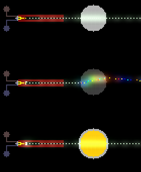

# Radioactive放射性物质

核能元素涉及放射性、中子物理和核反应。包括裂变材料、中子源和高能粒子。本分类共17个元素。

---

## 快速参考总览表

| 元素 | Type | 内部标识 | 颜色 | 分类 | 导热率 | 初始温度(°C) | 核心机制 | 危险等级 |
|------|------|----------|------|------|--------|-------------|----------|----------|
| NEUT | 18 | PT_NEUT | 白色闪烁 | 能量 | 60 | 26 | 核反应载体,链式反应驱动 | 极高 |
| PLUT | 19 | PT_PLUT | 暗灰绿 | 粉末 | 251 | 26 | 裂变燃料,压力加速衰变 | 极高 |
| PHOT | 31 | PT_PHOT | 由Ctype决定 | 能量 | 251 | 922 | 光子倍增,高温引燃 | 中 |
| URAN | 32 | PT_URAN | 暗绿 | 粉末 | 251 | 52 | 压力-热量转换器 | 高 |
| AMTR | 72 | PT_AMTR | 灰白 | 气体 | 70 | 22 | 物质湮灭,接触即毁 | 极高 |
| DEUT | 95 | PT_DEUT | 深蓝 | 液体 | 251 | 22 | 聚变燃料,压缩/扩散 | 极高 |
| WARP | 96 | PT_WARP | 炫彩 | 气体 | 100 | 22 | 空间迁跃,能量积累 | 高 |
| ISOZ | 107 | PT_ISOZ | 紫 | 液体 | 29 | 20 | 液体放射源,光子衰变 | 高 |
| ISZS | 108 | PT_ISZS | 暗紫 | 固体 | 251 | -133 | 固态同位素,负压衰变 | 高 |
| SING | 131 | PT_SING | 黑(微型黑洞) | 特殊 | 0 | 22 | 吞噬一切,爆发生粒子 | 极高 |
| ELEC | 136 | PT_ELEC | 亮黄 | 能量 | 251 | 222 | 电解,激发,充电 | 中高 |
| EXOT | 145 | PT_EXOT | 彩虹(冷)/白(激) | 特殊 | 250 | 22 | 物质复制,能量积累→WARP | 极高 |
| VIBR | 165 | PT_VIBR | 金属蓝 | 固体 | 251 | 0 | 能量吸收→受控爆炸 | 高 |
| BVBR | 166 | PT_BVBR | 金属蓝(粉末) | 粉末 | 251 | 0 | 粉末态振金,可流动 | 高 |
| PROT | 173 | PT_PROT | 亮蓝 | 能量 | 251 | 22 | 质子碰撞合成元素 | 极高 |
| GRVT | 177 | PT_GRVT | 半透明 | 能量 | 60 | 22 | 额外引力场 | 低 |
| POLO | 182 | PT_POLO | 暗灰 | 粉末 | 170 | 115 | 自发衰变,质子→PLUT | 极高 |

---

## 目录

- [NEUT Type:18](#neut) — 中子,核反应的核心载体
- [PLUT Type:19](#plut) — 钚,核裂变核心燃料
- [PHOT Type:31](#phot) — 光子,直线传播的能量粒子
- [URAN Type:32](#uran) — 铀,压力-热量转换器
- [AMTR Type:72](#amtr) — 反物质,接触湮灭
- [DEUT Type:95](#deut) — 重水,压缩/扩散系统,聚变燃料
- [WARP Type:96](#warp) — 迁跃粉,空间迁跃
- [ISOZ Type:107](#isoz) — 同位素Z,液体放射源
- [ISZS Type:108](#iszs) — 固态同位素Z
- [SING Type:131](#sing) — 奇点/微型黑洞
- [ELEC Type:136](#elec) — 电子,电解/激发
- [EXOT Type:145](#exot) — 奇异物质,能量积累
- [VIBR Type:165](#vibr) — 振金,能量缓冲/受控爆炸
- [BVBR Type:166](#bvbr) — 振金粉(粉末态)
- [PROT Type:173](#prot) — 质子,碰撞合成元素
- [GRVT Type:177](#grvt) — 引力子,额外引力场
- [POLO Type:182](#polo) — 钋,核素转化链起点

---

## 核反应链总图

```
                         ┌─────────────────────────────────────────────┐
                         │            TPT 核反应体系全景图              │
                         └─────────────────────────────────────────────┘

  ┌────────────────────────────────────────────────────────────────────────────────────┐
  │                              中子源路径 (NEUT来源)                                  │
  │                                                                                    │
  │  PLUT ──(自发衰变,压力加速)──→ NEUT        DEUT ──(NEUT触发聚变)──→ N×NEUT        │
  │  POLO ──(自发衰变,1/10000)──→ NEUT          DEUT ──(LIGH闪电)──→ NEUT(1/3)        │
  │  SING ──(life<1爆发)─────→ 大量NEUT+PHOT+ELEC                                    │
  │  PTNM + 2×HYGN ──(>500°C,1/1000冷聚变)──→ NEUT+NBLE+PHOT                         │
  └────────────────────────────────────────────────────────────────────────────────────┘
                                          │
                                          ▼
  ┌────────────────────────────────────────────────────────────────────────────────────┐
  │                              裂变链 (Fission Chain)                                 │
  │                                                                                    │
  │                        ┌──────────────────────────────┐                            │
  │                        │  NEUT + PLUT (中子轰击)       │                            │
  │                        │  概率: (3+pv)/1000            │                            │
  │                        └──────────┬───────────────────┘                            │
  │                                   │                                                 │
  │                    ┌──────────────┼──────────────┐                                  │
  │                    ▼              ▼              ▼                                  │
  │              1/3: URAN     2/3: 额外NEUT    其他: LAVA(PLUT)                       │
  │              (贫铀)        (链式反应!)      (熔融钚)                                │
  │                    │              │                                                 │
  │                    │              └──→ 产生更多NEUT ──→ 轰击更多PLUT ──→ 链式!      │
  │                    │                                                                 │
  │  URAN继续反应:     │                                                                 │
  │  temp=temp×(1+pv/2000) 压力越大升温越快 ──→ 达到点燃阈值 ──→ 熔化/引爆              │
  └────────────────────────────────────────────────────────────────────────────────────┘
                                          │
                                          ▼
  ┌────────────────────────────────────────────────────────────────────────────────────┐
  │                              聚变链 (Fusion Chain)                                  │
  │                                                                                    │
  │  NEUT + DEUT ──(概率含(3+pv)/1000+life/100)──→ 爆炸产N个NEUT (N=life/50, 最大340) │
  │                                              +6×CFDS×N 压力                        │
  │                                                                                    │
  │  LIGH + DEUT ──→ NEUT (1/3) + 高温+增压                                            │
  │  ELEC + DEUT ──→ DEUT.life+1 (电解浓缩, 提高聚变威力)                              │
  │  PROT + DEUT ──→ 内爆负压 (DeutImplosion)                                          │
  │  GRVT ──(增强引力)──→ DEUT.maxlife增大 ──→ 更多聚变产出                           │
  └────────────────────────────────────────────────────────────────────────────────────┘
                                          │
                                          ▼
  ┌────────────────────────────────────────────────────────────────────────────────────┐
  │                              元素合成链 (Nucleosynthesis)                           │
  │                                                                                    │
  │  PROT + PROT ──(碰撞: 180°±1°, 速度之和>10)──→ 累积Tmp:                            │
  │                                                                                    │
  │  Tmp累计值:                                                                         │
  │    ≤50      → NBLE (惰性气体)                                                       │
  │    >50      → CO2  (二氧化碳)                                                       │
  │    >100     → O2   (氧气)                                                           │
  │    >250     → PLSM (等离子体)                                                       │
  │    >310     → POLO (钋) ←── 核素链起点                                             │
  │    >420     → URAN (铀)                                                             │
  │    >700     → PLUT (钚)                                                             │
  │    >500000  → SING (奇点/黑洞)                                                      │
  │                                                                                    │
  │  POLO核素转化链:                                                                    │
  │    POLO ──(吸收10 PROT)──→ PLUT ──(衰变/中子)──→ URAN/LAVA(PLUT)+NEUT             │
  └────────────────────────────────────────────────────────────────────────────────────┘
                                          │
                                          ▼
  ┌────────────────────────────────────────────────────────────────────────────────────┐
  │                              湮灭/黑洞链 (Annihilation/Singularity)                 │
  │                                                                                    │
  │  AMTR + 任意物质 ──→ 湮灭: 1/10 PHOT + 消灭目标 + 低压                              │
  │                                                                                    │
  │  SING ──(3x3吞噬)──→ life+3(每吞噬一个) ──→ life>255时1/1000分裂出新SING           │
  │  SING ──(life<1)──→ 爆发: (Tmp/8)²×π 个 PHOT/NEUT/ELEC (上限~3019)                 │
  │  SING + SING ──→ 合并life (总和<255则合并, 否则跳过)                               │
  └────────────────────────────────────────────────────────────────────────────────────┘
                                          │
                                          ▼
  ┌────────────────────────────────────────────────────────────────────────────────────┐
  │                              能量-物质转换链                                        │
  │                                                                                    │
  │  EXOT (tmp2>6000) ──→ WARP (空间迁跃)                                               │
  │  EXOT (pv>200, temp>9000K, tmp2>200) ──→ WARP (高压高温触发)                       │
  │  EXOT + LAVA(TTAN/GOLD) ──→ LAVA(VIBR) (1/10) ──→ VIBR (振金)                     │
  │  EXOT (tmp>245, life>1337) ──→ 复制接触的非免疫物质 (自复制模式)                    │
  │  EXOT + PROT ──→ EXOT.ctype=PT_PROT (持续降温→CFLM冷焰)                            │
  │                                                                                    │
  │  VIBR (能量吸收) ──→ Tmp累积 ──→ Tmp≥1000 ──→ 爆炸(life=750)                      │
  │  VIBR爆炸 ──→ ELEC + PHOT + BREC + 变EXOT(9000K+50P)                              │
  └────────────────────────────────────────────────────────────────────────────────────┘
```

---

## 半衰期与稳定性对比

"半衰期"在此非严格物理学意义，而是指在TPT粒子系统中元素自发转化的平均速率/稳定时间。

| 元素 | 自发衰变类型 | 衰变概率(每帧) | 影响因素 | 稳定性评级 | 备注 |
|------|------------|---------------|---------|-----------|------|
| PLUT | 裂变→NEUT | chance(1,100) × chance(5×P,1000) | 压力越高越快 | 极不稳定 | 压力可加速几个数量级 |
| POLO | 衰变→NEUT | 1/10000 (自发) 或 1/100 (光子诱发) | PHOT存在时加速100倍 | 不稳定 | Tmp≥5后停止 |
| ISZS | 衰变→PHOT | 1/200 × chance(-4×P,1000) | 负压越大越快 | 中等稳定 | 固态更稳定 |
| ISOZ | 衰变→PHOT | chance(1,200) × chance(-4×P,1000) | 负压越大越快 | 中等稳定 | 液态稍不稳定 |
| NEUT | 自然消失 | life递减: 480→0 | 初始life随机480-959 | ~20-40秒 | 最终自动消失 |
| PHOT | 自然消失 | life递减: 680→0 | — | ~28秒 | 固定寿命 |
| ELEC | 自然消失 | life递减: 680→0 | — | ~28秒 | 固定寿命 |
| VIBR | 能量积累→爆炸 | Tmp持续累积(受热/压) | 温度/压力环境 | 条件性不稳定 | Tmp≥1000触发 |
| EXOT | 能量积累→WARP | Tmp2累积>6000 | 能量输入速度 | 条件性不稳定 | 两种触发路径 |
| URAN | 压力升温 | temp=temp×(1+pv/2000) | 压力指数加速 | 条件性不稳定 | 高压指数攀升 |
| SING | 吞噬积累→爆发 | life消耗至<1 | 吞噬越多越快 | 条件性不稳定 | 吞噬量决定爆发力 |
| AMTR | 反应消耗 | 每次反应life+1, >4消失 | 环境物质密度 | 稳定(不反应时) | 最多4次湮灭 |
| WARP | 无自发衰变 | — | — | 稳定 | 仅靠交换耗能 |
| DEUT | 无自发衰变 | — | — | 稳定 | 需中子触发聚变 |
| PROT | 无自发衰变 | — | — | 稳定 | 需碰撞合成 |
| GRVT | 自然消失 | life递减: 250→0 | — | ~10-18秒 | 固定寿命 |
| BVBR | 同VIBR | 同VIBR | 同VIBR | 同VIBR | 粉末态可流动 |

### 不稳定性排名（最不稳定→最稳定）

```
1. PLUT   — 压力下极易自发裂变 (最危险)
2. VIBR   — 任何能量输入都可能触发爆炸
3. EXOT   — 能量积累至阈值后转变
4. URAN   — 高压指数升温
5. POLO   — 自发+光子加速衰变
6. ISOZ   — 负压加速衰变
7. ISZS   — 同ISOZ但固相稍稳
8. SING   — 吞噬到临界质量爆发
9. AMTR   — 无反应物时稳定
10. DEUT  — 需外部中子触发
11. PROT  — 需碰撞条件
12. NEUT  — 仅自然消失
13. PHOT/ELEC — 自然消失
14. WARP  — 不可自发衰变
15. GRVT  — 自然消失
16. BVBR  — 粉末态自控 (最少危险场景)
```

---

## 安全防护与安全壳指南

### 核心安全原则

```
第一原则: 中子控制 = 一切核反应的根本控制
第二原则: 热管理 > 压力管理 > 辐射屏蔽
第三原则: 分层防护 (纵深防御)
```

### 推荐安全壳材料性能对比

| 材料 | 中子衰减 | 抗压(P) | 耐温(°C) | 酸抗 | 可用性 | 推荐用途 |
|------|---------|---------|---------|------|------|---------|
| TTAN | 5%/层 | 极高 | 1667 | 极高 | 中 | 第一层中子屏蔽 |
| GOLD | ~14%/层 | 极高 | 1063 | 0*(通电例外) | 低 | 高效中子屏蔽 |
| SHD4 | 0 | 40 | — | 高 | 低 | 最外层压力壳 |
| CRMC | 穿透! | 极高 | 2614+10P | 0 | 中 | NEUT窗口/观察 |
| GLAS | 特别* | 0.25ΔP | 1699 | 0* | 高 | 中子增殖器/切伦科夫 |
| HEAC | 0 | 无限 | ~1650 | 极高 | 中 | 热均衡/散热 |
| ICE | 减速 | 0.8 | 0(熔) | 极低 | 高 | 中子慢化剂 |
| WATR | 减速 | — | 99.85(沸) | — | 高 | 慢化剂+冷却 |
| MERC | 吸收 | 极高 | 不可熔 | 高 | 低 | 终极中子吸收 |
| ROCK | 0 | 120 | 1943 | 极高 | 高 | 结构框架 |
| DMND | 0 | 极高 | 4000+ | 0 | 极低 | 终极压力壳 |
| BIZS | ? | 高 | 异常 | 高 | 低 | 反重力重力场扭曲 |

*GLAS在NEUT通过时有特殊效果(中子增殖),不建议作为纯屏蔽使用

### PLUT裂变反应堆安全设计

```
推荐分层结构(由内向外):

第0层 (堆芯区): PLUT + 压力传感器
  ├─ 防护: 真空隔离带(无空气=无意外氧化)
  └─ 监测: HEAC热管连接外部温度计

第1层 (慢化层): ICE/WATR 
  ├─ 作用: 减速中子(v×0.995/层)
  └─ 注意: ICE会融化, 需持续冷却

第2层 (吸收层): TTAN (5%/层)
  ├─ 建议: 至少10-20层TTAN衰减中子至安全水平
  └─ 替代: GOLD(14%/层)更高效但昂贵

第3层 (压力壳): SHD4/ROCK/DMND
  ├─ SHD4: 40P抗压 + 0导热 (双层功能)
  └─ CRMC: 耐酸+可穿透中子(观测窗)

第4层 (热管理层): HEAC散热片
  ├─ 作用: 均匀化温度防止热点
  └─ 连接: LN2紧急冷却储罐

第5层 (外防护): SHLD系列自修复膜
  ├─ 失压时自动触发通电→生长
  └─ 多层结构: SHD4壳→SHD3→SHD2→SHLD外层
```

### DEUT聚变反应堆安全设计

```
堆芯设计:
  - DEUT保持低life (<50): 减少单次聚变中子产量(=life/50)
  - ELEC电解浓缩: 逐步提高DEUT.life至目标水平
  - GRVT引力压缩: 提高DEUT.maxlife→更高压缩度

引爆控制:
  主引爆: NEUT精准可控注入
    - 通过NEUT通道(CRMC窗)调控中子数量
    - 单一NEUT = 可控小爆炸(life/50个中子)
  
  紧急制动:
    - LN2注入: 瞬间降温至DEUT稳定温度以下
    - 真空抽吸: 负压≤-166.5P破坏反应条件
    - TTAN墙关闭: 阻断中子传播

能量提取:
  - 聚变压力→推动活塞做功
  - HEAC收集热量→热交换器
  - PHOT收集(从NEUT+DEUT反应中可能有光子副产)
```

### 奇点(SING)安全操作规范

```
⚠ 最高危险等级 ⚠

必须使用DMND容器:
  - SING不能吞噬DMND
  - DMND壁厚≥3层以防意外

操作注意事项:
  1. NEVER让两个SING合并到life>255 (会无限复制失控)
  2. 监控SING.life值: 越低越危险(接近<1时爆发)
  3. SING吞噬计数器(Tmp): Tmp越大爆发越强 (3019粒子上限)
  4. 爆发前预警: life<10时准备安全壳封闭
  
紧急处置:
  - AMTR: 反物质湮灭SING (但SING可能吞噬AMTR)
  - 最佳方案: DMND壁+真空外隔离
  - 不推荐: 任何基于物质接触的处置
```

### 反物质(AMTR)存储安全

```
存储方案: 
  - 唯一安全存储: DMND容器 (AMTR对DMND免疫)
  - 真空环境: 无任何物质接触
  - 严禁: 存储在有任何其他材料的容器中

运输方案:
  - DMND胶囊+磁悬浮(无壁接触)
  - 或: AMTR仅在使用时由粒子加速器即时生成(推荐)
```

### 辐射屏蔽效率对比

```
材料        单层衰减率    10层后剩余    建议层数(目标<1%)

GOLD        ~14.3%        ~21.4%        ~30层
TTAN        ~5.0%         ~59.9%        ~90层
MERC        吸收(100%)    0%            ~1层(但液态难固定)
WATR        减速(v×0.995) N/A           配合吸收层使用
ICE         减速(v×0.995) N/A           配合吸收层使用
CRMC        穿透(0%)      100%          不可用作屏蔽
```

### 紧急停机程序 (SCRAM Checklist)

```
[ ] 1. 切断所有NEUT源:
       - 移除PLUT/POLO/DEUT等NEUT源材料
       - 或: 用TTAN/WALL堵住中子通道

[ ] 2. 温度压制:
       - 注入LN2至堆芯区域 (<-196°C)
       - 或: FRZW/ICE水淹

[ ] 3. 压力释放:
       - 开启真空泵降至负压
       - 注意: 负压可能加速ISOZ/PLUT衰变!

[ ] 4. 链式反应阻断:
       - 分离PLUT燃料 (拉开距离>NEUT传播范围)
       - 插入中子吸收层(TTAN/GOLD/MERC)

[ ] 5. 安全壳封闭:
       - SHLD全系列通电→自生长形成保护罩
       - 外层DMND封装(若有)

[ ] 6. 长期监测:
       - HEAC温度传感器持续监控
       - SPNG灭火系统待命
```

### 辐射事故等级与应对

| 等级 | 描述 | 触发条件 | 推荐应对 |
|------|------|---------|---------|
| Ⅰ级 | 轻微泄漏 | 少量NEUT逸出 | WATR/ICE慢化吸收 |
| Ⅱ级 | 局部污染 | URAN/PLUT粉尘扩散 | 真空隔离+TTAN屏蔽罩 |
| Ⅲ级 | 链式反应失控 | PLUT+NEUT正反馈 | SCRAM 1-6全步骤 |
| Ⅳ级 | 聚变爆炸 | DEUT.life高+NEUT触发 | 不可逆, 尽快疏散+DMND安全壳 |
| Ⅴ级 | SING黑洞失控 | SING合并超255life | 放弃当前区域, 用DMND墙限制扩张 |

---

## 各元素详解

---

###### NEUT Type:18 (中子)


```
┌─────────────────────────────────────────────────────┐
│  属性         │  值                                  │
│───────────────┼──────────────────────────────────────│
│  内部标识     │  PT_NEUT                             │
│  颜色         │  白色闪烁 (能量粒子)                   │
│  分类         │  TYPE_ENERGY (无重力, Weight=-1)       │
│  导热率       │  60                                  │
│  初始温度     │  26.00°C / 299.15 K                   │
│  Life范围      │  480 ~ 959 (随机初始值, 自动递减)      │
│  速度         │  随机方向 1~2 像素/帧                  │
│  平均寿命     │  ~20-40秒 (≈480~959帧)                │
│  核心角色     │  所有核反应的触发载体                   │
└─────────────────────────────────────────────────────┘
```

**深度机制：** NEUT(中子)是TPT核物理体系的绝对核心。所有裂变、聚变、嬗变反应都由中子触发或参与。中子是能量型粒子(Weight=-1)，不受重力影响，以随机方向和速度(1-2像素/帧)自由穿行。

中子的life值决定其生存时间——life从初始值(480-959)线性递减至0时粒子消失。这意味着每个中子都有有限的"射程"和"作用窗口"。

**参数详解：**
- **Life值：** 生存计时器。初始480-959随机值，每帧-1。到0时NEUT消失
- **Vx/Vy值：** 速度矢量。初始随机1-2像素/帧
- **Tmp值：** 不被主动使用
- **Ctype值：** 不被主动使用

**中子反应完整列表：**

裂变/聚变核心:
```
NEUT + PLUT → 裂变 (概率(3+pv)/1000, 产生额外NEUT+压力)
NEUT + DEUT → 聚变爆炸 (产大量NEUT, 数量=DEUT.life/50)
```

物质嬗变:
```
NEUT + WATR → DSTW (3/20, 水→重水, 中子减速)
NEUT + GUNP → DUST (3/200)
NEUT + DYST → YEST (3/200)
NEUT + YEST → DYST
NEUT + PLEX → GOO (3/200)
NEUT + NITR → DESL (3/200)
NEUT + PLNT → WOOD (1/20, 辐射诱导木质化)
NEUT + DESL/OIL → GAS (3/200)
NEUT + COAL → WOOD (1/20)
NEUT + BCOL → SAWD (1/20)
NEUT + DUST → FWRK (1/20, 激活烟花)
NEUT + ACID → ISOZ (1/20, 同位素Z合成)
NEUT + RFRG → GAS 或 CAUS (1/2)
NEUT + RSSS → ctype物质 或 RSST
NEUT + BASE(>50°C) → LRBD (1/35, 碱→铷, 危险!)
```

吸收/减速/特殊:
```
NEUT + ICE/SNOW → 减速(v×0.995)
NEUT + TTAN → 中性子被吸收消失
NEUT + GOLD → 中子被吸收衰减(~14%/帧)
NEUT + MERC → 中子被吸收
NEUT + WOOD → 中子穿透+木材变形
NEUT + SEED → 随机翻转一个基因位(辐射诱变)
NEUT + EXOT → life=1500触发爆炸
NEUT + GLAS → 产生单色PHOT+可能NEUT增殖
```

**实用场景：**
- **裂变反应堆点火：** 第一发NEUT注入PLUT燃料启动链式反应
- **聚变装置引爆：** NEUT精准命中DEUT触发聚变爆炸
- **物质嬗变工厂：** 用NEUT批量转化材料(COAL→WOOD, PLNT→WOOD等)
- **ISOZ生产线：** NEUT照射ACID制造同位素Z
- **LRBD危险品制造：** NEUT照射热BASE生成铷(极高风险)
- **烟花激活器：** NEUT穿过DUST→FWRK激活烟花
- **基因突变实验：** NEUT照射SEED随机修改基因

*源码：NEUT.cpp*

---

###### PLUT Type:19 (钚)


```
┌─────────────────────────────────────────────────────┐
│  属性         │  值                                  │
│───────────────┼──────────────────────────────────────│
│  内部标识     │  PT_PLUT                             │
│  颜色         │  暗灰绿 (金属光泽)                     │
│  分类         │  TYPE_POWDER (PROP_NEUTPASS+PROP_RADIOACTIVE)│
│  密度         │  粉末 (受重力, 可堆积)                  │
│  导热率       │  251                                 │
│  初始温度     │  26.00°C / 299.15 K                   │
│  自发裂变率   │  chance(1,100) × chance(5×P,1000)     │
│  中子裂变率   │  (3+pv)/1000                          │
│  压力敏感性   │  极高 (压力直接加速自发裂变)             │
│  对火柴人     │  致命 (PROP_DEADLY)                    │
└─────────────────────────────────────────────────────┘
```

**深度机制：** PLUT(钚)是TPT裂变体系的核心燃料。其裂变行为由两个通道驱动：

1. **自发裂变**：每帧以`chance(1,100) × chance(5×P,1000)`的概率自发产生NEUT。压力极大的加速因素——在100P下，第二项概率为500/1000=50%，自发裂变率急剧升高。

2. **中子诱发裂变**：NEUT+PLUT以`(3+pv)/1000`概率裂变。结果：(A)1/3概率→URAN或LAVA(PLUT)；(B)2/3概率→额外产生NEUT+10×CFDS压力。关键：额外NEUT是链式反应的基础——2个NEUT产生2次裂变→4个NEUT→8个NEUT→指数增长。

临界质量概念：PLUT在局部的密度/数量达到一定水平后，一个中子产生的中子平均数>1（即2/3×2=4/3>1），链式反应自我维持。

LIGH(闪电)击中PLUT→加热+增压+1/3变NEUT，可能触发意外裂变。

DEST(炸药)摧毁PLUT→50%产NEUT。

**参数详解：**
- **Life值：** 不被主动使用
- **Tmp值：** 不被主动使用
- **Ctype值：** 不被主动使用

**反应链：**
```
PLUT → 自发裂变产NEUT [压力加速: chance(1,100) × chance(5P,1000)]
PLUT + NEUT → 裂变: 1/3→URAN/LAVA(PLUT), 2/3→额外NEUT [链式反应!]
PLUT + LIGH → 加热+增压+1/3变NEUT [闪电触发]
PLUT + DEST → 50%产NEUT [爆炸触发]
PLUT裂变 → +10×CFDS 压力/每次 [裂变产压]
POLO + 10×PROT → PLUT (核素合成路径)
ISZS/ISOZ + PTNM → PLUT + PTOH (铂催化路径)
```

**实用场景：**
- **裂变反应堆燃料：** PLUT是核电站的核心燃料
- **链式反应演示：** 用PLUT展示指数增长的中子增殖
- **核弹模拟：** 超高压力下PLUT快速自发裂变=引爆
- **压力传感器(核)：** 自发裂变率随压力升高→间接指示压力
- **中子源发生器：** 利用自发裂变持续产NEUT
- **闪电防护测试：** LIGH击中PLUT的连锁效应研究

*源码：PLUT.cpp*

---

###### PHOT Type:31 (光子)



```
┌─────────────────────────────────────────────────────┐
│  属性         │  值                                  │
│───────────────┼──────────────────────────────────────│
│  内部标识     │  PT_PHOT                             │
│  颜色         │  Ctype决定的波长颜色 (全1=白色)        │
│  分类         │  TYPE_ENERGY                         │
│  传播方式     │  直线传播, 不碰撞, 无重力              │
│  导热率       │  251                                 │
│  初始温度     │  922.00°C / 1195.15 K                 │
│  Life范围      │  680 (初始固定, 自动递减)              │
│  点燃阈值     │  >233°C / 506 K, 1/10点燃可燃物        │
│  波长编码     │  Ctype低30位 (5组: 红9/黄3/绿6/青3/蓝9)│
└─────────────────────────────────────────────────────┘
```

**深度机制：** PHOT(光子)以直线方向(DIR)传播，life从680自动递减至0消失。高温(>506K)时1/10概率点燃周围可燃物——这是光热引燃效应。

ISOZ/ISZS光子倍增：PHOT+ISOZ/ISZS→1/400额外PHOT(激光增益介质模拟)，消耗-15×CFDS压力。这个"光子放大器"效应是构建激光系统的核心。

FILT波长修改：PHOT通过FILT时Ctype被修改(按FILT的Tmp模式)，构成光子计算/通信的基础。

QRTZ/PQRT散射：光子在QRTZ上时获得随机方向和Ctype修改。

太阳能效应：PHOT接触PSCN/NSCN时产生SPRK——即光伏效应，将光能转为电能。

RSST固化：PHOT照射RSST→RSSS(光固化)。

**参数详解：**
- **Ctype值：** 波长编码(30位)。0x3FFFFFFF=白色全波长
- **Life值：** 寿命(初始680, 每帧-1)
- **Vx/Vy值：** 速度方向(直线传播)
- **Tmp值：** 不被主动使用

**反应链：**
```
PHOT + ISOZ/ISZS → 额外PHOT (1/400, 光子倍增, -15CFDS压力)
PHOT + QRTZ/PQRT → 散射 (随机方向+Ctype修改)
PHOT + FILT(Tmp=n) → Ctype按模式修改 (9种运算)
PHOT + PSCN/NSCN → SPRK (光伏效应, 光电转换)
PHOT + RSST → RSSS (光固化)
PHOT + BGLA → 随机折射
PHOT + WAX → 加速熔化 (光热效应)
PHOT(>506K) → 1/10点燃可燃物 (光热引燃)
PHOT + GLOW → 光子增殖 (增益介质)
PHOT + COAL → 光子被吸收
PHOT + GLAS → 色散为不同波长 (棱镜分光)
PHOT + BIZS → ELEC (光子→电子转换)
```

**实用场景：**
- **光子计算机：** PHOT+ FILT阵列构建光学逻辑
- **激光放大器：** PHOT+ISOZ/ISZS光子倍增构建激光
- **太阳能电池：** PHOT+PSCN/NSCN产生电力
- **光刻曝光：** PHOT+RSST制造光刻图案
- **光通信：** Ctype编码数据通过PHOT传输
- **光学开关：** 利用FILT吸收/透过特性制作光控开关

*源码：PHOT.cpp*

---

###### URAN Type:32 (铀)


```
┌─────────────────────────────────────────────────────┐
│  属性         │  值                                  │
│───────────────┼──────────────────────────────────────│
│  内部标识     │  PT_URAN                             │
│  颜色         │  暗绿色 (金属粉末)                     │
│  分类         │  TYPE_POWDER (PROP_RADIOACTIVE)       │
│  导热率       │  251                                 │
│  初始温度     │  52.00°C / 325.15 K                   │
│  升温公式     │  temp = temp × (1 + pv/2000) + MIN_TEMP│
│  压力敏感性   │  极高 (指数升温)                       │
│  中子反应     │  中子不可直接反应 (需PLUT作为裂变介质)   │
│  对火柴人     │  致命 (PROP_DEADLY)                    │
└─────────────────────────────────────────────────────┘
```

**深度机制：** URAN(铀)是PLUT的"兄弟燃料"但机制截然不同——NEUT不能直接与URAN反应。URAN的核心机制是"压力-热转换"：温度指数地随压力增长。

`temp = temp × (1 + pv/2000) + MIN_TEMP`

这意味着压力每增加2000P，温度翻倍(指数增长)。在低压下稳定，但在高压下温度急剧攀升直至触及点燃/熔化阈值。这是一种非线性的正反馈：压力升温→膨胀增压→更高压力→更快升温→...

URAN不能像PLUT那样参与链式反应——它需要先转化为PLUT(通过其他路径如POLO吸收10个PROT→PLUT)或作为压力-热转换器使用。

**参数详解：**
- **Life值：** 不被主动使用
- **Tmp值：** 不被主动使用
- **Ctype值：** 不被主动使用

**反应链：**
```
URAN → temp = temp × (1 + pv/2000) [压力指数升温]
URAN + 压力升高 → temp指数攀升→ 熔化/点燃
PROT+PROT碰撞(Tmp>420) → URAN [质子合成路径]
PLUT裂变(1/3概率) → URAN [裂变产物]
URAN不能直接与NEUT反应
```

**实用场景：**
- **压力-热转换引擎：** 利用URAN的高压升温制作热源
- **核反应副产物收集：** PLUT裂变后收集URAN
- **高压传感器：** URAN升温指示压力环境
- **燃料循环：** POLO→PLUT→裂变→URAN→回收
- **长期热源：** URAN在适宜压力下持续产热

*源码：URAN.cpp*

---

###### AMTR Type:72 (反物质)


```
┌─────────────────────────────────────────────────────┐
│  属性         │  值                                  │
│───────────────┼──────────────────────────────────────│
│  内部标识     │  PT_AMTR                             │
│  颜色         │  灰白色 (闪烁)                        │
│  分类         │  TYPE_GAS (高扩散率1.00)               │
│  导热率       │  70                                  │
│  初始温度     │  22.00°C / 295.15 K                   │
│  最大湮灭次数 │  4次 (life初始=0, 每次反应+1, >4消失)  │
│  湮灭产物     │  1/10→PHOT, 9/10→消灭目标              │
│  湮灭压力     │  -2 P/次 (产生低压)                    │
│  免疫列表     │  DMND, CLNE/PCLN, VOID, BHOL/NBHL,    │
│              │  PRTI/PRTO                             │
└─────────────────────────────────────────────────────┘
```

**深度机制：** AMTR(反物质)的湮灭是TPT中最具破坏力的单粒子反应。接触任何非免疫物质时：
- 1/10概率产生PHOT(光子)——能量释放为光
- 9/10概率直接消灭目标——完全湮灭
- 每次湮灭产生-2P低压(物质-反物质对消失导致真空)
- Life+1(计数反应次数)，life>4时AMTR自身消失

扩散率1.00(极高)意味着AMTR在空气中迅速扩散——这是双刃剑：更容易找到目标湮灭，也更容易在湮灭4次后消失。

DMND(钻石)免疫使其成为唯一安全的存储容器。CLNE/PCLN(复制体)免疫防止无限复制-湮灭循环。

**参数详解：**
- **Life值：** 湮灭计数器。初始=0, 每次+1, >4自身消失(最多4次)
- **Tmp值：** 不被主动使用
- **Ctype值：** 不被主动使用

**反应链：**
```
AMTR + 非免疫物质 → 湮灭: 1/10→PHOT, 9/10→消灭目标 [life+1, -2P]
AMTR(life>4) → 自身消失 (4次湮灭上限)
AMTR + DMND/CLNE/PCLN/VOID/BHOL/NBHL/PRTI/PRTO → 无反应 [免疫]
```

**实用场景：**
- **超高效物质消除：** 1个AMTR消灭最多4个任意粒子(非免疫)
- **可控爆破：** 精确计算4次湮灭的清除范围
- **光子产生器：** 利用湮灭的1/10 PHOT产出
- **DMND容器安全测试：** 验证DMND免疫性
- **终极武器(限制使用)：** 接触即毁的绝对破坏力

*源码：AMTR.cpp*

---

###### DEUT Type:95 (重水)


```
┌─────────────────────────────────────────────────────┐
│  属性         │  值                                  │
│───────────────┼──────────────────────────────────────│
│  内部标识     │  PT_DEUT                             │
│  颜色         │  深蓝色 (life越高越亮, ≥240发蓝白光)   │
│  分类         │  TYPE_LIQUID                         │
│  导热率       │  251                                 │
│  初始温度     │  22.00°C / 295.15 K                   │
│  Life范围      │  初始10, 最大=10000/(temp+1)-1       │
│  聚变产NEUT   │  N = life/50, 最大340                 │
│  颜色阈值     │  life≥240 → 蓝白发光                   │
│  引力修正     │  maxlife *= (5.0 - 8.0/(gravtot+2.0)) │
│  扩散机制     │  与相邻更浓缩DEUT交换一半life           │
└─────────────────────────────────────────────────────┘
```

**深度机制：** DEUT(重水/氘水)是TPT中设计最巧妙的粒子之一——它是一个"可压缩/可扩散"的密度系统。Life值表示压缩度/密度，值越大密度越高。

- **热膨胀**：maxlife = 10000/(temp+1)-1 —— 温度越高，maxlife越低，热膨胀
- **引力压缩**：maxlife *= (5.0 - 8.0/(gravtot+2.0)) —— 引力越强，压缩度越大
- **吸收**：life<maxlife时从相邻DEUT吸收life
- **分裂**：life>maxlife时在空格产生新DEUT(life=0)
- **扩散**：与相邻更浓DEUT交换一半life(模拟Fick扩散定律)

聚变爆炸(NEUT+DEUT)是终极N产出路径：产出`N = life/50`个NEUT(最大340个)，压力+6×CFDS×N。life=50时1个NEUT，life=10000时200个NEUT——压缩度直接决定爆炸威力。

其他触发路径：
- LIGH+DEUT→加热+增压+1/3变NEUT
- ELEC+DEUT→life+1(电解浓缩=提高聚变潜力)
- PROT+DEUT→DeutImplosion内爆负压

**参数详解：**
- **Life值：** 压缩度/密度。初始10, maxlife受温度和引力控制
- **Tmp值：** 不被主动使用
- **Ctype值：** 不被主动使用

**反应链：**
```
DEUT(life<maxlife) + 相邻DEUT → 吸收life [压缩]
DEUT(life>maxlife) + 空格 → 新DEUT(life=0) [膨胀分裂]
DEUT + 相邻更浓DEUT → 交换一半life [扩散平衡]

聚变反应:
DEUT + NEUT → 爆炸产N×NEUT(N=life/50,最大340) + 6CFDS×N压力
DEUT + LIGH → NEUT(1/3) + 高温高压 [闪电触发]
DEUT + PROT → DeutImplosion内爆 [质子内爆]

浓缩/调节:
DEUT + ELEC → life+1 (temp=0, 电解浓缩)
DEUT + GRVT → maxlife增大 [引力压缩]
DEUT + 加热 → maxlife减小 [热膨胀]
```

**实用场景：**
- **可控聚变装置：** 精确控制DEUT.life来调节聚变爆炸规模
- **能量武器：** 高压缩DEUT(life近10000)的聚变爆炸≈核弹
- **电解浓缩：** ELEC逐步提高DEUT.life增强聚变潜力
- **GRVT引力压缩：** 引力子压缩DEUT提高能量密度
- **闪烁探测器：** DEUT.life≥240发出蓝白光的视觉指示
- **扩散演示：** DEUT的Fick扩散+热膨胀+引力压缩=完整物理模拟

*源码：DEUT.cpp*

---

###### WARP Type:96 (迁跃粉)


```
┌─────────────────────────────────────────────────────┐
│  属性         │  值                                  │
│───────────────┼──────────────────────────────────────│
│  内部标识     │  PT_WARP                             │
│  颜色         │  炫彩色 (动态效果)                     │
│  分类         │  TYPE_GAS (极高扩散3.00)              │
│  导热率       │  100                                 │
│  初始温度     │  22.00°C / 295.15 K                   │
│  扩散率       │  3.00 (全游戏最高)                     │
│  能量阈值     │  Tmp2>2000→高温+压力+ELEC生成          │
│  WARP转化     │  Tmp2>6000→自身变WARP (最终能量释放)    │
│  免疫交换     │  WARP,  STKM, DMND, CLNE, BCLN, PCLN  │
└─────────────────────────────────────────────────────┘
```

**深度机制：** WARP(迁跃粉)是空间迁跃能力的能量粒子。与相邻粒子随机交换位置(排除WARP/STKM/DMND/CLNE/BCLN/PCLN)——每次交换life+=4, Tmp2+=4，给对方随机速度(动量和能量传递)。

能量积累效应：
- Tmp2>2000时：temp=10000(极高温度)，产生压力(tmp2/5000)×CFDS，1/50产ELEC
- Tmp2>6000时：变为WARP——实际上是"能量释放"

EXOT转变为WARP的条件：(1) Tmp2>6000或(2) pv>200且temp>9000且tmp2>200。

**参数详解：**
- **Life值：** 迁跃计数/能量(每次交换+4)
- **Tmp2值：** 能量累积器(每次交换+4, >2000触发高温, >6000转化)
- **Ctype值：** 不被主动使用

**反应链：**
```
WARP + 相邻粒子 → 交换位置 [空间迁跃, life+=4, Tmp2+=4]
WARP(Tmp2>2000) → temp=10000 + 产压 + 1/50 ELEC [能量释放]
WARP(Tmp2>6000) → 变WARP(自催化) [终极转化]
EXOT(Tmp2>6000) → WARP [EXOT→WARP路径]
EXOT(pv>200, temp>9000, tmp2>200) → WARP [高压路径]
```

**实用场景：**
- **空间传送：** 利用WARP交换粒子位置进行"传送"
- **物质打散器：** WARP随机交换破坏有序结构
- **能量武器组件：** WARP积累能量后的破坏性输出
- **EXOT能量释放：** 利用EXOT→WARP路径做能量转换
- **随机化引擎：** WARP提供系统中不可预测的随机因素

*源码：WARP.cpp*

---

###### ISOZ Type:107 (同位素Z)


```
┌─────────────────────────────────────────────────────┐
│  属性         │  值                                  │
│───────────────┼──────────────────────────────────────│
│  内部标识     │  PT_ISOZ                             │
│  颜色         │  紫色                                 │
│  分类         │  TYPE_LIQUID                         │
│  穿透性       │  PROP_NEUTPENETRATE + PROP_PHOTPASS   │
│  导热率       │  29                                  │
│  初始温度     │  20.00°C / 293.15 K                   │
│  衰变率       │  chance(1,200) × chance(-4P,1000)    │
│  衰变产物     │  PHOT (光子)                          │
│  光子速度     │  128~255/127                          │
│  凝固点       │  <-113°C / 160 K → ISZS              │
│  合成路径     │  ACID + NEUT → ISOZ (1/20)            │
└─────────────────────────────────────────────────────┘
```

**深度机制：** ISOZ(同位素Z)是液体放射源，衰变产生PHOT(光子)。衰变概率由两项乘积决定：(1)基础概率1/200；(2)负压因数`chance(-4×pv, 1000)`——负压越大(即pv越负)，-4×pv越大，衰变概率越高。这是负压催化衰变的独特机制。

光子倍增效应：PHOT+ISOZ→1/400额外PHOT+消耗15×CFDS压力。ISOZ和ISZS本质上都是"光子放大器"的增益介质。

NEUT和PHOT透明(PROP_NEUTPENETRATE + PROP_PHOTPASS)使ISOZ可以放置在中子/光子束流路径中而不阻挡它们。

凝固为ISZS：降温至<-113°C/160K时固化，相变可逆。

**参数详解：**
- **Life值：** 不被主动使用
- **Tmp值：** 不被主动使用
- **Ctype值：** 不被主动使用

**反应链：**
```
ISOZ → PHOT [自发衰变: chance(1,200) × chance(-4P,1000)]
ISOZ + PHOT → 额外PHOT (1/400) [光子倍增, -15CFDS压力]
ISOZ + NEUT → 穿透 (不影响中子)
ISOZ + PHOT → 穿透 (不影响光子)
ISOZ + 降温(<160K) → ISZS [凝固]
ACID + NEUT → ISOZ (1/20) [合成路径]
ISZS/ISOZ + PTNM → PLUT + PTOH [铂催化→钚]
```

**实用场景：**
- **光子放大器/激光增益介质：** PHOT+ISOZ倍增构建激光
- **放射光源：** ISOZ自发衰变持续产PHOT
- **中子束流标记：** NEUT穿透+PHOT产出→间接标记中子位置
- **负压-辐射传感器：** ISOZ衰变率随负压变化指示真空度
- **PLUT生产线：** PTNM催化ISZS/ISOZ→PLUT

*源码：ISOZ.cpp*

---

###### ISZS Type:108 (固态同位素Z)


```
┌─────────────────────────────────────────────────────┐
│  属性         │  值                                  │
│───────────────┼──────────────────────────────────────│
│  内部标识     │  PT_ISZS                             │
│  颜色         │  暗紫色 (固态)                        │
│  分类         │  TYPE_SOLID (Meltable=1, PROP_PHOTPASS)│
│  导热率       │  251                                 │
│  初始温度     │  -133.00°C / 140 K                    │
│  熔点         │  >27°C / 300 K → ISOZ                │
│  衰变率       │  同ISOZ: 1/200 × chance(-4P,1000)    │
│  衰变产物     │  PHOT (光子)                          │
│  光子速度范围 │  128~355/127 (比ISOZ更大)              │
│  负热空气     │  HotAir = -0.0007×CFDS (向周围吸热)    │
└─────────────────────────────────────────────────────┘
```

**深度机制：** ISZS(固态同位素Z)是ISOZ的固态形态，在300K(27°C)时熔化为ISOZ，在160K(-113°C)时ISOZ凝固为ISZS——两者形成温度控制的固液循环。衰变机制与ISOZ相同但光子速度范围更大(128~355 vs 128~255)。

与ISOZ的主要区别：
1. 负热空气效应(HotAir=-0.0007×CFDS)→持续向周围吸热降温
2. 更高的光子速度上限
3. 更高的导热率(251 vs 29)
4. 熔点仅27°C(室温即可熔化)

ISOZ←(160K)→ISZS←(300K)→ISOZ循环：两形态均可在负压下衰变为PHOT。PTNM催化ISZS/ISOZ→PLUT+PTOH。

**参数详解：**
- **Life值：** 不被主动使用
- **Tmp值：** 不被主动使用
- **Ctype值：** 不被主动使用

**反应链：**
```
ISZS → PHOT [同ISOZ衰变, 光子速度128~355]
ISZS + PHOT → 额外PHOT (1/400) [光子倍增]
ISZS + 升温(>300K) → ISOZ [熔化]
ISZS + 环境 → 持续吸热 (HotAir=-0.0007CFDS)
ISZS + PTNM → PLUT + PTOH [铂催化]
```

**实用场景：**
- **固态光子放大器：** 比ISOZ更稳定(固态), 光子速度范围更大
- **环境制冷：** 利用负热空气持续吸热
- **温度-辐射开关：** <27°C固态/ >27°C液态自动切换
- **PLUT固体合成站：** PTNM催化ISZS比ISOZ更易处理(固态)

*源码：ISZS.cpp*

---

###### SING Type:131 (奇点/微型黑洞)


```
┌─────────────────────────────────────────────────────┐
│  属性         │  值                                  │
│───────────────┼──────────────────────────────────────│
│  内部标识     │  PT_SING                             │
│  颜色         │  纯黑 (微型黑洞视觉效果)               │
│  分类         │  TYPE_SPECIAL (特殊元素)               │
│  导热率       │  0 (完全绝热)                         │
│  初始温度     │  22.00°C / 295.15 K                   │
│  Life (质量)   │  初始60~109 (随机), 相当于负质量/引力强度│
│  吞噬范围     │  3×3 网格 (自身+周围8格)               │
│  吞噬概率     │  1/3 (每帧对每个吞噬范围内的非DMND粒子)  │
│  爆发临界     │  life<1 → 立即爆发                     │
│  合并条件     │  SING+SING → life总和<256则合并        │
└─────────────────────────────────────────────────────┘
```

**深度机制：** SING(奇点)是微型黑洞模拟。Life=负质量/引力强度，在2×2网格持续产生朝-life方向的负压吸引(每帧逼近10%)——周围的物质被引力吸入。

吞噬机制(3×3范围)：
- 每帧对每个在吞噬范围内的非DMND粒子有1/3概率吞噬
- 被吞噬后：life+3增长"质量"，Tmp(吞噬计数器)+1，Temp(累积温度值)+被吞粒子的温度
- 若吞噬另一个SING：life+对方life。删除被吞SING。但如果总和>255则跳过(防止合并后失控)
- 吞噬life>255时：1/1000概率在吞噬位置产生新SING(life=100~109)而非继续吞噬——黑洞繁殖!

不可吞噬：DMND(钻石)完全免疫——唯一安全的容器材料。

爆发(life<1时触发)：产生大量PHOT/NEUT/ELEC粒子（各1/3概率），总数量=(Tmp/8)²×π，上限约3019个。Tmp=吞噬计数器，吞噬越多爆发越猛烈。

**参数详解：**
- **Life值：** 负质量/黑洞"饥饿度"。初始60~109, 每吞噬+3, 总和>255跳过合并, <1爆发
- **Tmp值：** 吞噬计数器(累计吞噬了多少粒子)。决定爆发粒子数量=(Tmp/8)²×π
- **Temp值：** 累计温度(所有被吞粒子的温度叠加)
- **Ctype值：** 不被主动使用

**反应链：**
```
SING(3×3范围) + 非DMND粒子 → 吞噬(life+3, Tmp+=1, Temp+=被吞粒子温度) [1/3概率]
SING + SING → 合并 (life<256则合并, ≥256跳过)
SING(life>255且吞噬时) → 1/1000产生新SING [黑洞繁殖]
SING(life<1) → 爆发: {(Tmp/8)²×π} 个 PHOT/NEUT/ELEC(各1/3) [上限~3019]
SING + DMND → 不能吞噬 [完全免疫]
SING → 持续产生负压引力吸引(朝向-life方向, 每帧逼近10%)
PROT+PROT碰撞(Tmp>500000) → SING [质子碰撞合成]
```

**实用场景：**
- **黑洞物理学模拟：** 展示引力吸引+吞噬+霍金辐射(爆发)
- **终极粒子源：** SING爆发产出大量PHOT/NEUT/ELEC
- **物质收集器：** 利用引力吸引聚集分散粒子后吞噬
- **DMND容器压力测试：** DMND包裹证明其绝对硬度
- **PROT碰撞终产物：** 500000+ Tmp的PROT碰撞产生SING
- **失控黑洞演示：** >255 life的分裂繁殖导致指数增长

*源码：SING.cpp*

---

###### ELEC Type:136 (电子)


```
┌─────────────────────────────────────────────────────┐
│  属性         │  值                                  │
│───────────────┼──────────────────────────────────────│
│  内部标识     │  PT_ELEC                             │
│  颜色         │  亮黄色 (闪电般闪烁)                   │
│  分类         │  TYPE_ENERGY                         │
│  导热率       │  251                                 │
│  初始温度     │  222.00°C / 495.15 K                  │
│  Life范围      │  680 (自动递减)                      │
│  电解触发     │  WATR/DSTW/SLTW/CBNW→O2(1/3)+H2(2/3) │
│  导电触发     │  导体(非NBLE/temp<2273K)→SPRK          │
│  GLAS反应     │  3×3范围EMBR (temp=ELEC.temp×0.8)     │
└─────────────────────────────────────────────────────┘
```

**深度机制：** ELEC(电子)是一种多功能能量粒子：

电解水电：
- WATR/DSTW/SLTW/CBNW + ELEC → 1/3 O2 + 2/3 H2——电化学分解水

光电转换(反向)：
- GLAS + ELEC → 3×3范围EMBR火花+ELEC消失——光电效应模拟(电子撞击玻璃产生火花)

LCRY充电：
- LCRY + ELEC → tmp2=5~9(可调)

导体通电：
- ELEC + 导体(非NBLE或temp<2273K)→SPRK——电子转换为电流

粒子反应：
- PROT + ELEC → H2(正反物质湮灭为氢气)
- NEUT + ELEC → H2
- DEUT + ELEC → life+1, temp=0(电解浓缩)
- EXOT + ELEC → tmp2+5, life=1000(激发)
- RSST + ELEC → 互相销毁

**参数详解：**
- **Life值：** 寿命(680递减至0消失)
- **Tmp值：** 不被主动使用
- **Ctype值：** 不被主动使用

**反应链：**
```
电解:
ELEC + WATR/DSTW/SLTW/CBNW → 1/3 O2 + 2/3 H2 [水电解]

光电:
ELEC + GLAS → EMBR(火花) + ELEC消失 [光电效应]

充电/激活:
ELEC + LCRY → tmp2=5~9 [液晶充电]
ELEC + EXOT → tmp2+5, life=1000 [激发生奇异物质]
ELEC + DEUT → life+1, temp=0 [电解浓缩]
ELEC + 导体 → SPRK [电子→电流]

粒子反应:
ELEC + PROT → H2 [结合为正反物质→氢气]
ELEC + NEUT → H2 [结合为氢气]
ELEC + RSST → 互相销毁 [光刻胶破坏]
```

**实用场景：**
- **电解制氢站：** ELEC通过水池批量生产H2+O2
- **GLAS火花发生器：** ELEC+GLAS产EMBR装饰火花
- **LCRY编程器：** ELEC给液晶充电设置参数
- **电子-电流转换器：** ELEC→导体→SPRK电路
- **DEUT电解浓缩：** ELEC逐步提高DEUT.life
- **EXOT激活器：** ELEC激发奇异物质进入活跃状态

*源码：ELEC.cpp*

---

###### EXOT Type:145 (奇异物质)


```
┌─────────────────────────────────────────────────────┐
│  属性         │  值                                  │
│───────────────┼──────────────────────────────────────│
│  内部标识     │  PT_EXOT                             │
│  颜色         │  Life<1001: 彩虹色 (冷态)              │
│              │  Life≥1500: 白色炽热 (激发态)          │
│  分类         │  TYPE_SPECIAL                         │
│  导热率       │  250                                 │
│  初始温度     │  22.00°C / 295.15 K                   │
│  Tmp2 (能量)   │  初始1, 能量>100向相邻EXOT扩散        │
│  WARP转化阈值 │  Tmp2>6000  或  pv>200+temp>9000+tmp2>200 │
│  物质复制     │  Tmp>245 + life>1337 → 复制接触物质    │
└─────────────────────────────────────────────────────┘
```

**深度机制：** EXOT(奇异物质)是最复杂的多态元素，有两种视觉/功能状态：
- **冷态**(life<1001)：彩虹色，能量积累中
- **激发态**(life≥1500)：白色炽热，高能态

核心机制：

1. **能量积累与传播**：Tmp2=能量值(初始1)。能量>100时向相邻EXOT扩散(能量均化)。两种WARP转化路径：(A) Tmp2>6000→WARP；(B) pv>200+temp>9000+tmp2>200→WARP。

2. **物质复制**：Tmp>245且life>1337时1/1复制接触的非免疫物质(排除EXOT/BREC/DMND/CLNE/PRTI/PRTO/PCLN/VOID/NBHL/WARP)。这是"万能复制机"模式。

3. **压力产生**：转变为WARP前持续产生压力`pv+=tmp2×CFDS/160000`。

4. **振金合成**：EXOT+LAVA(TTAN/GOLD)→1/10变LAVA(VIBR)→冷却成VIBR。

5. **PROT模式**：EXOT接触PROT时Ctype=PT_PROT，持续降温→50K以下变CFLM冷焰。

**参数详解：**
- **Life值：** 状态指示器。冷态(<1001)→过渡态(1001-1499)→激发态(≥1500)。>1337+tmp>245时物质复制
- **Tmp2值：** 能量累积。初始1, >100扩散, >200高压条件, >6000→WARP
- **Tmp值：** 热标记。>245时配合life>1337启动复制
- **Ctype值：** PT_PROT标记(PROT模式, 持续降温)

**反应链：**
```
EXOT + 能量积累(Tmp2) → 能量>100扩散到相邻EXOT [能量均化]
EXOT(Tmp2>6000) → WARP [高能转化]
EXOT(pv>200, temp>9000, tmp2>200) → WARP [高压高温转化]
EXOT(Tmp>245, life>1337) → 复制接触物质 [1/1, 万能复制]
EXOT + LAVA(TTAN/GOLD) → LAVA(VIBR) (1/10) [振金合成]
EXOT + PROT → Ctype=PT_PROT [PROT模式标记]
EXOT(ctype=PT_PROT) → 持续降温→50K→CFLM [冷焰模式]
EXOT + ELEC → tmp2+5, life=1000 [电子激发]
EXOT + NEUT → life=1500 [中子激发达激发态]
EXOT → 转WARP前: pv+=tmp2×CFDS/160000 [压力累积]
VIBR爆炸 → EXOT(9000K+50P) [VIBR爆炸产物]
```

**实用场景：**
- **万能复制机：** 利用Tmp>245+life>1337复制任何物质
- **振金工厂：** EXOT+熔融TTAN→VIBR合成
- **能量→WARP转换器：** 积累能量转化WARP用于空间迁跃
- **冷焰生成器：** PROT标记EXOT→自动降温至CFLM
- **压力炸弹：** EXOT持续产压至WARP转化→压力波
- **VIBR回收：** VIBR爆炸→回收EXOT再利用

*源码：EXOT.cpp*

---

###### VIBR Type:165 (振金) / BVBR Type:166 (振金粉)


```
┌─────────────────────────────────────────────────────┐
│  属性         │  值                                  │
│───────────────┼──────────────────────────────────────│
│  内部标识     │  PT_VIBR / PT_BVBR                   │
│  颜色         │  金属蓝色                             │
│  分类         │  TYPE_SOLID / TYPE_POWDER             │
│  导热率       │  251 / 251                          │
│  初始温度     │  0°C / 273.15 K                       │
│  Tmp (能量存储)│  能量缓冲值                           │
│  爆炸临界     │  Tmp ≥ 1000 → 爆炸(life=750)          │
│  BVBR流动性   │  粉末态, 有Advection/Gravity/Falldown  │
│  VIBR稳固性   │  固体态, 无流动                        │
└─────────────────────────────────────────────────────┘
```

**深度机制：** VIBR(振金)是一个"能量海绵"——从热量和压力中吸收能量存储到Tmp值中：

**充能公式**：
- temp>1.5°C → Tmp++ 且 temp -= 3 (吸热充能)
- temp<-1.5°C → Tmp-- 且 temp += 3 (放热释能)
- pv>2.5 → Tmp += 7 且 pv-- (吸压充能)
- pv<-2.5 → Tmp -= 2 且 pv++ (释压放能)

**爆炸过程**(Tmp≥1000触发, life=750):
- life<300: 持续产SPRK(电火花)
- life<500: 释放所有热量(tmp×3+随机邻居)
- life==1(最后一帧): 产ELEC+PHOT+BREC+变EXOT(temp=9000K, pv+50)

**邻居触发**：相邻VIBR/BVBR的爆炸加速充能(tmp+45)——连锁爆炸!

**冷焰模式**(Tmp2==1)：被CFLM触发冷焰熄灭。

**形态转换**：ANAR接触VIBR→BVBR(振金粉末)。BVBR与VIBR共用全部update/graphics逻辑，区别仅在物理属性(可流动 vs 固体)。

**参数详解：**
- **Tmp值：** 能量存储缓冲。通过吸热和吸压充能, ≥1000触发爆炸
- **Tmp2值：** ==1时为冷焰熄灭模式
- **Life值：** 爆炸倒计时。触发时life=750, 递减至0完成爆炸
- **Ctype值：** 不被主动使用

**反应链：**
```
能量吸收(充能):
VIBR/BVBR + 热(>1.5°C) → Tmp++, temp-=3 [吸热]
VIBR/BVBR + 冷(<-1.5°C) → Tmp--, temp+=3 [放热]
VIBR/BVBR + 压(>2.5P) → Tmp+=7, pv-- [吸压]
VIBR/BVBR + 负压(<-2.5P) → Tmp-=2, pv++ [释压]

爆炸(Tmp≥1000):
VIBR(life=750) → life<300: SPRK产生
VIBR(life<500) → 释放热量(tmp×3+邻居随机)
VIBR(life=1) → ELEC+PHOT+BREC+变EXOT(9000K+50P)

连锁:
VIBR/BVBR(相邻) + 正在爆炸的VIBR → tmp+45 [加速充能,连锁反应!]

合成与转化:
EXOT + LAVA(TTAN/GOLD) → LAVA(VIBR) → VIBR(冷却) [合成]
ANAR + VIBR → BVBR [振动→粉末]
EXOT + VIBR/BVBR → 2×EXOT [1/25, 逆转化]
CFLM + VIBR(Tmp2=1) → 冷焰熄灭 [灭焰模式]
```

**实用场景：**
- **受控爆炸装置：** 精确给VIBR充能至Tmp=1000触发爆炸
- **能量缓冲器：** 利用吸热/吸压特性抑制热/压力尖峰
- **热量→电流转换器：** VIBR爆炸产的SPRK可用于发电
- **连锁反应弹：** 布置多块VIBR互相触发加速充能(Tmp+45连锁)
- **EXOT回收：** VIBR爆炸→EXOT(9000K)再利用
- **ANAR→BVBR转化：** 将固体VIBR转化为可流动粉末态
- **压力稳定器：** 吸压(>2.5P)和释压(<-2.5P)双向调节压力

*源码：VIBR.cpp / BVBR.cpp*

---

###### PROT Type:173 (质子)


```
┌─────────────────────────────────────────────────────┐
│  属性         │  值                                  │
│───────────────┼──────────────────────────────────────│
│  内部标识     │  PT_PROT                             │
│  颜色         │  亮蓝色                               │
│  分类         │  TYPE_ENERGY                         │
│  导热率       │  251                                 │
│  初始温度     │  22.00°C / 295.15 K                   │
│  负压产生     │  每一帧 -0.003 P                      │
│  高温引燃     │  >500°C / 773 K 引爆可燃物             │
│  碰撞合成条件 │  两PROT: 180°±1° 反向 + 速度之和>10    │
│  Tmp累积范围  │  ≤50~500000+ (决定合成的元素)          │
└─────────────────────────────────────────────────────┘
```

**深度机制：** PROT(质子)最核心的机制是**质子-质子碰撞合成**——TPT中的元素合成(Nucleosynthesis)机制。

**碰撞条件**(极苛刻): 两个PROT必须在**完全相反方向(180°±1°)**以**速度之和>10**碰撞。满足条件后碰撞区域的Tmp值累积，根据累积值合成不同元素。

**合成阶梯**:
```
Tmp ≤ 50      → NBLE  (惰性气体, 最轻元素)
Tmp > 50      → CO2   (碳+氧)
Tmp > 100     → O2    (氧气)
Tmp > 250     → PLSM  (等离子体)
Tmp > 310     → POLO  (钋——核素链起点)
Tmp > 420     → URAN  (铀)
Tmp > 700     → PLUT  (钚)
Tmp > 500000  → SING  (奇点/微型黑洞!)
```

这是一个完整的宇宙元素合成链模拟——从基本粒子(PROT)碰撞→原子核→重核→超重核/黑洞。

其他功能：
- 持续产生-0.003 P负压
- >500°C时引爆可燃物(高温加热能力)
- 给导体额外life防止SPRK连锁
- SPRK清除
- DEUT内爆(PROT+DEUT→负压爆炸)
- LCRY→1/10变PHOT
- EXOT标记(Ctype=PT_PROT, 冷焰模式)
- SEED突变(1/2交换随机基因段)

**参数详解：**
- **Tmp值：** 碰撞累积值。决定合成目标元素(≤50=NBLE→500000+=SING)
- **Life值：** 不被主动使用
- **Ctype值：** 不被主动使用

**反应链：**
```
碰撞合成:
PROT + PROT(180°±1°, 速度之和>10) → 累积Tmp → 依阈值合成元素

粒子反应:
PROT + DEUT → DeutImplosion [内爆负压]
PROT + ELEC → H2 [湮灭→氢气]
PROT + LCRY → PHOT (1/10) [质子→光子]
PROT + SEED → 随机基因交换 (1/2) [辐射诱变]
PROT + EXOT → EXOT.ctype=PT_PROT [PROT标记模式]

环境效应:
PROT(每帧) → -0.003P [持续负压]
PROT(>773K) → 引爆可燃物 [高温引燃]
PROT + 导体 → 额外life [防止SPRK连锁]
PROT + SPRK → SPRK清除
PROT + VIRS → VIRS不自然死亡 [质子滋养]
PROT + WIFI → 温度调节
```

**实用场景：**
- **元素合成工厂(粒子加速器)：** 精确控制PROT碰撞产生指定元素
- **PLUT/Uranium生产线：** 积累PROT碰撞Tmp至>420(URAN)或>700(PLUT)
- **SING生成器(终极加速器)：** 碰撞Tmp>500000制造黑洞
- **DEUT内爆器：** PROT+DEUT产生负压爆炸
- **VIRS滋养维护：** PROT保持病毒不从自然死亡
- **负压源：** PROT持续-0.003P用于真空维持

*源码：PROT.cpp*

---

###### GRVT Type:177 (引力子)


```
┌─────────────────────────────────────────────────────┐
│  属性         │  值                                  │
│───────────────┼──────────────────────────────────────│
│  内部标识     │  PT_GRVT                             │
│  颜色         │  半透明 (低视觉影响)                    │
│  分类         │  TYPE_ENERGY                         │
│  导热率       │  60                                  │
│  初始温度     │  22.00°C / 295.15 K                   │
│  Life范围      │  250~449 (自动递减)                   │
│  Tmp (引力强度)│  初始7, 范围[-100, 100]              │
│  引力效果     │  gravIn.mass = 0.2 × Tmp              │
│  RSSS交互     │  1/5被销毁                             │
│  DEUT间接作用 │  增强引力压缩DEUT助聚变                 │
└─────────────────────────────────────────────────────┘
```

**深度机制：** GRVT(引力子)在所在网格设置额外的牛顿引力`gravIn.mass = 0.2 × Tmp`。Tmp初始值为7(默认提供1.4的额外引力质量)。Tmp范围[-100, 100]，正值增加引力，负值减少引力(反引力效果)。

利用GRVT调节局部引力场可以间接影响：
- DEUT的压缩度(maxlife受引力修正)→引力越大DEUT压缩度越高→聚变威力越大
- 所有粒子的下落/上升行为
- 液体流动方向

**参数详解：**
- **Tmp值：** 引力强度[-100, 100]。初始7, 产生引力=0.2×Tmp
- **Life值：** 生存期(250-449, 自动递减至0)
- **Ctype值：** 不被主动使用

**反应链：**
```
GRVT → 设置gravIn.mass=0.2×Tmp [调节局部引力]
GRVT(Tmp>0) → 吸引力增强 [物体下落加速]
GRVT(Tmp<0) → 反引力 [物体上浮]
GRVT + RSSS → 1/5被销毁
GRVT → 间接影响DEUT.maxlife [引力压缩→提高聚变]
```

**实用场景：**
- **引力场操控：** GRVT调节局部引力改变粒子下落速度
- **反重力装置：** Tmp<0产生局部反重力
- **DEUT聚变增强器：** GRVT引力压缩DEUT→更高压缩度→更强聚变
- **液体导流：** 利用引力场改变液体流动方向
- **粒子收集：** Tmp>0引力吸引分散粒子集中

*源码：GRVT.cpp*

---

###### POLO Type:182 (钋)


```
┌─────────────────────────────────────────────────────┐
│  属性         │  值                                  │
│───────────────┼──────────────────────────────────────│
│  内部标识     │  PT_POLO                             │
│  颜色         │  暗灰色 (Tmp≥5后变成灰色死态)          │
│  分类         │  TYPE_POWDER                         │
│              │  (PROP_NEUTPASS+PROP_RADIOACTIVE+PROP_DEADLY)│
│  导热率       │  170                                 │
│  初始温度     │  115.00°C / 388.15 K                  │
│  低温自加热   │  temp<115°C → +0.2/帧                 │
│  自发衰变     │  1/10000 → NEUT (Tmp<5, life=0)      │
│  光子诱发衰变 │  1/100 → NEUT (Tmp<5, 有PHOT)         │
│  PROT吸收     │  每吸1个PROT → Tmp2++                 │
│  PLUT转化     │  Tmp2≥10 → 变为PLUT                    │
│  衰变停止     │  Tmp≥5 → 停止衰变变灰                  │
│  熔点         │  >253.8°C / 526.95 K → LAVA(POLO)     │
└─────────────────────────────────────────────────────┘
```

**深度机制：** POLO(钋)是**核素转化链的起点元素**。它通过累积吸收PROT(质子)来"升级"到更重元素。

**衰变双通道**：
- 自发衰变: 1/10000概率→NEUT(life=15, Tmp++)
- 光子诱发衰变: 1/100概率→NEUT(有PHOT照射时, 概率高100倍!)

**质子吸收与转化链**：
POLO每吸收1个PROT→Tmp2++。Tmp2≥10时POLO转变为PLUT(钚)。这是关键核素升级路径：

`POLO →(吸收10 PROT)→ PLUT →(衰变/中子轰击)→ URAN/LAVA(PLUT)+NEUT`

**衰变寿命限制**：Tmp≥5时停止衰变变灰——每个POLO粒子最多衰变5次(产5个NEUT)。

**低温自热**：温度<115°C时每帧+0.2°C——自身产热维持温度。

**对火柴人致命**(PROP_DEADLY)——辐射致死。

**参数详解：**
- **Tmp值：** 衰变计数器。每次衰变+1, ≥5停止衰变(粒子变灰死亡)
- **Tmp2值：** PROT吸收计数。≥10时转变为PLUT
- **Life值：** 衰变冷却(衰变后life=15, 再衰减至0方可再次衰变)
- **Ctype值：** 不被主动使用

**反应链：**
```
自发衰变:
POLO(Tmp<5, life=0) → NEUT(life=15) + Tmp++ [1/10000]
  temp = (POLO.temp + NEUT.temp + 600)/2

光子加速衰变:
POLO(Tmp<5) + PHOT → NEUT + Tmp++ [1/100, 比自发快100倍]

核素升级:
POLO + PROT → Tmp2++ [质子吸收]
POLO(Tmp2≥10) → PLUT [转化! 核素链关键一步]

热行为:
POLO(temp<115°C) → temp+=0.2/帧 [低温自加热]
POLO(temp>526.95K) → LAVA(POLO) [熔化]

PROT碰撞合成:
PROT+PROT(Tmp>310) → POLO [合成路径]
```

**实用场景：**
- **PLUT生产线：** POLO+10 PROT→PLUT, 替代直接挖掘PLUT
- **慢速NEUT源：** 自发衰变1/10000提供稳定低频率中子
- **高速NEUT源(光控)：** PHOT照射→衰变加速100倍
- **质子检测器：** POLO吸收PROT→Tmp2增加间接计数PROT
- **核素转化链教学：** 完整展示POLO→PLUT→URAN的核素链
- **放射性示踪剂：** POLO的放射性+颜色变化指示衰变进度

*源码：POLO.cpp*

---

## 核安全总结检查表

### 核设施运行安全清单
- [ ] 所有PLUT/URAN储存容器使用TTAN/GOLD/MERC屏蔽
- [ ] 中子束流管道沿线无意外可燃物(PLNT/WOOD/COAL等)
- [ ] DEUT压缩度(life)保持在设计范围内
- [ ] SING始终在DMND容器内
- [ ] AMTR始终在DMND容器或真空环境
- [ ] VIBR堆叠时考虑连锁引爆风险(相邻VIBR tmp+45)
- [ ] LN2紧急冷却系统就位
- [ ] 辐射屏蔽层级(慢化→吸收→压力壳→热管理)完整
- [ ] SHLD自修复膜通电待命
- [ ] HEAC热监控网络在线
- [ ] 紧急SCRAM程序可执行
