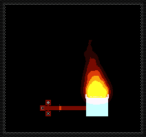
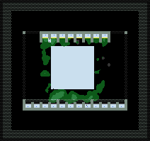
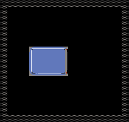
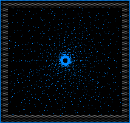

# Gases 气体

低密度、高扩散，受压力和温度影响显著。包括可燃气体、惰性气体、蒸汽等。气体型粒子（TYPE_GAS, 标志位值8）不直接受重力影响，但通过空气模拟（air simulation）间接受压力和温度梯度驱动。所有气体的默认 weight 均为 1，但扩散系数（diffusion）和水平流（advection）的不同决定了它们在空气中的实际"浮沉"表现。

本分类共 **14** 个元素。

- [GAS Type:10](#gas) — 石油气,易燃,在压力下液化成油
- [BIZG Type:12](#bizg) — 奇异气体
- [WTRV Type:23](#wtrv) — 水蒸气,水加热到100℃以上或者盐水加热到109.86℃以上时产生
- [PLSM Type:49](#plsm) — 等离子体,炽热的气体
- [NBLE Type:52](#nble) — 惰性气体,通电后能电离成等离子体,但只有1600℃左右
- [SMKE Type:57](#smke) — 烟,火焰冷却到较低温度时会产生烟,可燃烧
- [HYGN Type:77](#hygn) — 氢气,与氧气燃烧产生水,在高温高压下发生聚变
- [CO2 Type:80](#co2) — 二氧化碳,高密度气体,真空中下沉,与水反应生成苏打水(BUBW),冷却后变成干冰
- [CAUS Type:86](#caus) — 酸性气体,性质和酸(ACID)相似
- [FOG Type:92](#fog) — 雾,霜(RIME)受到电脉冲刺激时形成
- [OXYG Type:114](#oxyg) — 氧气,高度易燃的气体,可以被火焰点燃
- [BOYL Type:141](#boyl) — 波义耳气,不可燃气体,热胀冷缩
- [VRSG Type:175](#vrsg) — 病毒气,会将其碰触到的所有物质变成VIRS
- [RFRG Type:182](#rfrg) — 制冷剂,一种淡蓝色气体,在2P或更大压力下液化时加热,反之蒸发时冷却

---

## 气体物理特性对比总表

### 扩散系数与移动性

| 元素 | 扩散系数(diffusion) | 水平流(advection) | 空气阻力(airdrag) | airloss | hotair | 移动特征 |
|------|---------------------|-------------------|-------------------|---------|--------|----------|
| GAS | 0.75 | 1.0 | 0.01 | 0.99 | 0.001 | 中等扩散，上升趋势 |
| BIZG | 2.75 | 1.0 | 0.01 | 0.99 | 0.0 | 极高扩散，不受热空气影响 |
| WTRV | 0.75 | 1.0 | 0.01 | 0.99 | 0.0003 | 中等扩散，轻微上升 |
| PLSM | 0.3 | 0.9 | 0.04 | 0.97 | 0.001 | 低扩散，有上升趋势 |
| NBLE | 0.75 | 1.0 | 0.01 | 0.99 | 0.001 | 中等扩散，轻微上升 |
| SMKE | 0.0 | 0.9 | 0.04 | 0.97 | 0.001 | 零扩散，但 falldown=1 使其可下沉 |
| HYGN | 3.0 | 2.0 | 0.0 | 0.99 | 0.0 | 最高扩散+最高水平流，极活跃 |
| CO2 | 1.0 | 2.0 | 0.0 | 0.99 | 0.0 | 高扩散+gravity=0.1+falddown=1，会下沉 |
| CAUS | 1.5 | 2.0 | 0.0 | 0.99 | 0.0 | 较高扩散，无热空气驱动 |
| FOG | 0.99 | 0.8 | 0.0 | 0.4 | 0.0 | 高扩散但高损耗(loss=0.4)，会缓慢消散 |
| OXYG | 3.0 | 2.0 | 0.0 | 0.99 | 0.0 | 与HYGN相同，最高流动性 |
| BOYL | 0.18 | 1.0 | 0.01 | 0.99 | 0.0 | 极低扩散，相对惰性 |
| VRSG | 0.75 | 1.0 | 0.01 | 0.99 | 0.0 | 中等扩散 |
| RFRG | 1.3 | 1.2 | 0.0 | 0.99 | 0.0001 | 较高扩散+较高水平流+微热空气驱动 |

### 气体"密度"与实际行为

虽然所有气体的 weight 值均为 1，但其在空气中的实际浮沉行为由 gravity、falldown、hotair 和 diffusion 综合决定：

| 行为类别 | 元素 | 机制说明 |
|----------|------|----------|
| **上升型**（会向上方空间扩散） | WTRV, PLSM, GAS, RFRG | hotair>0 或 gravity<0，温度升高时加速上升 |
| **下沉型**（真空中会下沉） | CO2, SMKE | gravity=0.1(falldown=1) 或 falldown=1 且diffusion=0 |
| **中性型**（大致均匀分布） | BIZG, NBLE, CAUS, BOYL, VRSG | gravity=0, hotair=0 或极小 |
| **极活跃型**（快速填满空间） | HYGN, OXYG | diffusion=3.0 + advection=2.0，同类最高 |

### 冷凝/液化条件总表

| 元素 | 条件 | 产物 | 温度阈值 | 压力阈值 | 备注 |
|------|------|------|----------|----------|------|
| GAS | 高压压缩 | OIL | — | ≥6.0 P | 可逆反应，OIL低压/加热→GAS |
| WTRV | 冷却液化 | DSTW(以ctype存储) | ≤97.85℃ | 常压 | 也可通过加压冷凝 |
| WTRV | 超低温凝华 | RIME | ≤-0.16℃(272.99K) | 需要快速冷却 | 凝华为固体而非液体 |
| PLSM | 冷却回退 | NBLE(若ctype=NBLE) 或 WTRV(若tmp&3==3) | 自然冷却 | — | life≤1时触发 |
| NBLE | 冷却回退 | NBLE(从PLSM还原) | <等离子温度 | — | PLSM→NBLE当life≤1且ctype=NBLE |
| CO2 | 低温凝固 | DRIC(干冰) | ≤-78.5℃(194.65K) | — | 升华逆向：DRIC升温→CO2 |
| OXYG | 低温液化 | LOXY(液氧) | ≤-183.15℃(90K) | >100 P时加速 | 液氧升温→O2 |
| FOG | 升温蒸发 | WTRV | ≥100℃(373.15K) | — | 雾→蒸汽 |
| RFRG | 加压液化 | RFGL | — | ≥2 P | 液化时释放热量 |
| RFRG | 降压蒸发 | RFRG(从RFGL) | — | <2 P | 蒸发时吸收热量 |
| VRSG | 低温液化 | VIRS(病毒固体) | ≤400℃(673K) | — | 实际上凝华成固体病毒 |

---

## 气体扩散行为详解

TPT 中的气体扩散由以下参数联合控制：

1. **diffusion（扩散系数）**：每帧粒子随机向相邻格扩散的概率。值越大，气体越"活跃"，越容易填满整个容器。HYGN/OXYG 的 3.0 为气体中最高，BOYL 的 0.18 为最低。
2. **advection（水平流）**：粒子被空气速度场(air velocity field)带动的程度。气体值通常在 0.8~2.0 范围。高 advection 意味着气体粒子会被气流"吹走"。
3. **airdrag（空气阻力）**：粒子对空气速度场的阻力。值越小，粒子越容易跟随空气运动。
4. **airloss（空气动量损耗）**：粒子运动时对空气速度场的能量损耗率。越低，粒子运动对气流阻碍越小。
5. **hotair（热空气效应）**：正值表示粒子会被自身热量产生的上升气流托起。WTRV(0.0003)、PLSM(0.001)、GAS(0.001) 都有此特性，模拟"热空气上升"。
6. **gravity（重力因子）**：虽然气体不受重力下落（falldown=0），但 gravity 和 falldown 值仍影响其压力梯度下的运动方向。CO2 的 gravity=0.1 且 falldown=1 使其在真空中向下沉降。

### 封闭容器中的扩散行为

- **HYGN/OXYG**：放入任何容器后几乎瞬间均匀分布，无论容器形状如何。这是因为 diffusion=3.0。
- **BOYL/GAS/WTRV**：扩散较慢，需要数十帧才能均匀填充。在竖直容器中会略有分层（GAS 和 WTRV 因 hotair 偏向上方）。
- **CO2**：在竖直容器中会沉降到底部，因为 gravity=0.1 和 falldown=1。可形成"CO2 湖"。在真空中尤其明显。
- **SMKE**：diffusion=0 意味着烟粒子完全不自主扩散！烟的"扩散感"完全来自 advection(0.9) 跟随空气速度场。在完全静止的空气中，烟停留在原地。

---

###### GAS Type:10


### 属性表

| 属性 | 值 | 说明 |
|------|-----|------|
| 内部标识 | DEFAULT_PT_GAS | C++枚举名 |
| Type ID | 10 | 元素编号 |
| 颜色 | `0xE0FF20_rgb` | 黄绿色 |
| 分类 | TYPE_GAS (8) | 气体型 |
| 属性标志 | TYPE_PART, PROP_NEUTPASS | 粉末基类+中子可穿透 |
| weight | 1 | 标准气体重量 |
| heatconduct(导热率) | 42 | 中等偏低 |
| diffusion(扩散率) | 0.75 | 中等 |
| advection(水平流) | 1.0 | 标准 |
| airdrag | 0.01 | 极低空气阻力 |
| airloss | 0.99 | 标准 |
| hotair | 0.001 | 轻微热空气上升 |
| gravity | 0.0 | 不受重力 |
| falldown | 0 | 不下落 |
| flammable | 600 (帧) | 可燃，点燃后燃烧600帧 |
| explosive | 0 | 不爆炸 |
| hardness | 1 | 极低硬度 |
| 高温转换 | ≥573.0K (299.85℃) → FIRE | 燃点 |
| 高压转换 | ≥6.0 P → OIL | 液化压力 |
| 源文件 | GAS.cpp | — |

### 机制详解

GAS（石油气）是石油(OIL)和柴油(DESL)的气态形式。它是碳氢化合物燃料体系中的关键中间体。GAS 的扩散率为 0.75，属于中等扩散气体，在封闭容器中需要一定时间才能均匀分布。

**气-液-固相变链**：
```
OIL(液体) ←→ GAS(气体) → FIRE(燃烧) → SMKE(烟)
DESL(柴油) → GAS(低压/加热)
GAS → INSL(绝缘体, PTNM催化)
GAS + CAUS → RFRG(制冷剂气体)
```

GAS 的液化（高压→OIL）和蒸发（OIL 低压/加热→GAS）是可逆过程，这使得 GAS-OIL 体系可以用于压力驱动的自动调节装置。

### 参数详解

- **flammable=600**：与大多数可燃物不同，GAS 的 flammable 值是 600 帧而非标志位。这意味着 GAS 被点燃后不会立即消失，而是燃烧 600 帧（约 10 秒/60fps）。在这 600 帧内，GAS 会持续转化为 FIRE。
- **hotair=0.001**：GAS 被自身热量产生的上升气流轻微托起。在火灾现场，GAS 会向上升腾。
- **高压转换(6.0 P)**：当环境压力达到 6.0 或以上时，GAS 每帧有概率转变为 OIL。这是模拟气-液相变：压力增大→分子间距缩小→液化。

### 反应链

1. **燃烧反应链**：
   - 点火(温度≥573K 或接触 FIRE/PLSM/LAVA) → GAS 进入燃烧状态
   - 燃烧中的 GAS 帧帧产生 FIRE 粒子
   - FIRE 冷却 → SMKE
   - SMKE 继续受热 → FIRE（链式持续）

2. **催化转化**：
   - GAS + PTNM(铂) + ≥200℃ + >2 P → INSL
   - 这是费托合成(FT synthesis)在 TPT 中的体现：碳氢气体在催化剂作用下聚合成固体

3. **与 CAUS 的反应**：
   - GAS + CAUS(>3 P) → 2x RFRG
   - 酸性气体与石油气在中等压力下发生卤代反应生成制冷剂

### 环境交互

- **在水下**：GAS 因不直接受重力而会上升穿过水层，在上方空间聚集
- **在密闭容器中**：长时间高压会导致全部 GAS 液化为 OIL
- **与中子(NEUT)**：NEUT 轰击 OIL 或 DESL 产生 GAS；NEUT 本身可穿透 GAS（NEUTPASS 属性）
- **温度梯度**：GAS 从热区向冷区缓慢迁移（通过 hotair 和空气速度场）

### 实用场景

- **燃料气体供应系统**：OIL 池低压蒸发→GAS→管道输送→远程点火
- **压力调节阀**：利用 GAS→OIL 的 6.0P 液化阈值做自动泄压
- **PTNM 催化工厂**：GAS + PTNM 高温高压 → INSL 量产
- **制冷剂生产**：GAS + CAUS 中等压力 → RFRG 合成

---

###### BIZG Type:12


### 属性表

| 属性 | 值 | 说明 |
|------|-----|------|
| 内部标识 | DEFAULT_PT_BIZRG | C++枚举名 |
| Type ID | 12 | 元素编号 |
| 颜色 | `0x00FFBB_rgb` | 青绿色 |
| 分类 | TYPE_GAS (8) | 气体型 |
| 属性标志 | TYPE_PART | 粉末基类 |
| weight | 1 | 标准气体重量 |
| heatconduct | 42 | 与GAS相同 |
| diffusion | 2.75 | 极高扩散(仅次于HYGN/OXYG的3.0) |
| advection | 1.0 | 标准水平流 |
| airdrag | 0.01 | 极低空气阻力 |
| airloss | 0.99 | 标准 |
| hotair | 0.0 | 无热空气效应 |
| gravity | 0.0 | 不受重力 |
| falldown | 0 | 不下落 |
| flammable | 0 | 不燃烧 |
| explosive | 0 | 不爆炸 |
| hardness | 1 | 极低硬度 |
| 高温转换 | ≥100.0K (-173.15℃) → BIZR | 极低温下"汽化" |
| 源文件 | BIZRG.cpp | — |

### 机制详解

BIZG（奇异气体）是 BIZR（奇异液体）和 BIZS（奇异固体）体系中的气态成员。整个 BIZ 系列元素遵循**反向物理定律**：

```
BIZS(奇异固体) → 高温(400K/127℃) → BIZR(奇异液体)
BIZR(奇异液体) → 低温(100K/-173℃) → BIZG(奇异气体)
BIZG(奇异气体) → 高温(100K/-173℃) → BIZR(奇异液体)
```

正常物质是"冷凝固、热蒸发"，而 BIZ 系列恰好相反：**热凝固、冷蒸发**。BIZG 在 100K（约-173℃）时会"汽化"成液体 BIZR——这完全颠覆了常规物理直觉。

BIZG 的 diffusion 高达 2.75，在气体中仅次于 HYGN/OXYG(3.0)，这意味着 BIZG 会非常迅速地填满任何容器空间。hotair=0 意味着它不被自身热量影响，在空气中呈中性扩散。

### 参数详解

- **diffusion=2.75**：使得 BIZG 在气体中扩散速度排名第三。即使没有空气速度场，BIZG 也会极快地随机游走扩散。
- **高温转换(100K)**：注意这个"高温"仅 100K（-173℃），这是因为 BIZ 体系的相变方向是颠倒的。在常温(295K)下，BIZG 实际上处于"过热"状态，会自发转变为 BIZR。
- **heatconduct=42**：与 GAS、BOYL 相同，属于低导热气体。

### 反应链

BIZG 自身几乎没有化学反应，主要作为 BIZ 相变链的一部分：

1. **BIZ 三相循环**：
   - BIZS(固体, 低温) → 升温至 400K → BIZR(液体)
   - BIZR(液体, 常温) → 降温至 100K → BIZG(气体)
   - BIZG(气体, 超低温) → 升温至 100K → BIZR(液体)
   - BIZR(液体) → 降温 → BIZS(固体)

2. **颜色传染**：BIZR 和 BIZS 都会"染色"接触到的粒子，但 BIZG 作为气体不具有此特性。

### 环境交互

- **在常温环境中**：BIZG 会迅速（因为高 diffusion）扩散并立即转变为 BIZR（因为环境温度远高于 100K），因此常温下几乎无法观察到 BIZG 稳定存在。
- **超低温环境**：只有在温度低于 100K（约-173℃）的环境中 BIZG 才能稳定存在。可以配合 FRZZ、CFLM、NICE 等冷元素创造这样的环境。
- **与空气模拟**：advection=1.0 使得 BIZG 会跟随空气流动，但 hotair=0 意味着它不会产生热对流。

### 实用场景

- **超低温实验**：利用 BIZG↔BIZR 的 100K 反向相变作为超低温环境的指示剂
- **温度传感器标定**：100K 的精确相变点可用于校准温度检测系统
- **物理教学**：展示反向相变现象，对比正常物质的相变规律

---

###### WTRV Type:23


### 属性表

| 属性 | 值 | 说明 |
|------|-----|------|
| 内部标识 | DEFAULT_PT_WTRV | C++枚举名 |
| Type ID | 23 | 元素编号 |
| 颜色 | `0xA0A0FF_rgb` | 淡蓝紫色 |
| 分类 | TYPE_GAS (8) | 气体型 |
| 属性标志 | TYPE_PART | 粉末基类 |
| weight | 1 | 标准气体重量 |
| heatconduct | 48 | 中等 |
| diffusion | 0.75 | 中等（与GAS相同） |
| advection | 1.0 | 标准水平流 |
| airdrag | 0.01 | 极低空气阻力 |
| airloss | 0.99 | 标准 |
| hotair | 0.0003 | 轻微热空气上升 |
| gravity | -0.1 | 负重力——轻微上浮 |
| falldown | 0 | 不下落 |
| flammable | 0 | 不燃烧 |
| explosive | 0 | 不爆炸 |
| hardness | 4 | 气体中较高 |
| 低温转换 | ≤371.0K (97.85℃) → ctype存储的元素(默认DSTW) | 冷凝点 |
| 源文件 | WTRV.cpp | — |

### 机制详解

WTRV（水蒸气）是水(WATR)、盐水(SLTW)、蒸馏水(DSTW)和苏打水(BUBW)的气态形式。它是 TPT 中最常用的工作介质之一，因为水的气液相变温度（100℃）恰好处于 TPT 常见温度范围的中心。

**气液相变链**：
```
WATR(水) → ≥100℃(373K) → WTRV(水蒸气)
SLTW(盐水) → ≥109.86℃(383K) → WTRV + SALT残留
WTRV → ≤97.85℃(371K) → DSTW(蒸馏水,冷凝)
WTRV → ≤-0.16℃(272.99K)快速冷却 → RIME(霜,凝华)
```

WTRV 的 gravity=-0.1 和 hotair=0.0003 共同赋予其上升倾向，模拟现实中热蒸汽上升的物理行为。

### 参数详解

- **gravity=-0.1**：负重力使得 WTRV 粒子在无阻挡时倾向于向上移动。这是气体中唯一具有负重力的元素，明显体现了"蒸汽上升"的设计意图。
- **低温转换(371K=97.85℃)**：比水的沸点(373K)低约 2℃，存在小幅滞后。冷凝产物由 ctype 决定：默认生成 DSTW（蒸馏水），但如果 ctype 被设为其他值（如通过控制台修改），可能冷凝成其他物质——这是一个可用于奇点炸弹的漏洞特性。
- **hardness=4**：在气体中 hardness 最高(GAS=1, 大部分气体=0~1)，意味着 WTRV 更难被其他粒子"推开"。
- **hotair=0.0003**：正值意味着 WTRV 自身上升，温度越高上升越快，形成热对流。

### 反应链

1. **费托合成链**：
   - WTRV + BCOL(煤粉) + PTNM(铂催化) + ≥200℃ + >7 P → OIL
   - 这是工业上生产合成石油的核心反应

2. **酸气生成**：
   - WTRV + ACID(酸) → CAUS(酸气) (概率 1/250)
   - 模拟酸雾形成

3. **铷反应**：
   - WTRV + RBDM/LRBD(>12℃) → FIRE (概率 1/100)
   - 碱金属与水蒸气反应，产生火焰

4. **凝华成霜**：
   - WTRV 快速冷却至 ≤272.99K → RIME(霜)
   - 需要冷却速度快于冷凝速度

5. **转雾**：
   - RIME + 电脉冲 → FOG(雾)
   - FOG + 升温(≥100℃) → WTRV 完成循环

### 环境交互

- **在高热环境中**：WTRV 因 hotair 和负重力快速向顶部聚集。大量水沸腾时(如熔岩入水)，WTRV 产生的高压可达数十 P。
- **在冷壁面上**：遇到冷固体时 WTRV 冷凝为 DSTW，释放潜热加热壁面。
- **与中子**：NEUT 因 NEUTPASS 属性穿透 WTRV，不触发特殊反应。
- **压力积累**：密闭容器中大量 WTRV 产生可导致容器破裂。

### 实用场景

- **蒸汽机/涡轮**：WATR 加热→WTRV 高压→推动活塞或涡轮→冷凝回收
- **蒸馏装置**：WATR→WTRV→冷壁冷凝→DSTW(纯净水)
- **费托合成工厂**：WTRV+BCOL+PTNM 高温高压→OIL 工业量产
- **霜制造**：WTRV 急速冷却→RIME→通电→FOG 多级转换
- **热力管道**：利用 WTRV 的 gravity=-0.1 设计自动上升的热气管道

---

###### PLSM Type:49



### 属性表

| 属性 | 值 | 说明 |
|------|-----|------|
| 内部标识 | DEFAULT_PT_PLSM | C++枚举名 |
| Type ID | 49 | 元素编号 |
| 颜色 | `0xBB99FF_rgb` | 紫罗兰色 |
| 分类 | TYPE_GAS (8) | 气体型 |
| 属性标志 | TYPE_PART, PROP_LIFE_DEC, PROP_LIFE_KILL_DEC | 有生命衰减, 生命耗尽自毁 |
| weight | 1 | 标准气体重量 |
| heatconduct | 5 | 极低导热(气体中最低) |
| diffusion | 0.3 | 低扩散 |
| advection | 0.9 | 标准水平流 |
| airdrag | 0.04 | 中等空气阻力 |
| airloss | 0.97 | 中等偏低 |
| hotair | 0.001 | 轻微热空气上升 |
| gravity | -0.1 | 负重力(上浮) |
| falldown | 0 | 不下落 |
| flammable | 0 | 自身不燃(但可点燃其他) |
| explosive | 0 | 不爆炸 |
| hardness | 0 | 无硬度(任何粒子可推开) |
| 初始温度 | 9725.85℃ (9999K) | 游戏内最高温之一 |
| 默认 Life | 200以内随机 | 存在时间限制 |
| 源文件 | PLSM.cpp | — |

### 机制详解

PLSM（等离子体）是 TPT 中最炽热的物质之一，代表了物质的第四态——电子与原子核分离的电离态。它是许多核反应和点火过程的终点产物。

**等离子体生成途径**：
```
FIRE → ≥2500℃(2773K) → PLSM
BTRY(电池) → ≥2000℃(2273K) → PLSM
NBLE + SPRK(电脉冲) → PLSM(NBLE, 电离)
FUSE/FSEP 点燃 → PLSM
INSL + DEST 接触 → 部分 INSL → PLSM
ETRD 电极对 → PLSM(电极间)
NBLE 核聚变 → PLSM(产物)
H2 核聚变 → PLSM(产物)
CO2 极端裂解 → PLSM(产物)
O2 极端核反应 → PLSM(产物)
```

### 参数详解

- **初始温度=9999K(9725.85℃)**：游戏中的 MAX_TEMP，与 DEST 的目标温度相同。任何接触 PLSM 的物质都会被极速加热。
- **Life=200以内随机**：PLSM 的 Life 值在生成时随机设为 0~200。每帧 Life 递减(PROP_LIFE_DEC)。当 Life≤1 时触发销毁逻辑(PROP_LIFE_KILL_DEC)。
- **Life 耗尽时的行为**：
  - 若 ctype=NBLE：粒子转回 NBLE（等离子体复合）
  - 若 tmp&3==3：粒子转变为 WTRV（氢氧复合）
  - 其他：直接消失
- **heatconduct=5**：气体中最低的导热率。尽管 PLSM 温度极高，但它自身导热极慢。不过它通过直接接触传递热量（接触→设目标粒子温度→间接引燃）。
- **diffusion=0.3**：低扩散意味着 PLSM 比较"粘稠"，不会像普通气体那样快速扩散。这模拟了等离子体的高粘性和电磁约束效应。
- **gravity=-0.1**：与 WTRV 相同，火焰和等离子体都向上浮。

### 反应链

1. **氢气燃烧**：
   - PLSM + H2 → FIRE + PLSM(H2的tmp|=1标记)
   - PLSM 点燃氢气，自身保留

2. **病毒消灭**：
   - PLSM + VIRS → 2x PLSM (概率 1/100)
   - 高温等离子体消灭病毒粒子并增殖自身

3. **间接引爆链**：
   - PLSM 因高温间接引爆：FUSE, FSEP, FWRK, NITR, GUN, TNT, C-4 等

4. **与氧气**：
   - PLSM + O2(!tmp&4) → FIRE + PLSM
   - 氧气在等离子体中燃烧

### 环境交互

- **热辐射**：PLSM 温度高达 9999K，在数帧内可加热周围 5~10 格范围内的所有物质到燃点以上
- **压力产生**：PLSM 加热周围的空气产生急剧压力波(因为空气受热膨胀)
- **声音传播**：PLSM 的产生通常伴随剧烈的压力变化，可触发 WIFI 等压力敏感设备
- **与绝缘体(INSL)**：INSL 的热导率为 0，是唯一能在 PLSM 附近存活而不被熔化的物质

### 实用场景

- **核聚变反应堆**：利用 NBLE/HYGN 聚变产生的 PLSM 作为热源
- **等离子体切割**：利用 PLSM 的 9999K 超高温熔化任何物质
- **病毒净化**：PLSM 大量增殖可消灭病毒污染区域
- **点火装置**：ETRD 电极对产生可控 PLSM 用于远程点火
- **温度极限测试**：利用 PLSM 测试各种元素在 MAX_TEMP 下的行为

---

###### NBLE Type:52


### 属性表

| 属性 | 值 | 说明 |
|------|-----|------|
| 内部标识 | DEFAULT_PT_NBLE | C++枚举名 |
| Type ID | 52 | 元素编号 |
| 颜色 | `0xEB4917_rgb` | 橙红色 |
| 分类 | TYPE_GAS (8) | 气体型 |
| 属性标志 | TYPE_PART, PROP_CONDUCTS, PROP_LIFE_DEC | 可导电, 有生命衰减 |
| weight | 1 | 标准气体重量 |
| heatconduct | 106 | 气体中第三高(仅次于HYGN的251和VRSG的251) |
| diffusion | 0.75 | 中等 |
| advection | 1.0 | 标准水平流 |
| airdrag | 0.01 | 极低空气阻力 |
| airloss | 0.99 | 标准 |
| hotair | 0.001 | 轻微热空气上升 |
| gravity | 0.0 | 不受重力 |
| falldown | 0 | 不下落 |
| flammable | 0 | 不燃烧 |
| explosive | 0 | 不爆炸 |
| hardness | 1 | 极低硬度 |
| 初始温度 | 24.00℃ (297.15K) | 室温 |
| 源文件 | NBLE.cpp | — |

### 机制详解

NBLE（惰性气体）是 TPT 核反应体系中的核心中间体。它的设计原型是氦或氖等稀有气体——化学惰性但核物理活跃。NBLE 同时是气体中唯一同时具有导电性和生命衰减属性的元素，这使它成为电离和聚变过程的关键。

**NBLE 的双重身份**：
1. **作为惰性气体**：不参与燃烧和化学反应，可在任何环境中稳定存在
2. **作为聚变中间体**：HYGN 聚变的首步产物，自身也可继续聚变
3. **作为等离子体前体**：通电电离成 PLSM

### 参数详解

- **PROP_CONDUCTS**：NBLE 可以导电！这是气体中唯一的导电元素。通电后（SPRK 接触到 NBLE），NBLE 进入电离过程：
  - 每帧温度上升直到约 1600℃
  - 连续通电保持升温
  - 最终转变为 PLSM(NBLE)，其中 ctype 保留为 NBLE
- **PROP_LIFE_DEC**：NBLE 具有 Life 衰减特性，主要用于电离过程的时间控制（约 175 帧）
- **heatconduct=106**：气体中第三高的热导率（仅次于 HYGN 和 VRSG 的 251），使得 NBLE 能快速传递热量

### 反应链

1. **电离链**：
   ```
   NBLE + SPRK(电脉冲) → 加热(每帧升温) → ~175帧后 → PLSM(NBLE)
   PLSM(NBLE, life≤1) → 返回 NBLE(等离子体复合)
   ```
   这个可逆循环是许多等离子体器件的核心。

2. **核聚变链（氢路线）**：
   ```
   HYGN → (≥2000℃, ≥50P) → NBLE + NEUT + PHOT + ELEC(10%)
   NBLE → (≥5000℃, ≥100P) → CO2 + NEUT + PHOT + PLSM + ELEC(可能)
   ```
   这是完整的双阶段聚变过程：HYGN→NBLE→CO2+能量

3. **冷聚变链**：
   ```
   2x HYGN + PTNM + ≥500℃ → NBLE + NEUT + PHOT (概率 1/1000)
   ```
   铂催化下的低温冷聚变

### 环境交互

- **在电场中**：NBLE 接触 SPRK 立即开始电离升温，这是设计等离子体发生器的核心机制
- **在高温高压环境**：达到聚变条件(>5000K, >100P)时，每 5 帧有 1 次机会触发聚变反应
- **等离子复合**：当周围的 PLSM 冷却(life≤1)且 ctype=NBLE 时，会还原为 NBLE 气体

### 实用场景

- **等离子体发生器（电离方法）**：NBLE + 持续电脉冲 → 升温 → 稳定输出 PLSM
- **两阶段聚变反应堆**：HYGN 第一段聚变(2000℃/50P)→NBLE→NBLE 第二段聚变(5000℃/100P)→巨大能量
- **热电转换器**：利用 NBLE 的 PROP_CONDUCTS 属性设计气体导电电路
- **核废料处理**：聚变末端产物 CO2 可被植物吸收

---

###### SMKE Type:57


### 属性表

| 属性 | 值 | 说明 |
|------|-----|------|
| 内部标识 | DEFAULT_PT_SMKE | C++枚举名 |
| Type ID | 57 | 元素编号 |
| 颜色 | `0x222222_rgb` | 深灰色 |
| 分类 | TYPE_GAS (8) | 气体型 |
| 属性标志 | TYPE_PART, PROP_LIFE_DEC, PROP_LIFE_KILL_DEC | 有生命衰减, 生命耗尽自毁 |
| weight | 1 | 标准气体重量 |
| heatconduct | 88 | 较高(气体中排第四) |
| diffusion | 0.0 | 零扩散！ |
| advection | 0.9 | 标准水平流 |
| airdrag | 0.04 | 中等空气阻力 |
| airloss | 0.97 | 中等偏低 |
| hotair | 0.001 | 轻微热空气上升 |
| gravity | -0.1 | 负重力(上浮) |
| falldown | 1 | 可下落！ |
| flammable | 0 | 不直接燃烧(但有燃点) |
| explosive | 0 | 不爆炸 |
| hardness | 1 | 极低硬度 |
| 高温转换 | ≥625.0K (351.85℃) → FIRE | 燃点 |
| 初始温度 | 342.00℃ (615.15K) | 热烟 |
| 源文件 | SMKE.cpp | — |

### 机制详解

SMKE（烟）是所有燃烧过程的副产品。它在设计上非常特殊：diffusion=0 意味着烟雾自身不会扩散——这模拟了现实中烟雾的"滞重感"。但 falldown=1 和 gravity=-0.1 的矛盾设置（同时可下落和上浮）使得烟雾在受热时上升、在冷却时下沉，形成逼真的烟雾分层效果。

**烟雾产生链**：
```
FIRE → 自然冷却(life衰减) → SMKE → ≥625K → FIRE(复燃!)
DUST 燃烧 → FIRE(life 185~255) → SMKE
WOOD 燃烧 → SMKE
任何可燃物燃烧 → FIRE → ... → SMKE
```

### 参数详解

- **diffusion=0.0**：唯一的零扩散气体。这意味着 SMKE 粒子不会主动随机游走到相邻空位。烟雾的"扩散感"完全来自 advection(0.9)——跟随空气速度场。
- **falldown=1**：在气体中非常罕见。通常只有粉末具有 falldown=1。CO2 也有这个特性。当 falldown=1 且下方为空时，SMKE 会向下沉降。在真空中，SMKE 会下沉积聚。
- **gravity=-0.1**：又有负重力！这意味着温度较高时，SMKE 倾向于上浮；温度较低时，falldown 占主导，SMKE 下沉。这种二重性精确模拟了真实烟雾的热升冷降行为。
- **初始温度=615.15K(342℃)**：热烟雾！这比 FIRE 的典型温度(约 800K)低，但仍远超燃点。
- **高温转换=625K(351.85℃)**：只比初始温度高约 10℃。这意味着刚生成的 SMKE 非常接近复燃温度——稍微加热就会重新燃烧。
- **PROP_LIFE_DEC + PROP_LIFE_KILL_DEC**：SMKE 自然存在时间有限，Life 衰减完后消失，模拟烟雾消散。

### 反应链

1. **燃烧-烟雾循环**：
   ```
   FIRE → (life衰减) → SMKE → (≥625K加热) → FIRE
   ```
   这构成了一个可逆的燃烧/灭火循环。

2. **植物吸收**：
   ```
   SMKE + PLNT(植物) → PLNT 吸收 → 产生 OXYG
   ```
   模拟光合作用中的碳固定。

3. **产压效应**：
   SMKE 接触热物质（温度高于自身）时会产生轻微压力（约 0.05~0.1 P/frame），模拟热烟雾膨胀。

### 环境交互

- **在静止空气中**：diffusion=0 意味着 SMKE 不会主动扩散，在有风(空气速度场)之前会停留在原地。这在游戏中表现为"烟柱"效果。
- **在冷环境中**：SMKE 的 falldown=1 使其向下方沉降，形成低温烟雾层。
- **在热环境中**：gravity=-0.1 开始起作用，SMKE 向上方升腾。
- **CO2 灭火联动**：CO2 遇 FIRE 时消灭火焰（概率 1/30），火焰熄灭→产生 SMKE。CO2 因此可以间接"收集"烟雾。

### 实用场景

- **火警系统**：利用 SMKE 的产生作为火灾检测信号（DTEC 检测烟）
- **光合作用工厂**：PLNT + SMKE → OXYG 生产链
- **灭火系统设计**：SMKE↔FIRE 的可逆性意味着控温是关键
- **气流可视化**：diffusion=0 使 SMKE 成为完美的气流指示剂——烟的移动完全反映空气速度场

---

###### HYGN Type:77


### 属性表

| 属性 | 值 | 说明 |
|------|-----|------|
| 内部标识 | DEFAULT_PT_H2 | C++枚举名(注意标识名是 H2) |
| Type ID | 77 | 元素编号 |
| 颜色 | `0x5070FF_rgb` | 蓝色 |
| 分类 | TYPE_GAS (8) | 气体型 |
| 属性标志 | TYPE_PART, PROP_NEUTPASS | 中子可穿透 |
| weight | 1 | 标准气体重量 |
| heatconduct | 251 | 气体中最高(之一) |
| diffusion | 3.0 | 气体中最高(与OXYG并列) |
| advection | 2.0 | 气体中最高(与OXYG、CAUS并列) |
| airdrag | 0.0 | 无空气阻力 |
| airloss | 0.99 | 标准 |
| hotair | 0.0 | 无热空气效应 |
| gravity | 0.0 | 不受重力 |
| falldown | 0 | 不下落 |
| flammable | 0 | 不直接可燃(需FIRE/PLSM点燃) |
| explosive | 0 | 不爆炸 |
| hardness | 0 | 无硬度(极易被推开) |
| 初始温度 | 22.00℃ (295.15K) | 室温 |
| 源文件 | H2.cpp | — |

### 机制详解

HYGN（氢气）是 TPT 中最轻、最活跃的气体。diffusion=3.0+advection=2.0 的组合使其成为游戏中扩散最快的粒子（与 OXYG 并列第一）。airdrag=0 意味着氢气完全不受空气阻力影响，会以最大效率跟随空气速度场。

**HYGN 的多重角色**：
1. **可燃气体**：被 FIRE/PLSM/LAVA 点燃，与 OXYG 燃烧生成水
2. **核聚变燃料**：第一段聚变(2000℃/50P/概率1/5) → NBLE+NEUT+PHOT
3. **冷聚变参与者**：PTNM 催化下低温聚变
4. **工业原料**：与 DESL 加氢裂化→OIL+WATR
5. **基本粒子来源**：NEUT+ELEC→HYGN

### 参数详解

- **diffusion=3.0**：游戏中最高的扩散系数值(与 OXYG 并列)。HYGN 粒子每帧有极高概率随机移动到相邻空位，使其"瞬间"填满任何容器。
- **advection=2.0**：空气跟随系数也是最高。在强风环境中，HYGN 是所有气体中被吹得最快的。
- **airdrag=0.0**：无空气阻力。HYGN 完全顺从空气速度场，不产生任何反向阻力。这是 HYGN 在真空中也能快速运动的原因。
- **heatconduct=251**：与 VRSG 并列气体中最高。氢气是极佳的热导体（在 TPT 的简化物理模型中）。
- **PROP_NEUTPASS**：中子可以穿透 HYGN 而不被阻挡，模拟了氢对中子的低吸收截面。

### 反应链

1. **燃烧链**：
   ```
   HYGN + FIRE → 2x FIRE (氢气燃烧, HYGN的tmp|=1标记)
   HYGN + PLSM → FIRE (高温点燃)
   HYGN + LAVA → FIRE
   HYGN + OXYG + PTNM(催化) → 2x DSTW (催化燃烧产物为蒸馏水)
   ```

2. **加氢裂化链**：
   ```
   HYGN + DESL(pres>8) → OIL + WATR
   DESL 在 >5P 时自燃，需 TTAN 保护或快速反应
   ```

3. **核聚变链**：
   ```
   HYGN → (≥2273K, ≥50P, 1/5概率) → NBLE + NEUT + PHOT + 10%ELEC
   同时释放：+50P压力, +4000℃热量
   ```

4. **冷聚变链**：
   ```
   2x HYGN + PTNM + ≥500℃ → NBLE + NEUT + PHOT (1/1000概率)
   不需要高压！这是"冷"聚变的含义
   ```

5. **基本粒子合成**：
   ```
   NEUT + ELEC → HYGN (基本粒子逆反应)
   ```

### 环境交互

- **石英(QRTZ)保护**：HYGN 因无压力效应(PROP_NEUTPASS 而非压力产生)在低温下碰到 QRTZ 不会使其破碎。大多数其他气体会因微小压力导致 QRTZ 碎裂。
- **在密闭容器中**：HYGN 会瞬间均匀分布，无浓度梯度。如果与 OXYG 混合并被点燃，整个容器会瞬间爆燃。
- **氢气聚集**：尽管 HYGN 轻，但 TPT 气体无重力分层，HYGN 不会自动上升聚集在顶部（除非有温度梯度驱动空气速度场）。

### 实用场景

- **氢气-氧气焊接**：HYGN + OXYG 在 PTNM 催化下产生纯净水+热量
- **核聚变反应堆**：HYGN 二阶聚变是 TPT 中最常用的能源方案之一
- **合成石油工厂**：HYGN + DESL 加氢裂化→OIL 工业化生产
- **热电转换**：利用 heatconduct=251 的特性将 HYGN 作为气体导热介质
- **冷聚变实验**：PTNM + HYGN 在 500℃即可触发（不需要高压）

---

###### CO2 Type:80


### 属性表

| 属性 | 值 | 说明 |
|------|-----|------|
| 内部标识 | DEFAULT_PT_CO2 | C++枚举名 |
| Type ID | 80 | 元素编号 |
| 颜色 | `0x666666_rgb` | 灰色 |
| 分类 | TYPE_GAS (8) | 气体型 |
| 属性标志 | TYPE_PART | 粉末基类 |
| weight | 1 | 标准气体重量 |
| heatconduct | 88 | 较高(与SMKE相同) |
| diffusion | 1.0 | 中等偏高 |
| advection | 2.0 | 高(与HYGN/OXYG同级别) |
| airdrag | 0.0 | 无空气阻力 |
| airloss | 0.99 | 标准 |
| hotair | 0.0 | 无热空气效应 |
| gravity | 0.1 | 正重力——会下沉！ |
| falldown | 1 | 可下落！ |
| flammable | 0 | 不燃烧 |
| explosive | 0 | 不爆炸 |
| hardness | 0 | 无硬度 |
| 低温转换 | ≤194.65K (-78.5℃) → DRIC(干冰) | 凝华点 |
| 初始温度 | 22.00℃ (295.15K) | 室温 |
| 源文件 | CO2.cpp | — |

### 机制详解

CO2（二氧化碳）是 TPT 中最独特的气体——它是唯一同时具有 falldown=1、gravity=0.1 和 diffusion=1.0 的气体。这使它成为"下沉气体"：在真空中或静止空气中，CO2 会向下沉降，形成气体"湖"。

**CO2 循环链**：
```
BUBW(苏打水) → 缓慢释放 → CO2(ctype=5标记为BUBW来源)
CO2 + WATR/DSTW → CBNW(碳酸水) (1/50)
CO2 → ≤-78.5℃ → DRIC(干冰)
DRIC → ≥-78.5℃ → CO2(升华)
CO2 + PLNT → 植物吸收 → OXYG(光合作用)
CO2 → 极端高温高压 → 裂解
```

### 参数详解

- **gravity=0.1 + falldown=1**：CO2 会向下方空隙移动。在没有任何空气速度场的静止环境中，CO2 会像粉末一样向下沉降。这模拟了真实 CO2 比空气重的特性（尽管在游戏中 weight 仍为 1）。
- **diffusion=1.0**：比 HYGN/OXYG(3.0) 低，但比 GAS/WTRV(0.75) 高。CO2 仍会扩散，但下沉趋势更强。
- **advection=2.0**：即使会下沉，CO2 仍能高效跟随空气流动。在风道中，CO2 随风移动的速度与 HYGN 相同。
- **低温转换(194.65K=-78.5℃)**：CO2 在低温下直接凝华为干冰(DRIC)，跳过液态。这是模拟现实中二氧化碳的升华/凝华特性。
- **灭火机制**：CO2 接触 FIRE 时(1/30概率)，同时消灭自身和火焰。这是 TPT 中为数不多的可控灭火方式。

### 反应链

1. **苏打水-CO2 循环**：
   ```
   BUBW → 每帧(1/4000) → CO2(ctype=5) + 0.5P压力
   BUBW + 粉末接触 → 瞬间爆炸 → 大量CO2 + 0.2P/粒子
   BUBW + <-5P压力 → 瞬间爆炸
   BUBW + 固体(非DMND/GLAS) → 大量CO2(40000次) + 0.2P/次
   ```
   在密闭容器中，CO2 压力超过 3P 时 BUBW 停止产生 CO2——这是一个自动稳压机制。

2. **碳酸水形成**：
   ```
   CO2 + WATR/DSTW → CBNW(1/50概率)
   ```
   CBNW 是一种特殊的"碳酸标记水"，可作为中间产物。

3. **极端裂解**：
   ```
   CO2 → (≥9773K, ≥200P, 1/5概率) → OXYG + NEUT + ELEC(可能)
   同时产生：PLSM + 剧烈压力
   ```

4. **灭火反应**：
   ```
   CO2 + FIRE → CO2消失 + FIRE消失(1/30概率)
   ```

5. **锂碳化**：
   ```
   CO2 + LITH(锂) → LITH碳化因子+1, CO2消失
   ```

### 环境交互

- **在竖直容器中**：CO2 会沉降到底部形成"气垫"，从下往上逐步填充
- **真空舱室**：CO2 的下沉行为最为明显，因为没有空气速度场干扰。可以用 CO2 填充低洼区域。
- **灭火应用**：CO2 因重力下沉，可以覆盖在火焰上方形成窒息层
- **植物共生**：PLNT + CO2 → PLNT 生长 + OXYG，OXYG 上升(高diffusion)，CO2 补充下沉，形成垂直循环

### 实用场景

- **自动灭火系统**：CO2 储罐在火警时释放→CO2 下沉覆盖→灭火（GREP 防爆）
- **干冰制造**：CO2 冷却至 -78.5℃ → DRIC 用于低温实验
- **苏打水工厂**：BUBW→CO2→WATR→CBNW 循环
- **生命维持系统**：平衡 CO2(PLNT 吸收)和 OXYG(PLNT 产生)的配比
- **裂解能源**：极高温高压下 CO2→OXYG+NEUT 提供中子和燃料

---

###### CAUS Type:86



### 属性表

| 属性 | 值 | 说明 |
|------|-----|------|
| 内部标识 | DEFAULT_PT_CAUS | C++枚举名 |
| Type ID | 86 | 元素编号 |
| 颜色 | `0x80FFA0_rgb` | 亮绿色 |
| 分类 | TYPE_GAS (8) | 气体型 |
| 属性标志 | TYPE_PART, PROP_LIFE | 有生命值 |
| weight | 1 | 标准气体重量 |
| heatconduct | 70 | 中等 |
| diffusion | 1.5 | 较高 |
| advection | 2.0 | 高 |
| airdrag | 0.0 | 无空气阻力 |
| airloss | 0.99 | 标准 |
| hotair | 0.0 | 无热空气效应 |
| gravity | 0.0 | 不受重力 |
| falldown | 0 | 不下落 |
| flammable | 0 | 不燃烧 |
| explosive | 0 | 不爆炸 |
| hardness | 0 | 无硬度 |
| 初始Life值 | 75 | 每吸收一个粒子减1, ≤50时消失 |
| 初始温度 | 22.00℃ (295.15K) | 室温 |
| 源文件 | CAUS.cpp | — |

### 机制详解

CAUS（酸性气体）是 ACID（酸）的气态等价物。它与 ACID 共享腐蚀机制，但有两个重要区别：
1. CAUS 不会燃烧——与 ACID 不同，它是阻燃的
2. CAUS 有 Life 限制——初始 Life=75，每腐蚀一个粒子 Life 减 1，当 Life≤50 时消失

**CAUS 的生成与消耗**：
```
WTRV + ACID → CAUS(1/250概率)
GAS + CAUS(>3P) → 2x RFRG(大量消耗CAUS)
CAUS + BASE → SLTW(中和)
RFRG + NEUT → GAS 或 CAUS(CAUS的另一个来源)
```

### 参数详解

- **PROP_LIFE**：CAUS 是少数具有生命值的气体。Life 初始为 75，每成功腐蚀一个目标粒子减 1。当 Life≤50 时 CAUS 消失。这意味着 CAUS 只能有效腐蚀约 25 个粒子。
- **diffusion=1.5 + advection=2.0**：高扩散+高跟随意味着 CAUS 会迅速扩散并覆盖大片区域，对大面积腐蚀很有效。
- **heatconduct=70**：与 OXYG、DUST 等相同，中等导热。

### 反应链

1. **腐蚀机制（与 ACID 共享）**：
   - CAUS 接触目标粒子时，以 `Hardness/1000` 的概率成功腐蚀
   - 腐蚀成功→目标粒子消失+CAUS 的 Life -1+释放热量
   - GLAS(玻璃)对所有酸(ACID/CAUS)免疫
   - 腐蚀过程不会触发爆炸物（除非热量累积到炸点）

2. **RFRG 合成**：
   ```
   CAUS + GAS(>3P) → 2x RFRG
   ```
   这是制冷剂的主要工业合成路线。

3. **中和**：
   ```
   CAUS + BASE → SLTW(盐水)
   酸碱中和——与 ACID+BASE 行为相同
   ```

4. **水蒸气转化**：
   ```
   WTRV + ACID → CAUS(1/250)
   ```
   酸雾形成，CAUS 是水蒸气与液态酸的反应产物。

### 环境交互

- **在密闭空间中**：CAUS 会迅速扩散并腐蚀所有可腐蚀的粒子，直到 Life 耗尽。对金属固体的腐蚀尤为迅速。
- **通过玻璃管道**：GLAS 免疫腐蚀，是安全输送 CAUS 的唯一固体管道材料（DMND 也可）
- **与 BASE 中和**：任何 CAUS 泄漏都可用 BASE 喷洒中和
- **中子再生**：RFRG 被中子轰击可产生 CAUS，形成 CAUS 的可持续来源

### 实用场景

- **气体腐蚀工具**：在玻璃容器中释放 CAUS 进行可控腐蚀
- **工业制冷剂合成**：CAUS + GAS(加压) → RFRG
- **废水处理**：CAUS + BASE → SLTW(酸碱中和无害化)
- **玻璃刻蚀替代品**：用 CAUS 腐蚀玻璃不可行（GLAS 免疫），必须用其他方式

---

###### FOG Type:92


### 属性表

| 属性 | 值 | 说明 |
|------|-----|------|
| 内部标识 | DEFAULT_PT_FOG | C++枚举名 |
| Type ID | 92 | 元素编号 |
| 颜色 | `0xAAAAAA_rgb` | 灰色(比SMKE的0x222222浅) |
| 分类 | TYPE_GAS (8) | 气体型 |
| 属性标志 | TYPE_PART, PROP_LIFE_DEC | 有生命衰减 |
| weight | 1 | 标准气体重量 |
| heatconduct | 100 | 高(气体中排第五) |
| diffusion | 0.99 | 高扩散 |
| advection | 0.8 | 较低(气体中最低之一) |
| airdrag | 0.0 | 无空气阻力 |
| airloss | 0.4 | 极高的动量损耗！ |
| loss | 0.4 | 极低保持率——60%概率每帧消失！ |
| hotair | 0.0 | 无热空气效应 |
| gravity | 0.0 | 不受重力 |
| falldown | 0 | 不下落 |
| flammable | 0 | 不燃烧 |
| explosive | 0 | 不爆炸 |
| hardness | 30 | 气体中最高(与DUST相同) |
| 高温转换 | ≥373.15K (100℃) → WTRV | 蒸发点 |
| 初始温度 | -30.00℃ (243.15K) | 冷雾 |
| 源文件 | FOG.cpp | — |

### 机制详解

FOG（雾）是水在低温下的气态悬浮形式——介于水蒸气(WTRV)和霜(RIME)之间的过渡态。FOG 最初是 TPT 的隐藏元素，在 88.1 版本后正式成为可放置元素。

**雾的生成途径**：
```
BOYL + WATR → BOYL + FOG(1/30, 波义尔气水合)
BOYL + OXYG → WATR + FOG(压力+4, 1/9)
RIME + SPRK(电脉冲) → FOG(100帧后变回RIME)
```

**雾的消散途径**：
```
FOG → ≥100℃(373.15K) → WTRV(蒸发)
FOG + 固体 → RIME(1/10, life=0时, 凝华)
FOG → loss=0.4 → 自然消散(每帧40%概率消失)
FOG + GAS → FOG.tmp++(吸收GAS, 雾变浓)
```

### 参数详解

- **loss=0.4**：这是 FOG 最关键的参数。loss 决定每帧粒子保持自身不消失的概率。loss=0.4 意味着每帧有 60% 概率 FOG 粒子直接消失！这模拟了雾的自然消散。
- **airloss=0.4**：同样极高。FOG 对空气速度场有极大的阻尼效应——空气穿过雾时会迅速失去动量。雾让空气"减速"。
- **diffusion=0.99**：高扩散性。尽管 loss 极高，新产生的 FOG 仍会快速扩散到周围区域。
- **advection=0.8**：气体中最低的 advection 之一。FOG 不太跟随风动——"雾不容易被风吹散"。
- **hardness=30**：气体中最高硬度(与 DUST 粉末相同)。FOG 粒子难以被其他粒子推开，给雾带来了"厚重感"。
- **heatconduct=100**：高导热率。雾能快速传递热量，加速自身的蒸发或凝华。

### 反应链

1. **雾-霜-蒸汽循环**：
   ```
   RIME → +SPRK → FOG(临时, 100帧内变回RIME)
   FOG → +固体,RIME→ RIME(凝华)
   FOG → +100℃ → WTRV(蒸发)
   WTRV → 急速冷却 → RIME(凝华)
   ```

2. **雾-气体吸收**：
   ```
   FOG + GAS → FOG.tmp++(tmp<10时)
   ```
   FOG 吸收 GAS 后 tmp 增加（雾变浓、吸收石油气）。当 tmp 达到 10 后不再吸收。

### 环境交互

- **在温暖环境中**：FOG 迅速(因为高 heatconduct)升温至 100℃ 后蒸发为 WTRV
- **在寒冷表面上**：接触固体时凝华为 RIME
- **在有风环境中**：advection=0.8 低意味着 FOG 不会被风轻易吹散，但 loss=0.4 意味着它仍然会自然消散
- **作为气体吸收剂**：FOG 吸收 GAS（石油气）的特性可用于气体泄漏净化

### 实用场景

- **天气模拟**：BOYL+WATR 生成持续雾效果
- **气体净化**：FOG 吸收石油气(GAS)和其他可溶气体(tmp机制)
- **霜制造**：FOG + 冷固体 → RIME → 电脉冲 → FOG(循环)
- **热力学实验**：FOG 在 100℃ 精准蒸发，可作为温度阈值指示器

---

###### OXYG Type:114



### 属性表

| 属性 | 值 | 说明 |
|------|-----|------|
| 内部标识 | DEFAULT_PT_O2 | C++枚举名 |
| Type ID | 114 | 元素编号 |
| 颜色 | `0x80A0FF_rgb` | 淡蓝色(比HYGN浅) |
| 分类 | TYPE_GAS (8) | 气体型 |
| 属性标志 | TYPE_PART | 粉末基类 |
| weight | 1 | 标准气体重量 |
| heatconduct | 70 | 中等 |
| diffusion | 3.0 | 最高扩散(与HYGN并列) |
| advection | 2.0 | 最高水平流(与HYGN并列) |
| airdrag | 0.0 | 无空气阻力 |
| airloss | 0.99 | 标准 |
| hotair | 0.0 | 无热空气效应 |
| gravity | 0.0 | 不受重力 |
| falldown | 0 | 不下落 |
| flammable | 0 | 自身不燃(但是助燃剂) |
| explosive | 0 | 不爆炸 |
| hardness | 0 | 无硬度 |
| 低温转换 | ≤90.0K (-183.15℃) → LOXY(液氧) | 液化点 |
| 初始温度 | 22.00℃ (295.15K) | 室温 |
| 源文件 | O2.cpp | — |

### 机制详解

OXYG（氧气）是燃烧系统中不可或缺的助燃剂。虽然自身不燃烧，但 OXYG 的存在会大幅加速燃烧反应。与 HYGN 一样，OXYG 拥有最高的 diffusion(3.0)和 advection(2.0)，是游戏中扩散最快的粒子。

**OXYG 的五重角色**：
1. **助燃剂**：被 FIRE/PLSM 点燃，使火焰更旺
2. **液氧来源**：低温液化→LOXY
3. **极端核反应参与者**：O2 + 极高温高压+强引力 → MoltenBMTL
4. **光合作用产物**：PLNT + CO2/SMKE → OXYG
5. **燃烧产物原料**：OXYG + HYGN(PTNM催化) → DSTW

### 参数详解

- **diffusion=3.0 + advection=2.0**：与 HYGN 完全相同的最高值。OXYG 会瞬间填满任何容器，随风高速移动。
- **heatconduct=70**：比 HYGN(251) 低得多。氧气是相对不良的热导体。
- **低温转换(90K=-183.15℃)**：液氧的液化温度。在常压下冷却或>100P 高压下加速液化。
- **flammable=0**：OXYG 自身不燃，但它与 FIRE 接触时触发反应(FIRE+OXYG→2xFIRE)，且 OXYG 的 tmp|=2 标记位被设置。

### 反应链

1. **助燃反应**：
   ```
   OXYG + FIRE → 2x FIRE(OXYG的tmp|=2标记)
   OXYG + PLSM(!tmp&4) → FIRE + PLSM
   ```
   OXYG 被消耗，火焰加倍繁殖。这是 TPT 中唯一的"火焰放大器"。

2. **催化燃烧(无焰)**：
   ```
   OXYG + HYGN + PTNM → 2x DSTW
   ```
   铂催化下直接生成蒸馏水而不经过火焰阶段。安全无焰。

3. **BOYL 氧化**：
   ```
   OXYG + BOYL → WATR + 压力+4(1/9概率)
   ```

4. **极端核反应**：
   ```
   OXYG → (≥9973K, ≥250P, 强引力) → MoltenBMTL + NEUT + PHOT + GRVT
   ```
   需要同时满足高温、高压、强引力三个条件。

5. **光合作用（氧来源）**：
   ```
   PLNT + CO2 → PLNT生长 + OXYG
   PLNT + SMKE → PLNT生长 + OXYG
   ```

### 环境交互

- **火灾扩散**：在封闭空间中，OXYG + FIRE 的 2x 火焰繁殖效应导致火势呈指数增长
- **液氧环境**：低于 90K 时，OXYG 液化为 LOXY。LOXY 被点燃时产生 PLSM 而非普通 FIRE——液氧的燃烧更剧烈
- **在电场中**：OXYG 不导电，不被 SPRK 影响
- **与 PHOT**：光子穿透 OXYG(默认行为)，不被阻挡

### 实用场景

- **助燃系统**：向燃烧室注入 OXYG 提升火焰强度
- **液氧火箭**：OXYG→LOXY→点燃→PLSM 高温推进
- **无焰催化反应器**：OXYG + HYGN + PTNM → DSTW(安全能源)
- **极端核实验**：在强引力+超高温高压下触发 O2 极端反应
- **生命维持生态系统**：PLNT + CO2 ↔ OXYG 平衡

---

###### BOYL Type:141



### 属性表

| 属性 | 值 | 说明 |
|------|-----|------|
| 内部标识 | DEFAULT_PT_BOYL | C++枚举名 |
| Type ID | 141 | 元素编号 |
| 颜色 | `0x0A3200_rgb` | 深墨绿色(几乎黑色) |
| 分类 | TYPE_GAS (8) | 气体型 |
| 属性标志 | TYPE_PART | 粉末基类 |
| weight | 1 | 标准气体重量 |
| heatconduct | 42 | 中等偏低(与GAS相同) |
| diffusion | 0.18 | 气体中最低扩散！ |
| advection | 1.0 | 标准水平流 |
| airdrag | 0.01 | 极低空气阻力 |
| airloss | 0.99 | 标准 |
| hotair | 0.0 | 无热空气效应 |
| gravity | 0.0 | 不受重力 |
| falldown | 0 | 不下落 |
| flammable | 0 | 不可燃 |
| explosive | 0 | 不爆炸 |
| hardness | 1 | 极低硬度 |
| 初始温度 | 24.00℃ (297.15K) | 室温 |
| 源文件 | BOYL.cpp | — |

### 机制详解

BOYL（波义耳气）以罗伯特-波义耳命名，完美体现了波义耳定律(PV=nRT)：在密闭容器中，气体体积与压力成反比，温度与压力成正比。在 TPT 中，BOYL 的热胀冷缩行为由以下机制驱动：

- **热胀**：BOYL 被加热时增加周围压力
- **冷缩**：BOYL 被冷却时减少周围压力（产生负压）

这使得 BOYL 成为天然的"热能→压力转换器"，广泛应用于核反应堆和热力机械中。

BOYL 的 diffusion=0.18 是气体中最低的，意味着 BOYL 扩散极慢，会长时间停留在原位置。这有助于它在反应堆中保持稳定。

### 参数详解

- **diffusion=0.18**：气体中最低，仅为 HYGN/OXYG(3.0)的 6%。BOYL 几乎不自主扩散，需要空气速度场或外部推动才能移动。
- **heatconduct=42**：与 GAS、BIZG 相同。中等偏低导热意味着 BOYL 自身不会过快地传递热量，但足够支持其热胀冷缩功能。
- **无状态转换**：BOYL 没有高温/低温/高压/低压转换（ITH/ITL/IPH/IPL 全部为 NT）。它是化学和物理上都极其稳定的气体，不会液化、凝固或分解。
- **不可燃**：flammable=0，BOYL 是少数完全不可燃的气体（与 NBLE、RFRG 等相同）。

### 反应链

1. **BOYL-WATR-FOG 链**：
   ```
   BOYL + WATR → BOYL + FOG(1/30)
   ```
   BOYL 与水反应产生雾，自身不被消耗。

2. **BOYL-OXYG 氧化**：
   ```
   BOYL + OXYG → WATR + 压力+4(1/9概率)
   ```

3. **URAN 核反应堆循环**：
   ```
   URAN(铀) → 压力下发热(正反馈)
   BOYL 被 URAN 加热 → 膨胀增压 → URAN 受更高压力 → 更热
   → BOYL 更热 → 更大压力 → URAN 更高温度...
   ```
   这个正反馈循环是核反应堆设计的核心。需用控温材料（如 INSL）调节以防止失控。

### 环境交互

- **在封闭容器中**：被加热的 BOYL 会产生持续增长的压力。如果不释放，压力可达到容器爆破点。
- **温度梯度响应**：BOYL 在温度变化下的压力变化极为灵敏，是理想的热→机械能转换介质。
- **在水中**：BOYL 接触 WATR 会产生 FOG（雾化效果），BOYL 自身保留。
- **核辐射环境**：BOYL 自身对中子透明(NEUTPASS 未设置但默认可穿透)，不干扰链式反应。

### 实用场景

- **核反应堆压力介质**：BOYL + URAN 是 TPT 中最经典的核反应堆方案
- **热力发动机**：BOYL 的 PV=nRT 行为可用于推动活塞(PSTN)
- **雾发生器**：BOYL + WATR → FOG 产生可见雾
- **压力传感器**：BOYL 的热胀冷缩可放大微小的温度变化为可检测的压力信号
- **真空泵替代品**：冷却 BOYL 产生负压（冷缩）

---

###### VRSG Type:175


### 属性表

| 属性 | 值 | 说明 |
|------|-----|------|
| 内部标识 | DEFAULT_PT_VRSG | C++枚举名 |
| Type ID | 175 | 元素编号 |
| 颜色 | `0xFE68FE_rgb` | 亮粉色/品红色 |
| 分类 | TYPE_GAS (8) | 气体型 |
| 属性标志 | TYPE_PART, PROP_CONDUCTS | 可导电！ |
| weight | 1 | 标准气体重量 |
| heatconduct | 251 | 气体中最高(与HYGN并列) |
| diffusion | 0.75 | 中等(与GAS、WTRV、NBLE相同) |
| advection | 1.0 | 标准水平流 |
| airdrag | 0.01 | 极低空气阻力 |
| airloss | 0.99 | 标准 |
| hotair | 0.0 | 无热空气效应 |
| gravity | 0.0 | 不受重力 |
| falldown | 0 | 不下落 |
| flammable | 500 | 可燃！ |
| explosive | 0 | 不爆炸 |
| hardness | 0 | 无硬度 |
| 低温转换 | ≤673.0K (399.85℃) → VIRS | "凝华"为固体病毒 |
| 初始温度 | 22.00℃ (295.15K,推测) | 室温 |
| 源文件 | VRSG.cpp | — |

### 机制详解

VRSG（病毒气）是 VIRS 病毒体系的气态形式。VIRS 污染物家族包括三个态：
- VIRS(固体) — 基础病毒块
- VRSS(液体) — 液态病毒
- VRSG(气体) — 气态病毒

VRSG 的行为模式是"接触→转化"：任何非病毒粒子接触到 VRSG 都会被转化为 VIRS（固体病毒）。这是一对一转化，每帧检查所有相邻格粒子。

### 参数详解

- **PROP_CONDUCTS**：VRSG 可以导电！这是气体中第二个（与 NBLE 并列），使病毒可以沿电路传播。通电的 VRSG 温度会上升。
- **heatconduct=251**：与 HYGN 并列气体中最高。VRSG 是病毒传播的最佳热导体——热量会通过病毒气快速传递到整个感染区域。
- **flammable=500**：VRSG 可燃！点燃后燃烧 500 帧，持续的火焰可以消灭病毒气。这既是弱点也是控制手段。
- **低温转换(673K≈400℃)**：低于 400℃时 VRSG 转变为固体 VIRS。这意味着在常温(295K)下，VRSG 实际上处于"过冷"状态——会自发凝华为固体病毒。只有在高于 400℃ 的环境中 VRSG 才能稳定存在为气体。
- **diffusion=0.75**：中等扩散。VRSG 不会像 HYGN 那样瞬间填满空间，但扩散速度仍然可观。

### 反应链

1. **病毒传播链**：
   ```
   VRSG + 任何非病毒粒子 → 该粒子变成 VIRS(固体病毒)
   VIRS + 粒子 → 该粒子变成 VIRS(固体接触传播)
   VRSG + PLSM → 2x PLSM(病毒被消灭, 1/100)
   ```

2. **销毁方式**：
   - 加热到≥673K 保持为气体→用 FIRE 点燃(flammable=500)→VRSG 燃烧消失
   - 用 PLSM 高温消灭(1/100概率增殖 PLSM)
   - 封闭容器中加热→VRSG 保持气体态→自然消散
   - 注意：冷却到＜673K 只会变成 VIRS，病毒不死！

### 环境交互

- **在常温环境中(＜400℃)**：VRSG 会迅速(几帧内)凝华为 VIRS 固体。因此常温下实际观察不到 VRSG——你只会看到 VIRS。
- **在高温环境中(≥400℃)**：VRSG 以气体形态稳定存在，可以快速传播感染。
- **电网上**：PROP_CONDUCTS 使 VRSG 成为电路型病毒——通过电线传播 SPRK+VRSG→感染电路
- **PLSM 净化**：PLSM 接触 VRSG 时，以 1/100 概率将病毒消灭并增生 PLSM——等离子体是病毒的天然克星

### 实用场景

- **病毒炸弹**：在≥400℃环境中释放 VRSG→迅速大面积感染
- **等离子体消毒**：利用 PLSM 高温净化 VRSG 污染区
- **病毒电路实验**：利用 PROP_CONDUCTS 设计病毒导电逻辑
- **生物安全实验**：研究病毒在不同温度/压力/电场下的传播行为

---

###### RFRG Type:182


### 属性表

| 属性 | 值 | 说明 |
|------|-----|------|
| 内部标识 | DEFAULT_PT_RFRG | C++枚举名 |
| Type ID | 182 | 元素编号 |
| 颜色 | `0x72D2D4_rgb` | 淡蓝绿色 |
| 分类 | TYPE_GAS (8) | 气体型 |
| 属性标志 | TYPE_PART, PROP_LIFE | 有生命值 |
| weight | 1 | 标准气体重量 |
| heatconduct | 3 | 气体中最低！(仅高于NONE=0,INSUL=0等) |
| diffusion | 1.3 | 较高 |
| advection | 1.2 | 较高 |
| airdrag | 0.0 | 无空气阻力 |
| airloss | 0.99 | 标准 |
| hotair | 0.0001 | 极微热空气上升 |
| gravity | 0.0 | 不受重力 |
| falldown | 0 | 不下落 |
| flammable | 0 | 不可燃 |
| explosive | 0 | 不爆炸 |
| hardness | 21 | 气体中第二高(仅次于FOG的30) |
| 高压转换 | ≥2.0 P → RFGL(液态制冷剂) | 液化压力——液化时放热 |
| 初始温度 | 22.00℃ (295.15K) | 室温 |
| 源文件 | RFRG.cpp | — |

### 机制详解

RFRG（制冷剂，Refrigerant）是 TPT 中唯一用于主动热管理的气体。它模拟了现实中制冷剂的热力学循环：

**制冷循环**：
```
RFGL(液态制冷剂) → <2P降压 → RFRG(蒸发, 吸热制冷)
RFRG(气态制冷剂) → ≥2P加压 → RFGL(液化, 放热)
```

- **蒸发（降压）**：RFRG 压力＜2P 时转变为 RFGL 液态→气态蒸发，从周围吸收热量
- **液化（加压）**：RFRG 压力≥2P 时转变为 RFGL 气态→液态液化，向周围释放热量，同时自身温度上升

蒸发吸热使得 RFRG 成为"自冷却"气体——它不断从环境中抽取热量来维持蒸发。

### 参数详解

- **heatconduct=3**：气体中最低的热导率（所有物质中仅高于 QRTZ=3、DRIC=2、THDR=1）。这意味着 RFRG 自身几乎不传导热量——它通过相变潜热而非传导来实现热交换。
- **diffusion=1.3 + advection=1.2**：均高于大多数气体，确保制冷剂能快速扩散到需要冷却的区域。
- **hardness=21**：气体中第二高（FOG=30）。制冷剂粒子相对"坚固"。
- **PROP_LIFE**：RFRG 有生命值，可能用于控制蒸发/液化的持续时间。
- **高压转换(2.0 P)**：在气体中液化压力最低(GAS=6.0, RFRG=2.0)。这使得 RFRG 极易液化。

### 反应链

1. **合成**：
   ```
   CAUS + GAS(>3P) → 2x RFRG
   NEUT + RFGL → GAS 或 CAUS(1/2概率, 裂解制冷剂)
   ```
   RFRG 由 CAUS+GAS 在压力下合成，也可由 NEUT 轰击液态制冷剂产生。

2. **裂解**：
   ```
   RFRG + NEUT → GAS 或 CAUS(各50%概率)
   ```
   中子可以拆解制冷剂分子，产生石油气或酸性气体。

3. **循环**：
   ```
   RFRG → (≥2P) → RFGL + 放热
   RFGL → (<2P) → RFRG + 吸热
   ```

### 环境交互

- **在封闭活塞中**：PSTN 推动产生≥2P→RFRG 液化放热→加热端；PSTN 回拉产生<2P→RFGL 蒸发吸热→冷却端。这就是一个完整的热泵循环。
- **神经网络火灾中**：由于不可燃且能吸热，RFRG 可用于包裹热源降温。
- **与中子**：NEUT 轰击会破坏制冷剂分子，需用 TTAN 保护。
- **自然对流**：hotair=0.0001 使 RFRG 有微弱的上升趋势。

### 实用场景

- **制冷/空调系统**：利用 RFRG↔RFGL 的 2.0P 相变循环
- **活塞热泵**：PSTN 压缩和释放 RFRG 形成制冷循环
- **工业制冷合成**：GAS + CAUS 压力下批量生产
- **反应堆冷却**：利用 RFRG 蒸发吸热特性冷却 URAN 等高温物质
- **温度调节阀**：2.0P 的精准液化阈值可用于压力控制装置

---

## Liquids----------------------------------------液体

不同密度的流体，都有不同的性质。不同的液体可能会冻结、蒸发、熔化、燃烧和/或传导。

如果存在，P 表示压力，T 表示温度（在 HUD 中称为"温度"）。对于温度单位，C表示摄氏度，K表示开尔文；这是因为 HUD 仅以摄氏度显示温度，而控制台仅接受开尔文单位。

沸点是常压下测得的结果，大多数液体的沸点会随着压力变化而变化。
