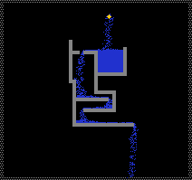
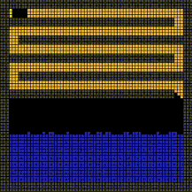

# Liquids液体

具有流动性，受重力影响。水、油、酸、熔融金属等各有独特化学交互。

本分类共 **22** 个元素。

---

## 快速参考总览表

| 元素 | Type | 内部标识 | 颜色 | 密度(相对) | 粘度 | 导热率 | 沸点(°C) | 凝固点(°C) | 导电 | 核心特性 |
|------|------|----------|------|-----------|------|--------|-----------|------------|------|----------|
| WATR | 2 | PT_WATR | #2030D0 | 中(1.0) | 低 | 29 | 99.85 | 0 | 是(慢) | 万能溶剂，电解 |
| OIL | 3 | PT_OIL | #404010 | 低(0.9) | 中 | 42 | 59.85 | — | 否 | 易燃，低压蒸发 |
| LAVA | 6 | PT_LAVA | #E05010 | 高 | 极高 | 60 | — | Ctype决定 | 视情况 | 万能熔融物，冶炼 |
| ACID | 21 | PT_ACID | #ED55FF | 中 | 低 | 34 | — | — | 否 | 腐蚀几乎所有物质 |
| BUBW | 25 | PT_CBNW | #2030D0 | 低 | 极低 | 29 | 99.85 | 0 | 是 | 释放CO2，粉末触发爆炸 |
| DSTW | 25 | PT_DSTW | #1020C0 | 中(1.0) | 低 | 23 | 99.85 | 0 | 否(绝缘) | 纯水，不导电 |
| SLTW | 27 | PT_SLTW | #4050F0 | 中高(1.1) | 低 | 75 | 109.85 | -21.1 | 是(快) | 盐水，高速导电 |
| MWAX | 34 | PT_MWAX | #E0E0AA | 低 | 中高 | 44 | 399.85(燃) | 44.85 | 否 | 蜡油，热致燃 |
| DESL | 58 | PT_DESL | #440000 | 低(0.85) | 低 | 42 | 61.85(燃) | — | 否 | 柴油，压力自燃 |
| GLOW | 66 | PT_GLOW | 多色变化 | 中 | 低 | 44 | — | — | 否 | 荧光液，状态变色 |
| LN2 | 95 | PT_LNTG | #80A0DF | 极低 | 极低 | 70 | -196.15(消失) | -210.15 | 否 | 液氮，接触消失制冷 |
| LOXY | 96 | PT_LO2 | #80A0EF | 中 | 极低 | 70 | -183.05 | — | 否 | 液氧，点燃生等离子体 |
| FRZW | 101 | PT_FRZW | #1020C0 | 中 | 中 | 29 | — | -220.15 | 是 | 寒水，自我降温至0K |
| BIZR | 103 | PT_BIZR | #00FF77 | — | 中 | 29 | 400(→BIZS) | 100(→BIZG) | 否 | 反物理液体，颜色感染 |
| PSTE | 111 | PT_PSTE | #AA99AA | 中高 | 高 | 29 | 473.85(→BRCK) | — | 否 | 浆糊，压力硬化 |
| GEL | 142 | PT_GEL | 透明→深色(吸水) | 中 | 高(含水降低) | 29 | — | — | 否 | 胶体，吸水深色 |
| SOAP | 148 | PT_SOAP | #F5F5DC | 低 | 低 | 29 | — | -25 | 否 | 肥皂，治愈病毒 |
| MERC | 151 | PT_MERC | #736B6D | 极高(最重) | 低 | 251 | —(不蒸发) | — | 是 | 水银，体积热胀 |
| VIRS | 173 | PT_VIRS | #FE11F6 | 中 | 中 | 251 | 399.85(→VRSG) | 31.85(→VRSS) | 否 | 病毒，接触感染 |
| RFGL | 183 | PT_RFGL | #84C2CF | 中 | 低 | 3 | 低压(→RFRG) | — | 否 | 液态制冷剂 |
| RSST | 191 | PT_RSST | #F95B49 | 中 | 低 | 55 | — | — | 否 | 光刻胶，PHOT固化 |
| BASE | 193 | PT_BASE | #90D5FF | 中 | 低 | 31 | — | — | 否 | 碱液，中和酸 |

---

## 目录

- [WATR Type:2](#watr) — 水,能导电
- [OIL Type:3](#oil) — 石油,易燃,较低压力/加热下会变成石油气
- [LAVA Type:6](#lava) — 岩浆,冷却后变成固体,所有熔融物都是一个样子,区别在于其Ctype
- [ACID Type:21](#acid) — 酸,可以腐蚀几乎所有物质
- [BUBW Type:25](#bubw) — 苏打水,缓慢释放CO2
- [DSTW Type:25](#dstw) — 蒸馏水,不导电的理论纯水
- [SLTW Type:27](#sltw) — 盐水,SALT+WATR的产物能更快的导电(比WATR快),具有更高沸点和更低的凝固点
- [MWAX Type:34](#mwax) — 蜡油,融化的蜡,可以燃烧,45℃时凝固成蜡
- [DESL Type:58](#desl) — 柴油,温度达到燃点或压力超过极限时自燃
- [GLOW Type:66](#glow) — 荧光液,在压力下发光
- [LN2 Type:95](#ln2) — 液氮,遇到比它热的物质后会消失并产生压力
- [LOXY Type:96](#loxy) — 液氧,点燃时产生等离子体,升温时转变成氧气
- [FRZW Type:101](#frzw) — 寒水,寒尘(FRZZ)溶于水形成,能自身不断降温直到绝对零度,同时将更多的水变成寒水
- [BIZR Type:103](#bizr) — 奇异液体,与一般物理规律相反的液体,会把碰到的物质染成自身颜色
- [PSTE Type:111](#pste) — 浆糊,胶体,在压力下变硬,高温下变成砖块
- [GEL Type:142](#gel) — 胶体,吸收水分之后颜色会变深,变得不那么粘稠而且导热系数会增加
- [SOAP Type:148](#soap) — 肥皂,0.5P时产生肥皂泡可以洗去染色肥皂泡在-25℃/248.15k时会凝固
- [MERC Type:151](#merc) — 水银,体积随温度变化,可以导电
- [VIRS Type:173](#virs) — 病毒,会将其碰触到的所有物质变成VIRS
- [RFGL Type:183](#rfgl) — 液态制冷剂
- [RSST Type:191](#rsst) — 光刻胶,遇PHOT固化,会被ELEC和SPRK破坏
- [BASE Type:193](#base) — 腐蚀性液体,腐蚀导电固体,会中和酸

---

## 密度与粘度对比

### 液体密度排序（从重到轻）

密度决定了液体的沉降/上浮行为——密度高的液体下沉到底部，密度低的液体浮在顶部。

| 排名 | 元素 | 相对密度 | 密度表现 | 特性说明 |
|------|------|---------|---------|----------|
| 1 | MERC | 极高 | ~13.5 | 全游戏最重液体，可让DUST浮起 |
| 2 | LAVA | 高 | ~3.0 | 熔融岩石/金属密度 |
| 3 | SLTW | 中高 | ~1.1 | 盐水比纯水略重 |
| 4 | WATR/DSTW | 中 | ~1.0 | 基准密度(水=1.0) |
| 5 | ACID | 中 | ~1.0 | 与水相近 |
| 6 | PSTE | 中高 | ~1.2 | 浆糊略重于水 |
| 7 | GEL | 中 | ~1.0 | 吸水后密度变化 |
| 8 | BUBW | 低 | ~0.9 | 含气液体较轻 |
| 9 | OIL | 低 | ~0.9 | 油浮于水上 |
| 10 | DESL | 低 | ~0.85 | 柴油轻于水 |
| 11 | MWAX | 低 | ~0.9 | 蜡油浮于水 |
| 12 | LN2 | 极低 | ~0.8 | 液氮极轻蒸发快 |
| 13 | LOXY | 中 | ~1.1 | 液氧略重于水 |

### 粘度排序（从浓稠到稀薄）

粘度影响液体的流动速度——高粘度液体流动缓慢，低粘度液体快速扩散。

| 排名 | 元素 | 粘度 | 流动表现 |
|------|------|------|---------|
| 1 | LAVA | 极高 | 极其缓慢，几乎不流动 |
| 2 | PSTE | 高 | 浓稠浆糊状 |
| 3 | GEL | 高(含水后降低) | 初始浓稠→吸水变稀 |
| 4 | MWAX | 中高 | 融蜡的粘稠感 |
| 5 | FRZW | 中 | 超冷水的粘滞性 |
| 6 | OIL | 中 | 油类流动性 |
| 7 | VIRS | 中 | 病毒液体流动性 |
| 8 | WATR/DSTW | 低 | 自由流动 |
| 9 | SLTW | 低 | 盐水自由流动 |
| 10 | ACID | 低 | 酸自由渗透 |
| 11 | DESL | 低 | 柴油流动性好 |
| 12 | SOAP | 低 | 肥皂水流动性 |
| 13 | BUBW | 极低 | 含CO2气泡易于流动 |
| 14 | LN2/LOXY | 极低 | 极低温液体近乎无粘 |

---

## 混合规则

TPT中液体混合遵循以下核心规则：

### 1. 密度分层规则
- 密度高的液体自动下沉，密度低的液体上浮
- 例：OIL(轻)→浮于WATR(中)→SLTW(重)沉底，形成三层结构

### 2. 反应扩散规则
- 两液体接触时触发反应的概率和速度取决于各自的反应参数
- 有些反应是双向的(如WATR+DSTW→2×WATR)，有些是单向的(如FRZW+WATR→2×FRZW)
- 大多数液体-液体反应为1/50~1/2000概率每帧

### 3. 互溶与排异

| 液体A | 液体B | 结果 | 类型 |
|-------|-------|------|------|
| WATR | DSTW | WATR×2 | 缓慢互溶(中速) |
| WATR | SLTW | SLTW×2 | 缓慢互溶(中速) |
| WATR | FRZW | FRZW×2 | 中速传播(1/14) |
| WATR | GLOW | DEUT | WATR消耗GLOW(1/400) |
| DSTW | SLTW | SLTW×2 | 极慢(1/2000) |
| ACID | BASE | 2×SLTW | 酸碱中和 |
| ACID | WTRV | CAUS | 缓慢(1/250) |
| FRZW | WATR | FRZW×2 | 快速寒化传播 |
| GEL | PSTE | CLST(固体) | 脱水沉淀 |
| GEL | SLTW | SALT析出 | 盐析效应 |
| GEL | GLOW | RSST | GLOW被消灭 |
| SOAP | VIRS | 治愈 | 病毒感染解除 |
| BASE | OIL | SOAP | 皂化反应(life≥70) |
| HYGN+DESL(>8P) | — | WATR+OIL | 极困难(>5P DESL自燃) |
| BUBW | DSTW/WATR | WATR | BUBW被污染 |
| LN2 | 任何较热液体 | LN2消失 | 瞬间汽化制冷 |

### 4. 混合策略总结

- **渐进转化**：WATR被DSTW/SLTW渐近转化→适合制作浓度梯度
- **连锁反应**：FRZW接触WATR快速蔓延→适合快速制冷/冰化系统
- **催化消耗**：GLOW+WATR→DEUT消耗GLOW→用于重水生产
- **中和终止**：ACID+BASE→SLTW终止腐蚀→安全处理废酸
- **相变沉淀**：GEL+PSTE→CLST固体沉淀→液体中提取固体

---

## 蒸发与冷凝

### 蒸发表（液体→气体）

| 液体 | 蒸发/沸腾温度(°C) | 产物 | 条件 | 压力影响 |
|------|-------------------|------|------|----------|
| WATR | 99.85+2×P | WTRV | 常压100°C | 压力每+1P沸点+2°C |
| SLTW | 109.85+2×P | WTRV+SALT | 常压110°C | 压力每+1P沸点+2°C |
| OIL | 59.85 | GAS | 低压≤-166.5P任何温度都可蒸发 | 负压加速 |
| DESL | 61.85 | FIRE(自燃) | 到达燃点自燃 | >5P直接引爆 |
| MWAX | 399.85(燃点) | FIRE | 高温点燃 | — |
| LN2 | -196.15 | NONE(消失) | >-196°C消失无残留 | 带走大量热量 |
| LOXY | -183.05 | OXYG | 升温转氧气 | — |
| BUBW | 99.85 | WTRV+CO2 | 逐步释放CO2 | >3P停止释放 |
| VIRS | 399.85 | VRSG | 液→气病毒 | — |
| RFGL | <2P | RFRG | 低压时气化 | 压力<2P |

### 冷凝表（气体→液体）

| 气体 | 冷凝温度(°C) | 产物 | 条件 |
|------|-------------|------|------|
| WTRV | <99.85 | DSTW | 常压100°C以下(注意:冷凝产DSTW非WATR) |
| WTRV(快速) | <-30 | RIME | 快速冷却凝华时先变霜(固) |
| CO2 | <-78.5 | DRIC(固) | CO2直接凝华为固体干冰 |
| GAS | <59.85 | OIL | 石油气冷凝回油 |
| LN2(消失后实际) | <-210.15 | NICE(固) | 极低温下液氮变为氮冰 |
| RFRG | >2P | RFGL | 加压液化制冷剂 |
| CAUS | 低温 | ACID? | 酸性气体可冷凝(非直接) |

### 冷凝与蒸发链实例

```
水循环全路径:
WATR(液) ──加热99.85°C──→ WTRV(气) ──冷凝<99.85°C──→ DSTW(液) ──接触WATR──→ WATR
                                                                  ──接触SALT──→ SLTW

氮循环:
NICE(固) ──加热-210°C──→ LN2(液) ──加热-196°C──→ NONE(消失+制冷)
LN2+极冷──→ NICE(固, 重新冻结)

油循环:
OIL(液) ──加热59.85°C──→ GAS(气) ──冷凝<59.85°C──→ OIL(液)
OIL+NEUT持续照射──→ GAS(气) ──不可逆转化

制冷剂循环:
RFGL(液) ──低压<2P──→ RFRG(气) ──高压>2P──→ RFGL(液) (吸收/释放热量)
```

---

###### WATR Type:2



```
┌─────────────────────────────────────────────────────┐
│  属性         │  值                                  │
│───────────────┼──────────────────────────────────────│
│  内部标识     │  PT_WATR                             │
│  颜色         │  #2030D0 (深蓝)                       │
│  分类         │  TYPE_LIQUID                         │
│  密度(相对)   │  1.0 (基准)                          │
│  粘度         │  低 (自由流动)                        │
│  硬度(酸抗)   │  20                                  │
│  导热率       │  29                                  │
│  初始温度     │  22.00°C / 295.15 K                   │
│  沸点         │  99.85 + 2×P °C                       │
│  凝固点       │  0°C (≤-0.01°C + ≥0.8P → SNOW)       │
│  导电性       │  是 (最慢导体, SPRK逐格传递)           │
│  电解产物     │  HYGN + OXYG (需通电)                  │
└─────────────────────────────────────────────────────┘
```

**深度机制：** WATR(水)是TPT中最核心的溶剂和反应介质。其导电性极慢——电脉冲在水中逐格传播，是所有导体中最慢的。蒸馏水(DSTW)与大多数物质接触后会自动转化为WATR(被"污染")，这模拟了现实中纯水极易吸收离子变为导体的特性。

水的电解由ELEC(电子)触发而非普通SPRK——电子在水中发生电解反应：1/3概率产生O2，2/3概率产生H2。这是直接的电子-水反应，不经过电极。

WATR+NEUT(特定速度范围)→DSTW+减速中子的机制模拟了中子在水中的慢化过程——水作为中子慢化剂减速中子，同时自身转化为重水(DSTW)。

压力影响沸点：沸点=99.85+2×P(°C)，高压下需要更高温度才沸腾——符合真实物理。

**参数详解：**
- **Life值：** 不被主动使用
- **Tmp值：** 不被主动使用
- **Ctype值：** 不被主动使用

**反应链完整版：**

内在反应(温度/压力触发):
```
WATR[≥99.86+2P °C] → WTRV + 0.50压力 [沸腾]
WATR[≤-0.01°C, ≥0.80P] → SNOW [加压结冰成雪]
WATR[≤-0.01°C, ≤0.79P] → ICE [常压结冰]
```

生成WATR的反应:
```
BOYL + OXYG → WATR [氢气燃烧]
HYGH(≤0.79P) + DESL(≤0.50P) → WATR + OIL [高压反应]
BUBW(经时间) → WATR + CO2(Ctype=STNE) [苏打水脱气]
SPNG(Life=n) → WATR + SPNG(Life=n-1) [海绵排水]
RIME(≥0°C) → WATR [霜融化]
```

电反应:
```
WATR + SPRK → WATR + SPRK传播 [慢速导电]
WATR + ELEC → HYGN(2/3) + OXYG(1/3) [电解]
```

气液反应:
```
WATR + CO2 → BUBW [碳酸化]
WATR + BOYL → FOG [沸腾蒸气与雾]
```

液液反应:
```
WATR + DSTW → 2×WATR (中速) [溶解纯水]
WATR + SLTW → 2×SLTW (中速) [盐水稀释]
WATR + GLOW → DEUT (渐进, GLOW消耗) [重水合成]
WATR(≤100.04°C) + GEL(Tmp=0) → GEL(Tmp=1) [胶体吸水]
WATR + FRZW → 2×FRZW (中速) [被寒水同化]
```

固液反应:
```
WATR + SALT → SLTW [盐溶解]
WATR + FRZZ → FRZW [寒尘溶解, WATR越热越慢]
WATR + CLST → PSTE [粘土和泥]
WATR + PLNT → 2×PLNT [植物繁殖]
WATR + IRON → BMTL(Tmp=1) [铁生锈]
WATR(≤100.04°C) + SPNG(Life<50) → SPNG(Life+1) [海绵吸水]
```

辐射反应:
```
WATR + NEUT(特定速度) → DSTW + NEUT(减速) [中子慢化]
WATR + ELEC → HYGN + ELEC(反射) + OXYG [电解]
```

**实用场景：**
- **万能溶剂平台：** 利用WATR与大多数物质的反应构建复杂化学系统
- **中子慢化池：** 利用水减速中子的特性制作核反应堆慢化层
- **电解制氢站：** ELEC通过WATR批量制造HYGN+OXYG
- **植物农场水源：** 持续供水给PLNT自动繁殖系统
- **FRZW冰化快启：** WATR→FRZW连锁反应制作快速制冷装置
- **SLTW/重水转换：** 利用不同反应路径将WATR转化为SLTW或DEUT

*源码：WATR.cpp*

---

###### OIL Type:3


```
┌─────────────────────────────────────────────────────┐
│  属性         │  值                                  │
│───────────────┼──────────────────────────────────────│
│  内部标识     │  PT_OIL                              │
│  颜色         │  #404010 (暗黄褐)                      │
│  分类         │  TYPE_LIQUID                         │
│  密度(相对)   │  ~0.9 (浮于水上)                      │
│  粘度         │  中                                  │
│  硬度(酸抗)   │  低                                  │
│  导热率       │  42                                  │
│  初始温度     │  22.00°C / 295.15 K                   │
│  沸点         │  59.85°C / 333 K → GAS               │
│  低压蒸发     │  ≤-166.51 P 任何温度→GAS+0.5P         │
│  燃点         │  高温可引燃为FIRE                      │
│  NEUT转化     │  持续中子照射→GAS                      │
└─────────────────────────────────────────────────────┘
```

**深度机制：** OIL(石油)具有"低压自蒸发"的特殊属性——当压力≤-166.51 P时，无论温度如何，油都会自发蒸发为GAS(石油气)，并在蒸发位置产生+0.50 P压力。这是OIL最独特的物理行为，低压触发蒸发模拟了真空环境下的液体沸腾。

中子(NEUT)持续照射可将OIL转化为GAS，这是辐射诱导的裂化反应模拟——重烃分子被中子打断为轻烃气体。

密度低于水(~0.9)，天然浮于WATR上方，常用于制作油水分离演示。

**参数详解：**
- **Life值：** 不被主动使用
- **Tmp值：** 不被主动使用
- **Ctype值：** 不被主动使用

**反应链：**
```
OIL + 高温(>333K) → GAS [热蒸发]
OIL + 低压(≤-166.51P) → GAS + 0.50P(在蒸发位置) [真空蒸发,任何温度]
OIL + NEUT(持续) → GAS [辐射裂化]
OIL + FIRE/高温 → FIRE [燃烧]
BASE(life≥70) + OIL → SOAP [皂化反应]
OIL + WATR → 互不相溶, 油浮于水上层 [密度分层]
```

**实用场景：**
- **石油气发生器：** 加热OIL或在真空中生产GAS燃料
- **油水分离展示：** 利用密度差呈现天然分层
- **中子转化工厂：** 用NEUT持续照射OIL大批量生产GAS
- **液体燃料库：** OIL比GAS更致密，储存更高效
- **皂化反应器：** BASE+OIL生产SOAP用于病毒清洁

*源码：OIL.cpp*

---

###### LAVA Type:6


```
┌─────────────────────────────────────────────────────┐
│  属性         │  值                                  │
│───────────────┼──────────────────────────────────────│
│  内部标识     │  PT_LAVA                             │
│  颜色         │  #E05010 (熔岩橙红) — 所有LAVA外观相同  │
│  分类         │  TYPE_LIQUID                         │
│  密度(相对)   │  ~3.0 (高密度熔融物)                   │
│  粘度         │  极高                                │
│  硬度(酸抗)   │  0 (酸免疫)                           │
│  导热率       │  60                                  │
│  初始温度     │  1522.00°C / 1795.15 K                │
│  Ctype机制    │  决定冷却后固体类型 (核心机制)          │
│  冷却行为     │  低于熔点 → Ctype对应固体               │
└─────────────────────────────────────────────────────┘
```

**深度机制：** LAVA是TPT的统一熔融系统——所有可熔融物质熔化后都变成LAVA，但通过Ctype值区分其"前身"。例如LAVA(IRON)冷却后恢复为IRON，LAVA(STNE)冷却后恢复为STNE。HUD显示为"Molten XXXX"表示未生成的熔岩类型。

LAVA是唯一能进行"熔融反应"的介质——多种高温合成反应需要以LAVA形式存在。最重要的冶炼反应包括：
- 炼铁：LAVA(IRON)+COAL→LAVA(METL)
- 炼硅：LAVA(STNE)+COAL→LAVA(SLCN)
- 陶瓷合成：LAVA(QRTZ)+LAVA(CLST)→LAVA(CRMC)
- 半导体合成：LAVA(SLCN)+LAVA(METL/BMTL)→LAVA(NSCN)+LAVA(PSCN)
- 振金合成：LAVA(TTAN)+EXOT→LAVA(VIBR)

LAVA还可作为核反应副产物（如PLUT裂变产生LAVA(PLUT)或URAN）。

**参数详解：**
- **Ctype值：** 决定冷却后产物的元素Type。这是LAVA最关键参数
- **Life值：** 不被主动使用
- **Tmp值：** 不被主动使用

**反应链：**
```
矿石冶炼:
LAVA(STNE) + COAL/BCOL → LAVA(SLCN) [1/60, 硅冶炼]
LAVA(IRON) + COAL/BCOL → LAVA(METL) [1/500, 炼铁]
LAVA(QRTZ) + LAVA(CLST) → 2×LAVA(CRMC) [高温陶瓷合成]
LAVA(SLCN) + O2 → LAVA(SAND/CLST/STNE随机) [硅氧化]
LAVA(SLCN) + LAVA(METL/BMTL) → LAVA(NSCN)+LAVA(PSCN) [半导体合成]

矿物分选(ROCK熔融):
LAVA(ROCK) + 25-50P → BRMT(50%)/CNCT(50%)
LAVA(ROCK) + 50-73P → QRTZ(87.5%)/GOLD(12.5%)
LAVA(ROCK) + 75-100P → TTAN(20%)/IRON(80%)
LAVA(ROCK)(≥100P,≥4726.85°C) → URAN(20%)/PLUT(16%)/TUNG(64%)

核反应副产:
PLUT裂变 → LAVA(PLUT)或URAN
9000°C+250P OXYG → LAVA(BMTL) [聚变末步]

铝热剂:
FIRE/PLSM/LAVA + THRM → LAVA(BMTL或THRM) [3500°C]
```

**实用场景：**
- **冶炼工厂：** 将金属矿石熔化为LAVA后用COAL还原提取纯金属
- **半导体生产线：** SLCN熔融+MELT→NSCN+PSCN制造半导体材料
- **陶瓷合成站：** QRTZ熔融+CLST熔融→CRMC陶瓷
- **矿物提炼厂：** 加压熔融ROCK提取稀有矿物(GOLD/TTAN/URAN)
- **铝热剂高温源：** THRM燃烧产生3500°C超高温用于特种冶炼
- **金矿脉采集：** >50P下ROCK+金→金矿脉提纯

*源码：LAVA.cpp*

---

###### ACID Type:21



```
┌─────────────────────────────────────────────────────┐
│  属性         │  值                                  │
│───────────────┼──────────────────────────────────────│
│  内部标识     │  PT_ACID                             │
│  颜色         │  #ED55FF (亮紫)                       │
│  分类         │  TYPE_LIQUID                         │
│  密度(相对)   │  ~1.0                                │
│  粘度         │  低 (自由渗透)                        │
│  导热率       │  34                                  │
│  初始温度     │  22.00°C / 295.15 K                   │
│  Life机制     │  初始75, 每反应-1, ≤50消耗, 代表浓度    │
│  最大腐蚀量   │  25个粒子 (Life=75, 消耗25次=50阈值)   │
│  免疫列表     │  LAVA, LN2, 放射性元素, 特殊元素,       │
│              │  爆炸物, GLAS*, QRTZ, PQRT, DMND,      │
│              │  GOLD, CRMC                            │
│  放热条件     │  硬度1-60 → 升温(60-硬度)×7°C         │
│  可燃         │  是 (明火/电/LAVA点燃→CAUS)            │
└─────────────────────────────────────────────────────┘
```

**深度机制：** ACID(酸)的腐蚀基于"Life值"系统——每个酸粒子初始Life=75，代表浓度。每腐蚀一个粒子消耗1点Life。当Life≤50时酸粒子被消耗(消失)。每个酸粒子可腐蚀25个其他粒子(Life从75降至50)。相互接触的酸粒子会交换Life值(模拟浓度扩散)。

腐蚀概率取决于目标硬度：概率=硬度/1000。硬度0为免疫，硬度1-60放热，硬度越高反应越慢。放热公式：温度上升=(60-硬度)×7。例如水(WATR硬度=20)：升温=(60-20)×7=280°C。

特殊材料处理：
- 爆炸物(PLEX/NITR/GUNP/RBDM/LRBD)→转化为2×FIRE(life=4)
- WTRV→CAUS腐蚀性气体(1/250)
- LITH→H2氢气(腐蚀锂产氢，非销毁)
- GLAS在实验室条件下免疫(特殊保护)
- CLNE/PCLN免疫(防止复制体被破坏)

ISOZ生成：ACID+NEUT→ISOZ(同位素Z, 1/20)

**参数详解：**
- **Life值：** 酸浓度。初始75, 每反应-1, ≤50时粒子消失。接触的酸粒子间扩散Life值
- **Tmp值：** 不被主动使用
- **Ctype值：** 不被主动使用

**反应链：**
```
通用腐蚀:
ACID + 目标(硬度>0) → 概率腐蚀消灭 [概率=硬度/1000]
ACID + 目标(硬度1-60) → 放热 [升温=(60-硬度)×7°C]
ACID(每腐蚀) → Life-1 [消耗浓度, Life≤50→消失]

特殊处理:
ACID + PLEX/NITR/GUNP/RBDM/LRBD → 2×FIRE(life=4) [爆炸物引爆]
ACID + WTRV → CAUS (1/250) [酸气生成]
ACID + LITH → H2 [腐蚀锂产氢]
ACID + NEUT → ISOZ (1/20) [同位素Z合成]
ACID + BASE → 2×SLTW [酸碱中和]

点燃:
ACID + FIRE/SPRK/LAVA → CAUS(可燃, 生成腐蚀性气体)
```

**实用场景：**
- **选择性蚀刻：** 利用不同材料的硬度差异进行选择性腐蚀
- **ISOZ合成：** 用NEUT照射ACID制造同位素Z
- **化学加热器：** 利用ACID腐蚀低硬度物质时的大量放热
- **废物处理：** 用ACID销毁不需要的物质
- **爆炸物引爆器：** 用酸接触爆炸物做延时引爆
- **酸气发生器：** ACID+WTRV→CAUS大量产酸气

*源码：ACID.cpp*

---

###### BUBW Type:25


```
┌─────────────────────────────────────────────────────┐
│  属性         │  值                                  │
│───────────────┼──────────────────────────────────────│
│  内部标识     │  PT_CBNW                             │
│  颜色         │  #2030D0 (与水相同)                    │
│  分类         │  TYPE_LIQUID                         │
│  密度(相对)   │  ~0.9 (含气较轻)                      │
│  粘度         │  极低 (含CO2气泡)                     │
│  导热率       │  29                                  │
│  初始温度     │  20.00°C / 293.15 K                   │
│  沸点         │  99.85°C / 373 K                      │
│  凝固点       │  0°C / 273.15 K                       │
│  CO2释放率    │  1/4000 (每帧) 或接触粉末/固体时加速    │
│  压力上限     │  >3 P 停止释放CO2                      │
│  触粉爆炸     │  接触任何粉末→立即爆炸释放0.2P/粒子     │
│  低压爆炸     │  <-5 P → 立即爆炸释放0.2P/粒子         │
└─────────────────────────────────────────────────────┘
```

**深度机制：** BUBW(苏打水/碳酸水)是溶解了CO2的水。其CO2释放有两种模式：(1)缓慢释放——每帧1/4000概率自然释放，释放0.5 P压力；(2)触发爆炸——接触任何粉末或低于-5 P时立即爆炸，每个粒子释放0.2 P。

压力反馈：>3 P时CO2停止产生——密闭容器中碳酸达到平衡。这是亨利定律的简化模拟：压力越高，CO2越难析出。

接触固体(非DMND/GLAS)时加速释放CO2，每接触一个固体有1/40000概率释放CO2+0.2P。

所有BUBW产生的CO2被标记Ctype=5以区别于其他来源的CO2。

**参数详解：**
- **Life值：** 不被主动使用
- **Tmp值：** 不被主动使用
- **Ctype值：** 不被主动使用（产生的CO2标记Ctype=5）

**反应链：**
```
BUBW(缓慢) → BUBW + CO2(Ctype=5) + 0.5P [1/4000/帧, 自然脱气]
BUBW + 任何粉末 → 爆炸: BUBW变为WATR+CO2 + 0.2P/粒子 [瞬间爆炸]
BUBW + 低压(<-5P) → 爆炸: WATR+CO2 + 0.2P/粒子 [真空爆炸]
BUBW + 固体(非DMND/GLAS) → CO2释放加速 [1/40000, +0.2P]
BUBW + 压力(>3P) → CO2停止释放 [平衡压制]
BUBW + WATR/DSTW → WATR [被正常水污染]
BUBW + SPNG → SPNG(Life+1) + CO2 [海绵吸水+脱气]
```

**实用场景：**
- **CO2发生器：** BUBW缓慢释放CO2供应PLNT光合作用
- **压力式发动机：** 利用BUBW脱气产生的压力驱动活塞/涡轮
- **触粉触发器：** 粉末接触BUBW引发爆炸作为触发器或陷阱
- **碳酸饮料模拟：** 开瓶(低压)后大量气泡的真实模拟
- **密闭加压容器：** >3P自动停止避免过度增压

*源码：CBNW.cpp*

---

###### DSTW Type:25


```
┌─────────────────────────────────────────────────────┐
│  属性         │  值                                  │
│───────────────┼──────────────────────────────────────│
│  内部标识     │  PT_DSTW                             │
│  颜色         │  #1020C0 (比WATR更暗的蓝)              │
│  分类         │  TYPE_LIQUID                         │
│  密度(相对)   │  ~1.0                                │
│  粘度         │  低                                  │
│  导热率       │  23                                  │
│  初始温度     │  22.00°C / 295.15 K                   │
│  沸点         │  99.85°C / 373 K                      │
│  凝固点       │  0°C / 273.15 K                       │
│  导电性       │  否 (完全绝缘)                        │
│  污染性       │  接触WATR/BUBW/SLTW变WATR              │
│  PLNT兼容     │  否 (植物不能吸收)                     │
│  IRON锈蚀     │  否 (不会导致铁生锈)                   │
└─────────────────────────────────────────────────────┘
```

**深度机制：** DSTW(蒸馏水)是理论上纯净的H2O。其"绝缘性"是区别于WATR的核心特征——纯水不导电。但DSTW极易被污染：接触WATR以1/100概率变WATR，接触BUBW也会被污染。

电解行为与WATR不同：DSTW通电时发生电解分离为HHO(氢氧混合气)而非简单生成H2和O2。

DSTW+SMKE(双方40~60°C)→BASE(碱液, 1/100)模拟了现实中烟(含CO2/SO2等)溶于水生成酸性/碱性溶液的过程。

DSTW是中子慢化剂WATR+NEUT→DSTW的产物，代表中子慢化过程中水的"重水化"。

**参数详解：**
- **Life值：** 不被主动使用
- **Tmp值：** 不被主动使用
- **Ctype值：** 不被主动使用

**反应链：**
```
DSTW + WATR → 2×WATR (1/100, 被污染)
DSTW + SLTW → 2×SLTW (1/2000, 极慢)
DSTW + SALT → 2×SLTW (1/50, 溶盐)
DSTW + BUBW → WATR (被污染)
DSTW + SMKE(40-60°C双方) → BASE (1/100, 烟溶生成碱液)
DSTW + RBDM/LRBD → FIRE (1/100, 铷遇水爆炸)
DSTW(通电) → HHO [电解, 与WATR电解产物不同]
DSTW + PLNT → 无反应 (植物不能吸收纯水)
DSTW + IRON → 无反应 (不导致生锈)
DSTW + NEUT → DSTW不影响中子
```

**实用场景：**
- **绝缘冷却液：** 在电气设备中用作不导电冷却液
- **纯水基准：** 化学实验室中的纯溶剂参考
- **BASE生产：** DSTW+SMKE制造碱液
- **防锈液路：** 用DSTW替代WATR保护铁管道
- **中子束流介质：** 放置在中子路径不干扰实验

*源码：DSTW.cpp*

---

###### SLTW Type:27


```
┌─────────────────────────────────────────────────────┐
│  属性         │  值                                  │
│───────────────┼──────────────────────────────────────│
│  内部标识     │  PT_SLTW                             │
│  颜色         │  #4050F0 (蓝紫)                       │
│  分类         │  TYPE_LIQUID                         │
│  密度(相对)   │  ~1.1 (略重于水)                      │
│  粘度         │  低                                  │
│  导热率       │  75                                  │
│  初始温度     │  22.00°C / 295.15 K                   │
│  沸点         │  109.85 + 2×P °C → WTRV+SALT         │
│  凝固点       │  -21.1°C / 252.05 K (低于纯水)        │
│  导电性       │  是 (比WATR更快)                      │
│  PLNT影响     │  杀死植物(1/40)                       │
│  QRTZ影响     │  促进石英生长                          │
└─────────────────────────────────────────────────────┘
```

**深度机制：** SLTW(盐水)是溶解了SALT(盐)的水。相较于纯水(WATR)，它有更高的沸点(109.85°C vs 99.85°C)和更低的凝固点(-21.1°C vs 0°C)——精确模拟了现实盐水的冰点降低和沸点升高。沸点同样受压力影响(+2°C/P)。

导电性比WATR更快——盐水中离子浓度高，电导率上升。

沸腾产物为WTRV(水蒸气)+SALT(盐)——水分蒸发后盐结晶析出，模拟晒盐过程。

对PLNT致命(1/40概率杀死)——模拟了盐碱地对植物的危害，现实生理学中高渗环境导致植物脱水。

对QRTZ(石英)有促进生长作用——吸收SLTW缓慢扩大QRTZ晶体。

**参数详解：**
- **Life值：** 不被主动使用
- **Tmp值：** 不被主动使用
- **Ctype值：** 不被主动使用

**反应链：**
```
SLTW + 高温(>109.85+2P°C) → WTRV + SALT [蒸发结晶]
SLTW + 低温(≤-20.01°C) → ICE(Ctype=SLTW) [结冰]
SLTW(≤-20.01°C, ≥0.8P) → SNOW [加压结雪]
SLTW + WATR → 2×SLTW (中速) [稀释同化]
SLTW + DSTW → 2×SLTW (1/2000) [极慢稀释]
SLTW + SALT → 2×SLTW (1/2000) [继续溶解]
SLTW + PLNT → SLTW (1/40) [杀死植物]
SLTW + QRTZ → 晶体生长 [吸收SLTW,扩大石英]
SLTW + RBDM/LRBD → FIRE (1/100) [铷遇盐水]
SLTW + SPNG → SPNG(Life+1) [海绵吸水]
SLTW(导电) → SPRK传播(比WATR快)
```

**实用场景：**
- **高速液体导线：** 比WATR更快的导电速度
- **低温液路：** 凝固点-21°C适合低温环境
- **晒盐工厂：** 加热SLTW蒸发回收SALT
- **QRTZ晶体培养：** 用SLTW喂养QRTZ大规模生长
- **除草剂：** 利用SLTW杀死PLNT的机制清除不需要的植物
- **防冻冷却液：** 寒冷环境中替代WATR防止管道冻结

*源码：SLTW.cpp*

---

###### MWAX Type:34


```
┌─────────────────────────────────────────────────────┐
│  属性         │  值                                  │
│───────────────┼──────────────────────────────────────│
│  内部标识     │  PT_MWAX                             │
│  颜色         │  #E0E0AA (淡黄, 比固态WAX略浅)         │
│  分类         │  TYPE_LIQUID                         │
│  密度(相对)   │  ~0.9 (轻于水)                        │
│  粘度         │  中高 (蜡油粘稠)                      │
│  导热率       │  44                                  │
│  初始温度     │  50.00°C / 323.15 K                   │
│  燃点         │  399.85°C / 673 K → FIRE             │
│  凝固点       │  44.85°C / 318 K → WAX               │
│  常温稳定性   │  不稳定 (常温>凝固点,容易自然凝固)      │
└─────────────────────────────────────────────────────┘
```

**深度机制：** MWAX(蜡油)是WAX(蜡)的液态形式。在50°C初始温度下刚好高于凝固点(44.85°C)，因此若不持续加热会在常温下较快凝固。>399.85°C(673K)时直接被引燃。

MWAX不如其他燃料(OIL/DESL)易燃——需要较高温度才引燃，因此在中等温度下较为安全。

**参数详解：**
- **Life值：** 不被主动使用
- **Tmp值：** 不被主动使用
- **Ctype值：** 不被主动使用

**反应链：**
```
MWAX + 低温(<318K) → WAX [凝固]
MWAX + 高温(>673K) → FIRE [点燃]
MWAX + PHOT → WAX(间接, 光子加热后凝固) [光热效应]
```

**实用场景：**
- **蜡烛模拟：** WAX加热→MWAX→FIRE的完整燃烧链
- **固液转换演示：** 44.85°C低熔点易于教学展示
- **安全燃料(中温)：** 在<399°C环境中稳定不燃
- **热控阀门：** MWAX/WAX相变作为温度敏感开关

*源码：MWAX.cpp*

---

###### DESL Type:58


```
┌─────────────────────────────────────────────────────┐
│  属性         │  值                                  │
│───────────────┼──────────────────────────────────────│
│  内部标识     │  PT_DESL                             │
│  颜色         │  #440000 (深红棕)                      │
│  分类         │  TYPE_LIQUID                         │
│  密度(相对)   │  ~0.85 (轻于水/油)                    │
│  粘度         │  低                                  │
│  导热率       │  42                                  │
│  初始温度     │  22.00°C / 295.15 K                   │
│  燃点         │  61.85°C / 335 K → FIRE(自燃)         │
│  压力极限     │  >5 P → FIRE(自燃爆炸)                 │
│  NEUT反应     │  NEUT+DESL → NEUT+GAS [辐射裂化]      │
│  HYGN反应     │  HYGN(>8P)+DESL(≤5P)→WATR+OIL [极难]  │
└─────────────────────────────────────────────────────┘
```

**深度机制：** DESL(柴油)是一种双重敏感的燃料——既对温度敏感(到达61.85°C自燃)，也对压力敏感(>5 P自燃爆炸)。这使DESL成为最难安全储存的燃料之一。

NEUT照射将DESL转化为GAS——模拟了重烃辐射裂化反应。HYGN+DEST在特定条件下(>8P氢 + ≤5P柴油)可发生反应生成WATR+OIL，但条件苛刻(柴油在>5P时先炸)。

与硝化甘油(NITR)性质类似但更稳定——DESL燃烧稳定而非剧烈爆炸。密度(~0.85)轻于水也轻于石油(OIL)。

**参数详解：**
- **Life值：** 不被主动使用
- **Tmp值：** 不被主动使用
- **Ctype值：** 不被主动使用

**反应链：**
```
DESL + 高温(>335K) → FIRE [热自燃]
DESL + 高压(>5P) → FIRE [压力自燃爆炸]
DESL + NEUT → GAS + NEUT(不消耗) [辐射裂化]
HYGN(>8P) + DESL(≤5P) → WATR + OIL [极难达成]
```

**实用场景：**
- **热压双触发：** 利用温度+压力双敏感特性作为安全引爆器
- **辐射裂化器：** NEUT照射DESL生产GAS
- **燃料喷射引擎：** DESL的高能密度适合做推进燃料
- **压力保险丝：** DESL在>5P自燃指示压力超标
- **化学武器(合法)：** 作为难以处理的危险品模拟

*源码：DESL.cpp*

---

###### GLOW Type:66


```
┌─────────────────────────────────────────────────────┐
│  属性         │  值                                  │
│───────────────┼──────────────────────────────────────│
│  内部标识     │  PT_GLOW                             │
│  颜色         │  多色(根据温度/压力/状态动态变化)       │
│  分类         │  TYPE_LIQUID                         │
│  密度(相对)   │  ~1.0                                │
│  粘度         │  低                                  │
│  导热率       │  44                                  │
│  初始温度     │  42.00°C / 315.15 K                   │
│  PHOT反应     │  接触GLOW→光子增殖                      │
│  ELEC反应     │  ELEC→PHOT(仅在GLOW内部)               │
│  WATR反应     │  GLOW+WATR→DEUT(1/400)                │
│  GEL反应      │  GLOW+GEL→RSST (GLOW被消灭)           │
└─────────────────────────────────────────────────────┘
```

**深度机制：** GLOW(荧光液)是TPT中最具视觉魅力的液体——颜色随状态动态变化。颜色映射：

| 颜色 | 触发状态 |
|------|---------|
| 灰色 | 默认/静止 |
| 蓝色 | 粒子运动时 |
| 亮红色 | 高温 |
| 深绿/深蓝 | 低温 |
| 翠绿 | 低压 |
| 黄色 | 高温+高压 |
| 亮粉 | 高温+低压 |
| 深翠绿 | 低温+高压 |
| 深蓝 | 低温+低压 |

光学特性：PHOT(光子)接触GLOW会增殖(光子倍增效应)——类似于激光增益介质。ELEC(电子)在GLOW内部会被转换为PHOT。

化学特性：GLOW+WATR→DEUT(重水, 1/400, GLOW被消灭)。GLOW+GEL→RSST(光刻胶, GLOW被消灭)。

**参数详解：**
- **Life值：** 不被主动使用
- **Tmp值：** 不被主动使用
- **Ctype值：** 不被主动使用

**反应链：**
```
GLOW + PHOT → PHOT增殖 [光子倍增, 光放大]
GLOW + ELEC(内部) → PHOT [电子→光子转换]
GLOW + WATR → DEUT (1/400, GLOW消耗) [重水合成]
GLOW + GEL → RSST (GLOW消耗) [光刻胶合成]
```

**实用场景：**
- **重水(D2O)工厂：** GLOW+WATR→DEUT批量生产重水
- **光放大器：** PHOT通过GLOW增殖构建光路增益
- **电子-光子转换器：** ELEC进入GLOW变成PHOT——电转光接口
- **状态显示器：** 利用颜色变化直观显示温度/压力分布
- **光刻胶生产：** GLOW+GEL→RSST制作光敏材料

*源码：GLOW.cpp*

---

###### LN2 Type:95


```
┌─────────────────────────────────────────────────────┐
│  属性         │  值                                  │
│───────────────┼──────────────────────────────────────│
│  内部标识     │  PT_LNTG                             │
│  颜色         │  #80A0DF (淡蓝)                       │
│  分类         │  TYPE_LIQUID                         │
│  密度(相对)   │  ~0.8 (极轻)                         │
│  粘度         │  极低 (近乎无粘)                      │
│  导热率       │  70                                  │
│  初始温度     │  -205.00°C / 68.15 K                  │
│  沸点(消失)   │  -196.15°C / 77 K → NONE(直接消失)    │
│  凝固点       │  -210.15°C / 63 K → NICE(氮冰)        │
│  冷却机制     │  接触较热物质→自身消失+带走大量热能     │
│  酸免疫       │  是                                  │
└─────────────────────────────────────────────────────┘
```

**深度机制：** LN2(液氮)是TPT中最有效的冷却介质。接触任何温度高于自身(-205°C)的物质时都会"消失"(不产生任何残留)，同时带走大量热能——无残留的蒸发制冷，不留下气体产物，纯粹的热量移除。

沸点(-196.15°C)和凝固点(-210.15°C)之间的液态区间仅14°C，极窄。在绝大多数环境中LN2会瞬间"沸腾消失"。与NICE(氮冰, 凝固点-210.05°C)配合使用构成两段冷却系统。

**参数详解：**
- **Life值：** 不被主动使用
- **Tmp值：** 不被主动使用
- **Ctype值：** 不被主动使用

**反应链：**
```
LN2 + 升温(>77K) → NONE [消失, 无残留制冷]
LN2 + 降温(<63K) → NICE [冻结为氮冰]
LN2 + 任何较热物质 → LN2消失, 目标降温 [接触制冷]
LN2 + ACID → 不反应 [酸免疫]
LN2 + LAVA → 不反应(LAVA对酸免疫) [两者互相免疫]
```

**实用场景：**
- **超低温快速冷却：** 将LN2注入反应堆/热区瞬间降温
- **反应堆紧急停机：** SCRAM系统中用LN2作为终极冷却剂
- **无残留清洁制冷：** 不留下气体/液体残留的纯粹制冷
- **低温实验环境：** 保持接近-196°C的恒温浴
- **热失控阻断：** 在需要紧急冷却的关键位置预置LN2

*源码：LNTG.cpp*

---

###### LOXY Type:96


```
┌─────────────────────────────────────────────────────┐
│  属性         │  值                                  │
│───────────────┼──────────────────────────────────────│
│  内部标识     │  PT_LO2                              │
│  颜色         │  #80A0EF (淡蓝紫)                      │
│  分类         │  TYPE_LIQUID                         │
│  密度(相对)   │  ~1.1 (略重于水)                      │
│  粘度         │  极低                                │
│  导热率       │  70                                  │
│  初始温度     │  -193.15°C / 80 K                     │
│  沸点         │  -183.05°C / 90.1 K → OXYG            │
│  点燃反应     │  点燃→PLSM(等离子体, 2000°C/1726.85K)  │
│  IRON腐蚀     │  超快速 (比普通水/氧快得多)             │
│  等离子体温度  │  2000°C / 2273.15 K (点燃时)          │
└─────────────────────────────────────────────────────┘
```

**深度机制：** LOXY(液氧)是氧元素的液态形式，点燃时产生2000°C的等离子体(PLSM)——这是TPT中温度最高的火焰之一。液氧是强氧化剂，对IRON(铁)的腐蚀速度极快：通常被液氧腐蚀成BMTL的铁在GOLD还原它之前就被液氧汽化产生的压力破碎成BRMT。

蒸发为OXYG(氧气)气体，温度在-183°C以上时有概率转为气态。

**参数详解：**
- **Life值：** 不被主动使用
- **Tmp值：** 不被主动使用
- **Ctype值：** 不被主动使用

**反应链：**
```
LOXY + 点燃(FIRE/PLSM/SPRK) → PLSM(2000°C) [等离子体燃烧]
LOXY + 升温(>90.1K) → OXYG [蒸发]
LOXY + IRON → BMTL→BRMT 快速锈蚀 [强氧化腐蚀]
LOXY + 有机物 → 剧烈氧化 (通常引燃)
```

**实用场景：**
- **等离子体发生器：** LOXY点燃瞬间产生2000°C PLSM
- **超高温焊接/切割：** 利用LOXY+点燃的等离子体进行热加工
- **氧化剂储存：** 液态形式更致密储存氧气
- **快速锈蚀测试：** 验证材料在极端氧化环境中的表现
- **火箭燃料氧化剂：** 配合燃料模拟液体火箭

*源码：LO2.cpp*

---

###### FRZW Type:101


```
┌─────────────────────────────────────────────────────┐
│  属性         │  值                                  │
│───────────────┼──────────────────────────────────────│
│  内部标识     │  PT_FRZW                             │
│  颜色         │  #1020C0 (深蓝, 与DSTW相同)            │
│  分类         │  TYPE_LIQUID                         │
│  密度(相对)   │  ~1.0                                │
│  粘度         │  中 (超冷水的粘滞)                     │
│  导热率       │  29                                  │
│  初始温度     │  -154.15°C / 119 K                    │
│  凝固点       │  -220.15°C / 53 K → ICEI              │
│  自冷却       │  持续降温直至绝对零度                    │
│  传播机制     │  FRZW+WATR→2×FRZW (1/14, 快速传播)     │
│  导电性       │  是                                  │
└─────────────────────────────────────────────────────┘
```

**深度机制：** FRZW(寒水)由FRZZ(寒尘)溶于水形成。最关键的特性是持续的自我降温——FRZW会不断降低自身温度直至接近绝对零度(0K)。同时，FRZW以1/14的较高概率将接触的WATR转化为FRZW——寒化传播。

这是正反馈传播系统：一个FRZW接触WATR→生成更多FRZW→更多WATR被寒化→连锁反应直至所有水都变成FRZW。

FRZW在53K(-220.15°C)时凝固为ICEI(超冷冰)。

**参数详解：**
- **Life值：** 不被主动使用
- **Tmp值：** 不被主动使用
- **Ctype值：** 不被主动使用

**反应链：**
```
FRZZ(FrzPdr) + WATR → FRZW [寒尘溶解, WATR越热越慢]
FRZW + WATR → 2×FRZW (1/14, 寒化传播)
FRZW → 温度持续降低→趋向0K [自冷却]
FRZW + 低温(<53K) → ICEI [超冷水冻结]
FRZW + SPRK → 导电
```

**实用场景：**
- **连锁制冷系统：** 一个FRZW粒子起始→全水池冰化
- **绝零实验环境：** 利用FRZW自冷至绝对零度的特性
- **寒化陷阱：** 在水中投入FRZW制造快速冻结效果
- **永冷浴：** FRZW持续降温可做永久性冷源
- **火焰防御：** FRZW的极端低温能有效控制火焰

*源码：FRZW.cpp*

---

###### BIZR Type:103


```
┌─────────────────────────────────────────────────────┐
│  属性         │  值                                  │
│───────────────┼──────────────────────────────────────│
│  内部标识     │  PT_BIZR                             │
│  颜色         │  #00FF77 (亮绿)                       │
│  分类         │  TYPE_LIQUID                         │
│  密度(相对)   │  反常 (反重力)                        │
│  粘度         │  中                                  │
│  导热率       │  29                                  │
│  初始温度     │  22.00°C / 295.15 K                   │
│  高温转换     │  >126.85°C / 400 K → BIZS(固体!)       │
│  低温转换     │  <-173.15°C / 100 K → BIZG(气体!)      │
│  颜色感染     │  将接触物质染成自身颜色                  │
│  反重力       │  在重力场中向上运动                     │
└─────────────────────────────────────────────────────┘
```

**深度机制：** BIZR(奇异液体)与BIZG(气)/BIZS(固)构成反物理三态。在重力场中BIZR向上升起而非下沉——反重力行为。颜色感染机制：BIZR染色后(通过dcolour装饰色或颜色工具)会缓慢将所有接触到的物质染成它的颜色。

相变方向完全反向：升温至400K时"凝固"为BIZS固体，降温至100K时"蒸发"为BIZG气体。

**参数详解：**
- **Life值：** 不被主动使用
- **Tmp值：** 不被主动使用
- **Ctype值：** 不被主动使用
- **dcolour：** 染色传播的颜色源

**反应链：**
```
BIZR + 升温(>400K) → BIZS(固体!) [反物理凝固]
BIZR + 降温(<100K) → BIZG(气体!) [反物理蒸发]
BIZR(dcolour) + 周围粒子 → 颜色感染传播
```

**实用场景：**
- **反重力液体系统：** BIZR自动向上流动的奇特特性
- **自动染色机：** dcolour+BIZR实现大面积自动染色
- **温度开关：** 利用反逻辑相变(冷变热,热变冷)制作奇特温控
- **反物理教学：** 演示BIZ系列的反直觉相变

*源码：BIZR.cpp*

---

###### PSTE Type:111


```
┌─────────────────────────────────────────────────────┐
│  属性         │  值                                  │
│───────────────┼──────────────────────────────────────│
│  内部标识     │  PT_PSTE                             │
│  颜色         │  #AA99AA (灰紫)                       │
│  分类         │  TYPE_LIQUID                         │
│  密度(相对)   │  ~1.2 (重于水)                       │
│  粘度         │  高 (浓稠浆糊)                        │
│  导热率       │  29                                  │
│  初始温度     │  20.00°C / 293.15 K                   │
│  烧制温度     │  473.85°C / 747 K → BRCK(砖块)        │
│  固化压力     │  >0.5 P → PSTS(固体浆糊)              │
│  制取         │  WATR + CLST → PSTE                  │
│  与GEL反应    │  PSTE+GEL→CLST (GEL夺水沉淀)          │
└─────────────────────────────────────────────────────┘
```

**深度机制：** PSTE(浆糊/胶体)由WATR(水)+CLST(粘土砂)混合制成——模拟了和泥过程。压力>0.5P时固化变为PSTS(固体浆糊)，低压下重新液化——压力控制固液切换。

加热至473.85°C(747K)时转化为BRCK(砖块)——模拟了粘土砖烧制。这是不可逆过程。

与GEL(胶体)反应：PSTE+GEL→CLST——GEL从浆糊中夺取水分，PSTE被脱水为干粘土砂。这是"脱水沉淀"过程。

**参数详解：**
- **Life值：** 不被主动使用
- **Tmp值：** 不被主动使用
- **Ctype值：** 不被主动使用

**反应链：**
```
WATR + CLST → PSTE [和泥制浆]
PSTE + 高压(>0.5P) → PSTS [加压固化]
PSTS + 低压(<0.5P) → PSTE [减压液化]
PSTE + 高温(>747K) → BRCK [烧砖,不可逆]
PSTE + GEL → CLST [脱水沉淀]
PSTE + SPNG → SPNG(Life+1) + CLST [海绵吸水后浆糊变干]
```

**实用场景：**
- **制砖工厂：** WATR+CLST→PSTE→高温→BRCK制砖流水线
- **压力控流阀：** >0.5P固化/PSTE/PSTS的双向压力控制
- **粘土砂回收：** PSTE+GEL→CLST提取粘土砂
- **可逆建筑材料：** 需要时可固化的临时结构
- **海绵分离器：** 用SPNG从PSTE中吸出水分留下CLST

*源码：PSTE.cpp*

---

###### GEL Type:142


```
┌─────────────────────────────────────────────────────┐
│  属性         │  值                                  │
│───────────────┼──────────────────────────────────────│
│  内部标识     │  PT_GEL                              │
│  颜色         │  透明→深色(吸水后变深、变稀)            │
│  分类         │  TYPE_LIQUID                         │
│  密度(相对)   │  ~1.0 (随含水量变化)                   │
│  粘度         │  高(初始)→低(吸水后粘度降低)           │
│  导热率       │  29 (吸水后导热增加)                   │
│  初始温度     │  22.00°C / 295.15 K                   │
│  吸水行为     │  接触水增加Tmp值+颜色变深+导热提高      │
│  气体干燥     │  接触气体时无序扩散到气体中              │
│  与PSTE反应   │  PSTE→CLST (GEL夺水)                  │
│  与SPNG反应   │  水从GEL转移到SPNG                    │
└─────────────────────────────────────────────────────┘
```

**深度机制：** GEL(胶体/凝胶)是一种吸水性高分子材料。其吸水特性表现为"三变化"：(1)Tmp值增加(含水分量)；(2)颜色变深(吸水后透明度下降)；(3)粘度降低、导热系数增加(含水后流动性增加)。这构成了一个"含水指示器"——颜色越深=水越多=流动性越强。

GEL+SPNG(海绵)时水从GEL转移到SPNG——海绵从胶体中"夺取"水分，类似于两种吸水材料的竞争。

气体干燥功能：GEL接触气体时无序扩散到气体中(吸附到气体表面)，有效降低气体含水。

**参数详解：**
- **Tmp值：** 含水量指示器。Tmp=0脱水态, Tmp>0含水态
- **Life值：** 不被主动使用
- **Ctype值：** 不被主动使用

**反应链：**
```
GEL(Tmp=0) + WATR(≤100.04°C) → GEL(Tmp+=1) [吸水, 颜色变深]
GEL + DSTW/FRZW → GEL(Tmp+=1) [吸纯水/寒水]
GEL(Tmp=n) + 高温 → 水释放+导热增加
GEL + PSTE → CLST [脱水: GEL夺水,PSTE变粘土砂]
GEL + SPNG → GEL(Tmp减少)+SPNG(Life增加) [海绵夺水]
GEL + SLTW → SALT(3/4概率SLTW消灭) [盐析效应]
GEL + BUBW → CO2 [苏打水脱气]
GEL + GLOW → RSST (GLOW消灭) [光刻胶合成]
GEL + 气体 → GEL散布到气体中 [气体干燥/吸附]
```

**实用场景：**
- **湿度指示器：** 利用GEL变色直观显示含水量
- **气体干燥器：** GEL散布到气体中吸收水分
- **CLST提取工厂：** PSTE+GEL→CLST批量产粘土砂
- **SALT分离器：** GEL+SLTW→SALT提取盐
- **SPNG协同系统：** GEL吸水→SPNG从GEL取水→SPNG排水(水传输链)
- **RSST合成：** GLOW+GEL→RSST生产光刻胶

*源码：GEL.cpp*

---

###### SOAP Type:148


```
┌─────────────────────────────────────────────────────┐
│  属性         │  值                                  │
│───────────────┼──────────────────────────────────────│
│  内部标识     │  PT_SOAP                             │
│  颜色         │  #F5F5DC (米白/奶油色)                 │
│  分类         │  TYPE_LIQUID                         │
│  密度(相对)   │  ~0.9 (轻于水)                        │
│  粘度         │  低 (流动性好)                        │
│  导热率       │  29                                  │
│  初始温度     │  20.00°C / 293.15 K                   │
│  凝固点       │  -25°C / 248.15 K                     │
│  气泡产生     │  0.5 P时产生肥皂泡                     │
│  清洗功能     │  淡化周围粒子的dcolour(85%褪色)         │
│  治愈功能     │  VIRS/VRSS/VRSG→原物质(1/4消灭SOAP)    │
└─────────────────────────────────────────────────────┘
```

**深度机制：** SOAP(肥皂)是唯一能对抗病毒(VIRS)的元素。治愈机制：SOAP接触VIRS/VRSS/VRSG时，以1/4概率消耗SOAP并还原目标为原Tmp2指定的物质类型。如果Tmp2无效或不合法，目标直接消失。

清洗/去色功能：SOAP淡化周围非SOAP粒子的dcolour装饰色(85%褪色速率)——模拟了肥皂的去污作用。

气泡生成：>0.5 P时产生肥皂泡(视觉效果)。

BASE(life≥70)+OIL→SOAP是肥皂的生产路径——皂化反应。

**参数详解：**
- **Life值：** 不被主动使用
- **Tmp值：** 不被主动使用
- **Ctype值：** 不被主动使用

**反应链：**
```
SOAP + VIRS/VRSS/VRSG → 原物质(由VIRS.Tmp2决定) [治愈, SOAP 1/4被消灭]
SOAP + 周围粒子 → dcolour淡化(85%衰减) [清洗去污]
SOAP + 高压(>0.5P) → 产生肥皂泡 [视觉效果]
SOAP + 低温(<-25°C) → 凝固
BASE(life≥70) + OIL → SOAP [皂化反应, 合成路径]
```

**实用场景：**
- **病毒危机响应：** 用SOAP大范围清理VIRS污染区
- **去色清洗站：** SOAP池淡化装饰色恢复原始外观
- **皂化工厂：** BASE+OIL→SOAP工业化生产
- **病毒隔离带：** 在关键区域铺设SOAP作为病毒屏障
- **装饰控制：** 利用SOAP的清洗功能管理大面积着色

*源码：SOAP.cpp*

---

###### MERC Type:151


```
┌─────────────────────────────────────────────────────┐
│  属性         │  值                                  │
│───────────────┼──────────────────────────────────────│
│  内部标识     │  PT_MERC                             │
│  颜色         │  #736B6D (暗灰银)                      │
│  分类         │  TYPE_LIQUID                         │
│  密度(相对)   │  ~13.5 (全游戏最重液体)                │
│  粘度         │  低 (水银流动性好)                     │
│  导热率       │  251                                 │
│  初始温度     │  22.00°C / 295.15 K                   │
│  导电性       │  是                                  │
│  沸点         │  不蒸发 (无蒸发机制)                   │
│  不可燃烧     │  是 (完全不可燃)                       │
│  不可破坏     │  是 (BOMB等除外)                       │
│  热胀冷缩     │  Tmp值高→体积增大                      │
│  中子反应     │  吸收中子                              │
└─────────────────────────────────────────────────────┘
```

**深度机制：** MERC(水银/汞)是TPT中密度最高的液体——密度极高以至于DUST(尘埃/粉末)都能浮在它上面。完全不可燃、不会蒸发、几乎不可摧毁。Tmp值高时体积增大(热膨胀)。

水银对STKM(火柴人)无毒(不同于现实)，但某些元素(BOMB等)可破坏它。

NEUT吸收：MERC+NEUT→中子被吸收。

**参数详解：**
- **Tmp值：** 温度指示+体积控制。Tmp高→体积膨胀
- **Life值：** 不被主动使用
- **Ctype值：** 不被主动使用

**反应链：**
```
MERC + NEUT → 吸收中子
MERC + 加热 → Tmp升高+体积膨胀 [热胀]
MERC + 绝大多数物质 → 无反应 (极端惰性)
BOMB/DEST爆炸 → 可破坏MERC
```

**实用场景：**
- **重液体分离器：** 密度极高使粉末/轻物体上浮分离
- **中子吸收剂：** 高密度中子吸收层
- **永久性导电液：** 不蒸发不燃烧的可靠导体
- **热胀温度计：** Tmp→体积变化制作简易温度计
- **重质液封：** 利用极端密度制作液体密封层
- **不可摧毁液路：** 在需要永久存在的液体场合使用

*源码：MERC.cpp*

---

###### VIRS Type:173


```
┌─────────────────────────────────────────────────────┐
│  属性         │  值                                  │
│───────────────┼──────────────────────────────────────│
│  内部标识     │  PT_VIRS                             │
│  颜色         │  #FE11F6 (亮品红)                      │
│  分类         │  TYPE_LIQUID                         │
│  密度(相对)   │  ~1.0                                │
│  粘度         │  中                                  │
│  导热率       │  251                                 │
│  初始温度     │  72.00°C / 345.15 K                   │
│  沸点         │  399.85°C / 673 K → VRSG(气体病毒)     │
│  凝固点       │  31.85°C / 305 K → VRSS(固体病毒)      │
│  感染率       │  1/8 (每帧对接触的非免疫元素)           │
│  免疫列表     │  GRVT, PROT, ELEC, PHOT, NEUT, SING,  │
│              │  AMTR, DMND                            │
│  治愈物       │  SOAP (肥皂)                           │
│  PROTON滋养   │  病毒不会自然死亡                       │
│  点燃         │  仅PLSM(等离子体)可点燃, 1/100          │
└─────────────────────────────────────────────────────┘
```

**深度机制：** VIRS(病毒)是涵盖三态(固VRSS/液VIRS/气VRSG)的感染性粒子系统。感染机制：接触非免疫物质时以1/8概率将其转化为同类病毒(VIRS/VRSS/VRSG形态由当前温度决定)，并在Tmp2中记录被感染物质的原始Type值(用于后续SOAP治愈还原)。

LOLZ/LOVE特殊交互：VIRS触及LOLZ/LOVE时，LOLZ/LOVE会"克隆"VIRS(将自身一像素改为VIRS后重组推开)。最终要么VIRS完全推开，要么VIRS同时感染所有LOVE/LOLZ。这是少数对LOVE/LOLZ产生有意义效果的元素之一。

SOAP治愈：接触SOAP时1/4概率消耗SOAP并还原为原始物质(从Tmp2读取Type值)。

PROTON滋养：接触PROT可使VIRS不会自然死亡(延长感染活性)。

仅PLSM(等离子体)可点燃/消灭VIRS(1/100→2×PLSM)。

**参数详解：**
- **Tmp2值：** 被感染物质的原始Type值——用于SOAP治愈时还原。这是VIRS的关键数据
- **Life值：** 生存计时器(自动递减至0时死亡)
- **Tmp值：** 不被主动使用

**反应链：**
```
VIRS + 非免疫元素 → VIRS(Tmp2=原Type) [1/8感染, 温度决定形态]
VIRS + 升温(>673K) → VRSG [液→气]
VIRS + 降温(<305K) → VRSS [液→固]
VIRS + SOAP → 原物质(从Tmp2还原) + SOAP(1/4消灭) [治愈]
VIRS + PLSM → 2×PLSM (1/100, 病毒被消灭) [高温消毒]
VIRS + PROT → VIRS不会自然死亡 [质子滋养]
VIRS + DMND/能量粒子 → 无反应 [免疫]
VIRS + LOLZ/LOVE → "克隆"博弈 (不断感染+重组)
```

**实用场景：**
- **物质批量转化：** 用VIRS快速将大面积材料统一为同类型
- **SOAP净化系统：** 肥皂喷雾/浸泡自动清除病毒污染
- **等离子体消毒室：** PLSM烧毁病毒的安全处理
- **数据记录/还原：** Tmp2记录原始类型→SOAP精准还原(信息存储)
- **病毒武器(竞技)：** 在对战中用VIRS感染敌方建筑
- **LOLZ/LOVE破解：** VIRS是少数能有效作用于LOLZ/LOVE的元素

*源码：VIRS.cpp*

---

###### RFGL Type:183


```
┌─────────────────────────────────────────────────────┐
│  属性         │  值                                  │
│───────────────┼──────────────────────────────────────│
│  内部标识     │  PT_RFGL                             │
│  颜色         │  #84C2CF (浅蓝绿)                      │
│  分类         │  TYPE_LIQUID                         │
│  密度(相对)   │  ~0.9                                │
│  粘度         │  低                                  │
│  导热率       │  3 (极低)                             │
│  初始温度     │  22.00°C / 295.15 K                   │
│  低压转换     │  <2 P → RFRG(气态制冷剂)              │
│  制冷循环     │  RFGL(液) ⇌ RFRG(气) 压力驱动         │
└─────────────────────────────────────────────────────┘
```

**深度机制：** RFGL(液态制冷剂)是制冷循环的工作介质。核心机制是压力驱动的相变循环：低压(<2P)时RFGL蒸发为RFRG(气态制冷剂)，此过程吸热制冷；高压(>2P)时RFRG凝结回RFGL，此过程释放热量。这是一个基于朗肯循环原理的热泵/制冷系统。

导热率极低(3)意味着RFGL流动时可高效"搬运"热量而不散失——制冷剂将热量从一处搬运到另一处。

**参数详解：**
- **Life值：** 不被主动使用
- **Tmp值：** 不被主动使用
- **Ctype值：** 不被主动使用

**反应链：**
```
RFGL + 低压(<2P) → RFRG + 吸热 [蒸发制冷]
RFRG + 高压(>2P) → RFGL + 放热 [压缩凝结]
RFGL(液) ──低压吸热──→ RFRG(气) ──高压放热──→ RFGL(液) [循环]
```

**实用场景：**
- **制冷循环系统：** RFGL/RFRG压力循环实现热搬运
- **空调/热泵模拟：** 一端低压吸热+一端高压放热
- **散热器：** RFGL流过热源吸取热量后到远处释放
- **工业级冷却：** 配合压力调节器构建大功率制冷

*源码：RFGL.cpp*

---

###### RSST Type:191


```
┌─────────────────────────────────────────────────────┐
│  属性         │  值                                  │
│───────────────┼──────────────────────────────────────│
│  内部标识     │  PT_RSST                             │
│  颜色         │  #F95B49 (橙红)                       │
│  分类         │  TYPE_LIQUID                         │
│  密度(相对)   │  ~1.0                                │
│  粘度         │  低                                  │
│  导热率       │  55                                  │
│  初始温度     │  22.00°C / 295.15 K                   │
│  PHOT反应     │  固化→RSSS(固态, Ctype从CLNE/PCLN复制) │
│  ELEC/SPRK    │  破坏RSST                             │
│  PTNM反应     │  RSST+PTNM→BIZR (催化转化)             │
│  合成路径     │  GLOW+GEL→RSST                         │
└─────────────────────────────────────────────────────┘
```

**深度机制：** RSST(光刻胶/光敏树脂)是TPT中的光固化材料，模拟了真实光刻工艺。PHOT(光子)照射RSST时发生固化反应——RSST转化为RSSS(固体光刻胶)，Ctype从相邻的CLNE/PCLN复制(用于图案转移/微影)。

ELEC(电子)和SPRK(电火花)会破坏RSST——这是光刻胶对电荷敏感的模拟。PTNM(铂)催化RSST→BIZR(奇异液体)的转化，这是RSST的另一种化学路径。

**参数详解：**
- **Ctype值：** 固化时从CLNE/PCLN复制的类型值
- **Life值：** 不被主动使用
- **Tmp值：** 不被主动使用

**反应链：**
```
RSST + PHOT → RSSS(固体光刻胶, Ctype=从CLNE/PCLN复制) [光固化]
RSST + ELEC → 被破坏 [电荷敏感]
RSST + SPRK → 被破坏 [电火花敏感]
RSST + PTNM → BIZR [铂催化转化]
GLOW + GEL → RSST [合成路径]
```

**实用场景：**
- **光刻图案制作：** PHOT选择性曝光RSST制作固体图案
- **CLNE-PCLN复制系统：** 利用Ctype复制机制传递建筑模板
- **光子检测器：** RSST固化提示有PHOT照射
- **BIZR生产：** PTNM催化RSST生成奇异液体
- **电敏感涂层：** ELEC/SPRK破坏RSST用作电路保护

*源码：RSST.cpp*

---

###### BASE Type:193


```
┌─────────────────────────────────────────────────────┐
│  属性         │  值                                  │
│───────────────┼──────────────────────────────────────│
│  内部标识     │  PT_BASE                             │
│  颜色         │  #90D5FF (浅蓝)                       │
│  分类         │  TYPE_LIQUID                         │
│  密度(相对)   │  ~1.0                                │
│  粘度         │  低                                  │
│  导热率       │  31                                  │
│  初始温度     │  22.00°C / 295.15 K                   │
│  酸中和       │  ACID→SLTW / CAUS→SLTW               │
│  导电腐蚀     │  腐蚀导电固体→BMTL (life≥10, 1/10)    │
│  皂化反应     │  BASE(life≥70)+OIL→SOAP               │
│  GOO反应      │  BASE+GOO→GEL                         │
│  BCOL反应     │  BASE+BCOL→GUNP                       │
│  NEUT反应     │  BASE(>50°C)+NEUT→LRBD (1/35)        │
│  DNA合成      │  DSTW+SMKE(40-60°C)→BASE (1/100)     │
└─────────────────────────────────────────────────────┘
```

**深度机制：** BASE(碱液)是ACID(酸)的化学对偶。酸碱中和(BASE+ACID→2×SLTW)直接生成盐水。BASE本质上是对导电固体的"碱腐蚀"——腐蚀导电固体变为BMTL(锈蚀)，要求life≥10且概率1/10。

最独特的反应是皂化：BASE(life≥70)+OIL→SOAP——模拟了真实的工业制皂过程(碱+油脂→肥皂+甘油)。

DSTW+SMKE(双方40-60°C)→BASE(1/100)模拟了工业上烟气洗涤生成碱性溶液的过程。

BASE+BCOL(煤粉)→GUNP(火药)——碱液与煤粉混合产生火药，这是黑火药成分的化学模拟(硝石+碳+硫)。

NEUT照射>50°C的BASE以1/35概率生成LRBD(液体铷)——辐射诱导核转变，极危险。

BASE+GOO→GEL——粘土与碱反应生成胶体。

BASE+LAVA(ROCK)(pres≥10)→MERC(1/1000)——极高压条件下从碱性岩浆中分离出水银。

**参数详解：**
- **Life值：** 碱浓度/活性。life≥10才能腐蚀导电固体，life≥70才能皂化
- **Tmp值：** 不被主动使用
- **Ctype值：** 不被主动使用

**反应链：**
```
酸碱中和:
BASE + ACID → 2×SLTW [中和反应]
BASE + CAUS → SLTW [中和酸性气体]

导电固体腐蚀:
BASE(life≥10) + 导电固体 → BMTL [碱腐蚀, 1/10]
BASE + 低硬度物质 → 缓慢腐蚀消灭

皂化反应:
BASE(life≥70) + OIL → SOAP [制皂工业]

其他反应:
BASE + GOO → GEL [粘土→胶体]
BASE + BCOL → GUNP [煤粉→火药]
BASE + LAVA(ROCK)(pres≥10) → MERC (1/1000) [水银分离]
BASE(>50°C) + NEUT → LRBD (1/35) [辐射转铷, 极危险]

合成路径:
DSTW + SMKE(双方40-60°C) → BASE (1/100) [烟气洗涤]
```

**实用场景：**
- **酸碱中和站：** BASE处理废酸→无害SLTW
- **制皂工厂：** BASE+OIL→SOAP工业化生产
- **火药制造厂：** BASE+BCOL→GUNP批量生产
- **导电材料破坏：** 利用BASE对导电固体的腐蚀进行材料加工
- **LRBD危险品制造：** NEUT照射热BASE产铷(需严格安全控制)
- **GEL生产：** GOO+BASE制造胶体用于后续工业

*源码：BASE.cpp*

---

## 蒸发与冷凝总结

### 蒸发链路总图

所有液体的蒸发途径汇总：
```
低温区:
  LN2 ──(-196°C)──→ NONE [无残留制冷]
  LOXY ──(-183°C)──→ OXYG [液氧转氧气]
  RFGL ──(低压<2P)──→ RFRG [制冷剂气化]

中温区:
  OIL ──(59.85°C)──→ GAS [石油气]
  或 ──(≤-166.5P)──→ GAS (任何温度)
  DESL ──(61.85°C)──→ FIRE [自燃]
  MWAX ──(399.85°C)──→ FIRE [点燃]

高温区:
  WATR ──(99.85+2P°C)──→ WTRV [水蒸气]
  SLTW ──(109.85+2P°C)──→ WTRV+SALT [盐水蒸发结晶]
  BUBW ──(99.85°C)──→ WTRV+CO2 [脱气]
  VIRS ──(399.85°C)──→ VRSG [病毒气]

固化/烧制:
  PSTE ──(473.85°C)──→ BRCK [烧砖,不可逆]

特殊:
  MERC ──不蒸发── [永久液态]
  ACID ──不蒸发, 可燃→CAUS── [非蒸发型]
```

### 冷凝链路总图

```
气体 → 液体/固体:
  WTRV ──(<99.85°C)──→ DSTW [水蒸气→纯水]
  WTRV ──(快速冷却)──→ RIME [凝华为霜]
  GAS ──(<59.85°C)──→ OIL [石油气→油]
  CO2 ──(<-78.5°C)──→ DRIC [直接凝华为干冰]
  RFRG ──(>2P)──→ RFGL [制冷剂液化]
  VRSG ──(<399.85°C)──→ VIRS [病毒气→液]
```
