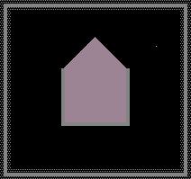

# Explosives 爆炸物

爆炸物在受到冲击、高温或电信号时发生剧烈反应。本分类共20个元素。

---

## Explosives Quick Reference 爆炸物快速参考

| 元素 | 中文名 | 引爆条件 | 爆炸半径/强度 | 特殊说明 |
|------|--------|----------|---------------|----------|
| FIRE | 火焰 | 自身即燃烧态 | 2格点燃半径 | 助燃需O2/H2，耗尽变SMKE/WTRV |
| GUN | 黑火药 | 热(>400℃)/SPRK/FIRE/PLSM/LAVA/NEUT | 中等压力爆炸 | 粉末状，极易引燃(Flammable=600) |
| NITR | 硝化甘油 | 热(>400℃)/SPRK/FIRE | 高压爆炸(Explosive=2) | 液体，极限可燃(Flammable=1000) |
| PLEX | C4塑胶炸弹 | 热(>400℃)/SPRK/高压 | 高压爆炸(Explosive=2) | 固体，中子可穿透 |
| RBDM | 固态铷 | 遇水(WATR/DSTW/SLTW) | 遇水即爆 | >39℃熔化为LRBD，导电 |
| LRBD | 液态铷 | 遇水(WATR/DSTW/SLTW) | 遇水即爆 | 压力越高越不稳定，导电 |
| THDR | 球状闪电 | 接触导体/非免疫物质 | 2格(导体→SPRK, 其他→+100压力) | 9000℃超高温，接触FIRW可引燃 |
| THRM | 铝热剂 | 仅FIRE/PLSM/LAVA/LIFE触发 | 产3500℃熔岩+高压 | 自身不燃不爆，需外部引燃 |
| CFLM | 冷焰 | 自身即反应态 | N/A(无压力爆炸) | 0K绝对零度，引爆C5 |
| FIRW | 烟花 | FIRE/PLSM/THDR接触 | 8压力+40个EMBR火花 | tmp状态机控制：待机→升空→爆炸 |
| FUSE | 导火线 | SPRK/热(>700℃)/高压(>2.7) | 燃尽产PLSM | 燃烧速度慢，life<40时1%产PLSM |
| FSEP | 导火线粉尘 | SPRK/热(>400℃)/高压(>2.7) | 燃尽产PLSM | FUSE的10倍燃烧速度 |
| LIGH | 闪电 | 自身即高温态 | 2格+沿线路径 | 可触发DEUT/PLUT核反应 |
| DEST | 高爆炸药 | 自身激活(life>0) | 2格随机破坏+60压力 | 不可破坏DMND/各类克隆体 |
| FWRK | 传统烟花 | DUST接触/热(>400℃) | 8压力+40个EMBR火花 | 比FIRW飞得更高 |
| BOMB | 炸弹 | 接触非免疫物质 | 内圈8格消灭/外圈9格EMBR | 触碰即爆，无延迟 |
| C5 | C5低温炸弹 | 低温(<100K)/CFLM接触 | 释放CFLM冷焰 | 唯一对"冷"敏感的爆炸物 |
| EMBR | 火花 | 触碰固体/液体/粉末 | 纯视觉效果 | 不会触发连锁反应 |
| IGNC | 导火索 | FIRE/PLSM/SPRK/LIGH/已激活IGNT | 产EMBR+FIRE | 需要外部点火源激活 |
| LITH | 锂 | 过充(energy≥100)/高温+水 | 产O2+双倍PLSM | 最复杂的多功能金属/电池 |

---

###### 火焰(FIRE)【Fire】---------------------------------------------------------Type:004


**属性表：**

| 属性 | 值 |
|------|-----|
| 内部标识 | PT_FIRE (0x04) |
| 显示颜色 | 0xFFA040 (橙黄火焰色)，tmp控制色调 |
| 物态类型 | TYPE_PART (粉末/粒子) |
| 燃点 | 自身即燃烧态，初始695℃ |
| 热导率 | 88 |
| 可燃性(Flammable) | 0 (自身已为火焰) |
| 爆炸性(Explosive) | 0 |
| 初始温度 | 695℃/968.15K |
| 初始life | 120~169 (随机) |
| 特殊属性 | PROP_LIFE_DEC (life每帧递减) |

**参数详解：**

| 参数 | 作用 |
|------|------|
| tmp | 位标志寄存器：bit0(1)=已消耗H2, bit1(2)=已消耗O2。tmp==3表示同时消耗了H2和O2，完全燃烧产物为WTRV |
| tmp2 | 备用/保留 |
| life | 剩余燃烧寿命。初始120~169帧。每帧减1。life<=1时进入熄灭逻辑 |
| ctype | 备用/保留 |
| temp | 当前温度。低于352℃变SMKE，高于2500℃变PLSM |

**逐步引爆/燃烧机制：**

1. **生成阶段**：FIRE以695℃高温生成，life随机初始化120~169帧
2. **燃烧维持**：每帧life递减1。在life>1期间持续活跃
3. **点燃传播（2格半径）**：每帧扫描周围2格。若目标Flammable>0，以 `(Flammable + 压力*10)/1000` 的概率将其转化为FIRE
4. **助燃阶段**：检测周围O2(tmp未标记bit1)→设tmp\|=2，消耗O2产生额外FIRE。检测H2(tmp未标记bit0)→设tmp\|=1，产生额外FIRE
5. **熄灭判定**：life<=1时：
   - 温度<352℃/625K→SMKE（烟）
   - 有O2+H2燃料(tmp==3)→WTRV（完全燃烧产物为水蒸气）
   - 否则→SMKE
6. **极端温度转换**：temp>2500℃→PLSM（等离子体）

**扩展反应链：**

```
FIRE + 可燃物(Flammable>0) → FIRE + FIRE (点燃传播)
FIRE + O2 → FIRE + FIRE (tmp|=2, 助燃)
FIRE + H2 → FIRE + FIRE (tmp|=1, 氢气燃烧)
FIRE + O2 + H2 → WTRV (完全燃烧,tmp==3)
FIRE + THRM → LAVA(BMTL,3500℃) + 50压力 (50%概率)
FIRE + THRM → LAVA(普通,3500℃) (50%概率)
FIRE + COAL/BCOL → FIRE(life截断到99, 加速燃烧)
FIRE(temp>2500℃) → PLSM (超高温电离)
FIRE(temp<352℃) → SMKE (低温熄灭)
FIRE(life==0, 有O2+H2) → WTRV (水蒸气)
FIRE + NEUT → 被中子穿透 (部分元素受影响)
```

**安全提示与防护策略：**

- **灭火方法**：用WATR（水）直接浇灭FIRE，或利用VACU（真空）抽走氧气中断助燃
- **围堵材料**：DMND（钻石）、INSL（隔热体）、BCLN（破坏性克隆体）均不会被FIRE点燃
- **隔离策略**：FIRE不能穿透墙体和固体方块（除非该方块Flammable>0），用STNE（石头）或BMTL（金属）建造防火隔层
- **链式反应阻断**：在可燃物之间插入不可燃隔离层（如GLAS玻璃），破坏点燃传播路径
- **注意**：FIRE即使熄灭也可能留下SMKE烟尘，在密闭空间中积累

**实战用法示例：**

```
// 可控燃烧炉 - 用INSL包围FIRE，上方放待加热材料
INSL INSL INSL INSL INSL
INSL FIRE FIRE FIRE INSL
INSL INSL INSL INSL INSL

// 火焰引爆链 - GUN粉末→FIRE点燃→连锁引爆
SPRK → METL → GUN → FIRE → NITR (远程引爆炸药)

// 水灭火系统 - 用探测器自动放水
FIRE (传感器) → METL → SPRK → PSTN → WATR释放
```

---

###### 黑火药(GUN)【Gunpowder】-------------------------------------------------Type:007


**属性表：**

| 属性 | 值 |
|------|-----|
| 内部标识 | PT_GUN (0x07) |
| 显示颜色 | 0xC0C0D0 (浅灰褐色) |
| 物态类型 | TYPE_PART (粉末) |
| 燃点 | 400℃/673K |
| 热导率 | 97 |
| 可燃性(Flammable) | 600 |
| 爆炸性(Explosive) | 1 |
| 初始温度 | 22℃/295.15K |
| 初始life | 默认值 |
| 特殊属性 | 无特殊属性 |

**参数详解：**

| 参数 | 作用 |
|------|------|
| tmp | 备用/保留 (非主要用途) |
| tmp2 | 备用/保留 |
| life | 未在GUN中使用特殊life逻辑(标准粒子行为) |
| ctype | 备用/保留 |
| temp | 触发温度阈值：>400℃/673K时转化为FIRE引爆 |

**逐步引爆机制：**

1. **热引爆**：温度超过400℃时，GUN直接转化为FIRE，触发爆炸系统(Explosive=1)
2. **电引爆**：SPRK电脉冲接触GUN→通过爆炸系统产生压力和破坏
3. **火焰接触引爆**：FIRE/PLSM/LAVA接触GUN→因其Flammable=600极高，几乎必定点燃
4. **中子反应**：NEUT+GUN→有3/200的概率GUN变为DUST（中子嬗变）
5. **爆炸效果**：Explosive=1产生中等压力波，可连锁引爆邻近爆炸物

**扩展反应链：**

```
GUN(temp>400℃) → FIRE (热引爆)
GUN + SPRK → 爆炸 (高压+破坏)
GUN + FIRE → FIRE (引燃, 概率≈0.6+压力*0.01)
GUN + PLSM → FIRE (等离子体引燃)
GUN + LAVA → FIRE (熔岩引燃)
GUN + NEUT → NEUT + DUST (3/200, 中子嬗变)
GUN + DEST → 被摧毁 (DEST消耗life)
GUN + BOMB → 被摧毁 (BOMB内圈消灭)
```

**安全提示与防护策略：**

- **防爆容器**：用DMND或INSL制作炸药仓库，GUN在内部引爆不会破坏容器
- **温度控制**：保持存放区温度<400℃，远离FIRE/PLSM/LAVA等热源
- **电绝缘**：用INSL包裹GUN存储区，防止SPRK意外接触
- **防潮**：虽然GUN不直接与水反应，但潮湿环境下可能影响粉末物理性质
- **安全运输**：用PIPE（管道）或CONV（传送带）运输时确保路径无热源

**实战用法示例：**

```
// 经典火炮 - SPRK引爆GUN推动弹丸
SPRK → METL → GUN (炮膛内) → [弹丸粒子]

// 地雷陷阱 - 压力板触发
压力→FUSE点燃→GUN引爆

// 中子嬗变工厂 - NEUT+GUN产DUST
NEUT源 → GUN → DUST收集
```

---

###### 硝化甘油(NITR)【Nitroglycerin】--------------------------------------------Type:008


**属性表：**

| 属性 | 值 |
|------|-----|
| 内部标识 | PT_NITR (0x08) |
| 显示颜色 | 0x80A070 (淡黄绿色) |
| 物态类型 | TYPE_LIQUID (液体) |
| 燃点 | 400℃/673K |
| 热导率 | 50 |
| 可燃性(Flammable) | 1000 (极限值) |
| 爆炸性(Explosive) | 2 (增强爆炸) |
| 初始温度 | 22℃/295.15K |
| 初始life | 默认值 |
| 特殊属性 | PROP_NEUTPASS (中子可穿透) |

**参数详解：**

| 参数 | 作用 |
|------|------|
| tmp | 备用/保留 |
| tmp2 | 备用/保留 |
| life | 未使用特殊life逻辑 |
| ctype | 备用/保留 |
| temp | >400℃转化为FIRE触发爆炸 |

**逐步引爆机制：**

1. **热引爆**：温度>400℃→NITR转化为FIRE，因Explosive=2产生大幅压力
2. **电引爆**：SPRK接触→通过爆炸系统触发，产生巨大压力冲击波
3. **火焰引爆**：FIRE/PLSM/LAVA接触→Flammable=1000意味着100%概率被点燃
4. **压力传递**：Explosive=2的爆炸压力显著高于Explosive=1的元素，可连锁引爆更远处的爆炸物
5. **液体流动扩散**：作为液体，NITR会自然向下流动和扩散，增加意外接触热源的风险

**扩展反应链：**

```
NITR(temp>400℃) → FIRE + 高压爆炸(Explosive=2)
NITR + SPRK → 高压爆炸(Explosive=2)
NITR + FIRE/PLSM/LAVA → 100%点燃 → 爆炸
NITR + NEUT → 中子穿透 (无直接反应)
NITR + DEST → 被摧毁 (DEST消耗life, 额外-4)
```

**安全提示与防护策略：**

- **液体防爆容器**：用DMND或GLAS制作密封容器，底部必须完全封闭防止泄漏
- **双层保险**：容器外部再加一层INSL隔热，即使外部起火也不会引爆内部
- **禁止金属接触**：避免用导电金属(METL)容器，防止SPRK意外导入
- **地漏设计**：存储区下方设置紧急排放通道，失控时可将NITR导入安全引爆区
- **震动防护**：虽然NITR在TPT中不因物理震动爆炸，但避免与大量运动粒子混合

**实战用法示例：**

```
// 液体炸弹 - 利用液体流动性制作大面积爆炸
GLAS(密封容器) → NITR(充满) → SPRK引爆 → 大面积高压破坏

// 连锁引爆阵列 - 利用Explosive=2增强传播
FIRE → NITR(一级) → [空间] → NITR(二级, 被压力波引爆)

// 定时炸弹 - FUSE+NITR组合
SPRK → FUSE(延时) → NITR → 爆炸
```

---

###### C4塑胶炸弹(PLEX)【C-4】---------------------------------------------------Type:011

**属性表：**

| 属性 | 值 |
|------|-----|
| 内部标识 | PT_PLEX (0x0B) |
| 显示颜色 | 0xD0C0A0 (米黄色/沙色) |
| 物态类型 | TYPE_SOLID (固体) |
| 燃点 | 400℃/673K |
| 热导率 | 50 |
| 可燃性(Flammable) | 1000 |
| 爆炸性(Explosive) | 2 |
| 初始温度 | 22℃/295.15K |
| 初始life | 默认值 |
| 特殊属性 | PROP_NEUTPENETRATE (中子可穿透) |

**参数详解：**

| 参数 | 作用 |
|------|------|
| tmp | 备用/保留 |
| tmp2 | 备用/保留 |
| life | 未使用特殊life逻辑 |
| ctype | 备用/保留 |
| temp | >400℃转为FIRE触发爆炸系统 |

**逐步引爆机制：**

1. **热引爆**：温度>400℃触发，PLEX→FIRE，Explosive=2产生强大压力冲击
2. **电引爆**：SPRK接触→经爆炸系统产生压力波和粒子破坏
3. **高压引爆**：外部高压(如邻近爆炸)→可能直接触发PLEX爆炸
4. **火焰引爆**：FIRE/PLSM/LAVA接触→因Flammable=1000，100%被点燃
5. **中子穿透特性**：PLEX具有PROP_NEUTPENETRATE，中子可直接穿过而不触发爆炸（但有3/200概率变为GOO）
6. **固体稳定性**：相比NITR液体，PLEX作为固体不会流动，更适合精确放置

**扩展反应链：**

```
PLEX(temp>400℃) → FIRE → 高压爆炸(Explosive=2)
PLEX + SPRK → 高压爆炸(Explosive=2)
PLEX + 高压(>阈值) → 爆炸
PLEX + FIRE/PLSM/LAVA → 100%点燃爆炸
PLEX + NEUT → NEUT + GOO (3/200, 中子嬗变为粘性物质)
PLEX + DEST → 被摧毁 (DEST消耗life, 固体消耗12点)
```

**安全提示与防护策略：**

- **固体存储优势**：PLEX不会流动，用DMND或坚硬材料做隔箱即可安全存储
- **热隔离**：存储区温度控制在<400℃，与热源之间至少隔3格
- **中子场警示**：如果场景中有NEUT源，注意PLEX可能嬗变为GOO污染区域
- **电绝缘**：用INSL包裹存储区，防止SPRK意外触发
- **爆炸隔离带**：PLEX仓库之间用3-4格的真空或不可燃材料隔开，防止连锁爆炸

**实战用法示例：**

```
// 定向爆破 - 用DMND做定向槽
DMND DMND [目标] DMND DMND
DMND PLEX PLEX PLEX DMND ← SPRK引爆
(爆炸能量被导向[目标]方向)

// 级联爆破 - 多层PLEX顺序引爆
SPRK → PLEX(1层) → [延迟] → PLEX(2层) → PLEX(3层)

// NEUT+GOO 生成器 - 利用中子嬗变
NEUT源 → PLEX → GOO (3/200概率, 堆积GOO产物)
```

---

###### 固态铷(RBDM)【Rubidium】---------------------------------------------------Type:041


**属性表：**

| 属性 | 值 |
|------|-----|
| 内部标识 | PT_RBDM (0x29) |
| 显示颜色 | 0x6B6B6B (深灰色/金属色) |
| 物态类型 | TYPE_SOLID (固体) |
| 燃点/引爆条件 | 遇水(WATR/DSTW/SLTW)即爆 |
| 熔化温度 | 39℃/312K→LRBD |
| 热导率 | 240 |
| 可燃性(Flammable) | 1000 |
| 爆炸性(Explosive) | 1 |
| 初始温度 | 22℃/295.15K |
| 初始life | 默认值 |
| 特殊属性 | PROP_CONDUCTS (导电), Meltable=50 |

**参数详解：**

| 参数 | 作用 |
|------|------|
| tmp | 备用/保留 |
| tmp2 | 备用/保留 |
| life | 未使用特殊life逻辑 |
| ctype | 备用/保留 |
| temp | 熔化阈值：>39℃/312K→LRBD。在Legacy模式下不会被FIRE直接熔化 |

**逐步引爆机制：**

1. **遇水引爆**：RBDM接触任何水类元素(WATR/DSTW/SLTW)→立即产生爆炸压力(Explosive=1)
2. **热熔化**：温度>39℃→RBDM熔化为LRBD液态铷，继续保持Explosive=1
3. **导电特性**：RBDM具有PROP_CONDUCTS，可作为电路的一部分传导SPRK信号
4. **电引爆**：SPRK通过导电属性传递后，RBDM自身也会因SPRK触发爆炸系统
5. **火焰接触**：FIRE/PLSM接触→因Flammable=1000引燃

**扩展反应链：**

```
RBDM + WATR/DSTW/SLTW → 爆炸 (遇水反应, Explosive=1)
RBDM(temp>39℃/312K) → LRBD (熔化)
RBDM + SPRK → 导电 + 爆炸
RBDM + FIRE/PLSM → FIRE (引燃爆炸)
RBDM + NEUT → 被中子穿透 (中性反应)
```

**安全提示与防护策略：**

- **绝对防水**：RBDM存储区必须完全无水，使用INSL制作防水容器
- **温度控制**：保持<39℃以防熔化为LRBD液体泄漏
- **惰性气体保护**：用CO2或N2（若存在）填充存储区，隔绝水蒸气
- **应急处理**：一旦RBDM遇水爆炸，立即用DMND隔板切断连锁反应路径
- **电路注意**：由于导电，沿电路传播的SPRK可能意外引爆远处RBDM

**实战用法示例：**

```
// 水路陷阱 - 在通道中部署RBDM，敌人触发水流
WATR(上方蓄水池) → [闸门] → 通道(底部RBDM) → 爆炸

// 温度传感开关 - 39℃相变
RBDM(低温) → [加热] → LRBD(液态, 流动到别处触发)

// 导电回路引爆 - 远程电路控制
SPRK → METL(长导线) → RBDM → 爆炸
```

---

###### 液态铷(LRBD)【Liquid Rubidium】-------------------------------------------Type:042


**属性表：**

| 属性 | 值 |
|------|-----|
| 内部标识 | PT_LRBD (0x2A) |
| 显示颜色 | 0xAAAAAA (亮灰色/银色液体) |
| 物态类型 | TYPE_LIQUID (液体) |
| 引爆条件 | 遇水(WATR/DSTW/SLTW)即爆 |
| 凝固温度 | <38℃/311K→RBDM |
| 气化/燃烧 | >688℃/961K→FIRE |
| 热导率 | 170 |
| 可燃性(Flammable) | 1000 |
| 爆炸性(Explosive) | 1 |
| 初始温度 | 67℃/340.15K |
| 初始life | 默认值 |
| 特殊属性 | PROP_CONDUCTS (导电) |

**参数详解：**

| 参数 | 作用 |
|------|------|
| tmp | 备用/保留 |
| tmp2 | 备用/保留 |
| life | 未使用特殊life逻辑 |
| ctype | 备用/保留 |
| temp | 凝固阈值：<38℃/311K→RBDM。燃烧阈值：>688℃/961K→FIRE。压力修正：压力越高，爆炸稳定性越低 |

**逐步引爆机制：**

1. **遇水引爆**：与RBDM相同，LRBD接触任何水立即爆炸
2. **液态扩散风险**：作为液体，LRBD会向下流动、水平扩散，更大面积接触水
3. **温度相变**：<38℃凝固回RBDM（安全化），>688℃气化为FIRE（爆炸化）
4. **导电传播**：LRBD导电，沿液体连通区域传递SPRK，可能导致大面积连锁引爆
5. **压力敏感性**：环境压力越高，LRBD越不稳定，爆炸点和阈值可能降低

**扩展反应链：**

```
LRBD + WATR/DSTW/SLTW → 爆炸 (遇水反应)
LRBD(temp<38℃/311K) → RBDM (凝固, 安全化)
LRBD(temp>688℃/961K) → FIRE (燃烧爆炸)
LRBD + SPRK → 导电传播 + 爆炸
LRBD + FIRE/PLSM → 引燃爆炸
LRBD(高压环境) → 更易引爆 (压力修正)
```

**安全提示与防护策略：**

- **比RBDM更危险**：液体流动性意味着更难控制扩散路径
- **低温固化策略**：用CFLM冷焰降低LRBD温度至<38℃，固化回安全的RBDM
- **防水优先**：与RBDM相同，绝对防水是核心安全要求
- **围堵设计**：存储容器需底部和侧面完全密封，用DMND材料
- **紧急冷却系统**：部署CFLM或液氮(如果可用)管道，泄漏时快速冷却固化

**实战用法示例：**

```
// 液体地雷 - 利用流动性覆盖更大区域
LRBD(上方滴管) → 滴落到含WATR区域 → 大面积爆炸

// 冷热双控开关 - 利用相变
CFLM冷却 → LRBD→RBDM(断路) / 加热 → RBDM→LRBD(通路) → 爆炸/导电

// 压力敏感引爆 - 利用压力修正
高压环境(活塞压缩) → LRBD不稳定 → 微小触发即爆炸
```

---

###### 球状闪电(THDR)【Thunder】--------------------------------------------------Type:048


**属性表：**

| 属性 | 值 |
|------|-----|
| 内部标识 | PT_THDR (0x30) |
| 显示颜色 | 0xFFFFA0 (亮黄色/白色光球) |
| 物态类型 | TYPE_PART (粒子) |
| 引爆条件 | 自身即超高温态(9000℃) |
| 扫描半径 | 2格 |
| 热导率 | 1 |
| 可燃性(Flammable) | 0 |
| 爆炸性(Explosive) | 0 |
| 初始温度 | 9000℃/9273.15K |
| 初始life | 默认值 |
| 特殊属性 | PROP_LIFE_DEC |

**参数详解：**

| 参数 | 作用 |
|------|------|
| tmp | 备用/保留 |
| tmp2 | 备用/保留 |
| life | 剩余存在时间（每帧递减，耗尽消失） |
| ctype | 备用/保留 |
| temp | 恒定为9000℃(超高)，用于加热周围粒子 |

**逐步引爆/作用机制：**

1. **扫描阶段**：每帧扫描周围2格内所有粒子
2. **导体判定**：若目标life==0（未激活态导体）→产生SPRK电脉冲，THDR自身消失
3. **免疫过滤**：若目标是CLNE/THDR/SPRK/DMND/FIRE→跳过（不产生效果）
4. **压力施加**：若目标为其他普通物质→施加+100压力（引爆/推动效果）
5. **FIRW特殊交互**：接触FIRW烟花→触发FIRW的tmp状态机，烟花升空
6. **超高温加热**：9000℃可瞬间融化/点燃周围绝大多数物质

**扩展反应链：**

```
THDR + 导体(life==0) → SPRK + THDR消失
THDR + 普通物质(非免疫) → 目标 + 100压力
THDR + FIRW → FIRW点燃升空 (tmp状态切换)
THDR + CLNE/DMND/SPRK/FIRE → 无效果 (免疫)
THDR + METL/WATR/STNE等 → +100压力 (推动/破坏)
THDR + GUN/NITR/PLEX → +100压力可能触发爆炸系统
THDR(life耗尽) → 自然消失
```

**安全提示与防护策略：**

- **免疫材料**：DMND和CLNE完全不受THDR影响，可做防护罩
- **导电路径控制**：避免THDR路径上有导体，否则THDR会提前消失并产生SPRK
- **真空通道**：在真空中THDR无法与物质交互，可安全传输
- **FIRW隔离**：如果不想触发烟花，确保THDR与FIRW之间至少3格距离
- **降温处理**：THDR温度极高但热导率仅1，可用大量WATR包围降温

**实战用法示例：**

```
// SPRK发生器 - 利用导体交互
THDR → METL(life=0) → SPRK输出 (接触式电信号发生器)

// 远程引爆 - 利用+100压力
THDR(扫描) → GUN/NITR/PLEX(2格内) → 压力触发爆炸

// 烟花表演控制器
THDR(阵列) → FIRW(阵列) → 同步烟花升空
```

---

###### 铝热剂(THRM)【Thermite】---------------------------------------------------Type:065



**属性表：**

| 属性 | 值 |
|------|-----|
| 内部标识 | PT_THRM (0x41) |
| 显示颜色 | 0xC0A080 (棕色/铜色粉末) |
| 物态类型 | TYPE_PART (粉末) |
| 引燃条件 | 仅FIRE/PLSM/LAVA/LIFE触发 |
| 反应温度 | 3500℃ (产物LAVA温度) |
| 热导率 | 211 |
| 可燃性(Flammable) | 0 |
| 爆炸性(Explosive) | 0 |
| 初始温度 | 22℃/295.15K |
| 初始life | 默认值 |
| 特殊属性 | Meltable=2 |

**参数详解：**

| 参数 | 作用 |
|------|------|
| tmp | 备用/保留 |
| tmp2 | 备用/保留 |
| life | 未使用特殊life逻辑 |
| ctype | 备用/保留 |
| temp | 反应产生3500℃传递给产物LAVA |

**逐步反应机制：**

1. **触发检测**：THRM自身不燃不爆(Flammable=0, Explosive=0)，仅在接触FIRE/PLSM/LAVA/LIFE时反应
2. **铝热反应**：与引燃源接触→发生剧烈铝热反应，产生3500℃超高温
3. **熔岩生成（50%概率分支）**：
   - 分支A(50%)：THRM→BMTL熔岩（broken metal/熔融金属），温度3500℃，附加+50压力
   - 分支B(50%)：THRM→普通LAVA，温度3500℃
4. **压力释放**：反应产生压力（分支A有额外+50），可触发周围爆炸物
5. **超高温传递**：3500℃的高温LAVA可引燃/熔化绝大多数物质，形成二次破坏

**扩展反应链：**

```
THRM + FIRE → 50%LAVA(BMTL,3500℃)+50压力 / 50%LAVA(普通,3500℃)
THRM + PLSM → 同上铝热反应
THRM + LAVA → 同上铝热反应
THRM + LIFE → 同上铝热反应
THRM + SPRK → 无反应 (SPRK不触发THRM)
THRM + 高温(<FIRE触发>）→ 无反应 (必须FIRE/PLSM/LAVA/LIFE接触)
THRM(作为粉末) + 重力 → 向下堆积
产物LAVA(3500℃) + 水 → 可能产生蒸汽爆炸
产物LAVA(3500℃) + 金属 → 熔化金属
```

**安全提示与防护策略：**

- **引燃源隔离**：THRM本身非常安全（不燃不爆），只需隔离FIRE/PLSM/LAVA/LIFE
- **安全存储**：普通容器即可，THRM不会自燃。用INSL隔热容器增加安全裕度
- **粉末泄露处理**：THRM粉末泄漏本身无害，用VACU吸走即可
- **反应控制**：若需可控铝热反应，用少量FIRE精确接触THRM表面
- **产物处理**：反应后产生3500℃LAVA极其危险，预留冷却空间或用水淹没降温

**实战用法示例：**

```
// 铝热切割器 - 定点超高温切割
FIRE(控制源) → THRM(粉末) → 3500℃LAVA(切割金属/钻石)

// 铝热地雷 - 利用LAVA流动伤害
压力板 → FIRE → THRM → 3500℃LAVA流下

// 铝热焊接 - 产生BMTL熔融金属做连接
FIRE + THRM → LAVA(BMTL, 50%概率) → 冷却固化为金属连接
```

---

###### 冷焰(CFLM)【Subzero Flame】------------------------------------------------Type:068


**属性表：**

| 属性 | 值 |
|------|-----|
| 内部标识 | PT_CFLM (0x44) |
| 显示颜色 | 0x80C0FF (淡蓝色冷光) |
| 物态类型 | TYPE_PART (粒子) |
| 反应条件 | 自身即绝对零度(0K) |
| 热导率 | 88 |
| 可燃性(Flammable) | 0 |
| 爆炸性(Explosive) | 0 |
| 初始温度 | 0K/-273.15℃ (绝对零度) |
| 初始life | 50~199 |
| 特殊属性 | PROP_LIFE_DEC |

**参数详解：**

| 参数 | 作用 |
|------|------|
| tmp | 备用/保留 |
| tmp2 | 备用/保留 |
| life | 剩余冷却寿命。初始50~199帧。每帧减1，耗尽后CFLM消失 |
| ctype | 备用/保留 |
| temp | 恒定为0K（绝对零度），不随环境升温 |

**逐步作用机制：**

1. **生成阶段**：CFLM以绝对零度(0K)生成，life随机50~199帧
2. **超低温辐射**：0K超低温对周围粒子产生急冷效果，可快速降温
3. **C5引爆**：CFLM接触C5低温炸弹→立即引爆C5，释放更多CFLM和高能光子
4. **ANAR链式反应**：CFLM+ANAR→产生2个CFLM，实现冷焰增殖
5. **自然消亡**：life耗尽后CFLM消失，不留下任何残余

**扩展反应链：**

```
CFLM + C5 → CFLM引爆C5 (唯一已知引爆方式)
CFLM + ANAR → 2xCFLM (冷焰链式增殖)
CFLM + WATR → 水冷却/冻结 (无爆炸)
CFLM + 火焰(FIRE) → 双方抵消/无直接反应 (温度中和)
CFLM + 高温物质 → 快速降温 (但CFLM自身不增温)
CFLM(life=0) → 消失 (自然消亡)
```

**安全提示与防护策略：**

- **超低温危险**：0K可瞬间冻结大多数物质，操作时使用INSL手套（隔热层）
- **C5远离**：CFLM和C5必须严格隔离，否则触发冷爆炸
- **ANAR控制**：避免CFLM接触ANAR，否则产生更多CFLM的链式增殖
- **CFLM无自灭能力**：CFLM不像FIRE会因降温而熄灭（它已经0K了），只能等life耗尽
- **热量缓冲区**：在CFLM和敏感设备之间放置高比热容材料吸收冷量

**实战用法示例：**

```
// 超低温冷却系统 - 用于精密温度控制
CFLM(阵列) → 目标材料 → 精确降温至接近0K

// C5引爆链 - 冷引爆
CFLM → C5 → CFLM扩散 → 更多C5引爆

// ANAR冷焰增殖器
CFLM + ANAR → 2CFLM (翻倍) → 快速制冷大面积区域
```

---

###### 烟花(FIRW)【Fireworks】----------------------------------------------------Type:069


**属性表：**

| 属性 | 值 |
|------|-----|
| 内部标识 | PT_FIRW (0x45) |
| 显示颜色 | 多种颜色（由tmp状态决定） |
| 物态类型 | TYPE_PART (粒子) |
| 引爆条件 | FIRE/PLSM/THDR接触触发 |
| 爆炸效果 | +8压力+40个EMBR火花 |
| 热导率 | 50 |
| 可燃性(Flammable) | 0 |
| 爆炸性(Explosive) | 0 |
| 初始温度 | 22℃/295.15K |
| 初始life | 20~29 (点燃后) |
| 特殊属性 | 无特殊属性 |

**参数详解：**

| 参数 | 作用 |
|------|------|
| tmp | **状态机核心**：0=待点燃(闲置态)，1=已点燃正在上升中，>=2=爆炸态(产生EMBR) |
| tmp2 | 备用/保留 |
| life | tmp==1时设为20~29，作为上升持续时间(帧)，耗尽后tmp切换到>=2进入爆炸 |
| ctype | 控制爆炸产生的EMBR颜色类型（传递给EMBR的Ctype） |
| temp | 常温22℃(待机时)，爆炸产生的EMBR温度为5750~6249K |

**逐步引爆机制（tmp状态机）：**

1. **待机态(tmp==0)**：烟花闲置，检测周围1格是否有FIRE/PLSM/THDR
2. **点燃触发**：检测到引燃源→计算重力方向(向上)→tmp从0→1，life设置20~29帧
3. **上升态(tmp==1)**：烟花向重力反方向（上方）移动。life每帧递减
4. **爆炸判定**：life递减到0→tmp切换到>=2，进入爆炸态
5. **爆炸效果**：产生+8压力，向周围发射40个EMBR高温火花(temp=5750~6249K)，EMBR带Ctype颜色
6. **视觉收尾**：EMBR自身有PROP_SPARKSETTLE不会连锁反应，纯视觉效果

**扩展反应链：**

```
FIRW(tmp=0) + FIRE(1格内) → FIRW(tmp=1,life=20~29) 点燃上升
FIRW(tmp=0) + PLSM(1格内) → FIRW(tmp=1) 点燃上升
FIRW(tmp=0) + THDR(1格内) → FIRW(tmp=1) 点燃上升
FIRW(tmp=1,life递减) → 向反重力方向移动
FIRW(tmp>=2) → +8压力 + 40xEMBR(5750~6249K, 彩色)
FIRW + SPRK → 无直接反应 (SPRK不触发FIRW)
FIRW + 高温(<FIRE级）→ 无反应 (必须FIRE/PLSM/THDR)
```

**安全提示与防护策略：**

- **引燃源隔离**：FIRW仅对FIRE/PLSM/THDR敏感，远离这三种即可安全存储
- **SPRK安全**：FIRW不受SPRK影响，可用电路控制周围装置而无需担心意外引爆
- **封闭空间注意**：烟花爆炸产生的+8压力和40个高温EMBR在密闭小空间内会造成严重破坏
- **方向控制**：烟花总向反重力方向上升，调整重力设置可改变发射方向
- **颜色预设**：通过设置FIRW的Ctype参数可控制爆炸EMBR的颜色

**实战用法示例：**

```
// 烟花表演阵列 - 不同颜色FIRW排列
FIRE(控制) → FIRW(ctype=红) FIRW(ctype=蓝) FIRW(ctype=绿) → 同步升空

// 信号弹 - 利用上升方向
FIRE(触发器) → FIRW(垂直上升) → 高空爆炸 → 远程可见信号

// 压力波发生器 - 利用+8压力
FIRW(爆炸) → +8压力 → 触发邻近压力敏感装置（如FUSE）
```

---

###### 导火线(FUSE)【Fuse】-------------------------------------------------------Type:070


**属性表：**

| 属性 | 值 |
|------|-----|
| 内部标识 | PT_FUSE (0x46) |
| 显示颜色 | 0x808080 (灰色/金属引线) |
| 物态类型 | TYPE_SOLID (固体) |
| 引燃条件 | SPRK/热(>700℃,1/20概率)/高压(>2.7) |
| 燃烧产物 | PLSM(等离子体) |
| 热导率 | 50 |
| 可燃性(Flammable) | 0 |
| 爆炸性(Explosive) | 0 |
| 初始温度 | 22℃/295.15K |
| 初始life | >40 (未点燃) |
| 特殊属性 | 无特殊属性 |

**参数详解：**

| 参数 | 作用 |
|------|------|
| tmp | **燃烧计时器**：初始=50。当tmp<40时进入燃烧态，每帧递减。tmp<=0→FSEP(导火索粉末) |
| tmp2 | 备用/保留 |
| life | **阶段判定**：>40未点燃态，39~1燃烧态(每帧1/100概率产PLSM)，<=0燃尽→产PLSM(life=50) |
| ctype | 备用/保留 |
| temp | 温度触发：>=700℃/973K时有1/20概率点燃（tmp设为<40） |

**逐步燃烧机制：**

1. **未点燃态(life>40)**：FUSE处于安全状态，等待触发信号
2. **点燃三条件**：
   - SPRK电脉冲→立即点燃(life进入39~1范围，tmp进入<40)
   - 温度>=700℃→每帧1/20概率点燃
   - 环境压力>2.7→点燃
3. **燃烧态(life 39~1)**：FUSE进入燃烧，tmp从<40开始每帧递减。每帧有1/100概率产生PLSM（等离子体火花）
4. **燃尽(life<=0)**：FUSE燃尽，产生PLSM(life=50)作为最终产物
5. **粉末化(tmp<=0)**：tmp降至0以下→FUSE变为FSEP导火索粉末（可继续燃烧）

**扩展反应链：**

```
FUSE(life>40) + SPRK → FUSE(life<40, 点燃)
FUSE(life>40, temp>=700℃) → FUSE(life<40, 1/20概率每帧)
FUSE(life>40, 压力>2.7) → FUSE(life<40, 点燃)
FUSE(life<40) → 每帧1/100概率产PLSM (燃烧中)
FUSE(life<=0) → PLSM(life=50) (燃尽)
FUSE(tmp<=0) → FSEP (粉末化, 可续燃)
FUSE + FIRE/PLSM → 可能引燃 (温度条件)
FUSE + 水 → 可能熄灭 (如果降温到<700℃)
```

**安全提示与防护策略：**

- **慢速燃烧**：FUSE燃烧速度较慢(life从39到0共40帧)，适合做延时引信
- **水灭法**：用水降温FUSE可中止燃烧（温度低于700℃则无法持续点燃）
- **切断法**：用DMND隔断FUSE线路可物理中断燃烧传播
- **SPRK屏蔽**：用INSL包裹FUSE路线段，防止意外SPRK误触发
- **压力保护**：存放环境保持压力<2.7，避免压力触发

**实战用法示例：**

```
// 延时引信 - 经典用法
SPRK → FUSE(长度10格, 燃烧约400帧) → GUN/NITR/PLEX → 爆炸

// 级联时序 - 不同长度FUSE实现分时引爆
SPRK → FUSE(短=5格) → 炸药A
SPRK → FUSE(中=10格) → 炸药B
SPRK → FUSE(长=15格) → 炸药C

// 压力传感引爆
高压脉冲(>2.7) → FUSE点燃 → 下游爆炸物
```

---

###### 导火线粉尘(FSEP)【Fuse Powder】------------------------------------------Type:071


**属性表：**

| 属性 | 值 |
|------|-----|
| 内部标识 | PT_FSEP (0x47) |
| 显示颜色 | 0x606060 (深灰色粉末) |
| 物态类型 | TYPE_PART (粉末) |
| 引燃条件 | SPRK/热(>400℃)/高压(>2.7) |
| 燃烧产物 | PLSM(等离子体) |
| 热导率 | 50 |
| 可燃性(Flammable) | 0 |
| 爆炸性(Explosive) | 0 |
| 初始温度 | 22℃/295.15K |
| 初始life | >40 (未点燃) |
| 特殊属性 | 无特殊属性 |

**参数详解：**

| 参数 | 作用 |
|------|------|
| tmp | 与FUSE相同：燃烧计时器，初始50，<40燃烧态，<=0→变回FSEP粉末残留 |
| tmp2 | 备用/保留 |
| life | >40未点燃，39~1燃烧态(每帧1/10概率产PLSM)，<=0燃尽→PLSM(life=50) |
| ctype | 备用/保留 |
| temp | 温度触发：>400℃/673K（比FUSE的700℃更低） |

**逐步燃烧机制（与FUSE对比）：**

1. **更快燃烧**：FSEP燃烧速度是FUSE的10倍（PLSM产生概率1/10 vs 1/100）
2. **更低燃点**：400℃ vs FUSE的700℃，更易被意外引燃
3. **更快的粉末扩散**：作为粉末，FSEP受重力影响下落堆积，增加接触面积
4. **燃烧态(1/10 PLSM)**：生命期内每帧10%概率产生PLSM，火花四溅
5. **燃尽->PLSM**：life<=0时产生PLSM(life=50)
6. **残留回收**：tmp<=0→变回FSEP粉末（可回收再利用）

**扩展反应链：**

```
FSEP(life>40) + SPRK → FSEP(点燃, life<40)
FSEP(life>40, temp>400℃) → FSEP(点燃, 阈值低于FUSE)
FSEP(life>40, 压力>2.7) → FSEP(点燃)
FSEP(life<40) → 每帧1/10概率产PLSM (比FUSE快10倍)
FSEP(life<=0) → PLSM(life=50) (燃尽)
FSEP(tmp<=0) → FSEP (粉末残留循环)
FUSE(life<=0, tmp<=0) → FSEP (FUSE燃尽产物)
FSEP + 水 → 可能熄灭
```

**安全提示与防护策略：**

- **FSEP比FUSE更危险**：燃点低(400℃)、燃烧快(10倍)、粉末扩散性是三大风险
- **防水存储**：与GUN黑火药类似，防潮可降低意外引燃概率
- **堆叠限制**：FSEP粉末堆积过多时，一旦点燃几乎瞬间全部燃烧(连锁反应)
- **FUSE→FSEP产物链**：注意FUSE燃尽后变为FSEP，可能形成二次燃烧风险
- **水灭法**：与FUSE相同，降温是最有效的灭火手段

**实战用法示例：**

```
// 快速导火索 - 比FUSE快10倍的引信
SPRK → FSEP(2格) → 炸药 (几乎瞬间引爆)

// FUSE→FSEP 二级加速链
SPRK → FUSE(慢燃10格) → FSEP(快燃2格) → 炸药 (先慢后快)

// 火药散布引爆 - 利用粉末重力
FSEP(上方堆积) → [重力下落] → 散布到高温区域 → 多点同时燃烧
```

---

###### 闪电(LIGH)【Lightning】----------------------------------------------------Type:087


**属性表：**

| 属性 | 值 |
|------|-----|
| 内部标识 | PT_LIGH (0x57) |
| 显示颜色 | 0xFFFFC0 (亮白黄色) |
| 物态类型 | TYPE_PART (粒子) |
| 温度 | life*150℃ (极高) |
| 热导率 | 0 |
| 可燃性(Flammable) | 0 |
| 爆炸性(Explosive) | 0 |
| 初始温度 | 由life决定 |
| 初始life | power值（闪电能量） |
| 特殊属性 | PROP_LIFE_DEC |

**参数详解：**

| 参数 | 作用 |
|------|------|
| tmp | **闪电角度**：用atan2计算闪电传播方向角（度），控制线段延伸方向 |
| tmp2 | **段状态机**：0~5+，控制闪电分段的生长/分支阶段。tmp2==5或life<=1时闪电消失 |
| life | **闪电能量(power)**：决定线段长度、粒子加热量(PURFUL/1.3)和增压量(PURFUL/400)。life越高闪电越强 |
| ctype | 备用/保留 |
| temp | 动态温度 = life * 150℃（随能量变化） |

**逐步作用机制：**

1. **方向计算**：tmp存储闪电传播角度（atan2计算），决定线段延伸方向
2. **线段生成**：沿tmp角度方向逐段生成闪电线段，每段消耗部分life能量
3. **分支概率**：每段有70%概率产生分支（改变方向角度），形成树状闪电效果
4. **2格范围扫描**：每段闪电扫描周围2格，执行以下效果：
   - **导体(life==0)**：产生SPRK电脉冲
   - **DEUT/PLUT**：加热+增压+1/3概率变NEUT（触发核反应）
   - **可燃物**：点燃为FIRE
   - **所有粒子**：加热(purful/1.3)+增压(purful/400)
   - **HEAC(重混凝土)**：变为LAVA(HEAC)高温熔化
5. **终止条件**：tmp2==5（段数用尽）或life<=1（能量耗尽）→闪电消失

**扩展反应链：**

```
LIGH + DEUT → NEUT (1/3概率, 氘核聚变触发)
LIGH + PLUT → NEUT (1/3概率, 钚核裂变触发)
LIGH + HEAC → LAVA(HEAC) (重混凝土熔化)
LIGH + 导体(life=0) → SPRK (电信号产生)
LIGH + 可燃物(Flammable>0) → FIRE (点燃)
LIGH + 任意粒子 → 加热(能量/1.3) + 增压(能量/400)
LIGH + FIRE → FIRE助燃
LIGH(life<=1 或 tmp2==5) → 消失
```

**安全提示与防护策略：**

- **避雷针设计**：用导体(METL)将闪电引导到安全区域放电，避免直接击中敏感设备
- **DEUT/PLUT隔离**：闪电+DEUT/PLUT=核反应，存放核材料的位置必须有完善的闪电屏蔽
- **INSL保护**：INSL绝缘体不会导电，包裹关键结构可防闪电破坏
- **接地系统**：用连接到大面积导体(如大地BMTL层)的避雷针分散闪电能量
- **真空隔离**：真空中闪电无法传播（无介质），可用于保护核心装置
- **HEAC应用**：HEAC接触闪电变为LAVA，可用于制作热力转换装置

**实战用法示例：**

```
// 核反应触发器 - LIGH+DEUT/PLUT→NEUT
LIGH(高power) → DEUT堆 → NEUT爆发

// 避雷针保护系统
LIGH → METL(避雷针, 顶部) → BMTL(接地) → 安全散逸

// 广域点火器 - 利用2格扫描
LIGH → 扫描范围内全部可燃物 → 大片FIRE

// 可控核连锁 - LIGH触发链
LIGH → DEUT(1)→NEUT→DEUT(2)→更多NEUT → 级联核反应
```

---

###### 高爆炸药(DEST)【Destructive Bomb】----------------------------------------Type:089


**属性表：**

| 属性 | 值 |
|------|-----|
| 内部标识 | PT_DEST (0x59) |
| 显示颜色 | 0xFF4040 (亮红色/危险标识色) |
| 物态类型 | TYPE_PART (粒子) |
| 引爆条件 | 自身即激活态(life>0即开始破坏) |
| 破坏强度 | +60压力/次，固体消耗life12/非固体4 |
| 热导率 | 0 |
| 可燃性(Flammable) | 0 |
| 爆炸性(Explosive) | 0 (不依赖爆炸系统，自有一套破坏逻辑) |
| 初始温度 | MAX_TEMP (游戏最大温度) |
| 初始life | 30~49 (破坏配额) |
| 特殊属性 | 无特殊属性 |

**参数详解：**

| 参数 | 作用 |
|------|------|
| tmp | 备用/保留 |
| tmp2 | 备用/保留 |
| life | **破坏配额**：初始30~49。每次破坏消耗：固体12点，非固体4点，PLUT/DEUT额外-4。life<=0时DEST自身消失 |
| ctype | 备用/保留 |
| temp | 始终为MAX_TEMP（不可改变） |

**逐步破坏机制（非传统爆炸）：**

1. **生成**：DEST以life=30~49生成，温度=MAX_TEMP
2. **随机目标选择**：每帧随机选择周围2格内的粒子
3. **免疫过滤**：排除DEST自身、DMND(钻石)、BCLN/PCLN/PBCN/CLNE各类克隆体
4. **破坏执行**：
   - 对固体：消耗12点life，消灭目标
   - 对非固体：消耗4点life，消灭目标
   - 对PLUT/DEUT：额外-4点life(即固体12+4=16，非固体4+4=8)，50%概率产生NEUT
   - 每帧+60压力（无论是否成功破坏）
5. **特殊反应**：
   - 对INSL(隔热体)→将INSL变为PLSM
   - 对PLUT/DEUT→额外+20压力，50%概率产NEUT触发核裂变
6. **自我销毁**：life<=0时DEST消失

**扩展反应链：**

```
DEST + 固体(非免疫) → 消灭目标, life-12, +60压力
DEST + 非固体(非免疫) → 消灭目标, life-4, +60压力
DEST + PLUT/DEUT → 消灭目标, life-(12+4)或(4+4), +80压力, 50%产NEUT
DEST + INSL → PLSM (隔热体被转化为等离子体)
DEST + DMND/BCLN/CLNE/PCLN/PBCN → 无效果 (免疫)
DEST + 空气/真空 → 无目标选择, 仅+60压力
DEST(life<=0) → 自身消失
产物NEUT(从PLUT/DEUT) → 可能触发连锁核反应
```

**安全提示与防护策略：**

- **唯一安全材料：DMND**：钻石是唯一不被DEST破坏的普通物质，做DEST容器首选
- **克隆体免疫**：BCLN、PCLN、CLNE、PBCN也不被破坏，可用作容器/隔离层
- **快速消耗**：life最多49，每次固体破坏消耗12，最多破坏4个固体后自我消失
- **压力累积**：每帧+60压力，即使在密闭空间中也会因压力累积而破坏容器
- **INSL无效**：不要用INSL包裹DEST，因为DEST会将INSL变为PLSM！这与大多数爆炸物不同
- **核安全**：DEST+核材料=中子辐射风险，确保周围无更多核材料

**实战用法示例：**

```
// 钻石容器定向破坏 - 唯一安全围堵
DMND DMND DMND
DMND DEST DMND ← 用DMND做容器
DMND DMND DMND
[开口方向] → 破坏目标

// 中子发生器 - DEST+DEUT/PLUT
DEST + DEUT堆 → NEUT(50%) → 核连锁

// 精准清除器 - 利用有限life
DEST(life=30~49) → 破坏4~12个目标粒子后自毁 (精确清除量)

// INSL→PLSM转换器 - 利用特殊反应
DEST + INSL(阵列) → PLSM(大量高温等离子体)
```

---

###### 传统烟花(FWRK)【Original Fireworks】--------------------------------------Type:098


**属性表：**

| 属性 | 值 |
|------|-----|
| 内部标识 | PT_FWRK (0x62) |
| 显示颜色 | 多种颜色（默认待机色） |
| 物态类型 | TYPE_PART (粒子) |
| 引爆条件 | DUST接触(ctype=PT_DUST)/热(>400℃) |
| 爆炸效果 | +8压力+40个EMBR火花 |
| 热导率 | 50 |
| 可燃性(Flammable) | 0 |
| 爆炸性(Explosive) | 0 |
| 初始温度 | 22℃/295.15K |
| 初始life | 默认值 |
| 特殊属性 | 无特殊属性 |

**参数详解：**

| 参数 | 作用 |
|------|------|
| tmp | 状态指示：非0=待机/上升中，0=已触发升空 |
| tmp2 | 备用/保留 |
| life | 升空高度/持续时间（触发后设置） |
| ctype | **核心触发**：初始值不为0。当ctype被设为PT_DUST(DUST接触)时触发。或在周围有空间且temp>400℃时通过概率触发。触发后ctype=0 |
| temp | 温度触发：>400℃且周围有空间→概率触发 |

**逐步机制（与FIRW类似但更高）：**

1. **待机态(ctype!=0)**：FWRK等待触发信号，保持当前位置
2. **触发条件二选一**：
   - **DUST接触**：任何DUST粒子接触FWRK→ctype自动变为PT_DUST(匹配触发条件)→触发
   - **热触发**：温度>400℃且周围有空间→概率通过→触发
3. **升空(ctype=0)**：触发后ctype清零，FWRK沿反重力方向快速上升（比FIRW更高）
4. **爆炸**：上升到一定高度后引爆，产生+8压力和40个EMBR随机颜色火花(temp=5750~6249K)
5. **与FIRW的区别**：FWRK飞得更高，触发方式不同（DUST触发 vs FIRE/PLSM/THDR触发）

**扩展反应链：**

```
FWRK(ctype!=0) + DUST → FWRK(ctype=PT_DUST, 匹配触发) → 升空爆炸
FWRK(ctype!=0, temp>400℃, 周围有空间) → 概率触发升空爆炸
FWRK(升空中) → 反重力方向移动 (比FIRW更高)
FWRK(爆炸) → +8压力 + 40xEMBR(5750~6249K, 随机颜色)
FWRK + FIRE → 可能加热到>400℃触发 (间接)
FWRK + SPRK → 无直接反应
```

**安全提示与防护策略：**

- **DUST隔离**：FWRK对DUST粉尘敏感，存储区必须保持无尘
- **温度控制**：保持<400℃，与FIRW类似
- **SPRK安全**：FWRK也不受SPRK影响，比GUN/NITR更安全的电路环境
- **更高飞行路径**：FWRK比FIRW飞得更高，开放空间充足才能正常爆炸
- **与FIRW的选择**：需要DUST触发选FWRK，需要FIRE/PLSM/THDR触发选FIRW

**实战用法示例：**

```
// DUST触发式高射烟花
DUST(下落/喷射) → FWRK → 超高空爆炸 (比FIRW更高的信号)

// 双触发器 - DUST或温度
DUST(路径A) → FWRK / FIRE(路径B, 加热) → FWRK(>400℃触发)

// 高空信号弹
FWRK(ctype预置) → DUST触发 → 超高空彩色爆炸 → 远距离可见
```

---

###### 炸药(BOMB)【Bomb】----------------------------------------------------------Type:129


**属性表：**

| 属性 | 值 |
|------|-----|
| 内部标识 | PT_BOMB (0x81) |
| 显示颜色 | 0xFF5000 (橙红色) |
| 物态类型 | TYPE_PART (粒子) |
| 引爆条件 | 周围1格有任何非免疫物质 |
| 爆炸半径 | 内圈8格消灭/外圈9格EMBR |
| 热导率 | 29 |
| 可燃性(Flammable) | 0 |
| 爆炸性(Explosive) | 0 (自有一套爆炸逻辑) |
| 初始温度 | 20℃/293.15K |
| 初始life | 默认值 |
| 特殊属性 | 无特殊属性 |

**参数详解：**

| 参数 | 作用 |
|------|------|
| tmp | 备用/保留（爆炸产物EMBR的tmp=0） |
| tmp2 | 备用/保留 |
| life | 爆炸产物EMBR的life=50（BOMB自身无特殊life逻辑） |
| ctype | 备用/保留 |
| temp | 常温20℃，爆炸产物EMBR为MAX_TEMP |

**逐步引爆机制（触碰即爆）：**

1. **接触检测**：每帧检测周围1格内是否有任何物质
2. **免疫判定**：以下物质不会触发BOMB：DMND(钻石)、CLNE(克隆体)、PCLN(粉末克隆)、BCLN(破坏性克隆)、VIBR(振动器)
3. **触发爆炸**：检测到非免疫物质→立即引爆
4. **内圈破坏（半径8格）**：爆炸中心半径8格内的所有非免疫粒子被直接消灭
5. **外圈EMBR（半径9格）**：半径9格内的空位产生EMBR火花(tmp=0, life=50, MAX_TEMP, 随机速度±20)
6. **无延时**：BOMB是触碰即爆，没有任何延时机制

**扩展反应链：**

```
BOMB + 非免疫物质(1格内) → 爆炸
  内圈(半径8) → 消灭所有非免疫粒子
    免疫：DMND/CLNE/PCLN/BCLN/VIBR
  外圈(半径9) → 空位产生EMBR(tmp=0,life=50,MAX_TEMP)
BOMB + DMND/CLNE/PCLN/BCLN/VIBR → 不触发 (安全)
BOMB + 空气(1格内) → 无触发 (空气为0物质)
BOMB + FIRE → 触发 (FIRE为非免疫物质)
BOMB + SPRK → 触发 (SPRK为非免疫物质)
```

**安全提示与防护策略：**

- **免疫材料容器**：用DMND/CLNE/BCLN做BOMB容器，这些材料接触BOMB不会引爆
- **真空隔离**：将BOMB置于真空中，周围无任何物质就不会触发
- **超危险**：BOMB是TPT中对触碰最敏感的爆炸物之一，几乎碰到任何东西都会爆炸
- **9格安全距离**：处理BOMB时确保半径9格内无计划外的物质/结构
- **定点部署**：BOMB适合用CLNE/PCLN克隆体远程生成后立即引爆，而不是手动搬运

**实战用法示例：**

```
// 触碰式地雷
BOMB(埋在地下) → 敌人粒子接触 → 瞬间爆炸 (半径8消灭)

// DMND/BCLN 安全投放器
BCLN(外壳) → [内部BOMB] → BCLN到达目标 → BCLN移除 → BOMB接触外界 → 爆炸

// 大规模清场 - 连锁BOMB
BOMB(触发)→ 外圈EMBR → EMBR飞到远处 → 接触另一个BOMB → 连锁爆炸

// 免疫穿透弹 - VIBR辅助
VIBR(打穿DMND护盾) → BOMB(随VIBR穿透) → 接触护盾后物质 → 爆炸
```

---

###### C5低温炸弹(C5)【C-5】------------------------------------------------------Type:130

**属性表：**

| 属性 | 值 |
|------|-----|
| 内部标识 | PT_C5 (0x82) |
| 显示颜色 | 0xE0E0FF (淡蓝白色/冰冷色调) |
| 物态类型 | TYPE_PART (粒子) |
| 引爆条件 | 周围2格有温度<100K(-173℃)/CFLM接触 |
| 爆炸产物 | CFLM冷焰(1/6概率)+光子释放 |
| 热导率 | 88 |
| 可燃性(Flammable) | 0 |
| 爆炸性(Explosive) | 0 |
| 初始温度 | 22℃/295.15K |
| 初始life | 默认值 |
| 特殊属性 | 唯一对"冷"敏感的爆炸物 |

**参数详解：**

| 参数 | 作用 |
|------|------|
| tmp | **光子速度定点数高位**：与tmp2组成16位定点数存储光子速度的整数部分 |
| tmp2 | **光子速度定点数低位**：存储光子速度的小数部分(16位定点数格式) |
| life | 未使用特殊life逻辑(标准粒子行为) |
| ctype | **光子波长缓存**：吸收光子时存储其波长。引爆时释放存储的光子 |
| temp | 引爆时自身和目标温度均设为0K |

**逐步引爆机制（冷引爆）：**

1. **光子吸收**：C5在存在期间可吸收经过的光子，存储在Ctype中，光子速度存储在tmp/tmp2（16位定点数）
2. **冷触发检测**：每帧检测周围2格：
   - 任何温度<100K(-173℃)的物质→触发
   - CFLM冷焰接触→触发
3. **引爆过程**：
   - 自身温度设为0K
   - 目标温度设为0K
   - 1/6概率产生CFLM冷焰（扩散冷爆炸）
   - 释放所有缓存的光子（Ctype波长方向，tmp/tmp2速度）
4. **连锁可能**：产生的CFLM可引爆更多C5，形成冷爆炸连锁反应

**扩展反应链：**

```
C5 + 低温物质(<100K, 2格内) → 爆炸(温度→0K, 1/6→CFLM, 释放光子)
C5 + CFLM → 爆炸(1/6→CFLM, 释放光子)
C5 + 光子 → 吸收存储(Ctype=波长, tmp/tmp2=速度)
C5(引爆) + 邻近C5 → 连锁冷爆炸
C5(爆炸) → 目标温度0K + CFLM(1/6) + 光子释放
ANAR + CFLM(来自C5引爆) → 2xCFLM (冷焰增殖)
```

**安全提示与防护策略：**

- **热保护**：C5对高温不敏感，反而是低温触发——这与所有其他爆炸物相反
- **绝对禁冷**：存储环境温度必须保持在>100K(-173℃)，远离CFLM和任何制冷设备
- **光子屏蔽**：避免光子照射C5存储区，否则C5吸收光子后引爆威力更大（释放缓存光子）
- **CFLM隔离**：CFLM和C5是致命组合——CFLM几乎必定触发C5（触发+1/6产生更多CFLM再次触发）
- **连锁预防**：C5冷爆炸可连锁，各C5单元之间用真空或>100K的隔热材料隔开
- **温度监控**：部署温度传感器持续监测C5存储区温度，低于100K时紧急加热

**实战用法示例：**

```
// 冷引爆链 - CFLM触发
CFLM → C5(1) → CFLM --> C5(2) --> CFLM --> C5(3) ... (连锁冷爆炸)

// 光子炸弹 - 预充能C5
光子源 → C5(吸收大量光子) → CFLM触发 → 高能光子爆发

// 超低温陷阱 - 利用CFLM+ANAR+C5
受害者(接触C5) → [同时] CFLM冷却+ANAR增殖CFLM → C5冷爆炸

// 温控安全箱 - 加热+隔热
HEAT(加热器, 保持>100K) + INSL(隔热) → C5(安全存储)
```

---

###### 火花(EMBR)【Ember】---------------------------------------------------------Type:147


**属性表：**

| 属性 | 值 |
|------|-----|
| 内部标识 | PT_EMBR (0x93) |
| 显示颜色 | 由Ctype和tmp类型决定(多彩) |
| 物态类型 | TYPE_PART (粒子) |
| 触发条件 | 接触固体/液体/粉末时消失 |
| 热导率 | 29 |
| 可燃性(Flammable) | 0 |
| 爆炸性(Explosive) | 0 |
| 初始温度 | 约500℃/773.15K (由产生者设定) |
| 初始life | 由产生者设定 |
| 特殊属性 | PROP_SPARKSETTLE (不会触发连锁反应) |

**参数详解：**

| 参数 | 作用 |
|------|------|
| tmp | **火花类型**：0=普通(BOMB外圈产物)，1=烟花发光(FIRW/FWRK爆炸产物)，2=BOMB内圈平面效果 |
| tmp2 | 备用/保留 |
| life | 视觉寿命(自动递减)。耗尽或触碰固体/液体/粉末时EMBR消失 |
| ctype | **颜色**：控制EMBR的显示颜色。由产生者(FIRE/FIRW/BOMB等)设置 |
| temp | 初始温度约500℃(773.15K)，由产生者根据场景设定 |

**逐步机制（纯视觉效果）：**

1. **生成**：EMBR由各种爆炸事件生成（BOMB外圈、FIRW/FWRK爆炸、FUSE燃烧等）
2. **飞行阶段**：EMBR以初始速度在空间中飞行，life每帧递减
3. **碰撞检测**：碰到固体/液体/粉末→EMBR立即消失（不产生任何反应）
4. **安全特性(PROP_SPARKSETTLE)**：EMBR不会触发任何连锁反应——不会点燃爆炸物、不会引燃可燃物
5. **视觉分类（tmp）**：
   - tmp=0：普通火花(BOMB外圈)，简单光点
   - tmp=1：烟花火花(FIRW/FWRK)，带拖尾和发光效果
   - tmp=2：BOMB内圈平面效果，大面积光亮

**扩展反应链：**

```
EMBR + 固体 → EMBR消失 (无反应)
EMBR + 液体 → EMBR消失 (无反应)
EMBR + 粉末 → EMBR消失 (无反应)
EMBR + FIRE/GUN/NITR/PLEX → EMBR消失 (不引爆！PROP_SPARKSETTLE)
EMBR + WATR → EMBR消失 (无蒸汽爆炸)
EMBR(life耗尽) → 自然消失
EMBR + 空气/真空 → 继续飞行 (无碰撞)
```

**安全提示与防护策略：**

- **完全安全**：EMBR是TPT中唯一100%安全的爆炸相关粒子，不会触发任何连锁反应
- **纯视觉效果**：EMBR只用于视觉反馈，可以忽略其安全风险
- **高温但不危险**：虽然EMBR初始约500℃，但因PROP_SPARKSETTLE不会点燃任何东西
- **无特殊防护需求**：EMBR会自然消失或碰撞消失，无需特别防护
- **性能考虑**：大量EMBR（如FIRW爆炸产40个）在高密度粒子环境中可能影响性能

**实战用法示例：**

```
// BOMB爆炸效果追踪
BOMB(引爆) → 外圈EMBR(tmp=0, 普通火花) → 标记爆炸范围

// 烟花颜色设计
FIRW(ctype=颜色预设) → EMBR(tmp=1, ctype=颜色) → 彩色烟花效果

// 无需防护 - EMBR在任何环境下都安全
EMBR + GUN/NITR/PLEX → 不会引爆 (可安全在炸药堆中使用)
```

---

###### 导火索(IGNC)【Ignition Cord】----------------------------------------------Type:140


**属性表：**

| 属性 | 值 |
|------|-----|
| 内部标识 | PT_IGNC (0x8C) |
| 显示颜色 | 0xA0A0A0 (灰白色/引线) |
| 物态类型 | TYPE_SOLID (固体) |
| 激活条件 | 1格内FIRE/PLSM/SPRK/LIGH/已激活IGNT |
| 燃烧产物 | EMBR(2/3概率)+FIRE(1/3概率) |
| 热导率 | 88 |
| 可燃性(Flammable) | 0 |
| 爆炸性(Explosive) | 0 |
| 初始温度 | 22℃/295.15K |
| 初始life | 激活后设定 |
| 特殊属性 | 无特殊属性 |

**参数详解：**

| 参数 | 作用 |
|------|------|
| tmp | **激活状态**：0=待激活(未点燃)，1=已激活(燃烧中) |
| tmp2 | 备用/保留 |
| life | 激活后>0期间：每帧2/3概率产EMBR(life=30)，1/3概率产FIRE。life耗尽后停火 |
| ctype | 备用/保留 |
| temp | 高温触发：>400℃/673K→直接转化为FIRE |

**逐步激活机制：**

1. **待激活态(tmp=0)**：IGNC处于惰性状态，等待点火源
2. **激活检测（1格范围）**：检测周围1格内是否存在：
   - FIRE（火焰）
   - PLSM（等离子体）
   - SPRK（电脉冲）
   - LIGH（闪电）
   - 已激活的IGNT（相邻导火索传播）
3. **激活(tmp=1)**：检测到点火源→tmp设为1，开始燃烧
4. **燃烧态(life>0)**：每帧随机产出：
   - 2/3概率→产EMBR(life=30)火花
   - 1/3概率→产FIRE火焰
5. **燃尽(life耗尽)**：停止产火，IGNC可能消失或残留
6. **高温直转**：温度>400℃→IGNT直接变为FIRE（跳过燃烧阶段）

**扩展反应链：**

```
IGNC(tmp=0) + FIRE(1格内) → IGNC(tmp=1, 激活)
IGNC(tmp=0) + PLSM(1格内) → IGNC(tmp=1, 激活)
IGNC(tmp=0) + SPRK(1格内) → IGNC(tmp=1, 激活)
IGNC(tmp=0) + LIGH(1格内) → IGNC(tmp=1, 激活)
IGNC(tmp=0) + IGNC(tmp=1, 1格内) → IGNC(tmp=1, 相邻传播)
IGNC(tmp=1, life>0) → 2/3概率产EMBR(life=30) + 1/3概率产FIRE
IGNC(temp>400℃) → FIRE (直接燃烧)
IGNC(life耗尽) → 停火
产生的FIRE → 可点燃更多IGNC或其它可燃物
产生的EMBR → 不会触发连锁 (PROP_SPARKSETTLE)
```

**安全提示与防护策略：**

- **物理隔离**：IGNC需要1格内点火源才能激活，用1格以上真空/不可燃材料隔离即可安全
- **SPRK防护**：IGNC对SPRK敏感，电路布线需与IGNC保持距离或用INSL包裹IGNC
- **相邻传播**：激活的IGNC会传播到相邻IGNC，设计时应考虑传播方向控制
- **FIRE副产品**：IGNC燃烧产出FIRE，可能引燃周围可燃物——周围用不可燃材料
- **温度控制**：保持存储区<400℃以防IGNC直接转化为FIRE

**实战用法示例：**

```
// 可传播的点火线路
SPRK → IGNC(激活) → IGNC → IGNC → IGNC → 最终目标炸药
(沿IGNC线路传播点火，比FUSE更灵活)

// 多地同步点火 - 利用SPRK+IGNC
SPRK(分线) → IGNC(A) / IGNC(B) / IGNC(C) → 三地同时产FIRE

// 火-火花混合输出 - EMBR视觉效果+FIRE功能
IGNC(激活) → EMBR(2/3, 视觉效果) + FIRE(1/3, 实际引燃)
```

---

###### 锂(LITH)【Lithium】---------------------------------------------------------Type:191


**属性表：**

| 属性 | 值 |
|------|-----|
| 内部标识 | PT_LITH (0xBF) |
| 显示颜色 | 0xE0E0E0 (银白色金属光泽) |
| 物态类型 | TYPE_SOLID (固体) |
| 引爆条件 | 过充(energy>=100)/高温+水 |
| 反应多样性 | 与水/CO2/SPRK均有不同反应 |
| 热导率 | 251 |
| 可燃性(Flammable) | 0 |
| 爆炸性(Explosive) | 0 |
| 初始温度 | 22℃/295.15K |
| 初始life | 见参数详解 |
| 特殊属性 | PROP_CONDUCTS(导电), PROP_LIFE_DEC |

**参数详解：**

| 参数 | 作用 |
|------|------|
| tmp | **氢化因子(hydrogenation)**：与水反应时增加。高温水反应：tmp=10；低温水反应：tmp+1。影响反应剧烈程度 |
| tmp2 | **碳化因子(carbonation)**：与CO2反应时增加。每次与CO2反应：直接消灭CO2，tmp2+1。碳化>=3影响熔融产物类型 |
| life | **多状态复合值**：<1000=火花冷却态，=1000=熔融触发态(相变)，1001~1023=高温反应中，=1024=过充爆炸态 |
| ctype | **storedEnergy(储存能量/电量)**：可充放电。SPRK(PSCN)+life==0→充电(+1)。NSCN(life==0)+energy>0→放电(产SPRK, -1)。相邻LITH自动平衡能量 |
| temp | 与水反应条件：>440℃→剧烈反应；<=440℃→温和反应 |

**逐步机制（最复杂元素）：**

**A. 与水反应：**
1. 高温(>440℃)→剧烈反应：life=1024(过充线)，产H2氢气，氢化因子tmp=10
2. 低温(<=440℃)→温和反应：自加热+产H2，氢化因子tmp+1

**B. 与CO2反应：**
1. 接触CO2→直接消灭CO2(碳捕获)，碳化因子tmp2+1

**C. 电池充放电：**
1. 充电：PSCN+SPRK接触+LITH(life==0)→storedEnergy+1, life=8(冷却期)
2. 放电：NSCN接触+LITH(life==0, energy>0)→NSCN→SPRK, storedEnergy-1, life=8
3. 均衡：相邻LITH之间自动平衡storedEnergy(电荷均衡)

**D. 熔融(life==1000)：**
1. 碳化<3→LAVA(LITH类型, 500+energy*10℃)
2. 碳化>=3→LAVA(GLAS类型, 2000+energy*10℃)

**E. 过充爆炸(life>=1024/energy>=100)：**
1. 超高温释放+产O2→双倍PLSM(等离子体爆炸)
2. 破坏性极强，连锁反应

**扩展反应链：**

```
// 水反应
LITH(temp>440℃) + WATR → H2 + life=1024 + tmp=10 (剧烈反应)
LITH(temp<=440℃) + WATR → H2 + 自加热 + tmp+1 (温和反应)

// CO2反应
LITH + CO2 → CO2被消灭 + tmp2+1 (碳捕获)

// 电池充放电
LITH(life=0) + PSCN(SPRK) → storedEnergy+1, life=8 (充电)
LITH(life=0, energy>0) + NSCN → NSCN变SPRK, energy-1, life=8 (放电)
LITH + 相邻LITH → storedEnergy自动均衡

// 熔融相变
LITH(life=1000, tmp2<3) → LAVA(LITH, 500+energy*10℃)
LITH(life=1000, tmp2>=3) → LAVA(GLAS, 2000+energy*10℃)

// 过充爆炸
LITH(energy>=100 或 life>=1024) → O2 + 双倍PLSM (毁灭性爆炸)

// 充放电传播
LITH(充电) → 触发相邻LITH充电 → 整行LITH充电 (电荷传播)
```

**安全提示与防护策略：**

- **防水第一**：LITH遇水反应，保持存储区完全无水。与RBDM/LRBD类似的防水要求
- **CO2环境注意**：LITH会消耗CO2并碳化，在CO2环境中会逐渐碳化改变熔融行为
- **电量监控**：LITH的storedEnergy不能超过99，100即为过充爆炸线。部署电量传感器监控
- **温度分层管理**：
  - <440℃：温和水反应(相对安全)
  - 440℃~life=1000：可放电态
  - life=1024：紧急——立即散热
- **充电速率限制**：慢速充电(每8帧+1能量)天然限制，但持续充电终将过充
- **相邻均衡效应**：大量LITH紧密排列时自动均衡电荷，可防止单点过充
- **熔融控制**：碳化<3产LAVA(LITH)，碳化>=3产LAVA(GLAS, 更高温度)，根据需要控制碳化度

**实战用法示例：**

```
// 可充电电池阵列
PSCN(SPRK充电) → LITH(1) ↔ LITH(2) ↔ LITH(3) → NSCN(放电输出)
(相邻LITH自动均衡，稳定电压输出)

// 水电爆炸 - LITH+高温+水
LITH(加热至>440℃) + WATR(滴入) → H2 + 过充爆炸 → 双倍PLSM

// CO2捕获器 - 利用碳化
CO2(废气) + LITH(阵列) → CO2被消灭 + 碳化累积 → 碳化>=3→GLAS熔岩产物

// 级联过充引爆 - 充电过量
PSCN(持续充电) → LITH → energy=100 → O2+双倍PLSM爆炸

// 相变开关 - 碳化度控制熔融产物
LITH(tmp2<3, 熔融) → LAVA(LITH, 低温熔岩, 导电)
LITH(tmp2>=3, 熔融) → LAVA(GLAS, 高温熔岩, 绝缘)
```

---

## 综合安全指南

### 爆炸物通用防护等级

| 防护材料 | 可防御 | 不可防御 | 适用场景 |
|----------|--------|----------|----------|
| DMND钻石 | 所有爆炸压力、热引爆、BOMB、DEST | DEST无法破坏DMND但压力可传导 | 万能容器 |
| INSL隔热体 | 热引爆、SPRK电引爆 | DEST将INSL变为PLSM | 热/电防护（禁止用于DEST） |
| BCLN破坏克隆 | BOMB触发、压力引爆 | DEST破坏 | BOMB安全容器 |
| 真空 | 所有需要接触的引爆 | 电磁(SPRK)/光(THDR) | 通用隔离带 |
| 水(WATR) | 冷却降温、灭火 | 遇RBDM/LRBD/LITH(高温)反而引爆 | 火灾灭火 |

### 最危险爆炸物排行榜

1. **DEST** - 不可阻挡的破坏，只有DMND/克隆体免疫
2. **BOMB** - 触碰即爆，半径8格毁灭
3. **LITH(过充)** - 双倍PLSM，连锁过充可能导致整排引爆
4. **C5** - 冷引爆逆向思维，CFLM连锁难以控制
5. **NITR/PLEX** - Explosive=2高压爆炸，液体/固体各有风险

### 通用安全操作守则

1. **任何爆炸物实验前**：用DMND制作容器和隔离墙
2. **保持安全距离**：核心爆炸物与操作区之间至少5格隔离带（真空或DMND）
3. **分步测试**：先小规模测试引爆条件，确认反应链后再扩大规模
4. **备份存档**：大规模爆炸实验前保存存档，避免不可逆破坏
5. **爆炸方向控制**：利用DMND不可破坏特性制作定向泄压通道
6. **温度监控**：在关键位置部署温度传感器（METL+WATR测温组合）
7. **电信号隔离**：所有导电爆炸物(GUN/NITR/PLEX/RBDM/LRBD/LITH)需用INSL包裹
