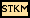
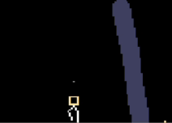

# Special特殊

特殊元素具有独特的行为机制，难以归入其他分类。包含传送、复制、操控角色等高度特异化的元素。本分类共 **20** 个元素。

---

###### 橡皮(NONE)【Eraser】-------------------------------------------------------Type:000

描述：擦除粒子。Properties=0——不是固体、液体、气体或能量中的任何一种。在画布上用 NONE 覆盖已有粒子即删除。唯一没有任何属性的"元素"。Weight=100，Hardness=1，Advection/AirDrag/Gravity 等物理参数全为0。

初始温度：22℃/295.15K

---

###### 复制体(CLNE)【Clone】-------------------------------------------------------Type:009

描述：复制碰到它的任何物体。Ctype 存储被复制元素类型。

Ctype 无效时进入"学习模式"：扫描 3×3 邻域（排除 CLNE/PCLN/BCLN/STKM/PBCN），将第一个有效粒子类型写入 Ctype。Ctype 有效后每帧在随机相邻空位创建目标元素。对 LIGH 只有 1/30 概率以防止泛滥。对 LIFE 使用 Tmp 作子类型。对 LAVA 保持熔岩链。

光子可穿透(PROP_PHOTPASS)。使用 ctypeDrawVInTmp 绘制目标元素颜色——CLNE 本身会显示为它复制的那种元素的颜色。

导热率：0
初始温度：22℃/295.15K

---

###### 真空(VACU)【Vacuum】-------------------------------------------------------Type:010

描述：产生负压吸入物质并加热。TYPE_SOLID 固体型，Hardness=0。HotAir=-0.01*CFDS，强烈负热空气持续产生吸力，将周围粒子拉向自身。AirLoss=0.95 消耗空气。DefaultProperties.temp 高于室温约 70℃，加热吸入的物质。可被 BOMB/DEST 摧毁。

导热率：255
初始温度：92℃/365.15K

---

###### 虚空(VOID)【Void】----------------------------------------------------------Type:022

描述：吞噬一切物质（除固体，即使被活塞推入也无法抵抗），同时产生少量负压。TYPE_SOLID，Hardness=0 无法破坏。HotAir=-0.0003*CFDS 微负压辅助吸入。HeatConduct=251 良好导热。实际粒子删除在 STKM_interact 等函数中处理。

Ctype 可设置过滤——设为某类型后只吞噬该类型粒子（白名单），或通过 Tmp 标志位反转（黑名单排除）。

导热率：251
初始温度：22℃/295.15K

---

###### 钻石(DMND)【Diamond】------------------------------------------------------Type:028

描述：坚不可摧的终极固体。Hardness=0 意味着无法被任何常规手段破坏——爆炸、压力、高温均无效。多种破坏性元素(DMG/GBMB/DEST/BOMB 等)都硬编码跳过 DMND。HeatConduct=186 极好导热。是各种破坏效果的免疫材料，广泛用于构建不可摧毁的建筑结构和反应容器。

导热率：186
初始温度：22℃/295.15K

---

###### 黑洞(BHOL)【Black Hole】---------------------------------------------------Type:039

描述：使用需开启牛顿万有引力(N键)，产生超强引力吸入物质并升温。TYPE_SOLID 固体型，Hardness=0。颜色深黑(0x202020_rgb)。

核心机制——牛顿引力产生：每帧在所在网格设 gravIn.mass = 0.2 * (Tmp*0.001)，即 Tmp 值控制的引力强度。Tmp 范围 0~51199（对应引力 0.1P~51.2P），默认 Tmp=0 即引力也为 0。HeatConduct=186 良好导热。每帧对周围粒子施加向心加速度。

高压(>225)→同位置产生 VACU 真空。

应用：必须在全局牛顿引力开启（按 N 键）时才工作。可用于构建粒子收集器、引力陷阱或模拟天体物理现象。

导热率：186
初始温度：22℃/295.15K

---

###### 白洞(WHOL)【White Hole】---------------------------------------------------Type:040

描述：使用需开启牛顿万有引力(N键)，产生超强斥力排斥物质。TYPE_SOLID。颜色纯白(0xFFFFFF_rgb)。与 BHOL 完全相反——产生向外推力。

核心机制：gravIn.mass = -0.2 * (Tmp*0.001)，负号表示排斥。Tmp 范围 0~51199（对应排斥力 -0.1P~-51.2P），默认 Tmp=0 即斥力也为 0。HeatConduct=186。

应用：粒子分散器、防护罩（排斥危险物质靠近）、与 BHOL 配合构建引力场。

导热率：186
初始温度：22℃/295.15K

---

###### 火柴人(STKM)【Stickman】---------------------------------------------------Type:055

描述：受重力和压力影响，使用方向键控制运动，吃 PLNT 或修改 Life 可改变生命值。只能存在一个（与 STK2 共存的"双人模式"除外）。

**核心系统——Verlet 积分骨骼动画**：
- 16 条腿坐标(legs[0..15])：肩/脚各 4 组，距离约束保持结构
- comm 位掩码：bit0=左(0x01), bit1=右(0x02), bit2=跳(0x04), bit3=发射(0x08)
- 移动：eval_move 检测脚前固体障碍，不可通行时火箭靴产生 PLSM 等离子推进
- 跳跃：脚接触固体时施加反向速度。火箭靴模式下总可跳
- 发射(comm&0x08)：在头顶创建粒子。风扇模式(WL_FAN)→施压而非发射

**武器系统**：扫描头部 5×5 区域，接触粒子类型自动写入武器 elem。Ctype=当前武器元素类型。按发射键在头顶创建该类型粒子。

**生命与伤害**：Life=生命值默认 100，<243K 时减少，吃 PLNT+5，接触 NEUT 受损。SPRK→32~51 伤害。高温/低温→2 伤害/帧。DEADLY 属性+1(ACID+5)。RADIOACTIVE 属性+1。

**交互**：PRTI 传送——将整个 particle 存入 portalp 数组。死亡(life<1 或压力≥4.5)→在 3×4 区域散布武器元素粒子。

**墙体交互**：WL_FAN→风扇模式。WL_EHOLE→禁用火箭靴。WL_GRAV→启用火箭靴。WL_DETECT→通电。

初始温度：36.6℃/309.75K

---

###### 失败测试(EQVE)【Equal Velocity】------------------------------------------Type:048

描述：失败的共享速度测试——一个被废弃的实验元素。TYPE_PART 粉末型，可下坠(Falldown=1)，重量 100。无任何 Update 函数或特殊功能，仅作为历史的遗留物保留在代码库中。MenuVisible=0 不在菜单显示。

初始温度：22℃/295.15K

---

###### 烟尘(MORT)【Mort】----------------------------------------------------------Type:077

描述：持续释放烟雾并缓慢飘落。TYPE_GAS 气体型，Weight=-1 向上飘浮，Collision=-0.99 高弹性（几乎不损失能量）。每帧在(x, y-1)位置创建 SMKE 烟雾粒子。默认向右漂移(vx=2.0)。与 SMKE 不同，MORT 是烟雾的"发生器"而非烟雾本身。MenuVisible=0 不在菜单显示。

导热率：29
初始温度：22℃/295.15K

---

###### 转化器(CONV)【Converter】---------------------------------------------------Type:085

描述：将它接触到的物质的 Type 值转换为自身的 Ctype 值。Ctype 无效时进入"学习模式"扫描 3×3 邻域获取第一个有效粒子类型（排除 CLNE/PCLN/BCLN/STKM/CONV 等特殊元素）。

Ctype 有效后扫描周围 3×3：Tmp 设置过滤类型（只转换该类型），Tmp2==1 反转过滤（排除 Tmp 类型）。排除 DMND 钻石和自身/目标同类型。使用 create_part(ID(r),...) 在原位置创建新粒子并保留粒子 ID，实现"无缝转换"。PROP_NOCTYPEDRAW + ctypeDrawVInCtype 显示目标元素的颜色。

导热率：0
初始温度：22℃/295.15K

---

###### 可破坏复制体(BCLN)【Breakable Clone】------------------------------------Type:093

描述：与 CLNE 类似但可被压力破坏。Ctype 自动学习+复制目标类型粒子。Life 自动递减(PROP_LIFE_DEC|PROP_LIFE_KILL_DEC)。

压力>4.0 时 Life 设为 80~119 随机+受气流漂移，耗尽后死亡。Hardness=12 较硬但非无敌。Loss=0.50 有速度损失，AirLoss=0.97。与 CLNE 的关键区别：有使用寿命限制，高压可提前摧毁。

导热率：0
初始温度：22℃/295.15K

---

###### 爱心(LOVE)【Love】----------------------------------------------------------Type:094

描述：纯装饰/趣味元素。TYPE_SOLID 固体型。MenuVisible=0 不在菜单显示。自带 9×9 细胞自动机规则表(Element_LOVE_RuleTable)，可被 LIFE 元素引用生成心形图案——这是个"硬编码的 CA 图案生成器"。temp 默认 100℃/373K。

本身不具备物理交互功能，仅作为 LIFE 的规则数据源存在。在游戏中极为罕见，属于开发者彩蛋。

初始温度：100℃/373K

---

###### 传送门入口(PRTI)【Portal IN】----------------------------------------------Type:109

描述：传送物质和电脉冲。通过改变温度设定频道——频道=(temp-73.15)/100+1 钳制。

8 方向捕获系统：使用 portal_rx/ry 数组顺时针环绕扫描。对 TYPE_PART/LIQUID/GAS/ENERGY/SPRK/STOR 粒子进行捕获。SPRK 特殊处理：不存储 SPRK 本身，而将原位置恢复为 SPRK 的 ctype（即还原为原导体）。STOR 互通：通过 Element_PIPE_transfer_pipe_to_part 提取存储粒子。

存储到 portalp[频道][进入方向][0~79]=Particle 结构体。活动状态 fe 控制轨道粒子动画。HotAir=-0.005*CFDS 产生负压辅助吸入。

与 PIPE 的集成：PIPE 检测相邻 PRTI 时将粒子喂入传送门。WIFI 兼容：通过 WIFI 元素可远程控制频道切换。

导热率：0
初始温度：22℃/295.15K

---

###### 传送门出口(PRTO)【Portal OUT】--------------------------------------------Type:110

描述：和 PRTI 配套使用，物质从这里出来。频道设置同 PRTI——频道=(temp-73.15)/100+1。

出口方向=(进入方向+4+随机偏移±1)%8 从对面出来。从 portalp[频道][随机槽]取出粒子。SPRK 特殊处理：在 3×3 区域创建 SPRK 电脉冲。STKM/FIGH 需重置 spwn 标志防止重复出生。保留原速度（若为 0 使用新粒子默认速度）。

HotAir=+0.005*CFDS 正压与 PRTI 的负压形成压差对，产生自然的入口→出口气流。

导热率：0
初始温度：22℃/295.15K

---

###### 搞笑元素(LOLZ)【LOLZ】----------------------------------------------------Type:123

描述：来搞笑的。TYPE_SOLID 固体型。MenuVisible=0 不在菜单显示。与 LOVE 类似的细胞自动机规则表(Element_LOLZ_RuleTable)，可被 LIFE 引用生成特定 CA 图案。纯趣味/彩蛋元素。

初始温度：22℃/295.15K

---

###### 智能微粒(TRON)【Tron】------------------------------------------------------Type:143

描述：绝对零度的智能微粒，会躲避障碍，随时间流逝尾巴变长。温度始终固定在 0K（绝对零度），可用于降温。

Tmp 位掩码系统：
- bit0(0x01)=HEAD 头部——主动移动和转向
- bit1(0x02)=NOGROW 禁止尾巴生长
- bit2(0x04)=WAIT 等待一帧（暂停移动）
- bit3(0x08)=NODIE 不自然死亡
- bit4(0x10)=DEATH 撞毁消亡中
- bit5~6=移动方向编码（0左、1上、2右、3下）
- bit7~16=色相值 HSV（0~359 色调，32 色调分辨率）
- bit17(0x10000)=NORANDOM 禁用随机转向

头部行为：优先直行，约 1/170 概率随机转弯。前方堵塞时检查左右两侧，选择能走最远的方向。trontrymovetron 进行视线检测。创建新头部时旧头部变为尾部节点。

尾部淡化：非头部粒子颜色 alpha 随 life/tmp2 递减，产生"拖尾"视觉效果。死亡：TRON_DEATH 触发放焰特效。颜色使用 HSV_to_RGB 实现彩虹色。PMODE_GLOW 发光模式渲染。

应用：降温器（0K 恒温）、粒子追踪展示、贪吃蛇风格小游戏、装饰性光轨。

导热率：0
初始温度：0K（绝对零度）

---

###### 打手(FIGH)【Fighter】-------------------------------------------------------Type:157

描述：电脑 AI 控制的火柴人，会追踪并攻击玩家 STKM。可同时存在多个(MAX_FIGHTERS 上限)。

**参数系统**：Tmp=fighters 数组索引（唯一标识）。Tmp2=AI 状态(0=静止，1=追踪)。Ctype=武器元素类型。Life=100 生命值。

**AI 行为逻辑**：
- 目标选择：扫描所有 FIGH 和 STKM，选择最近的 STKM 为目标
- 攻击决策：距离<24.5px 且持有危险武器(LIGH/NEUT/DEADLY/RADIOACTIVE/极端温度)→发射
- 移动：目标距离远→判断方向左右移动。被障碍阻挡→反向
- 跳跃：前方上方有障碍或脚下无支撑→跳跃
- 运动执行：复用 STKM 的 run_stickman 物理引擎，每帧调用 eval_move 碰撞检测

与 STKM 的区别：完全由 AI 驱动，不受玩家控制。不会主动吃 PLNT 回血。可作敌方 NPC 或自动化守卫。

初始温度：36.6℃/309.75K

---

###### 火柴人二号(STK2)【Stickman 2】--------------------------------------------Type:167

描述：与 STKM 完全相同但使用 **WASD** 控制（而非方向键）。关联 sim->player2，创建时生成 SPWN2 粒子。

双人模式：STKM(方向键)和 STK2(WASD)可同时存在。两人共用同一个模拟空间，可互相攻击（发射武器粒子伤害对方）。SPAWN2 标记其出生位置。

其余所有机制——骨骼动画、武器学习、生命系统、墙体交互——均与 STKM 完全相同。

初始温度：36.6℃/309.75K

---

###### 排气孔(VENT)【Vent】-------------------------------------------------------Type:189

描述：产生正压排出物质并降温。TYPE_SOLID 固体型，Hardness=0。HotAir=+0.01*CFDS 强烈正热空气持续产生推力，将粒子推离自身。与 VACU(真空)完全相反。DefaultProperties.temp 默认低于室温约 16℃，冷却周围物质。可被 BOMB/DEST 摧毁。

应用：粒子分散、气压驱动引擎、与 VACU 配合构建气压循环系统。

导热率：255
初始温度：6℃/279.15K

---

## 元素间交互矩阵

| 入口→出口 | 机制 |
|-----------|------|
| PRTI + PRTO | 传送门配对（同频道物质传输） |
| PRTI/PRTO + PIPE | 管道→传送门加速运输 |
| PRTI/PRTO + WIFI | 远程频道切换 |
| CLNE + DMND | 无法复制钻石 |
| VOID + DMND | 无法吞噬钻石 |
| STKM/STK2 武器 + FIGH | 玩家攻击 AI |
| FIGH + STKM | AI 追踪攻击玩家 |
| VACU + VENT | 低压/高压配对构建气压流 |
| BHOL + WHOL | 引力/斥力配对构建力场 |

---

*注：VINE(藤蔓)虽在源码中属于 SC_SOLIDS 固体类，因其特殊生长机制被收录于[固体](固体.md)分类。SPWN/SPWN2 火柴人出生点亦收录于固体分类。*
