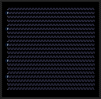
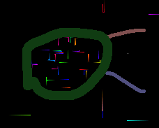
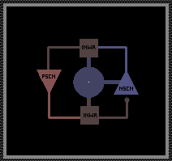
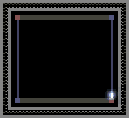
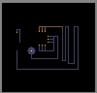

# Electronics 电子类

电子类元素构成TPT的逻辑控制系统。通过SPRK电脉冲信号进行激活和控制。包含导体、半导体、开关、发射器等各类电子元件。本分类共21个元素。

---

## 传导规则总纲

### 一、SPRK生命周期

SPRK不能单独放置，必须通过以下方式产生：
1. BTRY在范围2内对符合条件的导体直接通电
2. 已存在的SPRK向相邻导体传导
3. PSCN被PHOT光子撞击产生SPRK（太阳能电池板效应）
4. INST通过FloodINST瞬间传播
5. WIFI无线接收

SPRK创建后，其`life`值每帧递减1。life耗尽后，粒子还原为`ctype`记录的底层导体类型。

**各导体上SPRK的初始life与帧行为：**

| 导体 | 初始life | 传导周期 | 每帧行为 | 备注 |
|------|---------|---------|---------|------|
| METL/PSCN/NSCN/大多数导体 | 4 | 4帧 | life递减，life>0时激发态 | 标准导体 |
| WATR（水） | 6 | 6帧 | 同上 | 液态导体 |
| SLTW（盐水） | 5 | 5帧 | 同上 | 液态导体 |
| SWCH（开关） | 14（ON）/9（OFF） | 不等 | ON时life>=10持续激活 | 特殊life机制 |
| RSST（电阻） | 5 | 5帧 | life耗尽后自身销毁 | 一次性 |
| INST | 4→FloodINST | 同帧 | 瞬间传播到全部连通INST | 最快导体 |
| ETRD | 9（目标端） | 9帧 | life==1时触发等离子连线 | 电极特殊处理 |
| TUNG | 4 | 4帧 | 每帧随机加热-4到15 | 钨加热 |

**SPRK的帧级传导机制（标准导体）：**
- 第1帧（life=4）：SPRK刚产生，处于激发态，探测周围可导电目标
- 第2帧（life=3）：激发态，周围导体的检测窗口（ARAY/DRAY在此时被触发，要求SPRK.life==3）
- 第3帧（life=2）：激发态，继续传播
- 第4帧（life=1）：激发态，最后一帧有效传导（ETRD在life==1时执行等离子体连线）
- 第5帧（life=0）：死亡帧，粒子还原为ctype导体

**parts_avg绝缘检测：**
当SPRK向相邻导体传导时，检测两粒子中点位置 `((x1+x2)/2, (y1+y2)/2)` 是否存在INSL或RSSS粒子。若存在，传导被阻断。这意味着1像素宽的INSL即可阻断2像素间距内的传导。例外情况：
- SWCH的范围2互锁传导（不经过parts_avg检测）
- BTRY的范围2直接通电（不经过parts_avg检测）
- WIFI的无线传输（不涉及中点检测）
- TESC生成LIGH闪电（直接从邻格跳跃生成）

**非legacy模式自加热：**
SPRK在传导成功时，若目标导体为METL/BMTL/BRMT/PSCN/NSCN/ETRD/NBLE/IRON，目标温度+10℃。METL若被连续通电会自加热叠加导致热失控熔化。

---

### 二、完整传导矩阵

#### 发送端（SPRK骑在元素X上时，X作为sender可以向谁传导）：

| Sender | 可传导至 |
|--------|---------|
| METL | 所有导体（无任何限制） |
| PSCN | 所有导体 **除NSCN外** |
| NSCN | 所有导体 |
| NTCT | 始终→PSCN；温度>100℃→NSCN；温度>100℃→所有其他导体 |
| PTCT | 始终→PSCN；温度<100℃→NSCN；温度<100℃→所有其他导体 |
| ETRD | 仅METL/BMTL/BRMT/LRBD/RBDM/PSCN/NSCN |
| BTRY | 范围2内所有导体（排除WATR/SLTW/NTCT/PTCT/INWR） |
| SWCH(ON) | 所有导体（排除PSCN/NSCN/WATR/SLTW/NTCT/PTCT/INWR） |
| SWCH(OFF) | 不传导 |
| INWR | 仅PSCN和NSCN |
| TESC | 不传导（产生LIGH闪电） |
| INST | 仅NSCN（内部通过FloodINST瞬时传播） |
| WIFI | 不直接传导（无线系统） |
| TUNG | 所有导体 |
| WWLD | 仅NSCN（当WWLD自身为"头"状态时） |

#### 接收端（何种SPRK可以激活元素X）：

| Receiver | 可被谁激活 |
|----------|-----------|
| METL | 所有导体sender |
| PSCN | 所有导体sender |
| NSCN | 所有导体sender **除PSCN外** |
| NTCT | 始终被NSCN激活；被PSCN激活需NTCT自身温度>100℃ |
| PTCT | 始终被NSCN激活；被PSCN激活需PTCT自身温度<100℃ |
| INWR | 仅PSCN或NSCN |
| INST | 仅PSCN |
| SWCH | PSCN→开启(life=10)；NSCN→关闭(life=9) |
| TESC | 任何导体SPRK |
| ETRD | 任何导体SPRK（life==1时触发等离子） |
| BTRY | 不接收导电（自身是源） |
| ARAY | SPRK且life==3（由SPRK来向决定发射方向） |
| CRAY | 相邻SPRK（由SPRK来向决定发射方向） |
| DRAY | SPRK且life==3 |
| WIFI | SPRK且life>=3且ctype!=NSCN |
| EMP | SPRK且0<life<4（任意导体上的SPRK） |
| WWLD | SPRK且life==3且ctype==PSCN |

---

### 三、快速参考总表

| 元素 | 中文名 | 类型 | 导体角色 | 特殊行为 | 熔融产物 |
|------|--------|------|---------|---------|---------|
| METL | 金属 | 固体/导体 | 收发双向 | 唯一无限导体，自加热+10℃ | LAVA(METL) |
| SPRK | 电脉冲 | 能量/临时 | 依附态 | life耗尽还原为ctype | 无（还原为ctype） |
| PSCN | P型硅 | 固体/半导体 | 收发（除→NSCN） | 太阳能效应，二极管正向 | LAVA(PSCN) |
| NSCN | N型硅 | 固体/半导体 | 收发 | 不能触发WIFI/INST | LAVA(NSCN) |
| INSL | 绝缘体 | 固体/绝缘体 | 无 | parts_avg阻断，热绝缘 | 无（易燃） |
| NTCT | NTC热敏电阻 | 固体/半导体 | 高温收发 | >100℃导电，自冷却2.5K/帧 | LAVA(NTCT) |
| PTCT | PTC热敏电阻 | 固体/半导体 | 低温收发 | <100℃导电，自冷却2.5K/帧 | LAVA(PTCT) |
| ETRD | 电极 | 固体/导体 | sender受限 | 两电极间生成PLSM连线 | LAVA(ETRD) |
| BTRY | 电池 | 固体/电源 | 仅发不收 | 范围2无限供电 | PLSM(>2273℃) |
| SWCH | 开关 | 固体/导体 | ON时受限 | PSCN开/NSCN关，范围2互锁 | BREC(EMP)/LAVA |
| INWR | 绝缘线 | 固体/导体 | 仅PSCN↔NSCN | 最受限导体，隔离信号 | LAVA(INWR) |
| TESC | 特斯拉线圈 | 固体/特殊 | 不导电 | 生成LIGH闪电 | LAVA(TESC) |
| INST | 瞬时导体 | 固体/导体 | 仅PSCN→NSCN | FloodINST同帧全传播 | 不可熔融 |
| WIFI | 无线模块 | 固体/特殊 | 无线 | 频道制双缓冲无线 | BRMT/BREC |
| ARAY | A射线发射器 | 固体/特殊 | 不导电 | 发射BRAY射线 | BREC(EMP) |
| BRAY | B射线 | 能量/射线 | 不导电 | 被ARAY操控，无独立update | 生命耗尽消亡 |
| EMP | 电磁脉冲 | 固体/武器 | 不导电 | 全局摧毁带电电子元件 | 无（一次性脉冲） |
| CRAY | C射线发射器 | 固体/特殊 | 不导电 | 发射任意粒子束 | 不可熔融 |
| TUNG | 钨 | 固体/导体 | 收发双向 | 极耐热(3695℃)，怕压力变化 | BRMT/LAVA/FIRE |
| DRAY | D射线发射器 | 固体/特殊 | 不导电 | 复制前方粒子 | 不可熔融 |
| WWLD | WireWorld线 | 固体/自机 | PSCN→→NSCN | WireWorld细胞自动机 | 不可熔融 |

---

## 各元素详解

---

### 金属 (METL) -- Metal -- Type:014



| 属性 | 值 |
|------|-----|
| 内部标识 | METL |
| 中文名 | 金属 |
| 颜色 | 灰色 #C0C0C0（高温下发光变红） |
| 类型 | 固体 / 导体 |
| 重量 | 100 |
| 硬度 | 1 |
| 热导率 | 251 |
| 导电性 | 双向，无任何传导限制 |
| 熔点 | 999.85℃ / 1273.15K |
| 初始温度 | 22.00℃ / 295.15K |
| 可燃性 | 0（不可燃） |
| 爆炸性 | 0 |
| 可熔性 | 是 → LAVA(METL) |

**描述：**
最基础的导体。1个像素即可导电，两导体间距不超过1像素时空隙仍可通电（通过parts_avg中点检测，若无INSL则可通过）。电子通过时会将其加热，非legacy模式下每次成功传导目标温度+10℃。

**参数详表：**

| 参数 | 说明 | 取值范围 |
|------|------|---------|
| temp | 当前温度 | 22℃~999.85℃（固态），超过则熔化 |
| life | 标准SPRK life（当骑有SPRK时） | 4→0（4帧周期） |
| ctype | SPRK还原目标 | 被设定为METL |
| tmp | 未使用 | — |
| tmp2 | 未使用 | — |

**深层机制——帧级传导过程：**
1. METL粒子被相邻SPRK激活→自身变为SPRK(ctype=METL, life=4)
2. life=4/3/2/1：四帧激发态，每帧扫描周围8格（正交+对角）
3. 对每个邻格的导体目标，检测中点是否有INSL/RSSS阻断
4. 无阻断→目标导体变为SPRK（继承相关life，通常为4）
5. 非legacy模式下，目标导体温度+10℃
6. life=0：SPRK粒子还原为普通METL粒子

**制取方法：**
- 铁(IRON)熔化后倒在煤(COAL)或煤粉(BCOL)上冷却可得——这是模拟冶铁过程。
- 直接使用元素菜单放置。

**实用电路模式：**

1. **基础导线（Bus Line）：**
   ```
   BTRY → METL → METL → METL → ... → 目标元件
   ```
   最简单的一对一信号传输。METL作为万能导体，不挑输入端。

2. **星形配电（Star Distribution）：**
   ```
           → METL → 设备A
   BTRY → METL → METL → 设备B
           → METL → 设备C
   ```
   由于METL无传导限制，非常适合中央配电。

3. **热控断路（Thermal Cutoff）：**
   ```
   BTRY → METL（长线） → SWCH → 目标
   ```
   利用METL自加热特性：长线持续通电时温度逐渐升高，若靠近热敏元件（NTCT/PTCT）可实现热控反馈。

**常见陷阱：**
- **热失控（Thermal Runaway）：** METL每接收一次SPRK自加热+10℃，如果电路长时间高频通电（例如BTRY每帧都在范围2内刷新SPRK），METL会持续升温直至999.85℃熔化，变成LAVA毁坏整个电路。对策：加散热结构（如接触高导热率的非导电物质）或使用SWCH限制通电时间。
- **熔毁蔓延：** METL熔化后变成的LAVA(METL)会流动并破坏周围元件，可能需要用墙体隔离。
- **短路：** 因为METL向所有导体导电，不小心触碰NSCN或其他控制线会造成信号污染。在精密电路中用INWR或INSL隔离。
- **Legacy模式差异：** 在legacy模式下不执行自加热，电路不会热失控。非legacy模式下必须考虑散热。

**反应：**
- METL(>999.85℃) → LAVA(METL)
- METL + SPRK传导（非legacy）→ METL温度+10℃

---

### 电脉冲 (SPRK) -- Spark -- Type:015


| 属性 | 值 |
|------|-----|
| 内部标识 | SPRK |
| 中文名 | 电脉冲 |
| 颜色 | 继承自ctype导体（通常高亮闪烁） |
| 类型 | 能量 / 临时粒子 |
| 重量 | 100 |
| 硬度 | 1 |
| 热导率 | 251 |
| 导电性 | 依附于ctype导体决定传导规则 |
| 熔点 | 无（life耗尽后还原为ctype，而非熔化） |
| 初始温度 | 22.00℃ / 295.15K |
| 可燃性 | 0 |
| 爆炸性 | 0 |

**描述：**
所有电子设备的基础。SPRK不能单独放置，必须放在导体上才会产生。life每帧递减，耗尽后粒子还原为ctype记录的导体类型。SPRK无独立update函数——所有行为在 `part_update` 的 `case PT_SPRK:` 分支及其对ctype的switch-case中处理。

**参数详表：**

| 参数 | 说明 | 取值范围 |
|------|------|---------|
| life | 剩余激发帧数 | 4~14（取决于ctype），每帧-1，0时消亡 |
| ctype | 底层导体类型（还原目标） | 任意导体标识（METL/PSCN/NSCN/ETRD/TESC/...） |
| temp | 当前温度 | 继承自生成源，传导时会改变 |
| tmp | 未直接使用（由ctype子逻辑使用） | — |
| tmp2 | 未直接使用（由ctype子逻辑使用） | — |

**深层机制——SPRK的ctype分支行为：**
SPRK的update入口在 `part_update` 中根据 `parts[i].ctype` 做switch：

```
case PT_METL/PSCN/NSCN/...（标准导体）:
  → 标准传导逻辑（8方向扫描，parts_avg检测，life递减）
case PT_TESC:
  → TESC闪电生成逻辑（LIGH创建、tmp频率控制）
case PT_ETRD:
  → 电极等离子连线逻辑（life==1时搜索最近ETRD）
case PT_NBLE:
  → NBLE→PLSM转换+压力产生
case PT_IRON:
  → 电解水逻辑（相邻WATR→O2/H2）
case PT_TUNG:
  → 钨加热逻辑（温度低于3595℃时随机加热-4到15）
case PT_SWCH:
  → 开关互锁逻辑（范围2检测）
```

**各导体上SPRK的完整生命周期表：**

| ctype | 初始life | 第1帧(life=X) | 中间帧 | 末帧(life=1) | 死亡(life=0) |
|-------|---------|--------------|--------|-------------|-------------|
| METL | 4 | 激发传导 | life=3/2传导 | 末次传导 | 还原METL |
| PSCN | 4 | 激发传导（不传NSCN） | life=3传导（ARAY在life=3激活） | 末次传导 | 还原PSCN |
| NSCN | 4 | 激发传导 | life=3/2传导 | 末次传导 | 还原NSCN |
| WATR | 6 | 激发传导 | life=5→2传导 | 末次传导 | 还原WATR |
| SLTW | 5 | 激发传导 | life=4→2传导 | 末次传导 | 还原SLTW |
| SWCH | 14(ON) | 激发（持续≥10） | 维持ON | 维持ON | life=9(OFF) |
| RSST | 5 | 激发传导 | 3→1传导 | 末次传导 | **自身销毁** |
| TESC | 4 | 闪电生成 | life=3/2生成 | life=1生成 | 还原TESC |
| ETRD | 4(源端) | 正常传导 | life=3/2 | life=1→搜索目标 | 还原(源端还原为life=20非SPRK态) |
| ETRD(目标) | 9 | 激发传导 | 递减 | life=8→2传导 | 还原ETRD |
| TUNG | 4 | 激发+加热 | 3/2加热 | 末次加热 | 还原TUNG |

**实用电路模式：**

1. **信号观测：** SPRK的高亮闪烁是调试电路的可视化指示器——找到哪个位置的粒子在闪烁就知道信号传到了哪里。
2. **ARAY/DRAY触发窗口：** ARAY和DRAY只在SPRK.life==3时被激活。这意味着需要精确控制在SPRK产生的第2帧（life从4减到3时）让SPRK到达ARAY/DRAY。长距离传输时计算帧延迟很重要。
3. **单脉冲生成：** BTRY→METL→SWCH（用SWCH限制只产生一次脉冲，然后关闭）。

**常见陷阱：**
- **不能直接放置SPRK：** 必须在导体现有粒子上通过BTRY或传导产生。许多新手试图用笔刷画SPRK但发现它立刻消失。
- **life耗尽时机：** SPRK的寿命因ctype而异。在ETRD电路中，必须确保SPRK到达ETRD时life=1才会触发等离子体连线——如果在life=3/2到达，只会正常传导而不会触发。
- **PSCN触发ARAY的时机：** ARAY要求life==3，如果SPRK经过长距离PSCN线路到达ARAY时life已减至2或1，不会触发——需缩短距离或在中间加BTRY刷新。
- **WIFI排除NSCN：** SPRK的ctype为NSCN时无法触发WIFI发送。如果需要通过WIFI转发NSCN端的信号，必须经过中间导体转换（NSCN→METL→WIFI）。
- **自加热积累：** 若BTRY每帧刷新SPRK（life重置为4），导体温度持续+10℃，不考虑散热会热失控。

**反应：**
- SPRK(IRON上) + WATR/DSTW/SLTW → O2(1%概率) 或 H2(2%概率)（电解水）
- SPRK(NBLE上, life≤1) → PLSM替换NBLE
- SPRK(ETRD上, life=1) + 最近ETRD → 两点间PLSM连线
- SPRK(TESC上) → 每帧依概率生成LIGH闪电
- SPRK(TUNG上, temp<3595℃) → 每帧随机加热-4到15

---

### P型硅 (PSCN) -- P-type Silicon -- Type:035


| 属性 | 值 |
|------|-----|
| 内部标识 | PSCN |
| 中文名 | P型硅 |
| 颜色 | 棕红色 #805050 |
| 类型 | 固体 / 半导体 |
| 重量 | 100 |
| 硬度 | 10 |
| 热导率 | 251 |
| 导电性 | 收发双向，但作为sender不向NSCN传导 |
| 熔点 | 1413.85℃ / 1687.15K |
| 初始温度 | 22.00℃ / 295.15K |
| 可燃性 | 0 |
| 爆炸性 | 0 |
| 可熔性 | 是 → LAVA(PSCN) |

**描述：**
可向任何导体传导电脉冲——除了NSCN。这是TPT二极管效应的核心。"万能输入端"，从任何导体接收信号。PSCN与NSCN紧贴可形成太阳能电池板：光子(PHOT)撞击P型硅时直接产生SPRK电脉冲（无需BTRY），模拟光伏效应。

**参数详表：**

| 参数 | 说明 | 取值范围 |
|------|------|---------|
| temp | 当前温度 | 22℃~1413.85℃（固态），超过则熔化 |
| life | SPRK life（当骑有SPRK时） | 4→0（4帧周期） |
| ctype | SPRK还原目标 | PSCN |
| tmp | 未使用 | — |
| tmp2 | 未使用 | — |

**深层机制——二极管效应详解：**

PSCN的传导规则在代码中被硬编码为核心不对称性：

```
sender==PSCN 且 receiver==NSCN → 阻断（No conduction）
```

所有其他sender/receiver组合均正常。这构成了整个TPT二极管逻辑的基础：
- **正向（P→N不可）：** PSCN不能向NSCN传导。信号只能单向流动。
- **反向（N→P可）：** NSCN可以向PSCN传导。
- **为什么？** 这保证了PN结的单向导通性。信号只能从PSCN侧流入、从NSCN侧流出。

**太阳能电池板机制：**
当光子(PHOT)碰撞到PSCN粒子时：
1. 检测该PSCN粒子是否与NSCN粒子相邻（任意方向）
2. 若存在相邻NSCN：PSCN粒子变为SPRK(life=4, ctype=PSCN)
3. SPRK向周围传导（但因P→N阻断，不会直接传给相邻NSCN，需要经过中间导体路径）
4. 这是模拟PN结的光生伏特效应

**对特定元素的控制信号：**

| 目标元素 | 控制效果 | life/tmp设定 |
|---------|---------|-------------|
| SWCH | 开启开关 | life=10 |
| INST | 触发FloodINST瞬间填满 | — |
| ARAY | Destroy模式（红色BRAY） | 发射红色毁灭射线 |
| DRAY | Overwrite覆盖复制模式 | tmp=2 |
| PUMP/GPMP/HSWC/PBCN | 激活 | life=10 |
| LCRY（液晶） | 激活态 | tmp=2 |
| PPIP（管道泵） | 开启运输 | flood_trigger |

**实用电路模式：**

1. **PN结二极管（最基础）：**
   ```
   输入 → PSCN → (阻断) → NSCN → 不允许
   输入 → NSCN → PSCN → 输出 → 允许
   ```
   信号只能沿N→P方向通过。这是构建一切逻辑电路的基础。

2. **太阳能电池板：**
   ```
   PHOT源（太阳/光源） ↓
   PSCN ←（光子碰撞产生SPRK）→ NSCN（相邻但不直接导电）
                ↓
              经由中间METL输出
   ```
   PSCN和NSCN必须相邻放置。PHOT撞击PSCN时产生SPRK。

3. **信号路由器（Demux）：**
   ```
   输入 → METL → PSCN → 分支A（除NSCN外的目标）
                     → 分支B（除NSCN外的目标）
   ```
   利用PSCN的万能输出特性，一个信号源可以同时驱动多个目标。

**常见陷阱：**
- **P→N断开：** 最常见的电路bug。如果你发现信号从PSCN传不到NSCN——这不是错误，是设计特性。需要用中间导体（如METL）桥接，或重新设计信号流向。
- **太阳能板间距：** PSCN和NSCN必须紧邻（8方向中任意），间距>1则PHOT撞击PSCN不会生成SPRK。
- **SPRK.ctype污染：** 当SPRK通过PSCN传导时，SPRK的ctype变为PSCN。后续所有传导都会继承PSCN的规则（不向NSCN传导）。如果信号之后需要传回NSCN，需要经过一个中间BTRY刷新，或使用METL作为中转。
- **ARAY被PSCN意外激活：** 如果邻格PSCN上有SPRK且life==3，ARAY会被触发进入Destroy模式（红色BRAY）而非预期模式。

**反应：**
- PSCN(>1413.85℃) → LAVA(PSCN)
- PHOT + PSCN（相邻NSCN）→ PSCN变为SPRK（太阳能效应）

---

### N型硅 (NSCN) -- N-type Silicon -- Type:036


| 属性 | 值 |
|------|-----|
| 内部标识 | NSCN |
| 中文名 | N型硅 |
| 颜色 | 蓝紫色 #505080 |
| 类型 | 固体 / 半导体 |
| 重量 | 100 |
| 硬度 | 10 |
| 热导率 | 251 |
| 导电性 | 收发双向，不接受PSCN输入 |
| 熔点 | 1413.85℃ / 1687.15K |
| 初始温度 | 22.00℃ / 295.15K |
| 可燃性 | 0 |
| 爆炸性 | 0 |
| 可熔性 | 是 → LAVA(NSCN) |

**描述：**
可向任何导体传导电脉冲，是"万能输出端"。但PSCN不能向NSCN传导，所以信号只能从PSCN单向流向NSCN。与PSCN结合可形成PN结（二极管），也可制作太阳能电池板。用于关闭可控材料和制作逻辑电路。

**参数详表：**

| 参数 | 说明 | 取值范围 |
|------|------|---------|
| temp | 当前温度 | 22℃~1413.85℃（固态），超过则熔化 |
| life | SPRK life（当骑有SPRK时） | 4→0（4帧周期） |
| ctype | SPRK还原目标 | NSCN |
| tmp | 未使用 | — |
| tmp2 | 未使用 | — |

**重要限制——NSCN不能触发的对象：**
- WIFI不接受ctype==NSCN的SPRK进行发送
- INST只接受PSCN输入，不接受NSCN
- 这意味着NSCN作为信号源时，无线传输和瞬时传输都不可用

**对特定元素的控制信号：**

| 目标元素 | 控制效果 | life/tmp设定 |
|---------|---------|-------------|
| SWCH | 关闭开关 | life=9, ctype=PT_NONE |
| PUMP/GPMP/HSWC/PBCN | 关闭 | life=9 |
| LCRY（液晶） | 淡出态 | tmp=1 |
| PPIP（管道泵） | 停止运输 | flood_trigger |
| ARAY | 普通模式（白色BRAY） | 正常发射 |

**深层机制——PN结对偶：**

NSCN和PSCN形成完整的逻辑控制对偶关系：

| 功能 | PSCN作用 | NSCN作用 |
|------|---------|---------|
| SWCH控制 | 开启(life=10) | 关闭(life=9, ctype=PT_NONE) |
| PUMP/GPMP | 激活(life=10) | 关闭(life=9) |
| LCRY | 激活(tmp=2) | 淡出(tmp=1) |
| ARAY | Destroy模式（红BRAY） | Normal模式（白BRAY） |
| 传导方向 | →除NSCN外所有 | →所有 |
| 被谁激活 | 所有sender | 除PSCN外所有sender |

**实用电路模式：**

1. **输出缓冲（Output Buffer）：**
   ```
   逻辑电路 → PSCN → (空) → NSCN → 输出设备
   ```
   PSCN不能直接到NSCN，但通过空间隙（不超过1像素）+ 无INSL阻断，SPRK可以跨越空位传播。或者中间放METL桥接。

2. **开关控制对：**
   ```
   PSCN → SWCH（开启）
   NSCN → SWCH（关闭）
   ```
   PSCN和NSCN分别控制同一个SWCH的开和关，实现置位/复位。

3. **逻辑非门（利用WIFI排除）：**
   ```
   信号源(NSCN型) → WIFI → 不触发！
   ```
   NSCN信号不能激活WIFI，可用于构建"当信号来自NSCN时不转发"的逻辑。

**常见陷阱：**
- **NSCN作为信号源传给WIFI失败：** 这是最常见的问题。WIFI检测 `ctype!=NSCN`，如果SPRK的ctype是NSCN，WIFI不会发送。解决方法：在NSCN和WIFI之间插入一个METL来改变SPRK的ctype——METL接收NSCN的SPRK后，SPRK的ctype变为METL，然后就可以传给WIFI了。
- **INST不接受NSCN：** 如果试图用NSCN驱动INST做高速信号传输，不会工作。必须用PSCN。
- **NSCN向PSCN反向导通：** 虽然P不能传N，但N可以传P。这在某些电路中可能造成意外的反向信号路径。
- **SPRK.ctype继承：** NSCN→METL→ARAY：中间的METL会改变SPRK的ctype为METL，ARAY将以普通模式（白色BRAY）而非NSCN特有的模式工作。

**反应：**
- NSCN(>1413.85℃) → LAVA(NSCN)

---

### 绝缘体 (INSL) -- Insulator -- Type:038


| 属性 | 值 |
|------|-----|
| 内部标识 | INSL |
| 中文名 | 绝缘体 |
| 颜色 | 浅灰白色 #9E9E9E |
| 类型 | 固体 / 绝缘体 |
| 重量 | 100 |
| 硬度 | 10 |
| 热导率 | 0（完全热绝缘） |
| 导电性 | 无（阻断电脉冲） |
| 熔点 | 无明确熔点（易燃烧毁） |
| 初始温度 | 22.00℃ / 295.15K |
| 可燃性 | 7（高度易燃） |
| 爆炸性 | 0 |

**描述：**
既不吸收也不释放热量给其它元素（热导率0，完全热绝缘），可用于保护热敏感元件。INSL的绝缘功能通过SPRK传导系统的parts_avg检测实现：当两导体之间的中点位置有INSL粒子时，电脉冲被阻断。1个像素宽的INSL即可起到完全阻断作用。

**参数详表：**

| 参数 | 说明 | 取值范围 |
|------|------|---------|
| temp | 当前温度 | 22℃起，高温会燃烧 |
| life | 燃烧时使用 | 燃烧life计数 |
| tmp | 未使用 | — |
| tmp2 | 未使用 | — |

**深层机制——parts_avg中点检测原理：**

当SPRK扫描周围8格寻找可导电目标时：
1. 对于每个候选目标导体（在8个方向之一）
2. 计算两点坐标中点：mid_x = (x1 + x2) / 2, mid_y = (y1 + y2) / 2
3. 检测mid位置是否被INSL或RSSS粒子占据
4. 若有→跳过此方向，不传导
5. 若无→正常传导

这意味着：
- 两导体间距1像素（中间有一个像素空隙）→ 空隙位置的INSL可阻断
- 两导体直接相邻（间距0，中点就在边界上）→ 边界上有INSL可阻断
- INS只需要1个像素宽即可作为"墙"阻断两侧导体

**parts_avg检测的例外（不经过中点检测的传导方式）：**

| 传导方式 | 说明 |
|---------|------|
| SWCH范围2互锁 | SWCH之间在曼哈顿距离≤2内的互锁检测不经过parts_avg |
| BTRY范围2通电 | BTRY在菱形范围（曼哈顿距离<4）内的直接通电不经过parts_avg |
| WIFI无线传输 | WIFI使用独立的无线频道数组，完全不涉及中点检测 |
| TESC生成LIGH | TESC产生的LIGH直接放在隔一格位置，不经过中点检测 |
| INST FloodINST | INST使用递归填充算法，不检测中点 |
| ETRD PLSM连线 | ETRD之间的PLSM生成使用Bresenham画线算法，直接检测线路上是否有INSL（而非中点检测） |

**实用电路模式：**

1. **平行线隔离：**
   ```
   METL ==== METL ==== METL
   INSL    INSL    INSL
   METL ==== METL ==== METL
   ```
   上下两根METL线平行走线，中间用INSL隔开，确保不会互相干扰。

2. **转角保护：**
   ```
   METL → INSL（阻断）
        ↓
       METL（另一条线，不受上方信号干扰）
   ```

3. **热隔离层：**
   由于热导率=0，INSL可以放在热源（如等离子体）和热敏感元件之间防止热量传导。

**常见陷阱：**
- **高度易燃（可燃性=7）：** INSL碰到明火(FIRE/PLSM/LAVA)会燃烧，燃烧的INSL会失去绝缘能力并产生高温。不能用INSL隔离高温区域。
- **遮挡BTRY：** 虽然INSL可以阻断SPRK传导，但BTRY范围2内的导体仍会被直接通电——BTRY不经过parts_avg检测。如果你想阻止BTRY的信号，不能用INSL，需要移除导体或更改BTRY位置。
- **ETRD画线检测差异：** ETRD生成PLSM时直接检查线路上每个像素是否有INSL，而不是中点检测。所以INSL在两点坐标之间的任何像素都会阻断ETRD连线。
- **SWCH/WIFI不受限：** 绝缘体无法阻止SWCH的范围2互锁通信，也无法阻止WIFI的无线信号。跨区隔离必须移除相关元件。
- **熔融物穿透：** LAVA等熔融物会替换INSL粒子，烧出一个洞。

**反应：**
- INSL + 明火 → 燃烧（可燃性7，高温破坏）

---

### 负温度系数热敏电阻 (NTCT) -- NTC Thermistor -- Type:043


| 属性 | 值 |
|------|-----|
| 内部标识 | NTCT |
| 中文名 | NTC热敏电阻（负温度系数） |
| 颜色 | 暗橄榄色 #505040 |
| 类型 | 固体 / 半导体 |
| 重量 | 100 |
| 硬度 | 10 |
| 热导率 | 251 |
| 导电性 | 温度>100℃时双向，始终→PSCN |
| 熔点 | 1413.85℃ / 1687.15K |
| 初始温度 | 22.00℃ / 295.15K |
| 可燃性 | 0 |
| 爆炸性 | 0 |
| 可熔性 | 是 → LAVA(NTCT) |

**描述：**
半导体，只有超过100℃(373.15K)时才导电。具有自冷却特性——若温度高于22℃(295.15K)，每帧自动降温2.5K。这意味着需要持续加热才能维持高温导电状态。NTC = Negative Temperature Coefficient（负温度系数），温度越高，电阻越小。

**参数详表：**

| 参数 | 说明 | 取值范围 |
|------|------|---------|
| temp | 当前温度（决定导电状态） | 22℃~1413.85℃；>100℃导电 |
| life | SPRK life（当骑有SPRK时） | 4→0 |
| ctype | SPRK还原目标 | NTCT |
| tmp | 未使用 | — |
| tmp2 | 未使用 | — |

**深层机制——温度开关逻辑：**

每帧执行以下判断：
```
if (temp > 373.15K) → 导通模式：
  - 可以作为sender向所有导体导电
  - 可以作为receiver被PSCN激活
  
if (temp <= 373.15K) → 截止模式：
  - 不能作为sender（除→PSCN始终导通）
  - 不能被PSCN激活
  - 仍然可以被NSCN激活（NSCN→NTCT始终导通）
  
自冷却：
  if (temp > 295.15K) temp -= 2.5K  // 每帧降温2.5度
```

**METL加热特效：**
当METL向NTCT传导时（无论NTCT温度多少），NTCT被强制加热至200℃(473.15K)，立即激活导电性。这是最快激活NTCT的方式。

**传导规则完整汇总：**

| NTCT作为 | 条件 | 结果 |
|----------|------|------|
| sender→PSCN | 无条件 | 始终导通 |
| sender→NSCN | temp>100℃ | 导通 |
| sender→其他 | temp>100℃ | 导通 |
| receiver←NSCN | 无条件 | 始终接收 |
| receiver←PSCN | temp>100℃ | 接收 |
| 被METL传导 | 无条件 | NTCT加热至200℃激活 |

**实用电路模式：**

1. **温度阈值报警器：**
   ```
   BTRY → METL → [加热区] → NTCT → METL → 警报设备
   ```
   加热区温度超过100℃→NTCT导通→警报通电。低于100℃自动断开。

2. **过温保护开关：**
   ```
   正常信号 → NTCT（低于100℃阻断）
   过热时 → NTCT（高于100℃导通）→ SWCH(NSCN) → 关闭主电路
   ```
   利用NSCN→SWCH关闭机制，过热时自动切断主电路。

3. **METL加热快速导通：**
   ```
   BTRY → METL → NTCT（被加热至200℃）→ 立即导通 → 下一级
   ```
   使用METL作为热触发的"钥匙"，通电即导通NTCT。

4. **双阈值窗口检测（与PTCT配合）：**
   ```
   热源 → NTCT（检测>100℃上限） + PTCT（检测<100℃下限）
   ```
   两者配合可实现"温度在安全窗口内"的判断。

**常见陷阱：**
- **自冷却导致振荡：** NTCT通电后自身会发热（非legacy模式下传导时+10℃），断电后自冷却2.5K/帧。如果每秒开关频率高，NTCT可能在100℃临界点附近振荡。需要加滞后设计。
- **NSCN始终可激活：** 即使NTCT温度低于100℃（截止状态），NSCN仍然可以向其传导。这可能在设计中引入意外的信号通路。
- **METL强制加热的副作用：** METL→NTCT会将其加热到200℃，远比100℃阈值高。这意味着NTCT在之后很长时间内（(200-100)/2.5=40帧≈0.67秒）都保持导通状态。如需快速关断，需额外冷却设计。
- **熔点为1413.85℃：** 虽然比METL高，但仍可被极端高温熔化。不能用于等离子体或熔融金属附近的温度检测。

**制取方法：**
- EMP摧毁电路导体(PSCN/INST/NSCN等)时有60%概率产生NTCT。

**反应：**
- METL→NTCT传导 → NTCT被加热至200℃
- NTCT(>1413.85℃) → LAVA(NTCT)

---

### 正温度系数热敏电阻 (PTCT) -- PTC Thermistor -- Type:046


| 属性 | 值 |
|------|-----|
| 内部标识 | PTCT |
| 中文名 | PTC热敏电阻（正温度系数） |
| 颜色 | 暗青色 #405050 |
| 类型 | 固体 / 半导体 |
| 重量 | 100 |
| 硬度 | 10 |
| 热导率 | 251 |
| 导电性 | 温度<100℃时双向，始终→PSCN |
| 熔点 | 1413.85℃ / 1687.15K |
| 初始温度 | 22.00℃ / 295.15K |
| 可燃性 | 0 |
| 爆炸性 | 0 |
| 可熔性 | 是 → LAVA(PTCT) |

**描述：**
半导体，与NTCT相反——只有低于100℃(373.15K)时才导电。同样具有自冷却特性（每帧2.5K降至22℃）。PTC = Positive Temperature Coefficient（正温度系数），温度越高，电阻越大。与NTCT形成完美互补。

**参数详表：**

| 参数 | 说明 | 取值范围 |
|------|------|---------|
| temp | 当前温度（决定导电状态） | 22℃~1413.85℃；<100℃导电 |
| life | SPRK life（当骑有SPRK时） | 4→0 |
| ctype | SPRK还原目标 | PTCT |
| tmp | 未使用 | — |
| tmp2 | 未使用 | — |

**深层机制——与NTCT的对称对比：**

| 特性 | NTCT | PTCT |
|------|------|------|
| 导电条件 | temp > 100℃ | temp < 100℃ |
| 截止条件 | temp ≤ 100℃ | temp ≥ 100℃ |
| 常温(22℃)状态 | 截止（不导电） | 导通（导电） |
| 加热后状态 | 导通 | 截止 |
| METL传导效果 | 加热至200℃→导通 | 加热至200℃→截止 |
| 始终→PSCN | 是 | 是 |
| 被NSCN激活 | 始终 | 始终 |
| 自冷却 | 是（2.5K/帧→22℃） | 是（2.5K/帧→22℃） |
| 应用场景 | 过热检测 | 低温检测/常温电路 |

**传导规则完整汇总：**

| PTCT作为 | 条件 | 结果 |
|----------|------|------|
| sender→PSCN | 无条件 | 始终导通 |
| sender→NSCN | temp<100℃ | 导通 |
| sender→其他 | temp<100℃ | 导通 |
| receiver←NSCN | 无条件 | 始终接收 |
| receiver←PSCN | temp<100℃ | 接收 |
| 被METL传导 | 无条件 | PTCT加热至200℃→截止 |

**实用电路模式：**

1. **常温导通开关：**
   ```
   BTRY → PTCT（常温22℃导通）→ 输出
   ```
   电路默认导通。当温度超过100℃时自动断开。适用于"常温工作、过热保护"的场景。

2. **温度窗口检测器（与NTCT配合）：**
   ```
                    → NTCT（>100℃导通）→ 
   温度输入 → METL <
                    → PTCT（<100℃导通）→
   ```
   同时检测两个温度条件。常温(22℃)：PTCT导通、NTCT截止。高温(>100℃)：PTCT截止、NTCT导通。两者都导通的情况理论上只在精确100℃时发生（极窄窗口）。

3. **冷启动电路：**
   ```
   BTRY → PTCT → 加热器启动 → 温度升高 → PTCT断开 → 加热器停止
   ```
   冷机启动时PTCT导通，加热器工作；达到100℃后PTCT自动切断，停止加热。

4. **热保险丝（与NTCT互补使用）：**
   ```
   BTRY → NTCT → PTCT → 输出
   ```
   常温：NTCT截止(22℃<100℃)，PTCT导通(22℃<100℃)→总电路断开。
   中温(>100℃)：NTCT导通，PTCT截止→总电路断开。
   两个串联意味着任何时候都至少有一个截止——只有精确在100℃临界点时两者同时导通（极短暂）。可用作精确的温度触发开关。

**常见陷阱：**
- **常温默认导通：** PTCT在22℃时导电。如果你期望它像NTCT一样默认为"关"，则相反——PTCT默认是"开"。在通电瞬间就可能触发下游电路。
- **METL加热→截止：** METL→PTCT加热到200℃使其立即截止。这是反直觉的——给热敏电阻通电却导致电路断开。
- **自冷却恢复时间：** 从200℃冷却到<100℃需要(200-100)/2.5=40帧。如果电路需要在过热后快速恢复，PTCT的恢复时间可能太长。
- **NSCN始终可激活：** 与NTCT同理，即使PTCT在截止状态（≥100℃），NSCN仍可向其传导。

**反应：**
- METL→PTCT传导 → PTCT被加热至200℃（关闭导电性）
- PTCT(>1413.85℃) → LAVA(PTCT)

---

### 电极 (ETRD) -- Electrode -- Type:050


| 属性 | 值 |
|------|-----|
| 内部标识 | ETRD |
| 中文名 | 电极 |
| 颜色 | 暗蓝色 #404080 |
| 类型 | 固体 / 导体（受限） |
| 重量 | 100 |
| 硬度 | 1 |
| 热导率 | 251 |
| 导电性 | 作为sender受限（仅METL/BMTL/BRMT/LRBD/RBDM/PSCN/NSCN） |
| 熔点 | 约999℃（变为LAVA） |
| 初始温度 | 22.00℃ / 295.15K |
| 可燃性 | 0 |
| 爆炸性 | 0 |
| 可熔性 | 是 → LAVA(ETRD) |

**描述：**
一旦通电，会在最近的两个电极之间产生等离子体(PLSM)连线，温度极高(9000℃+)。是TPT中产生等离子体的主要方式之一。

**参数详表：**

| 参数 | 说明 | 取值范围 |
|------|------|---------|
| temp | 当前温度 | 22℃起 |
| life | 电极的life状态（非SPRK life） | 0=可接收（候选目标）；20=已放电等待恢复；非0=正在放电/恢复中 |
| ctype | SPRK还原目标 | ETRD |
| tmp | 最小触发距离 | 任意正整数，0表示无最小限制 |
| tmp2 | 最大触发距离 | 任意正整数，0表示无最大限制 |

**深层机制——完整的放电流程：**

1. **触发条件：** SPRK骑在ETRD上，且SPRK.life==1（即SPRK在ETRD上的最后一帧激发态）
2. **搜索目标：** 遍历全场粒子，找到所有满足条件的ETRD：
   - identifier == ETRD
   - life == 0（未在放电中）
   - 距离在[tmp, tmp2]范围内（如果tmp/tmp2设置了非0值）
   - 不是源ETRD自身
3. **选择最近者：** 在符合条件的候选ETRD中选择欧氏距离最近的一个
4. **绝缘检测：** 使用Bresenham画线算法检查从源到目标的直线上是否有INSL粒子。若有→取消放电
5. **生成PLSM：** 在源和目标之间的直线路径上（不包括源和目标本身）的所有像素位置创建PLSM粒子
   - PLSM的temp = 9000℃以上（极高温度）
6. **状态更新：**
   - 源ETRD：还原为普通ETRD粒子（life设为20，表示需要恢复时间）
   - 目标ETRD：变为SPRK(life=9, ctype=ETRD)，可以继续向下一级电路传导

**life状态机的三种状态：**

| life值 | 状态 | 含义 |
|--------|------|------|
| 0 | 空闲 | 可被选为目标电极，可接收SPRK输入 |
| 20 | 刚放电恢复 | 刚作为源端放电完毕，等待恢复。每帧递减 |
| 其他(如9) | 被触发 | 作为目标端被激活，持有SPRK，向周围传导 |

**tmp/tmp2距离过滤：**
- tmp=0且tmp2=0：无距离限制，选择最近的ETRD
- tmp=10：忽略距离小于10像素的ETRD（防止太近）
- tmp2=50：忽略距离大于50像素的ETRD（防止太远）
- 两者配合：选择距离在[10, 50]范围内的最近ETRD

**实用电路模式：**

1. **等离子体发生器（Plasma Cutter）：**
   ```
   BTRY → METL → ETRD(源, life=0) ..... ETRD(目标, life=0) → 接地
                    ↑__ 等离子体连线 __↑
   ```
   两个ETRD之间产生PLSM，可用于切割、加热、点燃。

2. **单脉冲触发放电：**
   ```
   BTRY → SWCH(受控) → ETRD(源) ... 距离 ... ETRD(目标)
   ```
   通过SWCH精确控制何时触发放电，只生成一帧的等离子体连线。

3. **距离过滤的多目标系统：**
   ```
   ETRD(tmp=0, tmp2=30)  → 激活最近(<30px)的ETRD
   ETRD(tmp=30, tmp2=60) → 激活30-60px的ETRD
   ETRD(tmp=60, tmp2=0)  → 激活>60px的最近的ETRD
   ```
   通过不同的tmp/tmp2设置实现分段覆盖。

4. **等离子体点火器：**
   ```
   BTRY → ETRD(源) → PLSM → 目标物质（被点燃/熔化）
   ```
   用PLSM的超高温(9000℃+)瞬间点燃或熔化几乎所有物质。

**常见陷阱：**
- **SPRK.life必须为1：** SPRK到达ETRD时必须恰好life==1才能触发等离子体连线。如果SPRK刚产生(life=4)就到达ETRD，会正常传导而不触发。解决方法：延长SPRK到达前的路径（每1像素消耗1帧life），或在路径中插入SWCH延迟。
- **目标ETRD.life必须为0：** 如果目标ETRD正在放电恢复中（life=20或任何非0值），不会被选为目标。
- **INSL阻断：** ETRD使用画线算法逐像素检查，如果两点间任意位置有INSL粒子，放电失败。这与普通SPRK的parts_avg检测不同——INSL必须在连线上，而不是中点。
- **墙体不影响：** 普通的墙体(WALL)不会阻挡PLSM生成。只有INSL可以。PLSM会穿透墙体生成。
- **最近优先（不是最强）：** ETRD总是选最近的目标。无法指定"选第N近的"。使用tmp/tmp2可以通过范围过滤间接控制。
- **源端恢复周期：** 源端放电后life=20，在20帧内不能再次作为源端或被选为目标。这是内置的冷却时间。
- **PLSM高温破坏：** 9000℃+的PLSM会熔化/汽化接触到的几乎所有物质，包括源和目标ETRD自身周围的物质。确保周围有保护。

**反应：**
- ETRD(SPRK通电, life=1) + 最近ETRD(life=0) → 两点间PLSM连线

---

### 电池 (BTRY) -- Battery -- Type:053


| 属性 | 值 |
|------|-----|
| 内部标识 | BTRY |
| 中文名 | 电池 |
| 颜色 | 深灰色 #404040 |
| 类型 | 固体 / 电源 |
| 重量 | 100 |
| 硬度 | 1 |
| 热导率 | 251 |
| 导电性 | 仅发送（范围2菱形区域直接通电），不接受信号 |
| 熔点 | >2273℃变为PLSM |
| 初始温度 | 22.00℃ / 295.15K |
| 可燃性 | 0 |
| 爆炸性 | 0 |

**描述：**
产生无限电脉冲的电源。每帧在菱形范围（曼哈顿距离<4）内扫描导体。对满足条件的导体直接将其变为SPRK(life=4)。排除水、盐水和热敏电阻——这些需要中间导体。BTRY是TPT所有电路的起点。

**参数详表：**

| 参数 | 说明 | 取值范围 |
|------|------|---------|
| temp | 当前温度 | 22℃起，>2273℃→PLSM |
| life | 未使用 | — |
| tmp | 未使用 | — |
| tmp2 | 未激活范围计数器 | 内部使用，追踪frame活跃状态 |

**深层机制——每帧通电过程：**

```
BTRY每帧执行：
  对于范围2内（曼哈顿距离dx+dy<4）的所有粒子：
    1. 检查该粒子是否有PROP_CONDUCTS属性
    2. 检查该粒子.life == 0（未被SPRK占据）
    3. 排除以下类型：
       - WATR（水）
       - SLTW（盐水）
       - NTCT（负温度系数热敏电阻）
       - PTCT（正温度系数热敏电阻）
       - INWR（绝缘线）
    4. 检查通过 → 该粒子变为SPRK(life=4, ctype=原类型)
```

**菱形范围（曼哈顿距离<4）覆盖的形状：**

```
     #        ← dx+dy=3 (距离3)
    ###       ← dx+dy=2 (距离2)
   #####      ← dx+dy=1 (距离1)
  ###B###     ← BTRY中心 + 距离1
   #####
    ###
     #
```

总共覆盖约48个像素位置（菱形区域）。

**排除WATR/SLTW/NTCT/PTCT/INWR的原因：**
- WATR/SLTW：液态，直接通电会产生大量水蒸气(O2/H2混合)，可能爆炸
- NTCT/PTCT：热敏电阻需要温度条件才能导电，BTRY强行通电不合适
- INWR：绝缘线应只由PSCN/NSCN驱动，保持信号隔离

**为什么BTRY不经过parts_avg检测：**
BTRY使用范围2直接通电，不通过相邻像素传导。这是一项便利设计，使电路布局更灵活——可以在BTRY周围2格内放置导体而不受INSL阻隔（这同时也是一个潜在问题，见陷阱）。

**实用电路模式：**

1. **基础电源总线：**
   ```
   BTRY → METL(距离2内) → 电路干线
   ```
   最简单的供电方式。METL放在BTRY菱形范围内即可自动通电。

2. **多路配电：**
   ```
           → METL(上) → 电路A
   BTRY → METL(左) → 电路B
           → METL(右) → 电路C
           → METL(下) → 电路D
   ```
   一个BTRY同时向四个方向的电路供电。SPRK会自动沿各条线路传播。

3. **时钟信号源（与METL自加热配合）：**
   ```
   BTRY → METL(长环) → 绕回NTCT → 输出
   ```
   BTRY保持通电，METL环上SPRK持续循环。METL自加热升温，当温度触发NTCT阈值时输出信号。形成基于温度的时钟。

4. **透过INSL供电（反直觉技巧）：**
   ```
   BTRY --- INSL --- METL
   ```
   BTRY范围2内即使有INSL阻隔，METL仍会被通电。这可以用于隔离噪声但不隔离电源。

**常见陷阱：**
- **持续过热→PLSM爆炸：** BTRY温度>2273℃时变为PLSM（等离子体），高温极度危险。如果BTRY靠近热源（TESC、PLSM、ETRD连线）或自身被连续加热，可能突然变成等离子体。
- **范围2不经过INSL：** BTRY可以穿透INSL给导体通电。这是许多电路bug的来源——你以为用INSL隔离了某段导体，但BTRY仍然能给它供电。
- **必须排除的导体需要中间导体：** 如果你想用BTRY激活NTCT/PTCT，需要先用BTRY→METL→NTCT（通过METL的中转和加热）。BTRY不能直接激活它们。
- **菱形范围不对称：** 菱形范围在不同方向上覆盖不同距离。曼哈顿距离<4意味着对角方向覆盖更少的像素。
- **无法关闭BTRY：** BTRY没有"关闭"机制。它每帧都在工作。要停止信号，需用SWCH或其他开关截断输出线路。
- **多个BTRY共存：** 多个BTRY可以同时工作，各自独立产生SPRK。如果它们的输出线路相连，SPRK可能会相互干扰。

**反应：**
- BTRY(>2273℃) → PLSM（等离子体爆炸）

---

### 开关 (SWCH) -- Switch -- Type:056



| 属性 | 值 |
|------|-----|
| 内部标识 | SWCH |
| 中文名 | 开关 |
| 颜色 | 深绿色 #103010（ON时颜色更亮） |
| 类型 | 固体 / 可控导体 |
| 重量 | 100 |
| 硬度 | 1 |
| 热导率 | 251 |
| 导电性 | ON时作为sender受限（排除PSCN/NSCN/WATR/SLTW/NTCT/PTCT/INWR） |
| 熔点 | 约999℃ |
| 初始温度 | 22.00℃ / 295.15K |
| 可燃性 | 0 |
| 爆炸性 | 0 |
| 可熔性 | 是 → LAVA(SWCH) |

**描述：**
从PSCN导入电时开启(life=10)，从NSCN导入电时关闭(life=9)。life>0且!=10时每帧递减（过渡态）。开关ON时作为sender不向半导体/水/盐水/热敏电阻/绝缘线导电，只向金属等普通导体导电。

**参数详表：**

| 参数 | 说明 | 取值范围 |
|------|------|---------|
| life | 开关状态 | 0=完全关闭；1~9=过渡态；10=ON；>10=维持ON |
| temp | 当前温度 | 22℃起，EMP破坏时+2000℃ |
| ctype | SPRK骑乘时的还原目标 | SWCH |

**life状态机详解：**

```
life = 0   : 完全关闭（OFF），不导电，等待信号
life = 1~8 : 过渡态（递减中），不导电
life = 9   : OFF信号态（从NSCN设置），短暂维持后递减
life = 10  : ON信号态（从PSCN设置），导电且持续维持
life > 10  : 持续ON态（高于10），导电。每帧递减直到10
```

**ON态(life>=10)的传导限制：**

| 可传导至 | 不可传导至 |
|---------|-----------|
| METL/BMTL/BRMT | PSCN/NSCN |
| ETRD | WATR/SLTW |
| TUNG | NTCT/PTCT |
| 其他金属导体 | INWR |

这些限制确保SWCH只用于金属导线的通断控制，不干扰半导体逻辑。

**互锁机制（范围2内SWCH间的竞争解决）：**

SWCH每帧检测曼哈顿距离≤2内的其他SWCH：

1. **自身ON(life>=10)且相邻SWCH在过渡中(0<life<10)：**
   → 自身life设为9（加速关断）。防止两个SWCH同时争抢控制权。

2. **自身OFF(life<=5)且相邻SWCH为ON(life>=10)：**
   → 自身life设为对方的值（跟随开启）。实现连锁反应。

**红色BRAY远距遥控：**
红色BRAY（来自ARAY的PSCN Destroy模式，tmp=2）可远距离控制SWCH：
- 条件：正上、正下、正左、正右四个方向各有一个红BRAY（四面包围，对角不算）
- 当前life==10 → life=9（关断）
- 当前life<=5 → life=14（开启）
- 这是TPT中唯一的"非接触式"开关控制方式（除WIFI以外）

**实用电路模式：**

1. **置位/复位双控开关：**
   ```
   PSCN → SWCH（开启，SET）
   NSCN → SWCH（关闭，RESET）
   输出 ← METL → SWCH → 下游
   ```
   两个独立信号分别控制同一SWCH的开和关。

2. **开关串联（AND逻辑）：**
   ```
   BTRY → SWCH(A) → METL → SWCH(B) → 输出
   ```
   两个SWCH都ON时输出才通电。实现逻辑与门。

3. **互锁翻转（Flip-Flop/Toggle）：**
   ```
   BTRY → METL → SWCH(A)
                → SWCH(B)（在A的范围2内）
   ```
   A先ON→B跟随ON（互锁机制2）。用于双稳态电路。

4. **延时关断：**
   ```
   PSCN → SWCH(life=10) → 无持续信号 → life自动递减(10→9→8...→0)
   ```
   利用SWCH的life递减特性。PSCN脉冲激活后，SWCH从10自动减到0，期间提供一段延时的导通。

**常见陷阱：**
- **ON态不传给PSCN/NSCN：** 如果你想用SWCH输出信号去控制另一个PSCN/NSCN逻辑电路，会失败。需要SWCH→METL→PSCN（中间加METL转接）。
- **互锁冲突：** 两个SWCH互相在范围2内时可能发生意外互锁。注意SWCH之间的间距。
- **红BRAY四面包围条件苛刻：** 需要四个正方向都有红BRAY。红BRAY的tmp=2且life极短(1-2帧)，很难恰好维持四个方向的包围。实际使用中成功率不高。
- **EMP脆弱性：** EMP有1/100概率将SWCH变为BREC（碎电子元件），温度+2000℃。在需要抗干扰的电路中，SWCH可能被意外摧毁。
- **过渡态不导电：** life=1~8期间SWCH完全不导电。如果在过渡态期间收到新的PSCN信号，life被直接设为10（重置）。
- **SWCH的life==14特殊情况（红BRAY开启）：** 红BRAY将life<=5的SWCH直接设为life=14，超出标准ON值10。这意味着红BRAY开启的SWCH需要更长时间才能关断（14帧递减到0，而非10帧）。

**反应：**
- SWCH(受EMP, 概率1/100) → BREC（碎电子元件），温度+2000℃
- SWCH(>熔点) → LAVA(SWCH)

---

### 绝缘线 (INWR) -- Insulated Wire -- Type:062



| 属性 | 值 |
|------|-----|
| 内部标识 | INWR |
| 中文名 | 绝缘线 |
| 颜色 | 粉棕色 #806060 |
| 类型 | 固体 / 受限导体 |
| 重量 | 100 |
| 硬度 | 1 |
| 热导率 | 251 |
| 导电性 | 仅PSCN↔NSCN双向 |
| 熔点 | 1413.85℃ / 1687.15K |
| 初始温度 | 22.00℃ / 295.15K |
| 可燃性 | 0 |
| 爆炸性 | 0 |
| 可熔性 | 是 → LAVA(INWR) |

**描述：**
传导规则是所有导体中最受限的。只能在PSCN和NSCN之间双向传递电脉冲——专门用于PSCN与NSCN的隔离信号传输。在嘈杂电路环境中确保信号只在PSCN/NSCN之间传递，阻止METL等普通导体的干扰。

**参数详表：**

| 参数 | 说明 | 取值范围 |
|------|------|---------|
| temp | 当前温度 | 22℃~1413.85℃ |
| life | SPRK life（当骑有SPRK时） | 4→0 |
| ctype | SPRK还原目标 | INWR |

**传导规则完全对照：**

| 场景 | 结果 |
|------|------|
| INWR作为sender→PSCN | 可传导 |
| INWR作为sender→NSCN | 可传导 |
| INWR作为sender→其他任何导体 | **不可传导** |
| INWR作为receiver←PSCN | 可接收 |
| INWR作为receiver←NSCN | 可接收 |
| INWR作为receiver←其他任何导体 | **不可接收（包括METL/BTRY）** |
| METL→INWR传导 | **加热至200℃但不产生SPRK** |
| WIFI→INWR | WIFI可绕过限制直接激活INWR |
| BTRY→INWR | BTRY范围2内排除INWR（不激活） |

**为什么INWR如此受限：**
INWR的设计目的是在PSCN和NSCN之间提供一条"隔离走廊"，确保无论周围有多少杂散导体（METL等），PSCN和NSCN之间的信号传递都不会被干扰或污染。它模拟了真实电路中的屏蔽电缆概念。

**WIFI可以绕过INWR限制：**
WIFI接收模式时，会直接将相邻的INWR变为SPRK。这是INWR唯一能被非PSCN/NSCN源激活的方式。利用这个特性可以实现无线信号注入到隔离线路中。

**实用电路模式：**

1. **PSCN-NSCN远距离隔离通信：**
   ```
   PSCN → INWR → INWR → ... → INWR → NSCN
   ```
   INWR线路上不会有任何来自METL或BTRY的干扰信号。

2. **信号隔离桥（Crossing Bridge）：**
   ```
   METL === INWR === METL（下方交叉线路）
   PSCN → INWR → INWR → INWR → NSCN（上方隔离线路）
   ```
   两条线路交叉穿越时互不干扰：METL线不能激活INWR，INWR也不能激活METL线。

3. **WIFI注入隔离线路：**
   ```
   WIFI(频道X) → INWR → PSCN/NSCN
   ```
   用WIFI向一条原本只接受PSCN/NSCN输入的INWR线路注入信号。

**常见陷阱：**
- **BTRY不能直接驱动INWR：** BTRY的范围2扫描中明确排除了INWR。需要BTRY→PSCN→INWR或BTRY→NSCN→INWR。
- **METL无法连接INWR：** 如果你有一个METL干线，想分出一路到INWR——不会工作。METL→INWR只会加热INWR到200℃，但不产生SPRK。
- **INWR限制了信号类型：** 通过INWR传播的SPRK，其ctype变为INWR（接收时的SPRK.ctype=INWR）。这会影响下游元件的行为——例如，WIFI检测ctype!=NSCN，INWR可以触发WIFI，但ARAY会被INWR激活进入特殊模式（正交方向仅）。
- **DRAY/ARAY的INWR模式：** 被INWR激活的DRAY只在正交方向激活，被INWR激活的CRAY可以穿透元素并产生SPRK。这些特殊行为可能意外触发。

**反应：**
- INWR(>1413.85℃) → LAVA(INWR)
- METL→INWR → INWR加热至200℃（但不产生SPRK）
- WIFI(活跃频道)→INWR → INWR变为SPRK

---

### 特斯拉线圈 (TESC) -- Tesla Coil -- Type:088


| 属性 | 值 |
|------|-----|
| 内部标识 | TESC |
| 中文名 | 特斯拉线圈 |
| 颜色 | 紫色 #400080 |
| 类型 | 固体 / 特殊（不导电） |
| 重量 | 100 |
| 硬度 | 1 |
| 热导率 | 251 |
| 导电性 | 不直接导电（产生LIGH闪电） |
| 熔点 | 约999℃ |
| 初始温度 | 22.00℃ / 295.15K |
| 可燃性 | 0 |
| 爆炸性 | 0 |
| 可熔性 | 是 → LAVA(TESC) |

**描述：**
通电后产生闪电(LIGH)。TESC自身没有update函数，全部行为在SPRK的case PT_TESC分支中处理。当SPRK骑在TESC上时，每帧检查周围8个邻格。

**参数详表：**

| 参数 | 说明 | 取值范围 |
|------|------|---------|
| tmp | 放电强度/间隔 | 1~300（上限300），越大单次越强但频率越低 |
| temp | 当前温度 | 每次放电后自冷却(temp -= tmp*2 + temp/5) |
| life | SPRK life（当骑有SPRK时） | 4→0 |
| dcolour | 装饰颜色 | 继承到LIGH的dcolour |
| tmp2 | 保留 | TESC自身不使用 |

**深层机制——Tmp与放电概率的数学关系：**

SPRK每帧在TESC上时，对每个空邻格计算放电概率：

```
若邻格(rx, ry)为空且tmp > 4：
  放电概率 P = 1 / (tmp²/20 + 6)

生成LIGH的位置：(x + rx*2, y + ry*2)  // 隔一格位置
LIGH属性：
  life = random(0, 2 + tmp/15) + tmp/7
  temp = life * tmp / 2.5
  tmp2 = 1（标记TESC来源）
  dcolour = TESC.dcolour
```

**Tmp值权衡分析：**

| tmp值 | 放电概率(约) | 单次闪电life(约) | 单次温度(约) | 适用场景 |
|-------|------------|-----------------|------------|---------|
| 5 | 1/7.25 ≈ 13.8% | 1~2 | 中等 | 高频小闪电 |
| 10 | 1/11 ≈ 9.1% | 2~3 | 较高 | 平衡 |
| 20 | 1/26 ≈ 3.8% | 4~5 | 高 | 中频强力闪电 |
| 50 | 1/131 ≈ 0.76% | 9~11 | 极高 | 低频大闪电 |
| 100 | 1/506 ≈ 0.20% | 18~22 | 超高 | 稀有巨型闪电 |
| 200 | 1/2006 ≈ 0.05% | 36~44 | 超极高 | 极小概率超大闪电 |
| 300 | 1/4506 ≈ 0.022% | 55~66 | 最高 | 理论最大值 |

**自冷却公式：**
每次成功放电后：`temp -= tmp*2 + temp/5`
- 高频放电(tmp小)→每次冷却少但放电频繁→总冷却量大
- 低频放电(tmp大)→每次冷却多但放电稀少→总冷却量小
- TESC在持续工作中会逐渐冷却，需要SPRK传导带来的+10℃加热来平衡

**实用电路模式：**

1. **闪电发生器：**
   ```
   BTRY → METL → TESC(tmp=10~30)
                  ↓
                 LIGH（8方向随机产生）
   ```
   持续通电产生闪电。tmp=10~30为实用区间。

2. **可调频闪电：**
   ```
   BTRY → SWCH → TESC（用PSCN/NSCN控制tmp）
   ```
   通过外部电路调整TESC的tmp值，动态改变闪电频率和强度。

3. **区域防御/屏障：**
   ```
   多个TESC排列 → 通电后产生密集LIGH → 形成闪电屏障
   ```
   LIGH会破坏通过的粒子。

4. **点燃装置：**
   ```
   TESC(tmp=5, 高频) → LIGH → 可燃物质（FIRE/PLSM点燃）
   ```
   高频TESC(tp=5~10)可快速连续产LIGH用于稳定点火。

**常见陷阱：**
- **tmp必须>4才放电：** tmp=0~4的TESC完全不会产生闪电。许多新手发现TESC不工作是因为没设置tmp。
- **tmp=0的默认状态：** TESC放置时tmp=0，需要手动设置才能开始工作。
- **TESC在隔一格生成LIGH：** LIGH出现在(x+rx*2, y+ry*2)而非邻格。这意味着TESC不能直接伤害紧贴它的东西——LIGH会跳过一格。
- **自冷却耗尽：** 如果长时间放电而没有外部加热，TESC会逐渐冷却到很低温度（可能低于0℃）。低温不影响放电，但极端低温可能影响周围环境。
- **LIGH从TESC周围8方向均等概率产生：** 无法控制LIGH的发射方向。如果某个方向有墙体，LIGH会在墙体位置生成但被墙体困住。
- **LIGH可能误伤自己：** TESC产生的LIGH如果被反弹回来，可能伤害TESC自身或周围电路。
- **TESC不经过parts_avg检测：** LIGH直接跳过中点检测，INSL不能阻止TESC闪电的产生。

**反应：**
- SPRK(TESC上) + 空邻格 → 依概率生成LIGH（闪电发生器）

---

### 瞬时导体 (INST) -- Instant Conductor -- Type:106



| 属性 | 值 |
|------|-----|
| 内部标识 | INST |
| 中文名 | 瞬时导体 |
| 颜色 | 深灰带闪烁 #404040（有独特的闪烁渲染效果） |
| 类型 | 固体 / 导体（瞬时传播） |
| 重量 | 100 |
| 硬度 | 1 |
| 热导率 | 251 |
| 导电性 | 仅PSCN→INST→NSCN（FloodINST瞬间全传播） |
| 熔点 | 不可熔融（高耐久） |
| 初始温度 | 22.00℃ / 295.15K |
| 可燃性 | 0 |
| 爆炸性 | 0 |

**描述：**
导电速度和导电墙相同——在同一帧内通过FloodINST瞬间将整个INST连通区全部变为SPRK。这是全游戏最快的导电方式，传递延迟为零帧。

**参数详表：**

| 参数 | 说明 | 取值范围 |
|------|------|---------|
| temp | 当前温度 | 22℃起 |
| life | SPRK life（当骑有SPRK时） | 4→0 |
| ctype | SPRK还原目标 | INST |
| tmp | 未使用 | — |
| tmp2 | 未使用 | — |

**深层机制——FloodINST递归填充算法：**

当PSCN向INST传导时：
1. INST粒子变为SPRK(life=4, ctype=INST)
2. 触发FloodINST函数：
   - 从当前INST位置开始
   - 向4个正交方向递归搜索所有相连的INST粒子
   - 每个找到的INST粒子在同一帧内变为SPRK
   - 停止条件：遇到非INST粒子或已变为SPRK的INST
3. 所有连通INST粒子已全部变为SPRK后：
   - 在INST连通区的边缘检测相邻NSCN
   - 相邻NSCN变为SPRK（作为最终输出）
4. 整个过程在同一帧内完成

**FloodINST传播范围：**
- 只沿正交方向（上下左右，无对角线）
- 必须连续——中间不能有非INST粒子打断
- 整体传播延迟：0帧（瞬时）

**特殊交互：**

| 触发源 | 效果 |
|-------|------|
| PSCN→INST | 正常FloodINST |
| NSCN→INST | 不触发（INST不接受NSCN输入） |
| INST触发的ARAY | BRAY获得nostop=1，穿透导体不停止，穿透后产生SPRK |
| INST触发的CRAY | 射线可穿过一切（穿透模式） |
| INST+PPIP | PPIP检测到附近被激发INST时反转运输方向 |

**实用电路模式：**

1. **全局时钟分配（最快布线）：**
   ```
   PSCN(时钟源) → INST → INST → INST → ... → INST → NSCN → 所有目标
   ```
   整个INST网络在瞬间全部变为SPRK。适合需要严格同步的多点信号分配。

2. **零延迟信号传输：**
   ```
   PSCN → INST(长距离连线) → NSCN → 目标
   ```
   无论INST连线多长，信号都在同一帧到达NSCN。

3. **ARAY穿透模式触发器：**
   ```
   PSCN → INST → ARAY → BRAY(nostop=1,穿透一切)
   ```
   利用INST触发ARAY的特殊模式产生穿透BRAY。

**常见陷阱：**
- **INST不接受NSCN输入：** 只能用PSCN驱动INST。如果用NSCN→INST，什么都不会发生。
- **INST不向自身导电：** INST之间的传播通过FloodINST内部处理，而非标准SPRK传导。对INST自身而言，FloodINST是特殊流程。
- **对角线INST不连通：** 只有正交方向相邻的INST粒子才在FloodINST中连通。对角相邻不行。
- **大规模FloodINST性能问题：** 如果INST网络非常大（数千像素），FloodINST在同一帧中处理可能导致明显的卡顿。大网络考虑分段或用常规线路。
- **不能被EMP高压破坏，也不能熔融：** INST非常耐用。但这意味着出错的INST网络需要手动清除。
- **FloodINST边缘必须紧贴NSCN：** 输出端（NSCN）必须与INST连通区的某个INST粒子正交相邻。如果中间有空气隙，信号无法跳出INST网络。

---

### WiFi (WIFI) -- WiFi -- Type:124


| 属性 | 值 |
|------|-----|
| 内部标识 | WIFI |
| 中文名 | 无线模块 |
| 颜色 | 彩虹色（正弦波动态变色效果） |
| 类型 | 固体 / 特殊（无线传输） |
| 重量 | 100 |
| 硬度 | 1 |
| 热导率 | 0（不传导热量） |
| 导电性 | 不直接导电（无线频道系统） |
| 熔点 | 无（压力>15→BRMT；EMP→BREC） |
| 初始温度 | 22.00℃ / 295.15K |
| 可燃性 | 0 |
| 爆炸性 | 0 |

**描述：**
无线传输电脉冲。通过温度设定频道，实现跨空间信号传输。WIFI自身不导电，使用独立的全局无线频道数组。

**参数详表：**

| 参数 | 说明 | 取值范围 |
|------|------|---------|
| temp | 频道设定值（决定通信频道） | 任意温度；频道=(temp-73.15)/100+1 |
| life | 未使用 | — |
| ctype | 未使用于频道 | — |
| tmp | 内部使用 | 存储无线状态标记 |

**深层机制——频道计算公式：**

```
频道号 = (temp - 73.15) / 100 + 1
```

| temp（K） | temp（℃） | 频道号 | 说明 |
|-----------|----------|--------|------|
| 73.15K | -200℃ | 1 | 最低有效频道 |
| 173.15K | -100℃ | 2 | |
| 273.15K | 0℃ | 3 | 常用频道 |
| 373.15K | 100℃ | 4 | 默认频道（22℃=295K→频道≈3.22→取整=3） |
| 473.15K | 200℃ | 5 | |
| 773.15K | 500℃ | 8 | |
| 1073.15K | 800℃ | 11 | |
| 1373.15K | 1100℃ | 14 | 高温频道 |

temp=295.15K（22℃默认温度）：频道 = (295.15 - 73.15) / 100 + 1 = 222/100 + 1 ≈ 3.22 → 取整为频道3（或更精确地钳位到有效频道范围）。

**双缓冲无线系统（核心机制）：**

```
全局数组：wireless[MAX_CHANNELS][2]

每帧流程：
  [阶段1 — 发送]
  所有WIFI扫描相邻SPRK：
    若相邻SPRK.life >= 3 且 ctype != NSCN：
      → wireless[该WIFI频道][1] = 1（设置下帧活跃标志）

  [阶段2 — 接收]
  检查wireless[该WIFI频道][0]：
    若 == 1（当前帧频道活跃）：
      → 将相邻NSCN/PSCN/INWR变为SPRK

  [阶段3 — 帧末翻转]
  wireless[频道][0] = wireless[频道][1]
  wireless[频道][1] = 0
  → 实现了1帧延迟的无线传输
```

**双缓冲的意义：**
- 发送和接收在同一帧内不会冲突
- 频道[X]在帧N被某WIFI发送→在帧N+1被所有同频道WIFI接收
- 保证了1帧的传播延迟（有线传输也有帧延迟，所以这是合理的）
- 同一频道的多个WIFI可以在同一帧发送（发送不冲突）

**核心限制：NSCN不能触发WIFI发送：**
WIFI发送时的检查 `ctype != NSCN` 意味着：
- 信号的原始来源如果是纯NSCN线路，不会被WIFI转发
- 解决方案：NSCN→METL→WIFI（中间METL改变SPRK的ctype为METL）

**特殊交互：**
- 高压>15：WIFI→BRMT（碎石）
- EMP：概率1/8随机换频道（temp随机偏移），概率1/16→BREC

**实用电路模式：**

1. **跨地图无线通信：**
   ```
   发送端：BTRY → METL → WIFI(频道3, temp=273K)
   接收端：WIFI(频道3, temp=273K) → NSCN → 输出
   ```
   发送和接收WIFI设置相同的温度（频道）。距离无限制。

2. **多频道并行通信：**
   ```
   频道3(temp=273K)：控制系统A
   频道4(temp=373K)：控制系统B
   频道5(temp=473K)：控制系统C
   ```
   三个WIFI频道互不干扰，实现三路独立无线信号。

3. **信号广播（一对多）：**
   ```
   发送端：1个WIFI(频道3)
   接收端：N个WIFI(频道3) → 各自输出
   ```
   一个发送端同时激活所有同频道的接收端。

4. **频道隔离安全系统：**
   ```
   频道3：正常运行信号
   频道4：紧急停机信号（通过加热WIFI到100℃来激活频道4）
   ```
   不同温度→不同频道→不同功能。

**常见陷阱：**
- **WIFI温度被环境改变：** 如果WIFI放在热源旁边，温度会漂移→频道改变→接收端收不到信号。WIFI热导率=0但不代表绝对不受温度影响（传导和环境热辐射仍会改变temp）。用INSL隔热保护。
- **默认频道3重叠：** 多个WIFI使用默认22℃→都在频道3→互相干扰。记得手动设置不同的温度。
- **NSCN不能触发WIFI：** 如果WIFI旁边是NSCN上的SPRK，WIFI不会发送。需要插入METL改变ctype。
- **频道计算精度：** 频道号从temp计算得出，取整后的微小差异可能导致频道不匹配。建议用精确的目标温度值。
- **EMP干扰：** EMP有概率随机改变WIFI的频道。在EMP敏感环境中，WIFI通信不可靠。
- **高压破坏：** WIFI在高压(>15)下变为BRMT，彻底破坏。不能在高压环境中使用。
- **双缓冲导致1帧延迟：** 本帧发送的信号在下帧才被接收。对于需要零延迟的电路，用INST代替。
- **无线频道是全局的：** 同一存档中所有WIFI共用频谱。大型电路需要仔细规划频道分配。

**反应：**
- WIFI(压力>15) → BRMT
- WIFI(EMP, 概率1/8) → 随机换频道
- WIFI(EMP, 概率1/16) → BREC

---

### A射线发射器 (ARAY) -- A-Ray Emitter -- Type:126



| 属性 | 值 |
|------|-----|
| 内部标识 | ARAY |
| 中文名 | A射线发射器 |
| 颜色 | 深灰 #404040（根据激活状态变化） |
| 类型 | 固体 / 特殊（发射BRAY） |
| 重量 | 100 |
| 硬度 | 1 |
| 热导率 | 0（不导热） |
| 导电性 | 不直接导电（接收SPRK→发射BRAY） |
| 熔点 | 不可熔融 |
| 初始温度 | 22.00℃ / 295.15K |
| 可燃性 | 0 |
| 爆炸性 | 0 |

**描述：**
检测周围8格SPRK(life==3)，沿SPRK来向的反方向发射BRAY射线。ARAY自身不导电。根据SPRK的ctype决定行为模式——PSCN激活毁灭模式、INST激活穿透模式、其他激活普通模式。

**参数详表：**

| 参数 | 说明 | 取值范围 |
|------|------|---------|
| life | 发射BRAY的寿命值 | >0时用作BRAY的life值；0时使用默认值 |
| temp | 当前温度（也传给BRAY） | 22℃起 |
| tmp | 用于标记是否被激活 | 内部标记 |
| ctype | 记录触发SPRK的ctype | 决定发射模式 |

**深层机制——触发条件与方向决定：**

ARAY每帧检测8个方向（正交+对角）：
```
对于每个方向(rx, ry)（rx和ry为-1/0/1的组合）：
  检查邻格(x+rx, y+ry)的粒子：
    若该粒子是SPRK 且 life == 3：
      → 沿反方向(-rx, -ry)发射BRAY
      → BRAY的life = (ARAY.life > 0) ? ARAY.life : 默认值
      → BRAY的tmp = 根据触发源ctype决定模式
```

**SPRK.life==3的精确时机：**
- SPRK在导体上产生时life=4
- 第2帧：life=3（这是ARAY/DRAY的检测窗口）
- 如果SPRK到达ARAY时life已经是2或1→ARAY不触发
- 需要确保SPRK在恰当帧数到达ARAY

**三种模式的完整行为对比：**

| 特性 | 普通模式（白色BRAY） | Destroy模式（红色BRAY） | 穿透模式 |
|------|-------------------|----------------------|---------|
| 触发源 | NSCN/METL/其他 | PSCN | INST |
| BRAY.tmp | 0 | 2 | 0（但BRAY有nostop=1） |
| BRAY.life | 短（默认30） | 1~2帧 | 短（默认30） |
| 颜色 | 白色 | 红色 | 白色（与普通相同） |
| 碰到导体 | 生成SPRK并停止 | 删除粒子 | 穿透并生成SPRK |
| 碰到BRAY(白) | 变为长寿命(tmp=1, life=1020) | BRAY变红 | 变为长寿命 |
| 删除粒子 | 不删除 | 删除（除FILT/DMND） | 不删除 |
| 被DMND阻挡 | 不阻挡 | 阻挡 | 不阻挡 |
| 穿透INWR/ARAY/WIFI/SWCH | 是（透明） | 是（透明） | 是（透明） |

**BRAY路径上的特殊交互：**
- 经过FILT：根据FILT的波长设定染色（改变dcolour/RGB通道）
- 碰到STOR：释放STOR中存储的粒子
- 穿透INWR/SPRK(INWR)/ARAY/WIFI/SWCH(life>=10)：这些元素对BRAY透明
- 碰到BRAY(白色, tmp=0)→变为长寿命反弹BRAY(tmp=1, life=1020)
- 碰到BRAY(红色, tmp=2)→被DMND阻挡

**实用电路模式：**

1. **远程开关控制（Destroy模式）：**
   ```
   PSCN → ARAY → 红色BRAY → SWCH（远距离）
   ```
   红色BRAY飞向远处的SWCH，四面包围后控制开关。

2. **粒子删除器（Destroy模式）：**
   ```
   PSCN → ARAY → 红色BRAY → 扫描路径 → 删除路径上所有粒子
   ```
   适合清理区域、制造洁净空间。

3. **信号长距离传输（普通模式）：**
   ```
   NSCN → ARAY → 白色BRAY → 远处导体 → 产生SPRK
   ```
   BRAY可以飞过远距离后在目标导体上产生SPRK，实现"隔空"信号传输。

4. **穿透探测（INST模式）：**
   ```
   INST → ARAY → BRAY(nostop=1) → 穿透多层导体 → 在每层生成SPRK
   ```
   一层BRAY同时激活多个导体层，适合层叠电路结构。

5. **长寿命BRAY制造：**
   ```
   两个ARAY相对发射白色BRAY → 碰撞 → 变为长寿命BRAY(life=1020)
   ```
   长寿命BRAY可用于长时间信号存储或光逻辑门。

**常见陷阱：**
- **SPRK必须life==3：** 最常见的ARAY问题。检查SPRK到达ARAY的路径长度，确保在第2帧（life=3）到达。
- **Destroy模式不能删FILT和DMND：** 红色BRAY穿过FILT时会被染色但不删除，碰到DMND会被阻挡。不能用ARAY清除滤波器或钻石。
- **普通模式碰到导体会停止：** 白色BRAY碰到任何导体会在碰撞点生成SPRK然后自身消亡。不能用于穿透导体。
- **对角线方向也检测：** ARAY对8个方向均等检测。如果多个方向同时有life==3的SPRK，ARAY只发射第一个找到的方向（搜索顺序影响）。
- **EMP破坏（概率1/60）：** ARAY会被EMP变为BREC。在需要可靠运行的电路中，ARAY需要EMP防护。
- **BRAY寿命：** 白色BRAY的默认寿命为约30帧。如果目标距离太远，BRAY可能在到达前消亡。

**反应：**
- ARAY(EMP, 概率1/60) → BREC

---

### B射线 (BRAY) -- B-Ray -- Type:127


| 属性 | 值 |
|------|-----|
| 内部标识 | BRAY |
| 中文名 | B射线 |
| 颜色 | 白色/红色（取决于tmp模式）/经过FILT染色后可变 |
| 类型 | 能量 / 射线粒子 |
| 重量 | 100 |
| 硬度 | 1 |
| 热导率 | 0 |
| 导电性 | 不导电（被ARAY操控） |
| 熔点 | 无（life耗尽消亡） |
| 初始温度 | 继承自ARAY |
| 可燃性 | 0 |
| 爆炸性 | 0 |

**描述：**
ARAY发射的射线产物，没有独立update函数，完全由ARAY的射线追踪逻辑操控。BRAY只是ARAY算法中的一个载体粒子，其行为在父ARAY的逐帧扫描中执行。

**参数详表：**

| 参数 | 说明 | 取值范围 |
|------|------|---------|
| tmp | 射线模式 | 0=白色普通；1=长寿命反弹；2=红色毁灭 |
| life | 剩余寿命（自动递减） | 默认30(白)/1020(长寿命)/1-2(红) |
| ctype | 颜色/波长数据 | 低36位RGB（每通道12位） |
| temp | 当前温度 | 继承自ARAY |
| tmp2 | 保留 | — |

**三种模式的完整技术规格：**

**tmp=0（白色普通射线）：**
- 由NSCN/METL等普通导体激活ARAY产生
- life≈30帧，每帧递减
- 移动中检测路径上的粒子：
  - 碰到有PROP_CONDUCTS的导体→在碰撞点产生SPRK→BRAY停止/消亡
  - 碰到另一个白色BRAY→变为tmp=1长寿命反弹BRAY(life=1020)
  - 穿透：INWR、SPRK(INWR)、ARAY、WIFI、SWCH(life>=10)
  - 穿过FILT：被染色（dcolour/ctype改变）
  - 碰到STOR：释放STOR存储的粒子

**tmp=1（长寿命反弹BRAY）：**
- 由两个白色BRAY碰撞产生
- life=1020（非常长的寿命）
- 碰到另一个BRAY重置life为1020（可无限续命）
- 其他行为同tmp=0

**tmp=2（红色毁灭射线）：**
- 由PSCN激活ARAY产生
- life=1~2帧（极短）
- 每帧删除路径上遇到的粒子（除FILT/DMND）
- 碰到BRAY将对方也变为红色(tmp=2)
- 被DMND阻挡
- 不能删除FILT（但可穿过）

**BRAY生命期属性：**
- PROP_LIFE_DEC：每帧life自动递减1
- PROP_LIFE_KILL：life==0时自动消亡
- 无独立update：所有移动、交互逻辑由发射它的ARAY处理

**实用电路模式：**

1. **远程信号传输：**
   ```
   ARAY → BRAY(tmp=0) → 飞行若干距离 → 碰到远处METL → 产生SPRK
   ```
   利用BRAY跨越空气隙传输信号。

2. **光学逻辑（长寿命BRAY）：**
   ```
   两个ARAY对发→碰撞产生长寿命BRAY(tmp=1, life=1020)→用作光存储或光逻辑门
   ```
   长寿命BRAY的life值可用来表示数据。

3. **区域清理（红色BRAY）：**
   ```
   ARAY(PSCN激活)→BRAY(tmp=2)→横扫目标区域→粒子删除
   ```

**常见陷阱：**
- **BRAY没有独立update：** BRAY完全依赖ARAY的射线追踪。如果ARAY被销毁或断电，BRAY会原地不动（剩余life内保持原位但什么都做不了）。
- **红色BRAY寿命极短：** tmp=2的红色BRAY life只有1-2帧。如果目标太远，在第一帧碰不到目标就消亡了。
- **BRAY穿透列表有例外：** 不是所有元素都能被BRAY穿透。例如METL不能穿透（会在表面生成SPRK并停止）。
- **STOR释放不可预测：** 当BRAY路径上有STOR时，STOR会释放存储的粒子，可能破坏电路。

---

### 电磁脉冲武器 (EMP) -- Electromagnetic Pulse -- Type:134


| 属性 | 值 |
|------|-----|
| 内部标识 | EMP |
| 中文名 | 电磁脉冲武器 |
| 颜色 | 动态变色（life*1.5→红/绿，200-life→蓝，脉冲期间从蓝变红） |
| 类型 | 固体 / 武器 |
| 重量 | 100 |
| 硬度 | 1 |
| 热导率 | 121 |
| 导电性 | 不导电（被SPRK触发后全局破坏） |
| 熔点 | 无（一次性触发后life从220递减至0） |
| 初始温度 | 22.00℃ / 295.15K |
| 可燃性 | 0 |
| 爆炸性 | 0 |

**描述：**
会随机摧毁所有正在工作(通电)的电子产品。EMP无独立update，由SPRK触发。当相邻SPRK(life>0, life<4)触发EMP(life==0)时，全局emp_trigger_count++，EMP.life=220。

**参数详表：**

| 参数 | 说明 | 取值范围 |
|------|------|---------|
| life | 脉冲持续帧数/视觉计数器 | 0=就绪；220→0（递减）脉冲期间 |
| temp | 当前温度 | 22℃起 |
| tmp | 未使用 | — |

**深层机制——全局emp_trigger_count叠加效应：**

EMP使用一个全局计数器 `emp_trigger_count`，所有同时触发的EMP共享此值：

```
EMP触发流程：
  1. SPRK(life>0且life<4) 相邻 EMP(life==0)
  2. emp_trigger_count++ （全局计数+1）
  3. EMP.life = 220（进入220帧的脉冲状态）
  4. 扫描全局所有粒子，对每种类型施加破坏效果
  5. 破坏概率与emp_trigger_count成正比
```

**多EMP同时触发的指数叠加：**
- 1个EMP触发：emp_trigger_count=1，破坏概率基准
- 2个EMP同时触发：emp_trigger_count=2，破坏概率×2
- 3个EMP同时触发：emp_trigger_count=3，破坏概率×3
- 多个EMP连锁触发→破坏力指数增长

**完整破坏效果表：**

**A. 对中心带电粒子（SPRK/PSCN/NSCN/PTCT/NTCT/INST/SWCH/WIFI）：**
- 温度+3000℃（每个trigger概率1/100）
- 40%概率变为BREC（碎电子元件）
- 60%概率变为NTCT
- 多个trigger时概率叠加——trigger越多越致命

**B. 对周围METL（曼哈顿距离≤2内）：**
- 加热+3000℃（概率1/280 per trigger）
- METL→BMTL（概率binomial(1/300) per trigger）
- BMTL→BRMT（概率binomial(1/160, triggerCount/2)）

METL的三阶段劣化：
```
正常：METL → 初级劣化：BMTL → 次级劣化：BRMT → 最终形态（碎石）
```

**C. 对特定元件的特殊效果：**

| 目标 | 效果 | 概率 |
|------|------|------|
| WIFI | 随机换频道 | 1/8 |
| WIFI | 彻底破坏→BREC | 1/16 |
| SWCH | →BREC，温度+2000℃ | 1/100 |
| ARAY | →BREC | 1/60 |
| DLAY | 随机化temp | 1/70 |

**实用电路模式：**

1. **EMP地雷/陷阱：**
   ```
   BTRY → 触发线 → EMP（等待敌人触发）
   ```
   敌人走过触发区→SPRK激活EMP→全场电子设备大规模破坏。

2. **NTCT工厂：**
   ```
   BTRY → EMP → 破坏周围带电粒子 → 60%概率生成NTCT
   ```
   利用EMP破坏带电粒子生成NTCT的特性来制造NTCT。

3. **METL→BMTL→BRMT转换链：**
   ```
   EMP + METL(大量) → 概率→BMTL → 再次EMP→BRMT
   ```
   用于将METL结构转换为BMTL/BRMT（某些场景需要碎石）。

4. **电路自毁系统：**
   ```
   条件触发 → EMP → 摧毁整个电路板（不可逆）
   ```
   用于在特定条件下彻底瘫痪电子系统。

**常见陷阱：**
- **EMP不分敌我：** EMP的破坏是全局的。你自己的所有带电电子元件都会被摧毁，包括关键的控制电路。使用前必须做好隔离（或接受损失）。
- **emp_trigger_count是全局的：** 在同一帧内多个EMP触发=破坏叠加。如果设计中无意触发了多个EMP，破坏力可能远超预期。
- **EMP.life=220是视觉脉冲期：** EMP的破坏效果在触发瞬间发生（一次性），而不是在life递减的220帧内持续破坏。life=220只是视觉效果。
- **触发一次后EMP.life!=0：** life从220开始递减。在life回到0之前，该EMP粒子不会被再次触发。这意味着同一EMP有约220帧的冷却期。
- **放置后需要外部SPRK触发：** EMP不会自己启动。需要相邻SPRK(life>0且<4)来触发。
- **触发条件life<4：** SPRK.life=4时不能触发EMP（第1帧）。必须等到life=3或以下。这通常意味着SPRK需要经过一段距离到达EMP。

**反应：**
- EMP(被SPRK触发) + 带电粒子 → 概率→BREC或NTCT，温度+3000℃
- EMP + WIFI → 1/8随机换频道，1/16→BREC
- EMP + SWCH → 1/100→BREC+2000℃
- EMP + ARAY → 1/60→BREC
- EMP + DLAY → 1/70随机化temp
- EMP + METL → →BMTL(概率1/300) → BRMT(概率1/160, 按emp_count叠加)

---

### 物质射线发射器 (CRAY) -- C-Ray Emitter (Particle Ray Emitter) -- Type:167


| 属性 | 值 |
|------|-----|
| 内部标识 | CRAY |
| 中文名 | C射线发射器（粒子射线发射器） |
| 颜色 | 金黄色 #FFD040 |
| 类型 | 固体 / 特殊（发射任意粒子） |
| 重量 | 100 |
| 硬度 | 10 |
| 热导率 | 0 |
| 导电性 | 不导电（接收SPRK→发射粒子束） |
| 熔点 | 不可熔融 |
| 初始温度 | 22.00℃ / 295.15K |
| 可燃性 | 0 |
| 爆炸性 | 0 |

**描述：**
当CRAY从与粒子直接相邻(包括对角线)的任何一侧发出SPRK时，它将向相反方向发射粒子束。其属性取决于引发它的导体、温度、Tmp、Tmp2、Ctype和Life的组合。CRAY是TPT中最灵活的元素发射器。

**参数详表：**

| 参数 | 说明 | 取值范围 |
|------|------|---------|
| ctype | 发射的粒子类型（核心参数） | 0=自动检测(取周围第一个非CRAY/PSCN/INST/METL/SPRK粒子的类型)；>0=指定粒子标识 |
| tmp | 射线长度（发射粒子数） | 默认255，每发射一个减1；耗尽停止 |
| tmp2 | 发射偏移距离（源和首个粒子间距） | 任意正整数，0=紧贴CRAY |
| temp | 产出粒子的温度 | 任意温度值（K） |
| life | 产出粒子的寿命 | >0时新粒子继承此值 |

**深层机制——auto-ctype自动检测：**

当ctype==0时，CRAY自动检测周围3x3区域（排除自身和特定类型）：
```
搜索范围：CRAY周围8格
排除类型：CRAY、PSCN、INST、METL、SPRK
检测到第一个符合条件的粒子→将其类型设为ctype
此ctype成为后续所有发射的粒子类型
```

如果周围3x3内没有符合条件的粒子，ctype保持为0（不会发射任何粒子）。

**五种激活模式的完整对比：**

| 模式 | 触发源 | 行为 |
|------|-------|------|
| NSCN模式 | NSCN | 射线只穿过FILT，不能穿过其他元素。在目标空位创建ctype粒子 |
| INST模式 | INST | 射线穿透一切（包括CRAY自身、已占据格子），全穿透 |
| INWR模式 | INWR | 射线穿透元素+在直线tmp2格后的tmp格内的导体上产生SPRK |
| PSCN模式（销毁） | PSCN | 删除直线tmp2格后共tmp格内的粒子（除FILT/DMND），每删一个消耗一个配额 |
| PSCN+ctype=SPRK | PSCN且ctype==SPRK | 删除粒子后在空位创建SPRK（删除+替换） |

**INWR模式的"火花创建"详解：**
```
射线从CRAY出发→跳过tmp2格→在接下来tmp格范围内：
  如果该位置有导体粒子：
    → 在该导体上生成SPRK（不替换粒子，仅在导体上骑乘SPRK）
  如果该位置为空：
    → 不创建粒子
```
这是将能量射线转为电信号的独特机制。

**墙体检测：**
发射前每步用IsWallBlocking检查——被墙体阻挡的位置不创建粒子。非墙体位置正常创建。

**实用电路模式：**

1. **粒子工厂（任意粒子生成器）：**
   ```
   源粒子（如FIRE）贴紧CRAY → CRAY(ctype=0, tmp=255) → 被SPRK激活
   → CRAY自动检测FIRE为ctype → 发射255个FIRE粒子
   ```

2. **定向粒子输送管道：**
   ```
   CRAY(tmp=100, tmp2=5, ctype=WATR) → 在5像素外开始创建100个水粒子
   ```

3. **远程SPRK注入（INWR模式）：**
   ```
   INWR → CRAY(INWR模式) → 射线飞行 → 在远处导体上产生SPRK
   ```
   无需物理连接即可远程激活导体。

4. **精确删除器（PSCN模式）：**
   ```
   PSCN → CRAY(tmp=50, tmp2=10) → 精确删除偏移10格后的50格内的粒子
   ```
   用于精确清理特定区域的粒子。

5. **带电粒子生成（PSCN+SPRK ctype）：**
   ```
   PSCN → CRAY(ctype=SPRK, tmp=20, tmp2=3) → 在偏移3格后的20格内，删除粒子→创建SPRK
   ```

**常见陷阱：**
- **ctype=0时的误检测：** 如果周围有非预期的粒子类型，CRAY会自动检测并发射错误类型的粒子。建议明确设置ctype而非依赖自动检测。
- **tmp耗尽：** tmp设置太小会很快耗尽。CRAY每发射一个粒子减1，发射完停止。需要重新设置tmp值。
- **tmp2偏移导致首发射位置错误：** tmp2=0时第一个粒子紧贴CRAY。如果期望有间距，需明确设置tmp2。
- **INST模式的无差别穿透：** 穿透一切意味着可能意外在墙体或不该有粒子的地方创建粒子。
- **墙体检测：** 如果目标位置被墙体占据，粒子不会被创建（尽管射线可能穿透到那里）。
- **PSCN+ctype=SPRK的副作用：** 该模式先删除再创建SPRK。如果目标位置的粒子有特殊属性，删除会造成数据丢失。

---

### 钨 (TUNG) -- Tungsten -- Type:170


| 属性 | 值 |
|------|-----|
| 内部标识 | TUNG |
| 中文名 | 钨 |
| 颜色 | 深灰色 #808080（接近熔点时发红发光） |
| 类型 | 固体 / 导体 |
| 重量 | 100 |
| 硬度 | 50（高硬度，但怕压力骤变） |
| 热导率 | 251 |
| 导电性 | 双向（标准导体） |
| 熔点 | 3695℃ / 3968.15K（极高） |
| 初始温度 | 22.00℃ / 295.15K |
| 可燃性 | 0 |
| 爆炸性 | 0 |

**描述：**
脆性金属，具有极高熔点(3695℃)，但不耐压。通电时若温度低于3595℃每帧自加热随机量。是TPT中熔点最高的导体金属，适合极端高温电路应用。

**参数详表：**

| 参数 | 说明 | 取值范围 |
|------|------|---------|
| temp | 当前温度 | 22℃~3695℃（固态） |
| tmp3 | 参考压力（压力变化检测基准） | 每帧更新为当前压力*64 |
| life | SPRK life（当骑有SPRK时） | 4→0 |
| ctype | SPRK还原目标 | TUNG |

**深层机制——压力破碎系统：**

TUNG每帧执行压力变化检测：
```
current_pressure = (当前区域压力)
pressure_diff = |current_pressure - tmp3/64|
// tmp3存储的是压力*64的值，用于避免浮点

if (pressure_diff > 32):
  → TUNG碎裂：变为BRMT(TUNG)
  // 压力变化超过32单位即碎裂

每帧末尾：
  tmp3 = current_pressure * 64  // 更新参考压力
```

这意味着压力骤变（如爆炸、等离子体生成、大量物质流动）会直接导致TUNG碎裂。

**SPRK通电自加热机制：**
```
if (SPRK骑在TUNG上 且 temp < 3595℃):
  每帧：temp += random(-4, 15)
  // 随机加热-4到15度，长期看净加热约5.5℃/帧
```

低于3595℃时TUNG自加热（这是为了模拟焦耳热效应），但到达3595℃后停止加热——这是接近熔点的保护机制。

**氧化反应（温度>2400℃）：**

当TUNG温度超过2400℃(2673.15K)时，每帧检测周围是否有O2（氧气）：
```
if (temp > 2400℃ 且 周围8格中有O2粒子):
  → splode = true（标记为熔毁）
  → temp = 3695 + random(200, 899)℃
  → 概率1/50：周围压力+50
  → 概率1/100：变为FIRE（life = random(0, 499)）
  → 其他情况：变为LAVA(TUNG)
```

**正常熔化（温度>3695℃）：**
```
if (temp > 3695℃ 且 概率1/20):
  → 概率1/50：周围压力+50
  → 概率1/100：变为FIRE
  → 其他情况：变为LAVA(TUNG)
```

**实用电路模式：**

1. **超高温电路：**
   ```
   BTRY → TUNG → 高温区域 → TUNG → 输出
   ```
   钨线可以在其他导体(如METL在999℃熔化)无法存活的环境中工作。

2. **受控焦耳加热器：**
   ```
   BTRY → TUNG(控制通电时间) → 目标（需要加热到约3500℃）
   ```
   利用TUNG的自加热特性把自身加热到接近3500℃，用于特殊材料处理。

3. **压力传感器（反向利用脆弱性）：**
   ```
   TUNG连接在电路中作为"压力保险丝" → 压力骤变→TUNG碎裂→电路断开
   ```
   将TUNG的脆弱性转化为优势——压力突变自动切断电路。

**常见陷阱：**
- **压力破碎无预警：** TUNG在压力变化>32时瞬间碎裂为BRMT。爆炸、PLSM创建、大量物质运动都可能触发。这完全不可逆。
- **高温下遇氧即熔毁：** 超过2400℃时检测到O2就会爆炸性熔毁。这个温度阈值比熔化温度(3695℃)低很多。在空气中(有O2)的TUNG实际使用上限是2400℃，而非3695℃。
- **自加热的随机性：** 每帧加热-4到15是随机的。净加热约5.5℃/帧，但有时会降温。不能精确预测到达目标温度的时间。
- **接近熔点的发光：** 超过约3000℃时TUNG的图形会发红发光——这是视觉警告。
- **氧化产生FIRE：** 氧化熔毁有1/100概率产生FIRE。FIRE会蔓延并破坏周围电路。
- **硬度50但怕压力：** 虽然硬度数值高，但压力变化大时直接碎裂，不经过压力和硬度的常规比较。

**反应：**
- TUNG(压力变化>32) → BRMT(TUNG)（碎裂）
- TUNG(>2400℃ + 周围有O2) → 熔毁（→LAVA(TUNG)或FIRE）
- TUNG(>3695℃) → 熔化（→LAVA(TUNG)或FIRE）
- SPRK(TUNG上, temp<3595℃) → 每帧随机加热-4到15

---

### D射线发射器 (DRAY) -- D-Ray Emitter (Duplicator Ray Emitter) -- Type:177


| 属性 | 值 |
|------|-----|
| 内部标识 | DRAY |
| 中文名 | D射线发射器（复制射线发射器） |
| 颜色 | 棕红色 #805050（类似PSCN） |
| 类型 | 固体 / 特殊（复制前方粒子） |
| 重量 | 100 |
| 硬度 | 1 |
| 热导率 | 0 |
| 导电性 | 不导电（接收SPRK→复制粒子） |
| 熔点 | 不可熔融 |
| 初始温度 | 22.00℃ / 295.15K |
| 可燃性 | 0 |
| 爆炸性 | 0 |

**描述：**
将沿电流方向对前方的所有粒子进行复制（而非像ARAY发射射线）。检测周围8格SPRK(life==3)，沿SPRK来向的反方向扫描。

**参数详表：**

| 参数 | 说明 | 取值范围 |
|------|------|---------|
| tmp | 复制长度 | 0=自动匹配(复制直到遇到ctype类型粒子)；>0=固定拷贝N个粒子 |
| tmp2 | 复制偏移间距 | 控制源端和目标端之间的距离（像素） |
| ctype | 指定要复制的元素类型 | 0=由射线碰到的第一个粒子类型决定；>0=指定元素标识 |
| temp | 复制粒子的温度（覆写） | 继承自DRAY温度 |
| life | 复制粒子的寿命 | >0时覆写新粒子的life值 |

**深层机制——复制与偏移原理：**

DRAY在直线方向上创建复制带：
```
DRAY位置[0] → 偏移tmp2格 → 目标区域 → 源区域

源区域：DRAY前方的连续粒子
目标区域：源区域再往前移tmp2格的位置

对于主区域内的每个位置：
  if (目标位置为空 或 PSCN激活的overwrite模式):
    → 在目标位置创建源位置粒子的副本
```

**三种激活模式的完整对比：**

| 模式 | 触发源 | 行为 |
|------|-------|------|
| 普通模式 | NSCN/METL/其他 | 只在空位复制；不覆盖已有粒子；可复制能量粒子（从photons数组读取） |
| Overwrite模式 | PSCN | 目标位已有粒子时覆盖/销毁→复制源粒子；SPRK特殊处理：先创建METL再转SPRK |
| INWR模式 | INWR | 跳过对角线方向，只在正交方向激活（限制更严格的方向检测） |

**tmp=0的自动匹配模式：**
```
if (tmp == 0):
  沿射线方向扫描：
    找到第一个ctype类型相同的粒子→复制长度=从此开始到DRAY的距离
    如果找不到：不复制
```
这允许DRAY自动适配不同长度的结构。

**SPRK的overwrite特殊处理：**
在PSCN overwrite模式下，如果源粒子是SPRK：
```
目标位置：
  1. 创建METL粒子（临时）
  2. METL粒子立即被转为SPRK
```
这样做是因为SPRK不能直接创建，必须骑在导体上。

**实用电路模式：**

1. **粒子复制器/刷怪机：**
   ```
   源粒子(任意)贴紧DRAY → DRAY(tmp=10, tmp2=5, ctype=0) → 被激活
   → 在偏移5格后的位置复制10个源粒子
   ```

2. **建筑复制（Overwrite模式）：**
   ```
   PSCN → DRAY(overwrite模式) → 扫描前方结构 → 覆盖复制到目标位置
   ```

3. **等间距复制阵列：**
   ```
   源结构 → DRAY(tmp=结构长度, tmp2=结构长度) → 目标位
   ```
   tmp2设为结构长度可实现无缝拼接复制。

4. **能量粒子复制：**
   ```
   光子(PHOT) → DRAY(普通模式) → 在目标位置创建光子副本
   ```
   DRAY可以复制photons数组中的能量粒子，这是其他复制手段无法做到的。

**常见陷阱：**
- **SPRK.life必须==3（与ARAY相同）：** DRAY也在SPRK.life==3时触发。如果SPRK到达时life!=3，不工作。
- **复制的不是原件：** DRAY创建的是副本。副本的temp如果由DRAY覆写（取决于实现），可能与源不同。
- **SRPK覆盖模式的中间METL：** Overwrite模式复制SPRK时会先创建METL再转SPRK。在极端情况下（如MetL属性被修改），中间步骤可能出问题。
- **INWR模式只正交方向：** INWR激活的DRAY忽略对角线方向。如果SPRK从对角方向到达DRAY，不会触发。
- **自动匹配的意外行为：** tmp=0时，DRAY自动检测复制长度。如果目标结构中混杂了非ctype类型的粒子，复制长度可能少于预期。

---

### WireWorld线 (WWLD) -- WireWorld Wire -- Type:191


| 属性 | 值 |
|------|-----|
| 内部标识 | WWLD |
| 中文名 | WireWorld线 |
| 颜色 | 取决于状态：铜黄色(导线#E0C040)/蓝色(头)/红色(尾) |
| 类型 | 固体 / 细胞自动机 |
| 重量 | 100 |
| 硬度 | 1 |
| 热导率 | 0 |
| 导电性 | 非传统SPRK导体（基于WireWorld规则） |
| 熔点 | 不可熔融 |
| 初始温度 | 22.00℃ / 295.15K |
| 可燃性 | 0 |
| 爆炸性 | 0 |

**描述：**
一种基于WireWorld细胞自动机的固体导电元素。不通过传统的SPRK传导机制工作。WWLD是图灵完备的——理论上可在TPT中运行任意可计算程序，包括完整计算机。

**参数详表：**

| 参数 | 说明 | 取值范围 |
|------|------|---------|
| ctype | 当前帧状态（颜色/状态） | 0=导线(铜黄)；1=电火花头(蓝)；2=电火花尾(红) |
| tmp | 上一帧状态 | 0/1/2（存储上帧状态用于邻居检测） |
| temp | 温度 | 22℃起（WWLD不主动改变温度） |
| life | 用于SPRK输出计数 | 内部使用 |

**WireWorld经典规则（每帧执行）：**

```
步骤1 — 状态回退（Standard WireWorld 回退规则）：
  如果 ctype == 1（头）→ ctype = 2（尾）
  如果 ctype == 2（尾）→ ctype = 0（导线）

步骤2 — 外部PSCN激活：
  如果相邻有 SPRK(life==3, ctype==PSCN)：
    → ctype = 1（立即变为头，无视当前状态）

步骤3 — NSCN输出：
  如果当前 ctype == 1（是头）且相邻有 NSCN：
    → 在NSCN位置创建SPRK

步骤4 — 邻居激发（经典WireWorld规则核心）：
  统计周围WWLD中上一帧(tmp)为"头"(==1)的邻居数量
  如果 ctype == 0（自身是导线）：
    如果 count ∈ {1, 2}：
      → ctype = 1（激发为头）
    否则：
      → ctype = 0（保持导线）
```

**WireWorld激发规则的技术解释：**
- 这是Conway制定的WireWorld规则：导线有恰好1个或2个相邻"头"时激发为头
- 0个邻居头：保持导线（无信号到达）
- 1个邻居头：信号来了，导线被激发（信号沿导线传播）
- 2个邻居头：两个信号交汇，导线被激发（用于逻辑门）
- 3个及以上邻居头：信号过载，保持导线（用于防止信号反向传播和拥挤）

**WWLD是图灵完备的证明要素：**
WireWorld细胞自动机已被数学证明是图灵完备的。WWLD可以构建：
- 与门（AND）：两条导线交汇（2个邻居头→激发）
- 或门（OR）：两条信号线合并（1或2个邻居头→激发）
- 非门（NOT）：通过信号交叉和时序设计实现
- 二极管/单向门：利用导线方向性
- 时钟/振荡器：利用信号在环路中循环
- 存储单元/内存：利用长信号路径和反馈环
- 完整的可编程计算机（已在TPT社区中实现）

**PSCN→WWLD→NSCN桥接机制：**
```
PSCN(SPRK,life=3) → WWLD(细胞自动机网络处理) → NSCN(输出SPRK)
```
SPRK从PSCN注入→WWLD进行WireWorld计算→结果通过NSCN输出到标准TPT电路。这实现了两种计算模型的互操作。

**实用电路模式：**

1. **基础信号传播线：**
   ```
   PSCN(SPRK life=3) → WWLD → WWLD → WWLD → ... → NSCN
   ```
   信号沿WWLD线以WireWorld规则传播。

2. **逻辑与门：**
   ```
   输入A → WWLD →\
                    → 交汇点(2个邻居头→激发)→ WWLD → NSCN输出
   输入B → WWLD →/
   ```

3. **振荡器/时钟：**
   ```
   WWLD环路（信号在环中循环）→ 周期性输出到NSCN
   ```

4. **复杂计算单元：**
   ```
   构建WireWorld计算模块（加法器、寄存器等）→ 通过NSCN输出结果
   ```

**常见陷阱：**
- **PSCN的SPRK.life必须==3：** 与ARAY/DRAY相同，WWLD的外部激活要求SPRK.life==3。如果SPRK到达时life不是3，WWLD不会被外部激活。
- **只有ctype==PSCN的SPRK能激活WWLD：** 普通METL/NSCN的SPRK不能激活WWLD。需要SPECIAL的PSCN信号。
- **WWLD不参与标准SPRK传导：** WWLD不能像METL那样被BTRY直接通电（BTRY检测PROP_CONDUCTS，但WWLD有特殊处理）。信号必须通过PSCN注入。
- **邻居统计用的是tmp（上一帧状态）：** 不要混淆——WireWorld规则用上一帧的头状态计算邻居数，而非当前帧。
- **WWLD头→尾→导线的回退不可跳过：** 信号经过后自动恢复为导线状态。如果需要持续信号，必须持续注入PSCN脉冲。
- **WireWorld的计算速度受帧率限制：** 信号每2帧（头→尾→导线）前进一格。复杂计算可能很慢。
- **不能熔化：** WWLD非常耐用，但这也意味着出错的WWLD结构需要用工具手动清除。
