# Powders 粉末

最基础的粒子类型，受重力下落、可堆积。许多粉末具有可燃性或特殊物理属性。所有粉末共有的核心特征：TYPE_PART(标志位值1)、falldown=1(可下落)、受重力(gravity>0)影响。

粉末粒子的运动由以下参数控制：advection(气流跟随)、gravity(重力加速度)、collision(碰撞弹性)、airloss(动量损失)。粉末之间的堆积行为受 weight(重量)和 CanMove 矩阵约束——重粉末可以排开轻粉末，同 weight 时较重的一个占据下方位。

本分类共 **20** 个元素。

- [DUST Type:1](#dust) — 轻粉末,难燃且火焰微弱
- [STNE Type:5](#stne) — 石粉,重粉末,熔化时变为LAVA
- [SNOW Type:16](#snow) — 雪,轻粉末,ICE在压力下破坏形成雪加热后变成WATR
- [BREL Type:19](#brel) — 破碎的电子元件,在压力下变成EXOT
- [CNCT Type:24](#cnct) — 混凝土,重粉末,比石粉坚固且更难熔化
- [SALT Type:26](#salt) — 盐,能溶于WATR形成SLTW
- [BRMT Type:30](#brmt) — 金属粉,铁生锈或金属暴露在压力下碎裂时产生
- [SAND Type:44](#sand) — 沙子,重粉末,熔化后冷却能形成玻璃
- [BGLA Type:47](#bgla) — 碎玻璃,玻璃在压力下破碎,熔化后能重新变回玻璃
- [YEST Type:63](#yest) — 酵母,在特定温度范围(29.85℃/303k~43.85℃/317k,不包括边界值)会繁殖
- [DYST Type:64](#dyst) — 菌丝
- [BCOL Type:73](#bcol) — 煤粉,重粉末,点然后缓慢燃烧
- [FRZZ Type:100](#frzz) — 寒尘,冷粉末,能立即冻住水,能将水转变成寒水
- [GRAV Type:102](#grav) — 引力尘,十分轻的粉末,几乎无视重力,随着速度改变颜色
- [ANAR Type:113](#anar) — 反引力尘,十分轻的粉尘,遵循相反的引力/压力/速度/温度定律
- [PQRT Type:133](#pqrt) — 石英砂,可以熔化,QRTZ的破碎形式
- [CLST Type:154](#clst) — 粘土砂,和水结合时产生浆糊(PSTE)
- [SAWD Type:180](#sawd) — 锯末,轻粉末,可以漂浮在水面上
- [SLCN Type:186](#slcn) — 硅粉,一种非常闪亮的粉末,像黄金一样导电
- [SEED Type:194](#seed) — 种子,放在沙子上时浇水会生长树木

---

## 粉末物理特性对比总表

### 重量与流动性

| 元素 | weight | gravity | advection | airdrag | airloss | collision | 流动特性 |
|------|--------|---------|-----------|---------|---------|-----------|----------|
| DUST | 85 | 0.1 | 0.7 | 0.02 | 0.96 | 0.0 | 轻粉，可被风吹起 |
| STNE | 90 | 0.3 | 0.4 | 0.04 | 0.94 | -0.1 | 重粉，快速沉降 |
| SNOW | 50 | 0.05 | 0.7 | 0.01 | 0.96 | -0.1 | 极轻粉，飘落 |
| BREL | 90 | 0.18 | 0.4 | 0.04 | 0.94 | -0.1 | 中重粉，中等沉降 |
| CNCT | 55 | 0.3 | 0.4 | 0.04 | 0.94 | -0.1 | 中重粉，刚性堆积 |
| SALT | 75 | 0.3 | 0.4 | 0.04 | 0.94 | -0.1 | 中重粉，快速沉降 |
| BRMT | 90 | 0.3 | 0.4 | 0.04 | 0.94 | -0.1 | 重粉，快速沉降 |
| SAND | 90 | 0.3 | 0.4 | 0.04 | 0.94 | -0.1 | 重粉，快速沉降 |
| BGLA | 90 | 0.3 | 0.4 | 0.04 | 0.94 | -0.1 | 重粉，快速沉降 |
| YEST | 80 | 0.1 | 0.7 | 0.02 | 0.96 | 0.0 | 轻粉，缓慢飘落 |
| DYST | 80 | 0.1 | 0.7 | 0.02 | 0.96 | 0.0 | 轻粉，缓慢飘落 |
| BCOL | 90 | 0.3 | 0.4 | 0.04 | 0.94 | -0.1 | 重粉，快速沉降 |
| FRZZ | 50 | 0.05 | 0.7 | 0.01 | 0.96 | -0.1 | 极轻粉，飘落（与SNOW相同） |
| GRAV | 85 | 0.0 | 0.7 | 0.0 | 1.0 | 0.0 | 近乎无重力！悬浮 |
| ANAR | 85 | -0.1 | -0.7 | -0.02 | 0.96 | 0.1 | 反重力！向上飘 |
| PQRT | 90 | 0.27 | 0.4 | 0.04 | 0.94 | -0.1 | 重粉，较快沉降 |
| CLST | 55 | 0.2 | 0.7 | 0.02 | 0.94 | 0.0 | 中轻粉，可自然结合 |
| SAWD | 18 | 0.1 | 0.7 | 0.02 | 0.96 | 0.0 | 最轻粉！浮于水面 |
| SLCN | 90 | 0.27 | 0.4 | 0.04 | 0.94 | -0.1 | 重粉，较快沉降 |
| SEED | 36 | 0.05 | 0.95 | 0.005 | 0.98 | -0.01 | 极轻粉，飘浮 |

### 粉末堆积力学

TPT 中粉末堆积由以下规则决定：

1. **重力驱动**：每帧检查下方邻格。若为空→下移。若被占→检查 weight。
2. **重量排开规则**：较重粒子可"下沉"穿过较轻粒子（重 powder weight 大者排开 weight 小者）。同 weight 时上层粒子不能穿过下层。
3. **侧向流动**：若下方被占且无法排开→尝试左下或右下移动。碰撞弹性(collision)影响侧流角度。
4. **堆积角度**：粉末自然堆积的坡度角(安息角)主要由 gravity/collision/advection 三者决定。gravity 越大→坡度越陡。collision 绝对值越大→越不易滚动→坡度越陡。

**特殊堆积行为**：
- **CNCT(混凝土)**：刚性堆积，可竖直堆叠而不塌落——CanMove规则中其他粒子不能排开 CNCT
- **CLST(粘土砂)**：可自然"结合"——温度越低越牢固，-70℃左右冻结成类混凝土硬度
- **SAWD(锯末)**：weight=18 是所有粉末中最轻的，可浮于任何其他粉末之上。CanMove规则中其他粉末不能排开 SAWD
- **GRAV(引力尘)**：gravity=0 几乎不下落，堆积行为接近于气体
- **ANAR(反引力尘)**：gravity=-0.1 完全无视重力，"堆积"在天花板上

### 熔点对比表

| 元素 | 熔点(℃) | 熔点(K) | 熔化产物 | 备注 |
|------|---------|---------|----------|------|
| SNOW | -0.15℃ | 273K | WATR(水,以ctype存储) | 特殊：熔化产物由ctype决定 |
| FRZZ | 0℃ | 273.15K | FRZW(寒水) | 超低温转变(50K→ICEI) |
| SEED | 249.85℃ | 523K | (直接燃烧→FIRE) | 673.15K 直接燃点, 无熔化态 |
| PLNT | 299.85℃ | 573K | FIRE | 植物不熔化，直接燃烧 |
| WOOD | 499.85℃ | 773K | 炭化 | 先炭化后于873K燃烧 |
| YEST | 99.85℃ | 373K | DYST(菌尸) | 不是熔化而是高温死亡 |
| DYST | 199.85℃ | 473K | DUST(尘埃) | 热解成DUST |
| STNE | 709.85℃ | 983K | LAVA(STNE) | 岩浆 |
| CLST | 982.85℃ | 1256K | LAVA(CLST) | 粘土砂熔岩 |
| CNCT | 849.85℃ | 1123K | LAVA(CNCT) | 混凝土熔岩 |
| SALT | 899.85℃ | 1173K | LAVA(SALT) | 盐熔岩 |
| BRMT | 约1000℃ | 1273K | 特殊转换(非普通LAVA) | hightemperature=ST, 特殊处理 |
| SAND | 1699.85℃ | 1973K | LAVA(SAND) | 玻璃级高温 |
| BGLA | 1699.85℃ | 1973K | LAVA(BGLA) | 与SAND相同熔点 |
| PQRT | 2300℃ | 2573.15K | LAVA(PQRT) | 高温陶瓷级 |
| SLCN | 约3265℃ | 3538.15K | LAVA(SLCN) | 粉末中最高熔点！ |
| DUST | — | — | 直接燃烧 | ITH→NT(无熔化) |
| BREL | — | — | 特殊转换 | ITH→NT(压力触发→EXOT) |
| BCOL | — | — | 缓慢燃烧 | ITH→NT(直接燃烧) |
| GRAV | — | — | 不熔化 | ITH→NT |
| ANAR | — | — | 不熔化 | ITH→NT |
| SAWD | — | — | 直接燃烧 | ITH→NT(无熔化态) |

---

###### DUST Type:1

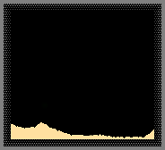

### 属性表

| 属性 | 值 | 说明 |
|------|-----|------|
| 内部标识 | DEFAULT_PT_DUST | C++枚举名 |
| Type ID | 1 | 元素编号(TPT启动默认选择) |
| 颜色 | `0xFFE0A0_rgb` | 浅米色 |
| 分类 | TYPE_PART (1) | 粉末型 |
| 属性标志 | TYPE_PART | 基础粉末 |
| weight | 85 | 轻量粉末 |
| heatconduct | 70 | 中等导热 |
| advection | 0.7 | 中等气流跟随 |
| airdrag | 0.02 | 低空气阻力 |
| airloss | 0.96 | 标准 |
| collision | 0.0 | 无弹性碰撞 |
| gravity | 0.1 | 标准重力 |
| diffusion | 0.0 | 不自发扩散 |
| falldown | 1 | 可下落 |
| flammable | 10 | 可燃(10帧燃烧) |
| hardness | 30 | 中等硬度 |
| 高温/低温/高压/低压转换 | 均为 NT | 无阈值转换 |
| 源文件 | DUST.cpp | — |

### 机制详解

DUST（尘埃）是 TPT 中最基础的粒子——Type ID=1，启动游戏时默认选择的元素。它是燃烧体系的起点粒子，也是许多转变链的终点(如 DYST→DUST)。

**DUST 的特殊地位**：
- Type ID=1：编号最小的可放置元素(NONE=0)
- STKM(火柴人)默认发射 DUST
- GUN(黑火药)的 NEUT 轰击产物之一
- 许多元素的"基态"(如菌丝→DUST、酵母→DYST→DUST)

### 参数详解

- **flammable=10**：燃烧时间极短——仅 10 帧(~0.17秒/60fps)。这意味着 DUST 的火焰非常微弱。燃烧时产生 FIRE，FIRE 的 Life 在 185~255 时转变为 SMKE。
- **weight=85**：轻于大多数重粉末(90)，但重于 SNOW(50)和 SAWD(18)。
- **hardness=30**：中等硬度。酸(ACID)腐蚀 DUST 的概率为 30/1000=3%每帧。
- **heatconduct=70**：标准导热值，在粉末中属于中等。
- **PHOT 反射**：photonreflectwavelengths=`0x3FFFFFC0`，可反射大部分波长的光子。

### 反应链

1. **NEUT 轰击链**：
   ```
   DUST + NEUT → FWRK(烟花)
   ```
   中子将尘埃转化为传统烟花，这是一个有趣的"废物升级"路线。

2. **DYST 热解链**：
   ```
   DYST(菌尸) → ≥473K → DUST(还原)
   ```
   菌尸高温分解回到基础尘埃。

3. **GUN 分解**：
   ```
   GUN + NEUT → DUST + 其他产物
   ```
   中子轰击黑火药产生尘埃。

4. **燃烧链**：
   ```
   DUST → 点燃 → FIRE(DUST消失, 燃烧10帧)
   FIRE → life 185~255 → SMKE
   ```

### 环境交互

- **在水下**：DUST 因 weight=85 下沉穿过水(weight=29 WATR→100)，并在底部堆积
- **在强风中**：advection=0.7 和 airdrag=0.02 使得 DUST 可被风吹起（但不如 SNOW 飘浮）
- **中子环境**：NEUT 轰击 DUST 产生 FWRK，可在 DUST 沙丘中产生烟花

### 实用场景

- **基础建材**：作为最常见的可堆放粉末用于建造、填坑
- **FWRK 转化**：NEUT 轰击 DUST 产生批量烟花
- **气流可视化**：DUST 的 advection=0.7 使其成为良好的风场指示器
- **燃烧测试**：flammable=10 的短燃烧特性适合做受控点火实验

---

###### STNE Type:5

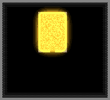

### 属性表

| 属性 | 值 | 说明 |
|------|-----|------|
| 内部标识 | DEFAULT_PT_STNE | C++枚举名 |
| Type ID | 5 | 元素编号 |
| 颜色 | `0xA0A0A0_rgb` | 中灰色 |
| 分类 | TYPE_PART (1) | 粉末型 |
| 属性标志 | TYPE_PART | 基础粉末 |
| weight | 90 | 重粉末 |
| heatconduct | 150 | 高导热 |
| advection | 0.4 | 低气流跟随 |
| airdrag | 0.04 | 中等空气阻力 |
| airloss | 0.94 | 较高损失 |
| collision | -0.1 | 低弹性(落地不弹) |
| gravity | 0.3 | 强重力(粉末中最高) |
| diffusion | 0.0 | 不自发扩散 |
| falldown | 1 | 可下落 |
| flammable | 0 | 不燃烧 |
| meltable | 5 | 可熔化 |
| hardness | 1 | 极低硬度 |
| 高温转换 | ≥983.0K (709.85℃) → LAVA | 熔点 |
| 源文件 | STNE.cpp | — |

### 机制详解

STNE（石粉）是最基础的重粉末，代表了地壳岩石粉末化后的形态。它是地质循环中的关键元素，连接了固体(ROCK/BRCK)和熔岩(LAVA)体系。

**石粉的地质循环**：
```
ROCK(岩石固体) + 高压(≥120P) → STNE(石粉)
BRCK(砖块) + 高压(≥8.8P) → STNE
STNE + 高温(≥983K) → LAVA(STNE)(熔岩)
LAVA(STNE) + 冷却 → STNE(或 SLCN若含BCOL)
ROCK + WATR → SAND + STNE + WATR(风化)
```

### 参数详解

- **gravity=0.3**：粉末中最高重力值(与 SAND、SALT、BRMT 等相同)。STNE 的沉降速度是所有粉末中最快的之一。
- **heatconduct=150**：粉末中热导率排名第三（仅次于 BRMT=211 和 BREL=211）。石粉导热快，在熔炉中会快速吸收热量。
- **meltable=5**：代表熔化需要 5 帧的持续高温。不是瞬间熔化。
- **collision=-0.1**：负碰撞弹性的含义是粒子碰到其他物体后不会反弹，会在接触点"停住"。这使得 STNE 堆积稳定，不易滑动。
- **hardness=1**：极低硬度意味着酸能轻易腐蚀（1/1000 概率每帧）。
- **weight=90**：重粉末，能排开所有 lighter 粉末。

### 反应链

1. **熔岩循环（SLCN变体）**：
   ```
   STNE + COAL/BCOL(熔融LAVA中, 1/60) → LAVA(SLCN)
   ```
   在熔岩态时，碳源可将石粉转化为硅熔岩。

2. **硅粉氧化副产物**：
   ```
   3x SLCN(熔融) + 3x OXYG → SAND + STNE + CLST/PQRT(1/3各)
   ```
   石粉是熔融硅氧化的三个可能产物之一。

3. **岩石风化**：
   ```
   3x ROCK + 3x WATR → SAND + 2x STNE + 3x WATR
   ```
   水侵蚀岩石同时产生沙子和石粉。

### 环境交互

- **在酸中**：hardness=1 使 STNE 极容易被酸溶解，不适合酸环境
- **在高温熔炉中**：STNE 在 983K 稳定熔化，不会燃烧，适合作为熔炉介质
- **压力转换**：ROCK 在 120P 时转变为 STNE，BRCK 在 8.8P 时转变

### 实用场景

- **熔炉填充介质**：高熔点和可预测的 LAVA 转换
- **地质模拟**：ROCK→STNE→LAVA→冷却→固体 完整地质循环
- **SLCN 生产**：STNE + BCOL 在熔岩态 1/60 概率转化为 SLCN
- **重物压载**：gravity=0.3 可用于快速沉降填充

---

###### SNOW Type:16

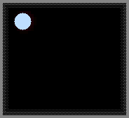

### 属性表

| 属性 | 值 | 说明 |
|------|-----|------|
| 内部标识 | DEFAULT_PT_SNOW | C++枚举名 |
| Type ID | 16 | 元素编号 |
| 颜色 | `0xC0E0FF_rgb` | 淡蓝白色 |
| 分类 | TYPE_PART (1) | 粉末型 |
| 属性标志 | TYPE_PART, PROP_NEUTPASS | 中子可穿透 |
| weight | 50 | 极轻粉末 |
| heatconduct | 46 | 中等偏低导热 |
| advection | 0.7 | 中等气流跟随 |
| airdrag | 0.01 | 极低空气阻力 |
| airloss | 0.96 | 标准 |
| collision | -0.1 | 低弹性 |
| gravity | 0.05 | 极弱重力 |
| diffusion | 0.01 | 微扩散 |
| hotair | -0.00005 | 微负热空气(轻微下沉) |
| falldown | 1 | 可下落 |
| flammable | 0 | 不燃烧 |
| hardness | 20 | 中等硬度 |
| 高温转换 | ≥252.05K (-21.1℃, 对于SLTW ctype) → ctype元素 | 融化点 |
| 初始温度 | -8.00℃ (265.15K) | 冷 |
| 源文件 | SNOW.cpp | — |

### 机制详解

SNOW（雪）是 TPT 中最轻的粉末之一（weight=50），模拟了真实雪花缓慢飘落的物理特性。gravity=0.05 和 advection=0.7 使得雪花在空中飘荡而非直接坠落。

**SNOW 的特殊 ctype 机制**：
当雪融化时，它转变为 ctype 值所对应的元素——**不仅仅是水**！如果通过控制台或 Lua 修改了雪的 ctype，它可以融化成任何元素。这是著名的"奇点炸弹"漏洞的核心机制。

### 参数详解

- **weight=50**：粉末中最轻的之一（仅重于 SAWD=18、SEED=36）。与 FRZZ 相同。
- **gravity=0.05**：极弱重力。雪花缓慢飘落，而非直坠。
- **hotair=-0.00005**：唯一的负 hotair 粉末！这使得雪轻微下沉而非上升。
- **diffusion=0.01**：粉末中唯一的非零扩散值（除 FRZZ=0.01 外）。雪有非常轻微的随机移动。
- **PROP_NEUTPASS**：中子可以穿透雪，可用于减速中子流的屏蔽层。
- **高温转换=252.05K**：与 ICE 的熔点相同。但如果 ctype 为 SLTW，则在 252K(-21.1℃)融化——这是模拟盐水的低冰点。

### 反应链

1. **雪的生成**：
   ```
   ICE(冰) + 高压(≥0.8P) → SNOW(冰碎裂成雪)
   WATR/DSTW/BUBW/SLTW + 冷却至冰点以下 + 压力 → SNOW
   FRZZ + 高压(≥1.8P) → SNOW(寒尘受压成雪)
   ```

2. **雪的融化**：
   ```
   SNOW → ≥252.05K(-21.1℃) → ctype元素(默认WATR)
   ```
   **重要**：即使 ctype 不是水，雪也会"融化"成它。这是奇点炸弹漏洞。

3. **中子减速**：
   ```
   NEUT + SNOW → NEUT(穿透, PROP_NEUTPASS)
   ```
   雪层可用来减速中子而不会吸收它们。

### 环境交互

- **在温暖环境中**：SNOW 在 252.05K(-21.1℃)迅速融化，远低于室温。常温下雪会立即融化。
- **在压力下**：ICE 在 0.8P 以上压力下碎裂成 SNOW
- **作为中子屏蔽**：NEUTPASS 属性使雪成为理想的中子减速材料

### 实用场景

- **冷却剂**：SNOW 初始温度-8℃，融化时吸收大量热
- **中子屏蔽层**：PROP_NEUTPASS 允许中子穿透但不吸收
- **奇点炸弹基础**：修改 ctype 制造非水融化产物
- **压力传感器**：ICE→SNOW 在 0.8P 触发转变

---

###### BREL Type:19


### 属性表

| 属性 | 值 | 说明 |
|------|-----|------|
| 内部标识 | DEFAULT_PT_BREC | C++枚举名(BREC=BReak Electronics) |
| Type ID | 19 | 元素编号 |
| 颜色 | `0x707060_rgb` | 灰褐色 |
| 分类 | TYPE_PART (1) | 粉末型 |
| 属性标志 | TYPE_PART, PROP_CONDUCTS, PROP_LIFE_DEC, PROP_HOT_GLOW | 导电, 生命衰减, 高温发光 |
| weight | 90 | 重粉末 |
| heatconduct | 211 | 极高导热(粉末中最高！) |
| advection | 0.4 | 低气流跟随 |
| airdrag | 0.04 | 中等空气阻力 |
| airloss | 0.94 | 较高损失 |
| collision | -0.1 | 低弹性 |
| gravity | 0.18 | 中等重力 |
| diffusion | 0.0 | 不自发扩散 |
| falldown | 1 | 可下落 |
| flammable | 0 | 不燃烧 |
| meltable | 2 | 可熔化 |
| hardness | 2 | 低硬度 |
| 源文件 | BREC.cpp | — |

### 机制详解

BREL（破碎的电子元件，Broken ELectronics）是 EMP(电磁脉冲武器)摧毁电子设备后留下的残骸。它是 TPT 中唯一同时具有导电性、高温发光的粉末，也是奇异物质(EXOT)的关键前体。

**BREL 的核心机制 **：
```
EMP(电磁脉冲) + 任何通电的电子元件 → BREL(碎片化)
BREL + 高压通电 → 可达到 9000℃+ → EXOT(奇异物质)
BREL + BRMT/BMTL(≥240℃) → THRM(铝热剂)
VIBR(振金)爆炸 → 产生 BREL
```

### 参数详解

- **PROP_CONDUCTS**：BREL 可以导电！这是粉末中罕见的导电属性。通电时 BREL 温度会上升。
- **PROP_LIFE_DEC + PROP_HOT_GLOW**：BREL 具有生命衰减，高温时发光。通电后 life>0 时在≥10P 下持续升温，≥9000℃且≥30P 时转变为 EXOT。
- **heatconduct=211**：粉末中最高导热率，与 BRMT 并列。这意味着 BREL 对热变化极为敏感。
- **gravity=0.18**：中等重力，比 STNE(0.3)轻，比 DUST(0.1)重。
- **meltable=2**：可熔化（2帧高温后熔化），产物由反应路径决定。

### 反应链

1. **EXOT 生成链**：
   ```
   BREL → 通电(life>0) + ≥10P → 逐渐升温
   BREL → ≥9000℃ + ≥30P → EXOT(奇异物质)
   BREL + PTNM(≥1000℃ + ≥50P) → EXOT(催化加速)
   ```

2. **铝热反应**：
   ```
   BREL + BMTL/IRON(≥240℃/523K) → THRM(铝热剂)
   ```
   模拟金属氧化物粉末与铝粉的反应。

3. **EMP 破坏**：
   ```
   EMP 爆炸 → 摧毁周围所有通电电子元件 → BREL
   VIBR 爆炸 → BREL
   ```

### 环境交互

- **在强电场中**：PROP_CONDUCTS 使 BREL 成为电路残骸链中的一环——电流流过 BREL 碎片
- **在高压环境中**：≥10P 下通电 BREL 会迅速升温，30P 时达9000℃生成 EXOT
- **在热反应中**：与金属接触可发生铝热反应，产生 THRM 和极高热量

### 实用场景

- **EXOT 生产**：BREL + 高压通电 → EXOT 是奇异物质的主要工业来源
- **EMP 受害者标记**：BREL 的存在代表此处曾发生过电磁脉冲攻击
- **铝热剂制造**：BREL + 金属粉 → THRM 用于高温焊接或爆破
- **高温传感器**：PROP_HOT_GLOW 使 BREL 在高温下发光，可视测温

---

###### CNCT Type:24

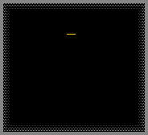

### 属性表

| 属性 | 值 | 说明 |
|------|-----|------|
| 内部标识 | DEFAULT_PT_CNCT | C++枚举名 |
| Type ID | 24 | 元素编号 |
| 颜色 | `0xC0C0C0_rgb` | 亮灰色(比STNE浅) |
| 分类 | TYPE_PART (1) | 粉末型 |
| 属性标志 | TYPE_PART, PROP_HOT_GLOW | 高温发光 |
| weight | 55 | 中等重量 |
| heatconduct | 100 | 高导热 |
| advection | 0.4 | 低气流跟随 |
| airdrag | 0.04 | 中等空气阻力 |
| airloss | 0.94 | 较高损失 |
| collision | -0.1 | 低弹性 |
| gravity | 0.3 | 强重力(与STNE相同) |
| diffusion | 0.0 | 不自发扩散 |
| falldown | 1 | 可下落 |
| flammable | 0 | 不燃烧 |
| meltable | 2 | 可熔化 |
| hardness | 2 | 低硬度 |
| 高温转换 | ≥1123.0K (849.85℃) → LAVA | 熔点 |
| 源文件 | CNCT.cpp | — |

### 机制详解

CNCT（混凝土粉末，Concrete）是最特殊的粉末——**它是刚性的**，可以竖直堆积而不会倒下。在 CanMove 规则中，任何其他粒子都无法排开或穿过 CNCT 粒子。这使得 CNCT 成为粉末中唯一的"建筑级"材料。

**刚性堆积机制**：
CNCT 的 weight=55(中等)配合 CanMove 矩阵的特殊规则(其他粒子→CNCT 时 can_move=0)，使得：
- CNCT 可以堆成竖直柱而不塌落
- DEST(高爆炸药)无法穿过 CNCT
- 没有任何粒子可以从 CNCT 中"穿过"

### 参数详解

- **weight=55**：虽然叫"重粉末"，但 weight 只有 55——比大多数"重粉末"(90)轻。但 CanMove 的特殊规则使重量无关紧要——其他粒子直接被阻塞。
- **gravity=0.3**：与最重粉末相同的重力加速度。CNCT 下落速度快。
- **heatconduct=100**：高导热。混凝土在现实中也是良好的储热材料。
- **meltable=2**：熔化需要 2 帧高温。比 STNE(5)快。
- **高温转换(1123K/849.85℃)**：比 STNE(983K)高约 140K，验证了"比石粉更难熔化"的描述。

### 反应链

1. **生成**：
   ```
   LAVA(ROCK) + 25~50P压力 → BRMT 或 CNCT (1/25000)
   ```
   极低概率，需要在精确的压力范围内。

2. **熔岩冷却**：
   ```
   LAVA(CNCT) → 自然冷却 → CNCT(固体粉末)
   ```

### 环境交互

- **阻挡任何物质**：包括 DEST(高爆炸药)都不能穿过 CNCT。CNCT 是粉末中的"终极屏障"。
- **在压力下稳定**：不像 BRCK(8.8P→STNE)或 ROCK(120P→STNE)，CNCT 没有压力转换阈值。
- **在酸中**：hardness=2 使得酸腐蚀概率为 2/1000=0.2%每帧——几乎不被腐蚀。

### 实用场景

- **防爆墙**：CNCT 能阻挡 DEST，是粉末中的最佳防爆材料
- **竖直建筑**：利用刚性堆积搭建粉末柱、粉末墙
- **高温容器衬里**：849.85℃高熔点，可在熔炉中使用
- **过滤器**：CNCT 不可被穿越，用于构建单向通道

---

###### SALT Type:26

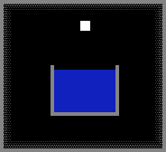

### 属性表

| 属性 | 值 | 说明 |
|------|-----|------|
| 内部标识 | DEFAULT_PT_SALT | C++枚举名 |
| Type ID | 26 | 元素编号 |
| 颜色 | `0xFFFFFF_rgb` | 纯白色 |
| 分类 | TYPE_PART (1) | 粉末型 |
| 属性标志 | TYPE_PART | 基础粉末 |
| weight | 75 | 中等偏重 |
| heatconduct | 110 | 高导热 |
| advection | 0.4 | 低气流跟随 |
| airdrag | 0.04 | 中等空气阻力 |
| airloss | 0.94 | 较高损失 |
| collision | -0.1 | 低弹性 |
| gravity | 0.3 | 强重力 |
| diffusion | 0.0 | 不自发扩散 |
| falldown | 1 | 可下落 |
| flammable | 0 | 不燃烧 |
| meltable | 5 | 可熔化(5帧) |
| hardness | 1 | 极低硬度 |
| 高温转换 | ≥1173.0K (899.85℃) → LAVA | 熔点 |
| 源文件 | SALT.cpp | — |

### 机制详解

SALT（盐）是溶解与腐蚀体系的核心元素。它在水中溶解形成 SLTW(盐水)，并能催化铁(IRON)的腐蚀过程。SALT 的生命周期围绕溶解、电解、冶炼展开。

**盐的溶解与腐蚀循环**：
```
SALT + WATR/DSTW → SLTW(盐水, SALT溶解)
SLTW 电解(IRON+电) → 产生 H2 + O2
SLTW → 加热→蒸发 → WTRV + SALT(盐析出)
SALT + IRON → BMTL → BRMT(铁的盐腐蚀)
SLTW → GEL/SPNG吸水 → SALT(盐结晶)
```

### 参数详解

- **weight=75**：中等偏重，会沉入水中(水 weight=100，实际水为 29；SALT weight=75 > WATR weight=29)。
- **heatconduct=110**：高导热，在粉末中排名第四(仅次于 BRMT/BREL=211，STNE/SAND/BGLA/BCOL=150)。
- **meltable=5**：需要 5 帧高温才能熔化，熔化较慢。
- **hardness=1**：极低硬度，极易被酸溶解(1/1000 概率/帧)。
- **高温转换(1173K/899.85℃)**：较高熔点，比 STNE(983K)高约 190K。

### 反应链

1. **盐水体系**：
   ```
   SALT + WATR → SLTW(溶解, SALT 缓慢消失)
   SALT + DSTW → SLTW(同上)
   SALT + SLTW → 缓慢溶解于盐水
   ```

2. **铁腐蚀催化**：
   ```
   SALT + IRON → BMTL(脆金属) → BRMT(金属粉)
   除非 GOLD(金)靠近以保护铁
   ```

3. **植物破坏**：
   ```
   SALT + PLNT → PLNT 被破坏
   SLTW + PLNT → PLNT 被破坏
   ```

4. **回收**：
   ```
   SPNG/GEL + SLTW → 吸水→留下 SALT(约每4个SLTW产生1个SALT)
   ```

### 环境交互

- **在水中**：SALT 接触 WATR 时开始溶解（每帧有概率将 WATR 转化为 SLTW），同时自身消失。溶液体积增大。
- **与金属接触**：紧贴 IRON 会加速铁的腐蚀（BMTL→BRMT）。
- **在植物附近**：SALT 和 SLTW 都会杀死植物。
- **高温下**：SALT 在 899.85℃熔化，可形成盐熔岩(LAVA with ctype=SALT)。

### 实用场景

- **盐水电池**：SALT + WATR → SLTW(导电液体)用于电解质
- **金属腐蚀实验**：SALT 加速 IRON→BMTL→BRMT 的变化
- **蒸馏脱盐**：SLTW→WTRV+SALT 可控盐析
- **植物清除**：在需要清除植物时使用 SALT

---

###### BRMT Type:30

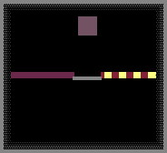

### 属性表

| 属性 | 值 | 说明 |
|------|-----|------|
| 内部标识 | DEFAULT_PT_BRMT | C++枚举名 |
| Type ID | 30 | 元素编号 |
| 颜色 | `0x705060_rgb` | 暗紫褐色 |
| 分类 | TYPE_PART (1) | 粉末型 |
| 属性标志 | TYPE_PART, PROP_CONDUCTS, PROP_LIFE_DEC, PROP_HOT_GLOW | 导电, 生命衰减, 高温发光 |
| weight | 90 | 重粉末 |
| heatconduct | 211 | 极高导热(与BREL并列粉末最高) |
| advection | 0.4 | 低气流跟随 |
| airdrag | 0.04 | 中等空气阻力 |
| airloss | 0.94 | 较高损失 |
| collision | -0.1 | 低弹性 |
| gravity | 0.3 | 强重力 |
| diffusion | 0.0 | 不自发扩散 |
| falldown | 1 | 可下落 |
| flammable | 0 | 不燃烧(但参与铝热反应) |
| meltable | 2 | 可熔化 |
| hardness | 2 | 低硬度 |
| 高温转换 | ≥1273.0K (~999.85℃) → 特殊转换(ST) | 特殊高温行为 |
| 源文件 | BRMT.cpp | — |

### 机制详解

BRMT（金属粉，Broken MeTal）是金属腐蚀和受压碎裂的末端产物。它与 BREL 共享 PROP_CONDUCTS、PROP_LIFE_DEC 和 PROP_HOT_GLOW 属性，是铝热反应(THRM)的核心成分。

**金属粉的产生途径**：
```
IRON(铁) + SALT/盐水 → BMTL(脆金属) → BRMT(金属粉)
BMTL(脆金属) + 高压(≥2.5P) → BRMT(碎裂)
BMTL(熔融态) + 缓慢冷却 → BRMT
PIPE(管道) + 高压(≥10P) → BRMT
WIFI(无线设备) + 高压(≥15P) → BRMT
```

### 参数详解

- **PROP_CONDUCTS**：金属粉可以导电。通电时(SPRK通过)温度上升。电流通过 BRMT 粒子会产生焦耳热。
- **heatconduct=211**：粉末中最高导热(与BREL并列)。金属粉是极佳的热导体。
- **gravity=0.3**：最高重力，快速沉降。
- **高温转换(1273K)为 ST(特殊)**：不是变成 LAVA。ST 意味着 ctype 被保留并触发 LAVA 的特殊处理逻辑。
- **meltable=2**：需要 2 帧高温后熔化。

### 反应链

1. **铝热反应**：
   ```
   BRMT(≥250℃/523K) + BREL → THRM(铝热剂)
   THRM + 点燃(FIRE/PLSM/LAVA) → MoltenBMTL + 极高热量
   ```

2. **熔融硅反应**：
   ```
   BRMT(熔融) + SLCN(熔融) → NSCN + PSCN(半导体对)
   ```

3. **高温特殊转换**：
   ```
   BRMT → ≥1273K → 特殊ST处理 → 可能为 LAVA(BRMT) 或 MoltenBMTL
   ```

### 环境交互

- **在电路中**：BRMT 导电但不稳定(PROP_LIFE_DEC)，长时间通电会衰减
- **与 BREL 共处**：两者接触温度≥250℃时发生铝热反应，产生 THRM 和极高热量
- **在磁场中**：金属粉对某些能量粒子有特殊反应（具体取决于 ctype）

### 实用场景

- **铝热反应**：BRMT + BREL → THRM 用于高温焊接或切割
- **NSCN/PSCN 生产**：熔融 BRMT + 熔融 SLCN → 半导体
- **导电粉末**：利用 PROP_CONDUCTS 设计粉末电路
- **热传感器**：PROP_HOT_GLOW 使 BRMT 在高温下发出可见光

---

###### SAND Type:44

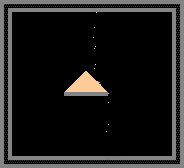

### 属性表

| 属性 | 值 | 说明 |
|------|-----|------|
| 内部标识 | DEFAULT_PT_SAND | C++枚举名 |
| Type ID | 44 | 元素编号 |
| 颜色 | `0xFFD090_rgb` | 沙黄色 |
| 分类 | TYPE_PART (1) | 粉末型 |
| 属性标志 | TYPE_PART | 基础粉末 |
| weight | 90 | 重粉末 |
| heatconduct | 150 | 高导热 |
| advection | 0.4 | 低气流跟随 |
| airdrag | 0.04 | 中等空气阻力 |
| airloss | 0.94 | 较高损失 |
| collision | -0.1 | 低弹性 |
| gravity | 0.3 | 强重力 |
| diffusion | 0.0 | 不自发扩散 |
| falldown | 1 | 可下落 |
| flammable | 0 | 不燃烧 |
| meltable | 5 | 可熔化(5帧) |
| hardness | 1 | 极低硬度 |
| 高温转换 | ≥1973.0K (1699.85℃) → LAVA | 极高熔点 |
| 源文件 | SAND.cpp | — |

### 机制详解

SAND（沙子）是玻璃工业的核心原料，也是地质风化的重要产物。SAND 的 LAVA(ctype=SAND)冷却后会形成 GLAS(玻璃)而非变回 SAND——这是 SAND 与大多数粉末的根本区别。

**沙子-玻璃循环**：
```
SAND → 熔化(≥1973K) → LAVA(SAND)
LAVA(SAND) → 冷却凝固 → GLAS(玻璃) [不是SAND!]
GLAS → 高压碎裂 → BGLA(碎玻璃)
BGLA → 熔化(≥1973K) → LAVA → 冷却 → GLAS(重新玻璃化)
```

### 参数详解

- **weight=90**：标准重粉末重量。
- **heatconduct=150**：高导热，与 STNE、BGLA、BCOL 相同。沙子在熔炉中加热效率高。
- **meltable=5**：需要 5 帧持续高温才能熔化。
- **高温转换(1973K/1699.85℃)**：极高熔点——粉末中仅次于 PQRT(2300℃/2573K)和 SLCN(3265℃/3538K)。这是玻璃的熔点。
- **hardness=1**：极低，易被酸溶解。

### 反应链

1. **风化产生**：
   ```
   3x ROCK + 3x WATR → SAND + 2x STNE + 3x WATR
   ```

2. **硅氧副产物**：
   ```
   3x SLCN(熔融) + 3x OXYG → SAND + STNE + CLST/PQRT(各1/3)
   ```

3. **玻璃化**：
   ```
   LAVA(SAND) → 冷却 → GLAS
   ```
   这是核心：熔融沙子冷却不是变回沙子而是变玻璃。

### 环境交互

- **在极端高温中**：1699.85℃的熔点使 SAND 成为优秀的高温材料
- **与水**：水在沙中流动，沙子沉降到底部
- **植物(SEED)**：SEED 放置在 SAND 上方+浇水→生长树木(PLNT模式)
- **中子环境**：NEUT 轰击 SAND 有概率产生特殊物质

### 实用场景

- **玻璃制造**：SAND→熔化→冷却→GLAS 是玻璃工业的唯一路径
- **SEED 基底**：配合水和种子生成树木
- **高温过滤**：利用高熔点过滤低熔点杂质
- **地质模拟**：ROCK→SAND 风化过程

---

###### BGLA Type:47

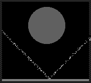

### 属性表

| 属性 | 值 | 说明 |
|------|-----|------|
| 内部标识 | DEFAULT_PT_BGLA | C++枚举名 |
| Type ID | 47 | 元素编号 |
| 颜色 | `0x606060_rgb` | 深灰色 |
| 分类 | TYPE_PART (1) | 粉末型 |
| 属性标志 | TYPE_PART, PROP_NEUTPASS, PROP_PHOTPASS, PROP_HOT_GLOW, PROP_LIFE | 中子穿透, 光子穿透, 高温发光, 有生命值 |
| weight | 90 | 重粉末 |
| heatconduct | 150 | 高导热 |
| advection | 0.4 | 低气流跟随 |
| airdrag | 0.04 | 中等空气阻力 |
| airloss | 0.94 | 较高损失 |
| collision | -0.1 | 低弹性 |
| gravity | 0.3 | 强重力 |
| diffusion | 0.0 | 不自发扩散 |
| falldown | 1 | 可下落 |
| flammable | 0 | 不燃烧 |
| meltable | 5 | 可熔化(5帧) |
| hardness | 0 | 无硬度 |
| 高温转换 | ≥1973.0K (1699.85℃) → LAVA | 熔点(与SAND相同) |
| 源文件 | BGLA.cpp | — |

### 机制详解

BGLA（碎玻璃，Broken GLA）是玻璃(GLAS)被压碎或破坏后的粉末形式。它是玻璃循环中的回收节点——碎玻璃熔化后能重新变回玻璃，而不会变成沙子。

**碎玻璃的独特属性**：
- PROP_NEUTPASS + PROP_PHOTPASS：中子**和**光子都可穿透！这是粉末中唯一同时允许两种能量粒子穿透的元素。
- PROP_HOT_GLOW + PROP_LIFE：高温发光且有生命值——碎片会随时间变化。

### 参数详解

- **hardness=0**：无硬度，极易被酸腐蚀、被其他粒子推开。
- **PROP_NEUTPASS + PROP_PHOTPASS**：碎玻璃对中子和光子都是透明的。可用于构建"透明"粉末过滤器。
- **高温转换=1973K**：与 SAND 完全相同。熔化后→LAVA→冷却→GLAS。
- **制造方法**：GLAS 加压→BGLA；GLAS 被 DMG 破坏→BGLA；LCRY 加热→BGLA。

### 反应链

1. **产生链**：
   ```
   GLAS + 高压 → BGLA(粉碎)
   GLAS + DMG(重力炸弹) → BGLA
   LCRY(液晶) + 加热 → BGLA(液晶分解)
   ```

2. **回收链**：
   ```
   BGLA → 熔化(1973K) → LAVA → 冷却 → GLAS
   ```

### 环境交互

- **在中子束中**：NEUT 直接穿透 BGLA(PROP_NEUTPASS)
- **在光束中**：PHOT 直接穿透 BGLA(PROP_PHOTPASS)
- **在压力下**：自身不会被压力破坏（已经是碎片了）
- **高温发光**：被加热时会因 PROP_HOT_GLOW 发光

### 实用场景

- **玻璃回收**：BGLA 熔化→玻璃重建
- **中子/光子窗口**：利用双穿透属性设计传感器
- **光学实验**：PROP_PHOTPASS 使碎玻璃成为独特的光学材料

---

###### YEST Type:63

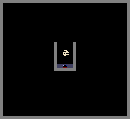

### 属性表

| 属性 | 值 | 说明 |
|------|-----|------|
| 内部标识 | DEFAULT_PT_YEST | C++枚举名 |
| Type ID | 63 | 元素编号 |
| 颜色 | `0xEEE0C0_rgb` | 淡米黄色 |
| 分类 | TYPE_PART (1) | 粉末型 |
| 属性标志 | TYPE_PART | 基础粉末 |
| weight | 80 | 中轻粉末 |
| heatconduct | 70 | 中等导热 |
| advection | 0.7 | 中等气流跟随 |
| airdrag | 0.02 | 低空气阻力 |
| airloss | 0.96 | 标准 |
| collision | 0.0 | 无弹性碰撞 |
| gravity | 0.1 | 标准重力（与DUST相同） |
| diffusion | 0.0 | 不自发扩散 |
| falldown | 1 | 可下落 |
| flammable | 15 | 可燃(15帧) |
| hardness | 31 | 中等硬度 |
| 初始温度 | 22.00℃ (295.15K) | 室温 |
| 高温转换 | ≥373.0K (99.85℃) → DYST(菌尸) | 高温死亡 |
| 源文件 | YEST.cpp | — |

### 机制详解

YEST（酵母）是 TPT 中为数不多的"活"粒子之一。它在特定温度窗口(29.85℃~43.85℃/303K~317K)内会繁殖——接触到相邻空位时产生新的 YEST 粒子。

**生命与死亡**：
```
YEST → 29.85~43.85℃ → 繁殖(2x YEST)
YEST → ≥99.85℃ → DYST(高温死亡)
YEST + NEUT → DYST(中子辐射致死)
YEST + DYST(接触) → DYST(被菌尸感染, 1/6概率)
```

注意：温度范围**不包括边界值**——恰好 29.85℃ 或 43.85℃ 不繁殖。

### 参数详解

- **flammable=15**：可燃 15 帧，比 DUST(10)略长但仍是短燃烧。
- **hardness=31**：比 DUST(30)略高。
- **weight=80**：比 DUST(85)略轻。
- **gravity=0.1**：标准轻粉末重力，缓慢飘落。
- **高温转换(373K/99.85℃)**：比水沸点低 0.15℃，意味着水沸腾之前酵母已经死亡。

### 反应链

1. **繁殖链**：
   ```
   YEST(303K~317K) + 空位 → 2x YEST → 4x YEST → ... 指数增长
   ```
   只在黄金温度窗口繁殖。低于 30℃停止，高于 44℃停止，≥100℃死亡。

2. **死亡-复活链**：
   ```
   YEST → ≥99.85℃ → DYST
   DYST → ≥199.85℃ → DUST
   DYST + NEUT → YEST(复活! 3/200概率)
   ```

3. **感染链**：
   ```
   YEST + DYST(相邻) → YEST 变成 DYST(1/6每帧)
   ```

### 环境交互

- **恒温箱中**：29.85~43.85℃ 的精确控温是酵母养殖的关键
- **中子环境中**：NEUT 直接杀死 YEST→DYST。辐射灭菌。
- **与 DYST 同在**：菌尸的存在会使活酵母迅速死亡（感染）
- **在水里**：液体中酵母仍可繁殖（只要温度合适且有相邻空位）

### 实用场景

- **指数增长演示**：在黄金温度窗口观察酵母从 1 到满屏的指数繁殖
- **温度传感器**：酵母仅在一定温度范围活跃→用于温度窗口检测
- **DYST 生产线**：YEST 高温→DYST 批量生产
- **DUST 循环**：YEST→DYST→DUST 三步链
- **中子复活实验**：用 NEUT 将 DYST 复活为 YEST(3/200概率)

---

###### DYST Type:64


### 属性表

| 属性 | 值 | 说明 |
|------|-----|------|
| 内部标识 | DEFAULT_PT_DYST | C++枚举名 |
| Type ID | 64 | 元素编号 |
| 颜色 | `0xBBB0A0_rgb` | 灰褐色 |
| 分类 | TYPE_PART (1) | 粉末型 |
| 属性标志 | TYPE_PART | 基础粉末 |
| weight | 80 | 与 YEST 相同 |
| heatconduct | 70 | 与 YEST 相同 |
| advection | 0.7 | 与 YEST 相同 |
| airdrag | 0.02 | 与 YEST 相同 |
| airloss | 0.96 | 与 YEST 相同 |
| collision | 0.0 | 与 YEST 相同 |
| gravity | 0.1 | 与 YEST 相同 |
| diffusion | 0.0 | 不自发扩散 |
| falldown | 1 | 可下落 |
| flammable | 20 | 可燃(20帧, 比YEST长) |
| hardness | 30 | 与 DUST 相同 |
| 高温转换 | ≥473.0K (199.85℃) → DUST | 热解温度 |
| 源文件 | DYST.cpp | — |

### 机制详解

DYST（菌尸/菌丝，Dead YealST）是 YEST 死亡后的产物——酵母的尸体。它是 YEST→DUST 三步链的中间环节，也具有感染活性酵母的能力。

**菌尸的特征**：
- 可燃烧 20 帧(比 YEST 的 15 帧长)
- 触碰到任何活 YEST 都会将其杀死(1/6 每帧)
- 高温热解成 DUST(基础尘埃)
- 可被中子复活为 YEST

### 参数详解

- **flammable=20**：比 YEST 多 5 帧燃烧时间。
- **hardness=30**：与 DUST 相同。
- **高温转换(473K/199.85℃)**：约 200℃ 时热解为 DUST。
- **生成途径**：YEST 高温死亡(≥100℃)、YEST+NEUT、或 YEST 被菌尸感染。

### 反应链

1. **三步循环**：
   ```
   YEST → ≥373K → DYST → ≥473K → DUST
   DUST + NEUT → FWRK(或自然循环回基础)
   DYST + NEUT → YEST(3/200, 复活)
   ```

2. **感染传播**：
   ```
   DYST + YEST(相邻) → YEST → DYST(1/6每帧)
   ```
   一个 DYST 可以感染周围所有活酵母。

3. **直接产生**：
   ```
   YEST + NEUT 轰击 → DYST(辐射致死)
   ```

### 环境交互

- **在酵母群中**：DYST 会像传染病一样在 YEST 群体中扩散
- **在高温炉中**：199.85℃ 热解为 DUST——比 YEST 的死亡温度恰好多 100℃
- **中子复活**：3/200 概率复活为 YEST——这是需要耐心的小概率事件

### 实用场景

- **酵母养殖的"天敌"**：利用 DYST 的感染性控制过度繁殖的 YEST
- **DUST 生产**：YEST→DYST→DUST 提供可再生的 DUST 来源
- **中子复活器**：大量 DYST + NEUT 轰击→概率复活 YEST
- **燃烧燃料**：flammable=20 可作为短期燃料

---

###### BCOL Type:73


### 属性表

| 属性 | 值 | 说明 |
|------|-----|------|
| 内部标识 | DEFAULT_PT_BCOL | C++枚举名 |
| Type ID | 73 | 元素编号 |
| 颜色 | `0x333333_rgb` | 深灰色(炭色) |
| 分类 | TYPE_PART (1) | 粉末型 |
| 属性标志 | TYPE_PART | 基础粉末 |
| weight | 90 | 重粉末 |
| heatconduct | 150 | 高导热 |
| advection | 0.4 | 低气流跟随 |
| airdrag | 0.04 | 中等空气阻力 |
| airloss | 0.94 | 较高损失 |
| collision | -0.1 | 低弹性 |
| gravity | 0.3 | 强重力 |
| diffusion | 0.0 | 不自发扩散 |
| falldown | 1 | 可下落 |
| flammable | 0 | 不直接可燃(需明火) |
| hardness | 2 | 低硬度 |
| 高温/高压转换 | 均为 NT | 无直接阈值(缓慢燃烧) |
| 源文件 | BCOL.cpp | — |

### 机制详解

BCOL（煤粉，Black COaL）是 WOOD 的碳化产物，只能用明火点燃而不能自燃。点燃后缓慢燃烧（非瞬间），是费托合成的核心原料。

**煤粉的工业价值**：
```
WOOD → (<-10P, ≥499.85℃) → BCOL(高温无氧炭化)
BCOL + 明火点燃 → 缓慢燃烧(不是FIRE爆发)
BCOL + WTRV + PTNM(≥200℃, >7P) → OIL(费托合成!)
BCOL + BASE → GUNP(黑火药)
BCOL + NEUT → SAWD(锯末, 1/20)
BCOL + LAVA(STNE) → LAVA(SLCN)(熔岩转化)
```

### 参数详解

- **flammable=0**：尽管是煤，但 BCOL 不自燃。必须用明火(FIRE/PLSM/LAVA)接触才能点燃。点燃后缓慢燃烧而非瞬间爆发。
- **weight=90**：标准重粉末。在液体中下沉。
- **heatconduct=150**：高导热(与 STNE/SAND 相同)。
- **无直接状态转换**：ITH/ITL/IPH/IPL 全为 NT——煤粉不熔化、不凝华，只在特定条件下反应。

### 反应链

1. **费托合成（核心反应）**：
   ```
   BCOL + WTRV(水蒸气) + PTNM(铂催化) + ≥200℃ + >7P → OIL(石油)
   ```
   这是 TPT 中从煤和蒸汽直接合成石油的途径，模拟工业费托合成。

2. **黑火药制备**：
   ```
   BCOL + BASE(腐蚀性液体) → GUNP(黑火药)
   ```

3. **NEUT 轰击**：
   ```
   BCOL + NEUT → SAWD(锯末) (1/20概率)
   ```

4. **熔岩转化**：
   ```
   BCOL + LAVA(STNE) → LAVA(SLCN) (1/60概率)
   ```

### 环境交互

- **在水中**：煤粉沉降(weight=90)，水不会点燃煤粉
- **在强热下**：即使温度再高 BCOL 也不会自燃，需要明火接触
- **与 BASE**：接触 BASE 液体时转变为 GUNP(黑火药)
- **中子辐射**：1/20 概率变成锯末——有趣但通常不想要的转化

### 实用场景

- **费托合成石油工厂**：BCOL + WTRV + PTNM 高温高压 → OIL
- **黑火药生产线**：BCOL + BASE → GUNP 批量生产
- **SLCN 生产**：BCOL + LAVA(STNE) → LAVA(SLCN)
- **炭化实验**：WOOD 高温低压→BCOL→观察炭化过程

---

###### FRZZ Type:100

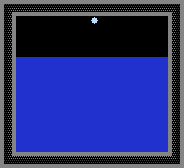

### 属性表

| 属性 | 值 | 说明 |
|------|-----|------|
| 内部标识 | DEFAULT_PT_FRZZ | C++枚举名 |
| Type ID | 100 | 元素编号 |
| 颜色 | `0xC0E0FF_rgb` | 淡蓝白色（与SNOW颜色相同） |
| 分类 | TYPE_PART (1) | 粉末型 |
| 属性标志 | TYPE_PART | 基础粉末 |
| weight | 50 | 极轻粉末 |
| heatconduct | 46 | 中等偏低导热(与SNOW相同) |
| advection | 0.7 | 中等气流跟随 |
| airdrag | 0.01 | 极低空气阻力 |
| airloss | 0.96 | 标准 |
| collision | -0.1 | 低弹性 |
| gravity | 0.05 | 极弱重力 |
| diffusion | 0.01 | 微扩散 |
| hotair | -0.00005 | 微负热空气 |
| falldown | 1 | 可下落 |
| flammable | 0 | 不燃烧 |
| hardness | 20 | 中等硬度 |
| 高温转换 | ≥273.15K (0℃) → FRZW(寒水) | 熔点 |
| 低温转换 | ≤50.0K (-223.15℃) → ICEI(超冷冰) | 极端低温转变 |
| 高压转换 | ≥1.8 P → SNOW(雪) | 压力极限 |
| 初始温度 | -20.00℃ (253.15K) | 冷 |
| 源文件 | FRZZ.cpp | — |

### 机制详解

FRZZ（寒尘，Freeze dust）是一种极具攻击性的冷粉末。它的核心行为是"一次性速冻"——接触液态水(WATR)时瞬间将水变为 FRZW(寒水)，自身消失。FRZW 随后会连锁将更多水变成寒水，形成传染性冻结。

**寒尘的三相变化**：
```
FRZZ → ≥0℃(273.15K) → FRZW(寒水, 液态)
FRZZ → ≤-223.15℃(50K) → ICEI(超冷冰, 自动降温型)
FRZZ → ≥1.8P → SNOW(受压成雪)
FRZZ + WATR → FRZW(一次性速冻, FRZZ消失)
```

FRZZ 是 TPT 中少数同时具有高温、低温和高压三个转换阈值的元素。

### 参数详解

- **weight=50**：与 SNOW 完全相同（极轻粉末）。
- **gravity=0.05**：与 SNOW 完全相同（极弱重力、飘落）。
- **heatconduct=46**：与 SNOW/ICE 相同。
- **hotair=-0.00005**：与 SNOW 相同的微负热空气。
- **diffusion=0.01**：与 SNOW 相同。
- **高温转换(273.15K=0℃)**：恰好是冰点。FRZZ 在 0℃融化——这与 ICE(0℃→WATR)一致但产物不同(FRZZ→FRZW)。
- **低温转换(50K=-223.15℃)**：在极端低温下 FRZZ 变成 ICEI(一种能自动降温的特殊冰)。
- **高压转换(1.8P)**：FRZZ 在轻微压力下就变成 SNOW——压力极限很低！

### 反应链

1. **速冻链**：
   ```
   FRZZ + WATR → FRZW(FRZZ消失, WATR变为FRZW)
   FRZW + WATR(连续) → FRZW 传染(更多水变为FRZW)
   ```

2. **超冷冰链**：
   ```
   FRZZ → ≤50K → ICEI
   ICEI 自动降温 → 接近绝对零度
   FRZZ + ICEI → ICEI(FRZW, 1/200概率)
   ```

3. **受压抑化**：
   ```
   FRZZ → ≥1.8P → SNOW
   ```
   寒尘在低压下就碎裂成雪。

### 环境交互

- **在水池中**：一粒 FRZZ 落入水池→接触 WATR→变成 FRZW→FRZW 传染周围 WATR→整个水池冻结。速度极快。
- **在室温下**：FRZZ 初始温度 -20℃，室温下迅速升温。一旦达到 0℃就变成 FRZW(液态)。随后 FRZW 继续降温→吸收热量→冷冻更多物质。
- **在雪中**：FRZZ 和 SNOW 外观相同(同色)，但 FRZZ 是"活性"的冷冻剂。

### 实用场景

- **瞬冻炸弹**：FRZZ 落入水池→连锁冻结
- **寒水工厂**：FRZZ + WATR → FRZW 用于降温系统
- **超冷实验**：FRZZ→50K→ICEI 制造自动降温的冰
- **雪地伪装**：FRZZ 和 SNOW 外观相同，可用于隐藏冷冻陷阱

---

###### GRAV Type:102


### 属性表

| 属性 | 值 | 说明 |
|------|-----|------|
| 内部标识 | DEFAULT_PT_GRAV | C++枚举名 |
| Type ID | 102 | 元素编号 |
| 颜色 | `0x202020_rgb` | 几乎黑色(颜色随速度变化) |
| 分类 | TYPE_PART (1) | 粉末型 |
| 属性标志 | TYPE_PART, PROP_LIFE_DEC | 有生命衰减 |
| weight | 85 | 中等重量 |
| heatconduct | 70 | 中等导热 |
| advection | 0.7 | 中等气流跟随 |
| airdrag | 0.0 | 无空气阻力！ |
| airloss | 1.0 | 完美保持(无动量损失) |
| collision | 0.0 | 无弹性碰撞 |
| gravity | 0.0 | 无视重力！ |
| diffusion | 0.0 | 不自发扩散 |
| falldown | 1 | falldown=1但gravity=0——特殊行为 |
| flammable | 10 | 可燃(10帧) |
| hardness | 30 | 中等硬度(与DUST相同) |
| 初始温度 | 22.00℃ (295.15K) | 室温 |
| 源文件 | GRAV.cpp | — |

### 机制详解

GRAV（引力尘）是 TPT 中最反直觉的粉末——gravity=0 意味着它几乎不受重力影响，但 falldown=1 意味着它仍作为粉末参与下落逻辑。在效果上，GRAV 处于"悬浮"状态，只有在被其他力推动时才会移动。

**速度可视化**：
GRAV 的颜色随速度变化——速度越大颜色越亮。当速度达到一定阈值(≥0.1)时，life 被设为 48 并发光。这使得 GRAV 成为完美的速度可视化工具。

### 参数详解

- **gravity=0.0**：粉末中的唯一！GRAV 不受重力。在静止空气中，GRAV 粒子停留在放置位置不沉降。
- **airdrag=0.0**：无空气阻力。如果有风速，GRAV 会完美跟随气流。
- **airloss=1.0**：完美动量保持！GRAV 不损失任何动量给空气。一旦受到力就会匀速运动。
- **falldown=1**：虽然有 falldown 标志，但 gravity=0 使其实际上不"下落"。falldown=1 主要影响与液体的交互行为。
- **flammable=10**：可被点燃，燃烧 10 帧。

### 反应链

1. **速度检测**：
   ```
   GRAV(速度≥0.1) → life=48 → 发出亮光(速度可视化)
   ```
   速度越快，发光越亮。这是 GRAV 最核心的实用功能。

### 环境交互

- **在真空/静止空气中**：GRAV 悬浮在放置位置，完全不动
- **在有风环境中**：GRAV 因 airdrag=0+airloss=1 完美跟随气流——比任何其他粉末都更灵敏地反映空气速度场
- **在液体中**：falldown=1 影响其在液体中的行为（可能上浮或下沉取决于具体情况）
- **接触火焰**：flammable=10 使 GRAV 可作为短暂燃料

### 实用场景

- **空气速度场可视化**：GRAV 是 TPT 中最佳的风速计——放置 GRAV 观察其运动可精确了解空气速度场分布
- **气流测绘**：在通风系统中撒入 GRAV 观察气流路径
- **教学演示**：演示无重力环境下的粒子行为
- **速度传感器**：利用速度≥0.1→发光的特性检测粒子速度

---

###### ANAR Type:113

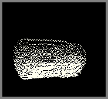

### 属性表

| 属性 | 值 | 说明 |
|------|-----|------|
| 内部标识 | DEFAULT_PT_ANAR | C++枚举名 |
| Type ID | 113 | 元素编号 |
| 颜色 | `0xFFFFEE_rgb` | 近白色(略微暖白) |
| 分类 | TYPE_PART (1) | 粉末型 |
| 属性标志 | TYPE_PART | 基础粉末 |
| weight | 85 | 与 DUST/GRAV 相同 |
| heatconduct | 70 | 中等导热 |
| advection | -0.7 | 负值——逆向跟随气流！ |
| airdrag | -0.02 | 负值——逆向空气阻力！ |
| airloss | 0.96 | 标准 |
| collision | 0.1 | 正值——有弹性！ |
| gravity | -0.1 | 负值——向上"落"！ |
| diffusion | 0.0 | 不自发扩散 |
| falldown | 1 | falldown=1但gravity=-0.1 |
| flammable | 0 | 不直接燃烧(与CFLM反应) |
| hardness | 29 | 略低于DUST(30) |
| 初始温度 | 22.00℃ (295.15K) | 室温 |
| 源文件 | ANAR.cpp | — |

### 机制详解

ANAR（反引力尘，Anti-gRAvity）是 TPT 中唯一遵循**完全反向物理定律**的粉末。它的所有动力学参数都是正常值的相反数：
- 重力向上(gravity=-0.1) ——"落"向天花板
- 气流跟随反向(advection=-0.7) ——逆风而行
- 空气阻力反向(airdrag=-0.02) ——被气流加速而非减速
- 碰撞弹性正值(collision=0.1) ——接触物体会反弹

此外，ANAR 对特殊物体的行为也是反向的：
- 被白洞(WHOL)**排斥**打入而非被黑洞(BHOL)吸入
- 白洞会摧毁 ANAR（正如黑洞摧毁其他粒子）
- 被冷焰(CFLM)引爆，产生链式反应并**降低**压力

### 参数详解

- **advection=-0.7**：负值意味着 ANAR 的运动方向与空气速度场相反。风向右吹→ANAR 向左移。
- **airdrag=-0.02**：负值意味着空气对 ANAR 产生加速度而非阻力。这是反物理的。
- **collision=0.1**：正值碰撞弹性。ANAR 碰撞物体后反弹，而非停在接触点。
- **gravity=-0.1**：向上"落"。在不通风的封闭空间中，ANAR 飘向天花板。
- **阻挡元素**：DUST, SAWD, GRAV, CNCT, GUN 可以阻挡 ANAR(在其边缘之外)。其他粒子 ANAR 会"上升"穿过。

### 反应链

1. **冷焰链式反应**：
   ```
   ANAR + CFLM → 2x CFLM(双方都变冷焰, ANAR 消失)
   ```
   同时降低 0.5P 压力。一个 ANAR 粒子可触发冷焰的指数传播。

2. **振金粉碎**：
   ```
   ANAR + VIBR(振金) → BVBR(振金粉)
   ```
   ANAR 可将坚固的振金固体变为粉末形式。

### 环境交互

- **在重力场中**：ANAR 被白洞(WHOL)吸入——正向黑洞(BHOL)排斥 ANAR！完全颠倒。
- **在冷焰旁**：接触 CFLM 立即爆炸性链式反应，产生更多冷焰，压力骤降。
- **在水中**：ANAR 会"上升"穿过水层到达顶部（因 gravity=-0.1）。
- **被 DUST/GRAV/SAWD 阻挡**：这些特定粉末能阻挡 ANAR，可作为"反反引力尘屏障"。

### 实用场景

- **反重力运输**：利用 ANAR 自动上升的特性向上方输送物质
- **冷焰引擎**：ANAR + CFLM 链式反应产生压力降可用于真空泵
- **振金粉碎机**：ANAR 将 VIBR 转化为 BVBR 粉末
- **黑洞/白洞实验**：ANAR 是唯一可测试白洞效应的非能量粒子
- **反物理教学**：展示所有运动参数取反值后的粒子行为

---

###### PQRT Type:133


### 属性表

| 属性 | 值 | 说明 |
|------|-----|------|
| 内部标识 | DEFAULT_PT_PQRT | C++枚举名 |
| Type ID | 133 | 元素编号 |
| 颜色 | `0x88BBBB_rgb` | 灰蓝绿色 |
| 分类 | TYPE_PART (1) | 粉末型 |
| 属性标志 | TYPE_PART, PROP_PHOTPASS, PROP_HOT_GLOW, PROP_LIFE | 光子穿透, 高温发光, 有生命值 |
| weight | 90 | 重粉末 |
| heatconduct | 3 | 极低导热！(粉末中最低) |
| advection | 0.4 | 低气流跟随 |
| airdrag | 0.04 | 中等空气阻力 |
| airloss | 0.94 | 较高损失 |
| collision | -0.1 | 低弹性 |
| gravity | 0.27 | 较高重力 |
| diffusion | 0.0 | 不自发扩散 |
| falldown | 1 | 可下落 |
| flammable | 0 | 不燃烧 |
| hardness | 0 | 无硬度 |
| 高温转换 | ≥2573.15K (2300℃) → LAVA | 极高熔点 |
| 源文件 | PQRT.cpp | — |

### 机制详解

PQRT（石英砂，Powdered QuaRTz）是 QRTZ(石英)的粉末形态。它最大的特征是**极低导热率(heatconduct=3)**——在所有粉末中最低（仅高于 NONE=0、INSUL=0、DRIC=2、THDR=1）。这使得 PQRT 成为优秀的天然隔热材料。

**石英的循环**：
```
QRTZ(石英固体) + DMG(重力炸弹) → PQRT(石英砂)
QRTZ → 经受压力 → PQRT(碎裂)
PQRT + 缓慢底部加热 → QRTZ(熔炼回石英)
PQRT + SLTW(盐水) → QRTZ(化学转化)
PQRT → ≥2573.15K → LAVA(PQRT)
LAVA(PQRT) + CLST(熔融) → CRMC(陶瓷)
```

### 参数详解

- **heatconduct=3**：粉末中最低！PQRT 几乎是热绝缘体。这模拟了石英砂在现实中作为良好隔热材料的特性。
- **高温转换(2573.15K/2300℃)**：仅次于 SLCN(3538K)的粉末第二高熔点。
- **PROP_PHOTPASS**：光子可以穿透石英砂。与 QRTZ 一致——石英对光子部分透明。
- **PROP_HOT_GLOW**：高温下发光。
- **gravity=0.27**：略低于 STNE/SAND(0.3)，但仍为高重力粉末。

### 反应链

1. **陶瓷制造**：
   ```
   CLST(熔融) + PQRT(熔融)/QRTZ(熔融) → 2x CRMC(陶瓷)
   ```
   粘土砂和石英砂在熔融态结合形成陶瓷。

2. **石英回收**：
   ```
   PQRT + SLTW(盐水) → QRTZ(石英固体)
   PQRT + 底部缓慢加热 → QRTZ
   ```

3. **硅氧副产物**：
   ```
   3x SLCN(熔融) + 3x OXYG → SAND + STNE + CLST/PQRT(<7446.3℃时)
   ```

### 环境交互

- **在高温中**：2300℃的极高熔点使 PQRT 成为高温应用的首选粉末
- **在光子束中**：PROP_PHOTPASS 允许光子穿过，可用于光学隔热
- **在酸中**：hardness=0 极易被腐蚀——这是 PQRT 的主要弱点
- **在盐水中**：SLTW 可将 PQRT 转化为 QRTZ 固体——化学修复

### 实用场景

- **高温隔热层**：heatconduct=3 使 PQRT 成为粉末中最佳的隔热材料
- **陶瓷生产线**：PQRT + CLST 熔融→CRMC
- **石英修复**：PQRT + SLTW→QRTZ(把碎石英粘回去)
- **光学窗口**：PROP_PHOTPASS 允许在隔热的同时保持光学透过

---

###### CLST Type:154


### 属性表

| 属性 | 值 | 说明 |
|------|-----|------|
| 内部标识 | DEFAULT_PT_CLST | C++枚举名 |
| Type ID | 154 | 元素编号 |
| 颜色 | `0xE4A4A4_rgb` | 淡粉褐色(粘土色) |
| 分类 | TYPE_PART (1) | 粉末型 |
| 属性标志 | TYPE_PART | 基础粉末 |
| weight | 55 | 中等重量(与CNCT相同) |
| heatconduct | 70 | 中等导热 |
| advection | 0.7 | 中等气流跟随 |
| airdrag | 0.02 | 低空气阻力 |
| airloss | 0.94 | 较高损失 |
| collision | 0.0 | 无弹性碰撞 |
| gravity | 0.2 | 中等重力 |
| diffusion | 0.0 | 不自发扩散 |
| falldown | 1 | 可下落 |
| flammable | 0 | 不燃烧 |
| meltable | 2 | 可熔化 |
| hardness | 2 | 低硬度 |
| 高温转换 | ≥1256.0K (982.85℃) → LAVA | 熔点 |
| 源文件 | CLST.cpp | — |

### 机制详解

CLST（粘土砂，CLay duST）是一种具有"自结合"能力的粉末——温度越低，颗粒之间的结合力越强。在约-70℃时，CLST 冻结得如同混凝土般坚固。这使得 CLST 在低温建造和温差敏感结构中有特殊用途。

**粘土的多样用途**：
```
CLST + WATR → PSTE(浆糊)——基础混合
CLST + NITR → TNT——炸药制造!
CLST + GEL/SPNG + 吸水→ CLST 回收
CRMC + 低压(<-30P) → CLST(陶瓷碎裂)
CLST(熔融) + PQRT(熔融) → CRMC(陶瓷烧制)
```

### 参数详解

- **weight=55**：与 CNCT 相同的中等重量。具有自然结合力。
- **gravity=0.2**：中等重力。比 STNE(0.3)低，比 DUST(0.1)高。
- **自结合机制**：CLST 在低温下 clump together（结合），温度越低结合越强。在约-70℃时达到最大强度。
- **高温转换(1256K/982.85℃)**：接近 1000℃ 的熔点，适合陶瓷烧制。
- **生成方式**：CRMC(陶瓷) 在 <-30P 压力下碎裂→CLST。这是一个可逆过程(CLST+PQRT 熔融→CRMC)。

### 反应链

1. **浆糊制造**：
   ```
   WATR + CLST → PSTE(浆糊, 胶体)
   PSTE + GEL/SPNG → CLST + GEL/SPNG(回收)
   ```

2. **TNT 制造**：
   ```
   NITR(硝化甘油) + CLST → TNT(三硝基甲苯)
   ```
   粘土砂作为稳定剂使硝化甘油变为可安全使用的 TNT！

3. **陶瓷烧制**：
   ```
   CLST(熔融) + PQRT(熔融)/QRTZ(熔融) → 2x CRMC(陶瓷)
   ```

4. **硅氧副产物**：
   ```
   3x SLCN(熔融) + 3x OXYG → SAND + STNE + CLST/PQRT(低于7446.3℃时
   ```

### 环境交互

- **在水中**：变为 PSTE 浆糊——体积增大，流动性改变
- **在低温环境中**：自结合成近似固体的结构（约-70℃）
- **与 NITR 接触**：形成 TNT——这是一步到位的反应，非常危险但也非常有用
- **在高压高温下**：熔融 CLST + 熔融 PQRT → CRMC 陶瓷

### 实用场景

- **TNT 炸药生产**：CLST + NITR → TNT 是工业炸药的唯一合成路线
- **陶瓷工业**：CLST + PQRT 熔融 → CRMC
- **浆糊胶体**：CLST + WATR → PSTE 用于粘合/密封
- **低温建筑**：利用自结合特性在低温下建造临时粉末结构
- **CRMC 回收**：CRMC 低压破碎→CLST 原料回收

---

###### SAWD Type:180


### 属性表

| 属性 | 值 | 说明 |
|------|-----|------|
| 内部标识 | DEFAULT_PT_SAWD | C++枚举名 |
| Type ID | 180 | 元素编号 |
| 颜色 | `0xF0F0A0_rgb` | 淡黄色(木色) |
| 分类 | TYPE_PART (1) | 粉末型 |
| 属性标志 | TYPE_PART, PROP_NEUTPASS | 中子可穿透 |
| weight | 18 | 粉末中最低重量！ |
| heatconduct | 70 | 中等导热 |
| advection | 0.7 | 中等气流跟随 |
| airdrag | 0.02 | 低空气阻力 |
| airloss | 0.96 | 标准 |
| collision | 0.0 | 无弹性碰撞 |
| gravity | 0.1 | 标准重力 |
| diffusion | 0.0 | 不自发扩散 |
| falldown | 1 | 可下落 |
| flammable | 10 | 可燃(10帧) |
| hardness | 29 | 接近 DUST(30) |
| 初始温度 | 22.00℃ (295.15K) | 室温 |
| 源文件 | SAWD.cpp | — |

### 机制详解

SAWD（锯末，SAW Dust）有一个独特且强大的特性：**它可以漂浮在水面上**。这是由 CanMove 规则中的特殊设置实现的——其他粉末无法排开 SAWD(can_move=0)，而 SAWD 的 weight=18(所有粉末中最低)意味着它浮在任何东西上面。

**锯末的来源**：
```
WOOD(木头) + 高速粒子撞击 → SAWD
BCOL(煤粉) + NEUT → SAWD(1/20概率)
```

### 参数详解

- **weight=18**：所有粉末中绝对最低！第二轻的 SEED=36，重量仅为其一半。这使得 SAWD 在所有其他粉末上"漂浮"——轻粒子不能排开重粒子，但其他粉末(weight 更大者)也不能排开 SAWD(CanMove 特殊规则)。
- **PROP_NEUTPASS**：中子可穿透锯末。
- **hardness=29**：接近 DUST(30)。
- **flammable=10**：与 DUST 相同的短燃烧时间。
- **gravity=0.1**：标准轻粉末重力。

### 反应链

1. **产生方式**：
   ```
   WOOD + 高速撞击 → SAWD
   BCOL + NEUT → SAWD(1/20)
   ```

2. **分层材料**：
   SAWD 在液体和其他粉末上都形成"顶层"。这是 TPT 中最接近"粉末浮选"的材料。

### 环境交互

- **在水面上**：SAWD 漂浮——所有其他粉末沉入水中，SAWD 留在水面。这是其最显著的特征。
- **在中子场中**：PROP_NEUTPASS 允许中子自由穿透。
- **在堆叠时**：所有其他粉末在 SAWD 之下。SAWD 总是在最顶层。
- **ANAR 阻挡**：ANAR(反引力尘)被 SAWD 阻挡——SAWD 可作为"反反引力尘"的捕获层。

### 实用场景

- **水面覆盖层**：SAWD 漂浮覆盖水面，阻止蒸发或提供视觉标记
- **粉末分层**：利用 SAWD 总在顶层的特性做粉末层序标记
- **中子窗口**：PROP_NEUTPASS 使 SAWD 成为对中子透明的轻质材料
- **ANAR 收集器**：在容器顶部铺 SAWD 收集上升的 ANAR

---

###### SLCN Type:186

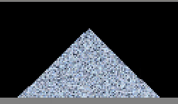

### 属性表

| 属性 | 值 | 说明 |
|------|-----|------|
| 内部标识 | DEFAULT_PT_SLCN | C++枚举名 |
| Type ID | 186 | 元素编号 |
| 颜色 | `0xBCCDDF_rgb` | 亮灰蓝色(金属光泽) |
| 分类 | TYPE_PART (1) | 粉末型 |
| 属性标志 | TYPE_PART, PROP_CONDUCTS, PROP_HOT_GLOW, PROP_LIFE_DEC | 导电, 高温发光, 生命衰减 |
| weight | 90 | 重粉末 |
| heatconduct | 100 | 高导热 |
| advection | 0.4 | 低气流跟随 |
| airdrag | 0.04 | 中等空气阻力 |
| airloss | 0.94 | 较高损失 |
| collision | -0.1 | 低弹性 |
| gravity | 0.27 | 较高重力 |
| diffusion | 0.0 | 不自发扩散 |
| falldown | 1 | 可下落 |
| flammable | 0 | 不燃烧 |
| hardness | 0 | 无硬度 |
| 高温转换 | ≥3538.15K (约3265℃) → LAVA | 粉末中最高熔点！ |
| 源文件 | SLCN.cpp | — |

### 机制详解

SLCN（硅粉，SiLiCoN）是 TPT 中最"闪亮"的粉末，也是粉末中的"瑞士军刀"——它具有导电性、超高温发光、极高熔点，并且参与多种核心合成反应。

**硅粉的关键特征**：
- 熔融 SLCN 是半导体(PSCN/NSCN)和多种矿物的前体
- 与 OXYG 反应产生随机矿物
- 与熔融 METL/BMTL 反应生成半导体对
- 熔融 STNE + BCOL/COAL 可转化为 SLCN

### 参数详解

- **PROP_CONDUCTS**：硅粉像黄金一样导电！它是粉末中少数的导电元素(BREL/BRMT/SLCN)。通电时 SLCN 温度上升。
- **PROP_HOT_GLOW**：高温发光——"闪亮"特性来源。硅粉在加热时发出可见光。
- **高温转换(3538.15K/约3265℃)**：粉末中绝对最高的熔点。比第二名 PQRT(2573K)高约 965K。接近真实硅的熔点(1687K 现实 vs 3538K 游戏)。
- **gravity=0.27**：与 PQRT 相同的高重力。

### 反应链

1. **矿物合成(硅氧反应)**：
   ```
   3x SLCN(熔融) + 3x OXYG →
   1/3 → SAND(沙子)
   1/3 → STNE(石粉)
   1/3 → CLST(<7446.3℃) 或 PQRT(≥7446.3℃)
   ```

2. **半导体制造**：
   ```
   SLCN(熔融) + METL/BMTL(熔融) →
   SLCN → NSCN(N型硅)
   METL/BMTL → PSCN(P型硅)
   ```
   这是 TPT 中生产半导体的核心反应！

3. **SLCN 来源**：
   ```
   STNE(熔融, LAVA) + COAL/BCOL → SLCN(熔融, 1/60)
   ```

### 环境交互

- **在电场中**：PROP_CONDUCTS 使硅粉导电，可嵌入电路
- **与氧气**：熔融态与 OXYG 反应产生随机矿物——温度决定生成 CLST 还是 PQRT
- **与金属熔融**：生成 PSCN/NSCN 半导体对——电子工业的核心
- **在酸中**：hardness=0 极易被腐蚀——硅粉不能抗酸

### 实用场景

- **半导体工厂**：SLCN + METL/BMTL 熔融→PSCN/NSCN
- **矿物随机生成器**：SLCN + OXYG 产生 SAND/STNE/CLST/PQRT 随机
- **导电粉末电路**：PROP_CONDUCTS 使 SLCN 成为粉末电路元件
- **高温光源**：加热 SLCN 因其 PROP_HOT_GLOW 属性发光

---

###### SEED Type:194

### 属性表

| 属性 | 值 | 说明 |
|------|-----|------|
| 内部标识 | DEFAULT_PT_SEED | C++枚举名 |
| Type ID | 194 | 元素编号 |
| 颜色 | `0x88E788_rgb` | 草绿色 |
| 分类 | TYPE_PART (1) | 粉末型 |
| 属性标志 | TYPE_PART, PROP_NEUTPASS | 中子可穿透 |
| weight | 36 | 极轻(仅重于SAWD=18) |
| heatconduct | 32 | 低导热 |
| advection | 0.95 | 高气流跟随(接近气体!) |
| airdrag | 0.005 | 极低空气阻力 |
| airloss | 0.98 | 高保持率 |
| collision | -0.01 | 近乎零弹性 |
| gravity | 0.05 | 极弱重力(与SNOW相同) |
| diffusion | 0.0 | 不自发扩散 |
| falldown | 1 | 可下落 |
| flammable | 0 | 不直接燃烧(高温转FIRE) |
| hardness | 19 | 中低硬度 |
| 高温转换 | ≥673.15K (400℃) → FIRE | 燃点(不熔化直接燃烧) |
| 初始温度 | 22.00℃ (295.15K) | 室温 |
| 源文件 | SEED.cpp | — |

### 机制详解

SEED（种子）是 TPT 中最复杂的粒子之一，拥有完整的遗传系统和生长算法。它不仅是植物(PLNT)和树木的来源，还包含基因杂交、辐射诱变等机制。详见附录K。

**种子的生命循环**：
```
SEED(干燥) + 吸水(moisture≥4) → 可发芽
SEED + SAND(下方) + 空位(上方) + life>200 → PLNT(树木模式)
SEED + 相邻 SEED(均有水分) → 基因杂交(子代)
SEED + NEUT → 随机翻转一个基因位(辐射诱变)
SEED + WATR/DEUT/DSTW/CBNW → 吸水
SEED + SLTW → 失水(盐水有害)
SEED + 高温(≥673.15K) → FIRE(燃烧)
```

### 参数详解

- **weight=36**：第二轻粉末(仅重于 SAWD=18)。配合 gravity=0.05 使 SEED 在空中飘浮。
- **advection=0.95**：接近气体级别(气体通常 0.8~2.0)！种子非常容易被风吹散——这是自然播种的模拟。
- **heatconduct=32**：低导热。种子有一定的保温性。
- **PROP_NEUTPASS**：中子穿透，用于辐射诱变机制（不吸收中子，而是检测后翻转基因位）。
- **高温转换(673.15K/400℃)**：直接燃烧成 FIRE。不经过熔化阶段。

### 反应链

1. **发芽**：
   ```
   SEED(moisture≥4) + SAND 在下方 + 上方空位 + life>200 → PLNT 树木
   ```

2. **基因杂交**：
   相邻两个有足够水分的 SEED → 后代 SEED 继承父母各 50% 基因+随机突变

3. **辐射诱变**：
   ```
   SEED + NEUT → 随机翻转一个基因位
   ```
   所有基因属性都可能被翻转——包括生长速度、颜色、抗性等。

4. **吸水/失水**：
   ```
   SEED + WATR/DSTW/CBNW → moisture++
   SEED + SLTW → moisture-- (盐水威胁)
   ```

### 环境交互

- **在沙子上**：这是萌发的前提条件。SEED 需要 SAND 下方+空位上方。
- **在有水处**：主动吸水增加 moisture。但盐水(SLTW)适得其反。
- **风中飘散**：advection=0.95 使种子极易被风吹散——模拟自然传播。
- **辐射中**：中子轰击导致基因突变——可用于育种实验。

### 实用场景

- **森林培育**：SEED + SAND + WATR → 树木生成
- **基因工程**：利用相邻杂交+中子诱变培育特定性状后代
- **农业模拟**：研究水分/土壤/温度对种子萌发的影响
- **自然传播观察**：高 advection 使种子随风播散，可观察传播模式

---

## Solids-----------------------------------------固体
